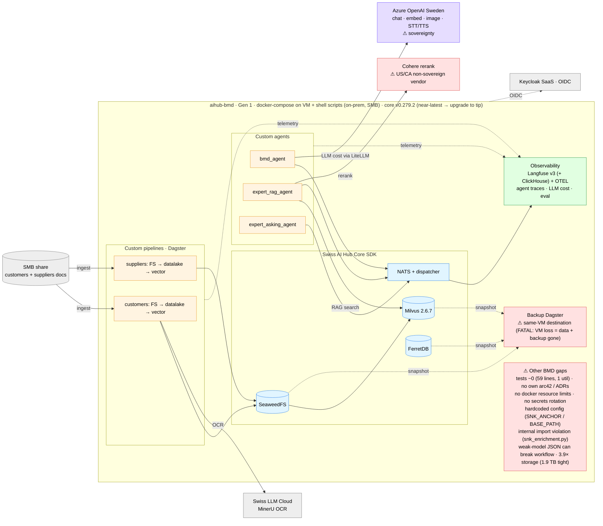
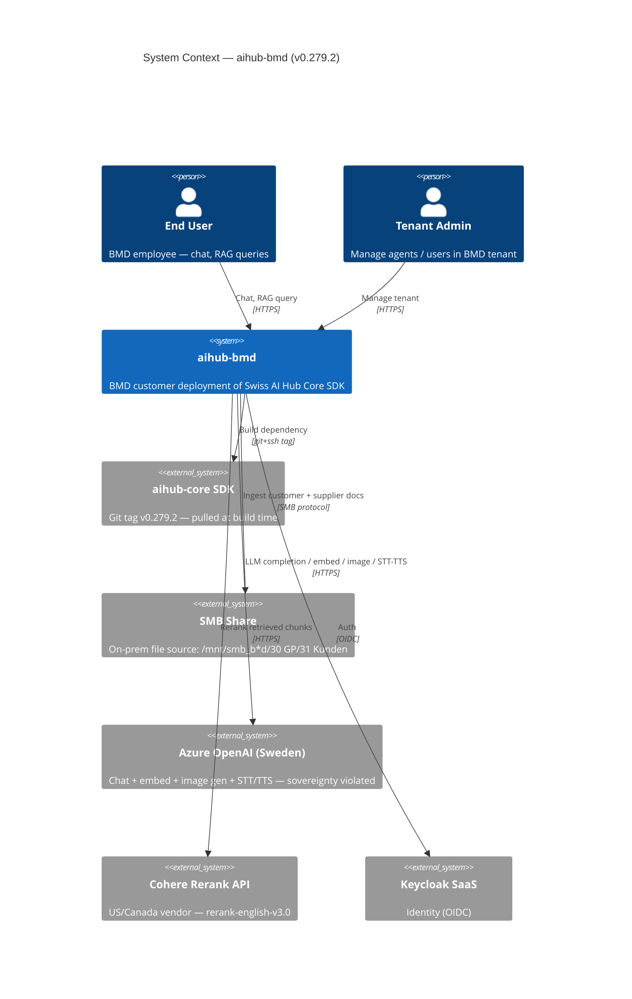
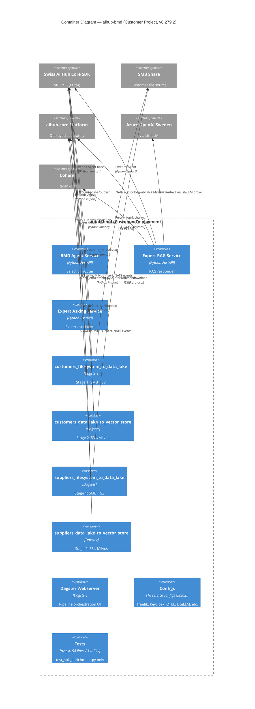

# C4 — aihub-bmd

> Snapshot: **aihub-bmd v0.279.2** (drift 11 minors behind core v0.290.4) as of 2026-05-28. Extracted from
> [`../03_c4_diagrams.md`](../03_c4_diagrams.md) §2.2 and refreshed with verified component counts.

## Level 0 — High-Level Solution Architecture

Boundary-first view: custom code (amber), core touchpoints (blue), Azure (purple), observability (green), known issues
(red). Less text, more wiring.

**Read in one line**: 3 custom agents + 2 filesystem→vector pipelines on stock core (Milvus/FerretDB/SeaweedFS); LLM via
**Azure OpenAI Sweden** (⚠ sovereignty); Cohere rerank; Swiss LLM Cloud for OCR; identity via Keycloak SaaS;
**observability via Langfuse v3 (ClickHouse) + OTEL** — agent traces, LLM cost and eval; backup runs but **lands on the
same VM** (⚠). Open gaps: near-zero tests, no own arc42/ADRs, no docker resource limits, hardcoded config, an
internal-import violation, weak-model JSON fragility, 3.9× storage growth, and a non-sovereign Cohere reranker.
Near-latest pin — the cheapest upgrade of all customers.

## Level 1 — System Context

**Trust boundary**: end users / tenant admins / BMD deployment / Keycloak SaaS are *trusted*. SMB on customer's on-prem
is *trusted*. **Azure OpenAI Sweden** and **Cohere** are *untrusted external* — this is the sovereignty violation
flagged in Overview §1 Weaknesses and addressed by proposed
[`adr_000`](../05_proposed_adrs/adr_000_sovereignty_compliance_path.md).

## Level 2 — Container

### BMD-specific observations

- **3 agents** (bmd_agent, expert_rag, expert_asking) + **4 pipelines** (customers × 2-stage, suppliers × 2-stage). No
  custom API.
- All consume `aihub-core SDK v0.279.2` via git tag — **11 minors drift behind core v0.290.4**.
- **One deep-import violation**: `pipelines/snk_enrichment.py:2` reaches internal module. Tracked in
  [`adr_038`](../05_proposed_adrs/adr_038_sdk_import_discipline.md).
- **6 docker-compose files** split by concern (agents, pipelines, backfill). Separation rationale undocumented (Overview
  §5.2).
- **Configs/** holds 16 Jinja2 templates — duplicate effort with core platform configs.
- **Sovereignty violation**: Azure OpenAI Sweden (LLM) + Cohere US/Canada (rerank). Subject to
  [`adr_000`](../05_proposed_adrs/adr_000_sovereignty_compliance_path.md).
- **Test coverage**: 58 lines / 1 utility test (`tests/test_snk_enrichment.py`). Agents and pipelines untested.
- **Backup**: same VM as primary (FATAL pattern, Overview §3.2 #1).
- **Identity**: Keycloak SaaS (shared realm).

### Scaling readiness

| Container         | Stateless? | Horizontal scale ready? | Notes                                              |
| ----------------- | :--------: | :---------------------: | -------------------------------------------------- |
| BMD Agent Service |     ✅     |           ✅            | Stateless dispatcher                               |
| Expert RAG        |     ✅     |           ✅            | Reads Milvus + Azure OpenAI; per-request           |
| Expert Asking     |     ✅     |           ✅            | NATS-driven                                        |
| Pipelines (L1/L2) |     ❌     |           ❌            | Dagster `in_process_executor`; inherits core DTC-6 |
| Dagster Webserver |     ❌     |           ⚠️            | Singleton; needs persistent DB                     |
| Configs           |    N/A     |           N/A           | Static at deploy time                              |

## Cross-reference

- Customer priority items:
  [`../01_architecture_review_overview.en.md#32-aihub-bd`](../01_architecture_review_overview.en.md).
- Customer concerns: [`../01_architecture_review_overview.en.md#52-aihub-bd`](../01_architecture_review_overview.en.md).
- Sovereignty path:
  [`../05_proposed_adrs/adr_000_sovereignty_compliance_path.md`](../05_proposed_adrs/adr_000_sovereignty_compliance_path.md).
- Import discipline:
  [`../05_proposed_adrs/adr_038_sdk_import_discipline.md`](../05_proposed_adrs/adr_038_sdk_import_discipline.md).
- Backup off-site:
  [`../05_proposed_adrs/adr_030_offsite_backup_replication.md`](../05_proposed_adrs/adr_030_offsite_backup_replication.md).
- Aggregate deployment + multi-customer topology: [`../03_c4_diagrams.md`](../03_c4_diagrams.md).
