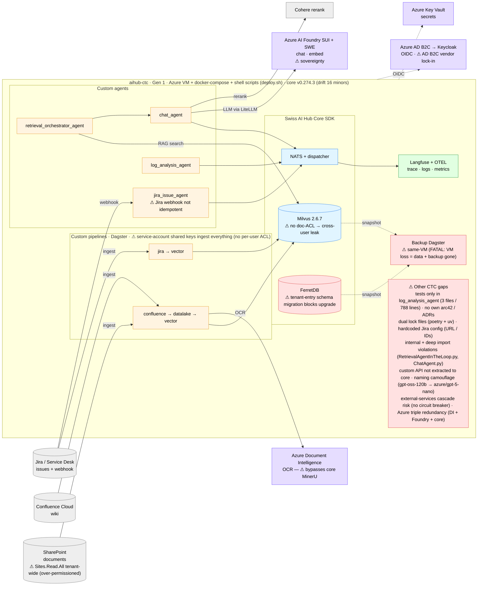
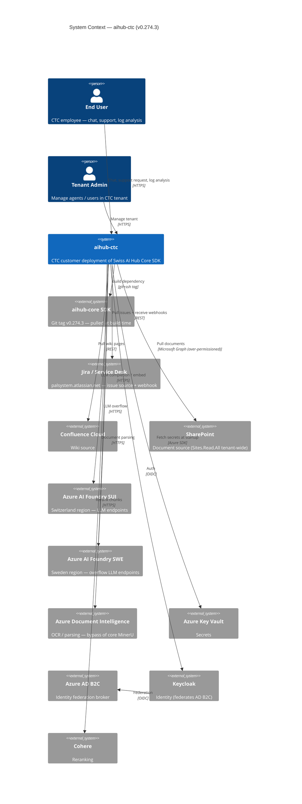

# C4 — aihub-ctc

> Snapshot: **aihub-ctc v0.274.3** (drift 16 minors behind core v0.290.4) as of 2026-05-28.
> Extracted from [`../03_c4_diagrams.md`](../03_c4_diagrams.md) §2.3 and refreshed with verified test count
> (788 lines / 3 files in `log_analysis_agent`) and deep-import findings.

## Level 0 — High-Level Solution Architecture

Boundary-first view: custom code (amber), core touchpoints (blue), Azure (purple), observability (green), known issues
(red).

**Read in one line**: 4 custom agents (orchestrator + chat/jira/log) + Confluence/Jira/SharePoint pipelines on stock
core; LLM via **Azure AI Foundry SUI+SWE** (⚠ sovereignty); **Azure Document Intelligence** replaces core MinerU; secrets
in Azure Key Vault; identity federated AD-B2C→Keycloak (⚠ lock-in); Langfuse+OTEL; backup via Dagster (⚠ same-VM, FATAL).
**Security gap**: source ingestion uses service-account shared keys with no per-user ACL → cross-user leak. **Upgrade
blocker**: the Mongo tenant-entry schema changed (⚠) — needs a migration (adr_045). Other gaps: minimal tests, no own
arc42/ADRs, dual lock files, hardcoded Jira config, internal/deep import violations, un-extracted custom API, naming
camouflage, no circuit breaker, Azure triple-redundancy.

## Level 1 — System Context

**Trust boundary**: end users / tenant admins / CTC deployment / Keycloak / Azure AD B2C are *trusted*. Azure
Foundry SUI is *defensible Swiss region*. Azure Foundry SWE / Cohere / Azure DI are *untrusted external* —
sovereignty exposure (Overview §3.3 #2, see [`adr_000`](../05_proposed_adrs/adr_000_sovereignty_compliance_path.md)).

## Level 2 — Container

```mermaid
C4Container
    title Container Diagram — aihub-ctc (Customer Project, v0.274.3)

    System_Ext(aihub_core_sdk, "Swiss AI Hub Core SDK", "v0.274.3 git tag (16 minors behind)")
    System_Ext(jira_cloud, "Jira / Service Desk", "palsystem.atlassian.net")
    System_Ext(confluence_cloud, "Confluence", "Wiki source")
    System_Ext(sharepoint, "SharePoint", "Sites.Read.All tenant-wide")
    System_Ext(azure_kv, "Azure Key Vault", "Secret store")
    System_Ext(azure_foundry, "Azure Foundry SUI+SWE", "via LiteLLM")
    System_Ext(azure_di, "Azure Document Intelligence", "Doc parsing")
    System_Ext(aihub_platform, "aihub-core Platform", "Deployed separately")

    System_Boundary(ctc, "aihub-ctc (Customer Deployment)") {
        Container(chat_agent_svc, "Chat Agent", "FastAPI", "Main conversational — ⚠️ deep imports (adr_038)")
        Container(jira_agent_svc, "Jira Issue Agent", "FastAPI", "Auto-respond Jira")
        Container(log_agent_svc, "Log Analysis Agent", "FastAPI", "Parse zip logs — 788 lines of tests")
        Container(orchestrator_svc, "Retrieval Orchestrator", "FastAPI", "Multi-source RAG router")
        Container(custom_api, "CTC Custom API", "FastAPI", "Jira webhook + Support request endpoints")
        Container(jira_pipeline_l1, "Jira → S3", "Dagster", "Stage 1")
        Container(jira_pipeline_l2, "Jira S3 → Milvus", "Dagster", "Stage 2")
        Container(confluence_pipeline_l1, "Confluence → S3", "Dagster", "Stage 1")
        Container(confluence_pipeline_l2, "Confluence S3 → Milvus", "Dagster", "Stage 2")
        Container(sharepoint_pipeline_l1, "SharePoint → S3", "Dagster", "Stage 1")
        Container(sharepoint_pipeline_l2, "SharePoint S3 → Milvus", "Dagster", "Stage 2")
        ContainerDb(lib_common, "lib/common/", "Python lib", "Shared events, types, ops — ⚠️ RetrievalAgentInTheLoop.py:1-4 internal import")
    }

    Rel(chat_agent_svc, lib_common, "Import")
    Rel(jira_agent_svc, lib_common, "Import")
    Rel(log_agent_svc, lib_common, "Import")
    Rel(orchestrator_svc, lib_common, "Import")
    Rel(custom_api, lib_common, "Import")
    Rel(lib_common, aihub_core_sdk, "⚠️ Import violation: from swiss_ai_hub.core.events.agent (internal)")
    Rel(chat_agent_svc, aihub_core_sdk, "⚠️ Deep imports to generative_ai.{chat_history,guards} + i18n.locale_handler (adr_038)")

    Rel(custom_api, jira_cloud, "Webhook receive (not idempotent — §3.3 #9)")
    Rel(custom_api, jira_cloud, "Support Desk API")
    Rel(custom_api, azure_kv, "Fetch secrets")
    Rel(custom_api, aihub_platform, "NATS publish (Jira events)")

    Rel(jira_pipeline_l1, jira_cloud, "Fetch issues")
    Rel(jira_pipeline_l2, aihub_platform, "Milvus insert")
    Rel(confluence_pipeline_l1, confluence_cloud, "Fetch pages")
    Rel(confluence_pipeline_l2, aihub_platform, "Milvus insert")
    Rel(sharepoint_pipeline_l1, sharepoint, "Fetch docs (Sites.Read.All)")
    Rel(sharepoint_pipeline_l1, azure_di, "Document parsing")
    Rel(sharepoint_pipeline_l2, aihub_platform, "Milvus insert")

    Rel(chat_agent_svc, orchestrator_svc, "AgentInTheLoop")
    Rel(orchestrator_svc, jira_agent_svc, "AgentInTheLoop")
    Rel(chat_agent_svc, azure_foundry, "LLM via LiteLLM proxy")
    Rel(orchestrator_svc, azure_foundry, "LLM via LiteLLM proxy")

    UpdateLayoutConfig($c4ShapeInRow="3", $c4BoundaryInRow="1")
```

### CTC-specific observations

- **4 agents** + **6 pipelines** (3 sources × 2-stage) + **1 custom API** + **`lib/common/` shared lib**.
- **SDK drift 16 minors** behind core. Custom `switch_dependencies.py` workflow + dual lockfiles
  (`poetry.lock` 84KB + `uv.lock`) — see Overview §3.3 #15.
- **Import violations** (two): (1) `lib/common/types/RetrievalAgentInTheLoop.py:1-4` (internal import via deep
  path); (2) NEW in this review: `agents/chat_agent/chat_agent/ChatAgent.py` reaches
  `swiss_ai_hub.core.generative_ai.{chat_history,guards}` and `swiss_ai_hub.core.i18n.locale_handler`. Both
  tracked in [`adr_038`](../05_proposed_adrs/adr_038_sdk_import_discipline.md).
- **Custom API** with 2 endpoints (Jira webhook + Support request) — not in BMD, not in core. Webhook is **not
  idempotent** (Overview §3.3 #9).
- **Azure Key Vault integration** (enterprise-grade); BMD uses `.env` files instead.
- **Azure stack triple redundancy** (DI + Foundry + core MinerU+LiteLLM) — see Overview §3.3 #12.
- **SharePoint over-permissioned**: `Sites.Read.All` tenant-wide instead of scoped (Overview §3.3 #6).
- **Test coverage**: 3 files / **788 lines** in `agents/log_analysis_agent/log_analysis_agent/tests/`
  (`test_error_label.py` 105 + `test_extract_logs.py` 500 + `test_integration_backups.py` 183). **Other 3 agents
  + 6 pipelines + custom API + `lib/common` untested.** (Earlier review snapshots claimed "ZERO" — corrected
  2026-05-28.)
- **Backup**: same Azure VM (FATAL pattern, Overview §3.3 #1).
- **Identity**: Keycloak federated with Azure AD B2C (vendor lock-in flagged in §3.3 #13).
- **Sovereignty**: 100% Azure stack (Foundry SUI+SWE + DI + Cohere). Subject to
  [`adr_000`](../05_proposed_adrs/adr_000_sovereignty_compliance_path.md).

### Scaling readiness

| Container               | Stateless? | Horizontal scale ready? | Notes                                                       |
| ----------------------- | :--------: | :---------------------: | ----------------------------------------------------------- |
| Chat Agent              |     ✅     |           ✅            | Per-request                                                 |
| Jira Issue Agent        |     ✅     |           ⚠️            | Webhook idempotency missing                                 |
| Log Analysis Agent      |     ✅     |           ✅            | Zip-file processing per call                                |
| Retrieval Orchestrator  |     ✅     |           ✅            | Routes via AgentInTheLoop                                   |
| CTC Custom API          |     ✅     |           ⚠️            | Idempotency key missing on webhook (Overview §3.3 #9)       |
| Pipelines (3 × L1/L2)   |     ❌     |           ❌            | Dagster `in_process_executor`; inherits core DTC-6          |
| lib/common              |     N/A    |           N/A           | Library; imported by all services                           |

## Cross-reference

- Customer priority items: [`../01_architecture_review_overview.en.md#33-aihub-cc`](../01_architecture_review_overview.en.md).
- Customer concerns: [`../01_architecture_review_overview.en.md#53-aihub-cc`](../01_architecture_review_overview.en.md).
- Sovereignty path: [`../05_proposed_adrs/adr_000_sovereignty_compliance_path.md`](../05_proposed_adrs/adr_000_sovereignty_compliance_path.md).
- Import discipline: [`../05_proposed_adrs/adr_038_sdk_import_discipline.md`](../05_proposed_adrs/adr_038_sdk_import_discipline.md).
- Document ACL inheritance: [`../05_proposed_adrs/adr_020_document_acl_inheritance.md`](../05_proposed_adrs/adr_020_document_acl_inheritance.md).
- Aggregate deployment + multi-customer topology: [`../03_c4_diagrams.md`](../03_c4_diagrams.md).
