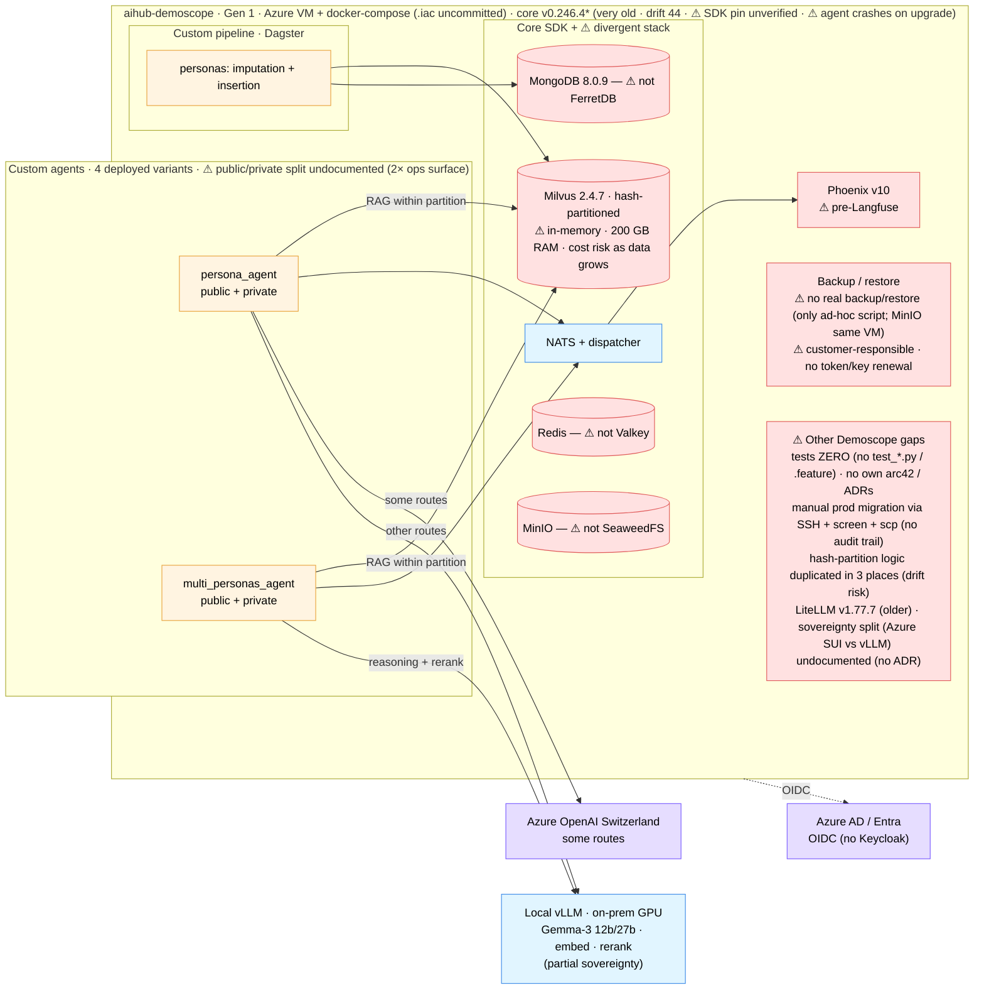
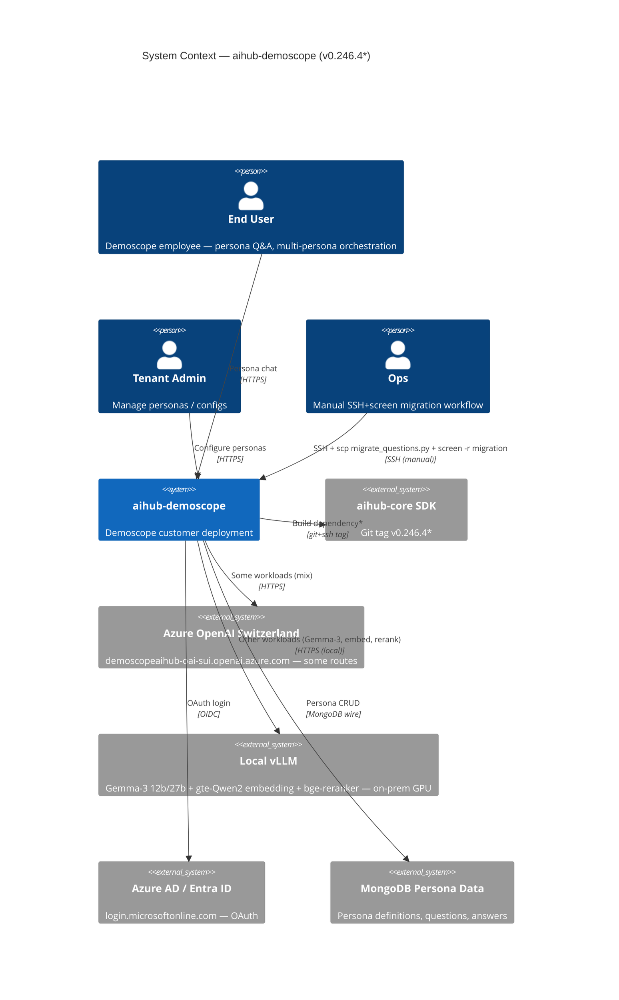

# C4 — aihub-demoscope

> Snapshot: **aihub-demoscope v0.246.4*** (drift 44 minors behind core v0.290.4) as of 2026-05-28.
> *SDK pin not present in repo `pyproject.toml`; figure carried over from prior snapshot pending operational
> confirmation. New file in this review.

## Level 0 — High-Level Solution Architecture

Boundary-first view: custom code (amber), core touchpoints (blue), Azure (purple), observability (green), known issues
and stack divergence (red).

**Read in one line**: persona + multi-persona agents (4 variants) on a **divergent stack** (Mongo/Redis/MinIO/Phoenix
instead of FerretDB/Valkey/SeaweedFS/Langfuse); **mixed LLM** — Azure OpenAI CH + local vLLM (only partial-sovereign
customer); identity via Azure AD. Three red flags: vectors held **in-memory on a 200 GB-RAM box** (cost wall as data
grows), **no backup/restore** (customer-accepted risk, no key/token renewal), and the SDK is so old the **agent crashes
on upgrade**. Other gaps: zero tests, no own arc42/ADRs, manual SSH+screen migration, hash-partition logic duplicated 3×,
`.iac` not committed, SDK pin unverified (drift 44).

## Level 1 — System Context

**Trust boundary**: end users / tenant admin / ops / Demoscope deployment / Azure AD are *trusted*. **Local vLLM
on-prem** is *trusted* (only customer with sovereign LLM stack — partial). **Azure OpenAI Switzerland** is
*defensible Swiss region*. The workload split between Azure SUI and vLLM is **not documented in any ADR** — see
[`adr_000`](../05_proposed_adrs/adr_000_sovereignty_compliance_path.md).

## Level 2 — Container

```mermaid
C4Container
    title Container Diagram — aihub-demoscope (Customer Project, v0.246.4*)

    System_Ext(aihub_core_sdk, "Swiss AI Hub Core SDK", "v0.246.4* — pin unverified")
    System_Ext(azure_openai_sui, "Azure OpenAI Switzerland", "via LiteLLM v1.77.7 (older)")
    System_Ext(azure_ad, "Azure AD / Entra", "OAuth")

    System_Boundary(demoscope, "aihub-demoscope (Customer Deployment)") {
        Container(persona_public, "persona_agent_public", "FastAPI", "Single persona — public variant")
        Container(persona_private, "persona_agent_private", "FastAPI", "Single persona — private variant")
        Container(multi_public, "multi_personas_agent_public", "FastAPI", "Multi-persona orchestration — public")
        Container(multi_private, "multi_personas_agent_private", "FastAPI", "Multi-persona orchestration — private")
        Container(personas_pipeline, "personas pipeline", "Dagster", "Imputation + insertion jobs into hash-partitioned Milvus")
        Container(custom_api, "Custom API", "FastAPI (minimal)", "Mounts core controllers")
        Container(lib_common, "lib/common/", "Python lib", "Events, ops, schemas, persistence, partition_utils")
        Container(vllm1, "vllm-instance-1", "vLLM v0.11.0 GPU", "Gemma-3 12b chat")
        Container(vllm2, "vllm-instance-2", "vLLM v0.11.0 GPU", "Gemma-3 27b / embed / rerank")

        ContainerDb(mongo, "MongoDB 8.0.9", "Document store", "⚠️ Divergence from core FerretDB")
        ContainerDb(redis, "Redis 8.0.1", "Cache", "⚠️ Divergence from core Valkey")
        ContainerDb(milvus, "Milvus v2.4.7", "Vector DB", "Hash-partitioned 1000 partitions on persona_id")
        ContainerDb(pgvector, "PostgreSQL pgvector (pg17)", "Vector / persistence")
        ContainerDb(minio, "MinIO", "S3-compatible", "⚠️ Backup co-located on same VM (FATAL pattern)")
        Container(phoenix, "Phoenix v10.0.4", "Observability", "⚠️ Pre-Langfuse (ADR 2026_02_10)")
    }

    Rel(persona_public, lib_common, "Import partition_utils (hash function)")
    Rel(persona_private, lib_common, "Import partition_utils")
    Rel(multi_public, lib_common, "Import partition_utils")
    Rel(multi_private, lib_common, "Import partition_utils")
    Rel(personas_pipeline, lib_common, "Import partition_utils — ⚠️ hash function duplicated 3 places (Overview §3.4 #6)")

    Rel(persona_public, azure_openai_sui, "Some routes")
    Rel(persona_public, vllm1, "Other routes (mix)")
    Rel(multi_public, vllm2, "Multi-persona reasoning + rerank")

    Rel(personas_pipeline, milvus, "Hash-partitioned insert")
    Rel(personas_pipeline, mongo, "Persona metadata")

    Rel(persona_public, mongo, "Persona lookup")
    Rel(persona_public, milvus, "Vector search within partition")
    Rel(persona_public, redis, "Session / cache")
    Rel(persona_public, phoenix, "Tracing")

    Rel(custom_api, azure_ad, "OAuth callback")

    UpdateLayoutConfig($c4ShapeInRow="3", $c4BoundaryInRow="1")
```

### Demoscope-specific observations

- **2 agent packages, 4 deployed variants** (`persona_agent` + `multi_personas_agent`, each public + private). The
  public/private split rationale is **not documented** (Overview §3.4 #7). Operational surface is 2× larger than
  necessary.
- **1 pipeline** (`personas` — imputation + insertion). Hash function for partitioning duplicated in 3 places
  (`lib/common/partition_utils.py`, persona_agent, migration script) — drift risk (Overview §3.4 #6).
- **SDK pin not in `pyproject.toml`** — version unverifiable from repo. The "v0.246.4 / drift 44 minors" figure
  is carried over from the previous review snapshot; **operational confirmation required** (CI logs, deploy
  manifests).
- **Stack divergence from core** (Overview §3.4 #8):
  - `mongo:8.0.9` instead of FerretDB
  - `redis:8.0.1` instead of Valkey
  - `phoenix:version-10.0.4` pre-Langfuse (ADR `2026_02_10`)
  - `litellm:v1.77.7` (older than core)
  - `MinIO` instead of SeaweedFS
- **Mixed sovereignty** (Overview §3.4 #10): Azure OpenAI Switzerland for some routes + **local vLLM**
  (Gemma-3 12b/27b + gte-Qwen2 + bge-reranker) for others. Only customer with partial sovereign LLM stack.
- **Pulumi mentioned in README but `.iac/` code NOT committed** (Overview §3.4 #3) — deployment irreproducible
  from the repo.
- **Manual SSH+screen+scp migration** workflow (Overview §3.4 #5). No audit trail; progress in
  `migration_log.json` on the VM.
- **Test coverage**: ZERO. No `test_*.py`, no `.feature` files.
- **Backup**: MinIO on same VM as Milvus / Mongo (FATAL pattern, Overview §3.4 #2).
- **Identity**: Azure AD / Entra ID; no Keycloak.

### Scaling readiness

| Container                         | Stateless? | Horizontal scale ready? | Notes                                                               |
| --------------------------------- | :--------: | :---------------------: | ------------------------------------------------------------------- |
| persona_agent_{public,private}    |     ✅     |           ✅            | Stateless; partition lookup deterministic                           |
| multi_personas_agent_{public,private} |  ✅    |           ✅            | Stateless                                                           |
| personas pipeline                 |     ❌     |           ❌            | Single Dagster run; manual migration script                         |
| Custom API                        |     ✅     |           ✅            | Minimal — mounts core controllers                                   |
| vllm-instance-1/2                 |     ❌     |           ❌            | GPU-pinned; no horizontal scaling                                   |
| MongoDB / Redis / Phoenix         |     ❌     |           ❌            | Single instance each                                                |
| Milvus standalone                 |     ❌     |           ❌            | Single-node; hash partitioning helps but doesn't scale-out          |

## Cross-reference

- Customer priority items: [`../01_architecture_review_overview.en.md#34-aihub-demscope`](../01_architecture_review_overview.en.md).
- Customer concerns: [`../01_architecture_review_overview.en.md#54-aihub-demscope`](../01_architecture_review_overview.en.md).
- Sovereignty path: [`../05_proposed_adrs/adr_000_sovereignty_compliance_path.md`](../05_proposed_adrs/adr_000_sovereignty_compliance_path.md).
- Backup off-site: [`../05_proposed_adrs/adr_030_offsite_backup_replication.md`](../05_proposed_adrs/adr_030_offsite_backup_replication.md).
- Aggregate deployment + multi-customer topology: [`../03_c4_diagrams.md`](../03_c4_diagrams.md).
