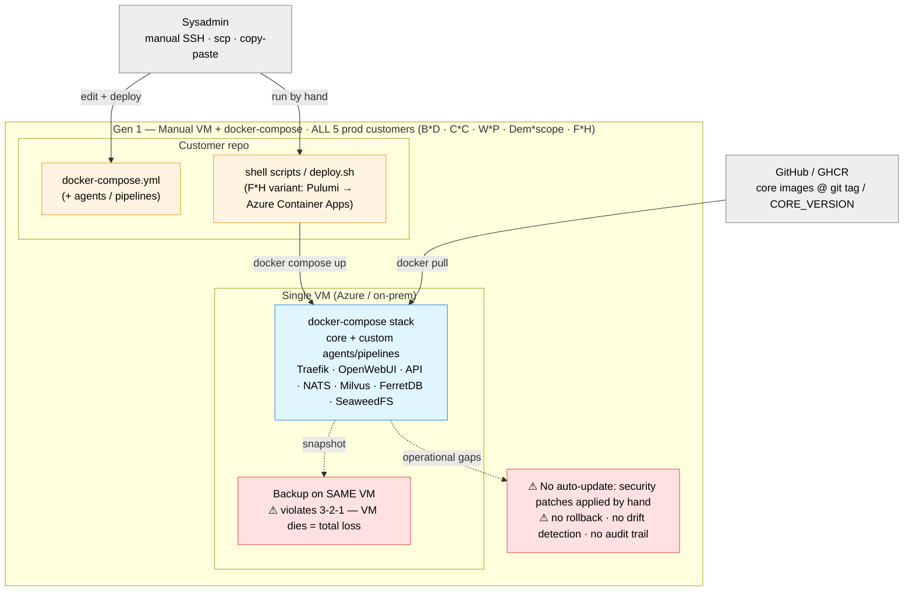
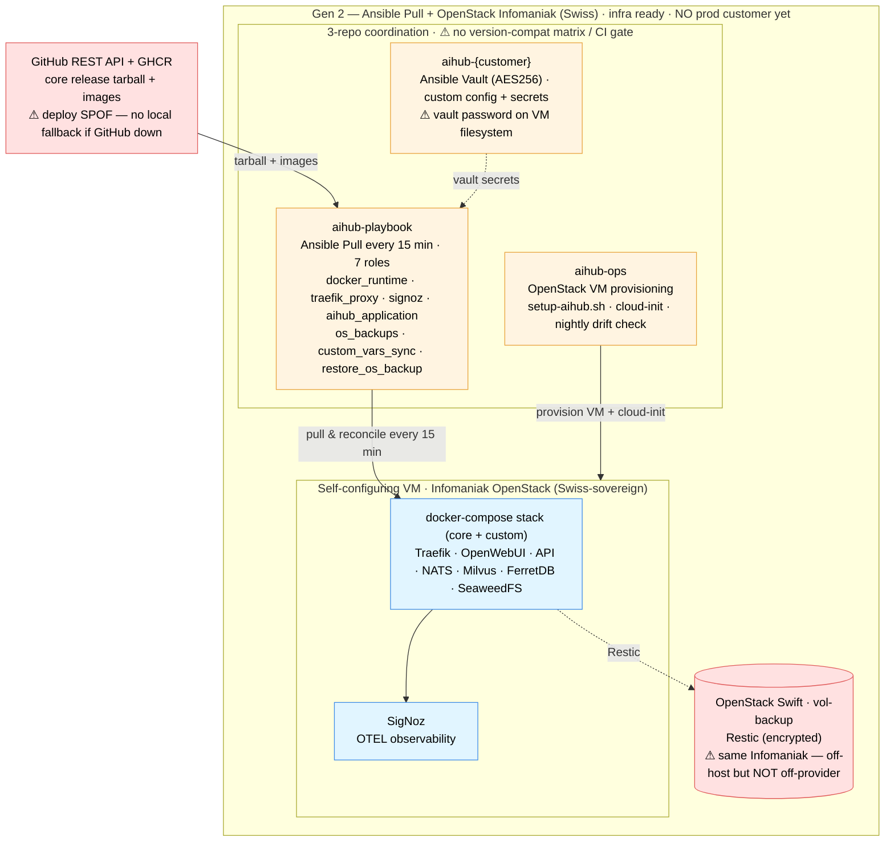
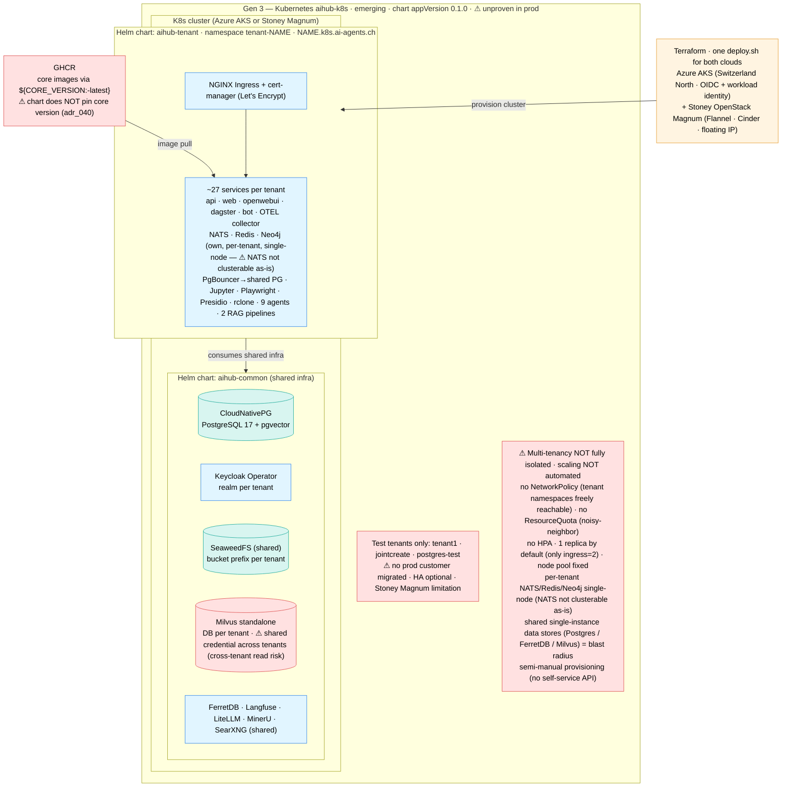

# C4 — Deployment Generations (Gen 1 / Gen 2 / Gen 3)

> Snapshot 2026-05-28. Source of truth: Overview §1, §5.8 (Gen 2 pattern), §References (Gen 3 stack), and the ecosystem
> diagram in [`../01_architecture_review_overview.en.md`](../01_architecture_review_overview.en.md). The three
> generations differ in *how a deployment is provisioned, configured, and run* — not in the application code.

Same colour key as the other `c4/` files: IaC/config repos (amber), app/stack services (blue), data & backup (teal),
external systems (grey), known gaps (red).

**At a glance**: Gen 1 = manual VM + docker-compose (**all 5 production customers today**). Gen 2 = Ansible Pull +
OpenStack Infomaniak (**infra ready; first customer `aihub-igs` onboarding as a pre-production pilot**). Gen 3 =
Kubernetes `aihub-k8s` (**emerging, test tenants only**).

## Gen 1 — Manual VM + docker-compose

How every production customer (B\*D, C\*C, W\*P, Dem\*scope, F\*H) runs today: a single VM, a docker-compose stack, and
shell scripts run by hand.

**Read in one line**: a person SSHes in, copies a docker-compose file and runs a script; the stack pulls core images by
git tag; backups sit on the same VM and patches are manual. Simple, but **no HA, no off-site backup, no auto-update, no
audit trail** — the source of most Gen 1 customer findings (§3.2–§3.6).

## Gen 2 — Ansible Pull + OpenStack Infomaniak

Self-configuring VMs on Swiss-sovereign Infomaniak OpenStack, reconciled every 15 minutes by Ansible Pull. The
infrastructure is ready and **`aihub-igs` is the first customer onboarding on this pattern** (Ansible-Vault config repo
`aihub-igs` with `secrets/igs.yml.vault`) — currently **pre-production / pilot**, not yet a full production cutover. See
[`igs.md`](igs.md).

**Read in one line**: VMs provision themselves on Swiss Infomaniak and re-pull config every 15 min — security patches
auto-deploy, secrets are vault-encrypted, backups go to Swift. Remaining gaps: **3-repo version coupling, GitHub as a
deploy SPOF, same-provider backup, and a 15-min cadence too slow for hot-fixes**. Still single-server (docker-compose).

## Gen 3 — Kubernetes (`aihub-k8s`, emerging)

Terraform-provisioned K8s on Azure AKS or Stoney OpenStack Magnum, with two Helm charts giving **namespace-per-tenant**
multi-tenancy and horizontal scale. Emerging — only test tenants exist.

**Read in one line**: Terraform stands up a cluster on AKS or Stoney Magnum; `aihub-common` runs the shared data layer
(CNPG Postgres, FerretDB, Milvus, SeaweedFS) + shared LiteLLM/Keycloak/Langfuse/MinerU/SearXNG, while `aihub-tenant`
gives each tenant its own namespace, subdomain, app stack and **its own NATS / Redis / Neo4j**. It is the only
generation with namespace-per-tenant multi-tenancy and horizontal scale — **but the isolation is logical, not
hardened**: no NetworkPolicy, no ResourceQuota, a **shared Milvus credential across all tenants**, shared
single-instance data stores (blast radius), HA optional, semi-manual provisioning, charts don't pin the core version
(adr_040), and it's unproven in prod (test tenants only). Good for trusted/internal tenants; **not yet enterprise-grade
for untrusted/regulated tenants**.

## Comparison

| Aspect        | Gen 1 (today)               | Gen 2 (ready, unused)                         | Gen 3 (emerging)                                                                   |
| ------------- | --------------------------- | --------------------------------------------- | ---------------------------------------------------------------------------------- |
| Provisioning  | Manual (SSH / copy-paste)   | `aihub-ops` — OpenStack + cloud-init          | Terraform (AKS / Stoney Magnum)                                                    |
| Config mgmt   | Shell scripts (FMH: Pulumi) | Ansible Pull (15-min reconcile)               | Helm (`aihub-common` + `aihub-tenant`)                                             |
| Runtime       | docker-compose on 1 VM      | docker-compose on 1 VM                        | Kubernetes pods                                                                    |
| Cloud         | Azure / on-prem             | Infomaniak OpenStack (Swiss)                  | Azure AKS or Stoney OpenStack Magnum                                               |
| Secrets       | `.env` on VM                | Ansible Vault (AES256)                        | K8s secrets / operators                                                            |
| Multi-tenancy | 1 deployment per customer   | 1 deployment per customer                     | namespace-per-tenant — ⚠ logical only (no NetworkPolicy/quota; shared Milvus cred) |
| Scaling / HA  | None (single VM)            | None (single VM)                              | Horizontal scale; ⚠ HA optional + shared data stores single-instance               |
| Backup        | Same VM ⚠ (no 3-2-1)        | Restic → Swift (off-host, same provider ⚠)    | Operator-managed (CNPG) + object store                                             |
| Auto-update   | Manual ⚠                    | 15-min Ansible Pull (⚠ slow for hot-fix)      | GitOps-style image pull (⚠ no chart version pin)                                   |
| Status        | **All 5 prod customers**    | Infra ready; **`aihub-igs` pilot (pre-prod)** | **Emerging**, test tenants only                                                    |

## Cross-reference

- Gen 2 pattern detail + concerns:
  [`../01_architecture_review_overview.en.md` §5.8](../01_architecture_review_overview.en.md).
- Gen 3 stack references:
  [`../01_architecture_review_overview.en.md` §References](../01_architecture_review_overview.en.md).
- Chart core-version pin policy:
  [`../05_proposed_adrs/adr_040_k8s_chart_core_version_pinning.md`](../05_proposed_adrs/adr_040_k8s_chart_core_version_pinning.md).
- Off-site backup / 3-2-1:
  [`../05_proposed_adrs/adr_030_offsite_backup_replication.md`](../05_proposed_adrs/adr_030_offsite_backup_replication.md).
- Per-customer deployments (5 Gen 1 prod + 1 Gen 2 pilot): [`bmd.md`](bmd.md), [`ctc.md`](ctc.md),
  [`demoscope.md`](demoscope.md), [`wpe.md`](wpe.md), [`fmh.md`](fmh.md), [`igs.md`](igs.md) (Gen 2 pilot).
- Gen 3 tenant-isolation hardening (NetworkPolicy, ResourceQuota, per-tenant Milvus credential, HA):
  [`../05_proposed_adrs/adr_047_gen3_tenant_isolation_hardening.md`](../05_proposed_adrs/adr_047_gen3_tenant_isolation_hardening.md).
