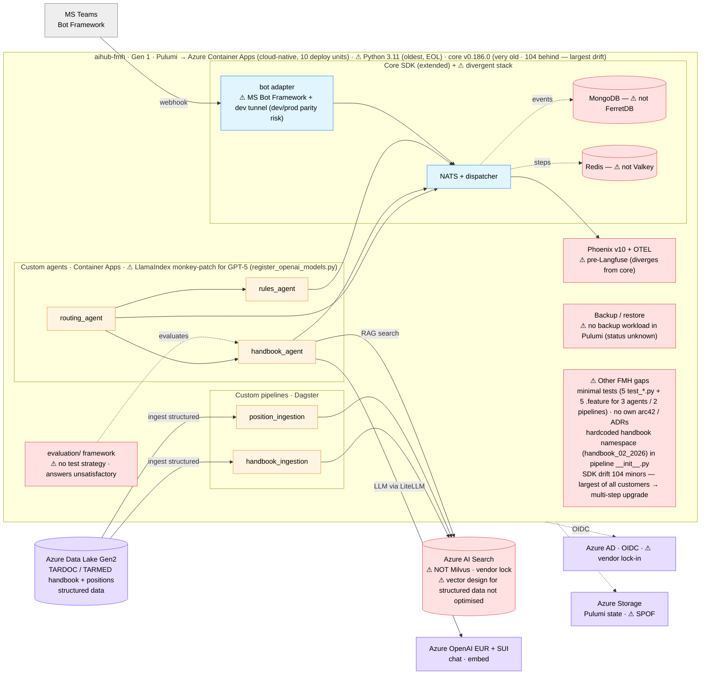
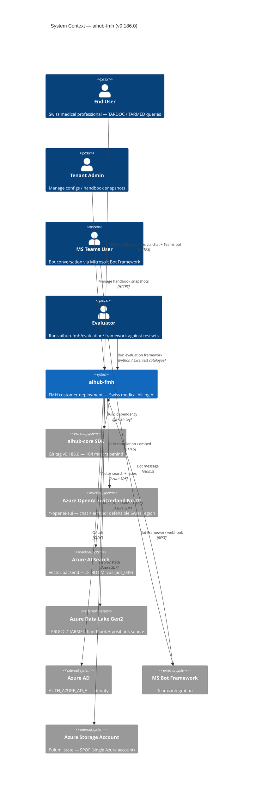
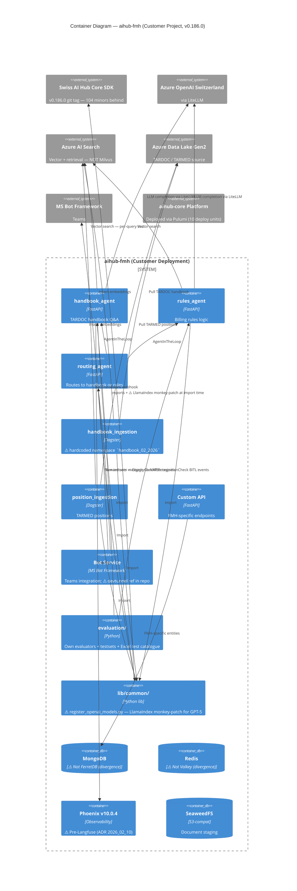

# C4 — aihub-fmh

> Snapshot: **aihub-fmh v0.186.0** (drift 104 minors behind core v0.290.4 — **largest of any customer**) as of
> 2026-05-28. New file in this review. Uses **Azure AI Search instead of Milvus** (stack divergence) — see
> [`adr_039`](../05_proposed_adrs/adr_039_fmh_azure_ai_search_vs_milvus.md).

## Level 0 — High-Level Solution Architecture

Boundary-first view: custom code (amber), core touchpoints (blue), Azure (purple), known issues (red). Fully
Azure-native (Pulumi → Container Apps).

**Read in one line**: routing/handbook/rules agents on **Azure Container Apps** (Pulumi-deployed), ingesting **structured
TARDOC/TARMED** data into **Azure AI Search** (⚠ not Milvus — vendor lock); LLM via Azure OpenAI EUR+SUI; Teams bot front
door. The customer is **unhappy with answer quality** — the likely root cause is **vector/ingestion design for structured
data** plus the **absence of a testing/eval strategy** (the eval framework exists but is unused). Oldest pin of all
customers (104 minors behind) → multi-step upgrade. Other gaps: GPT-5 LlamaIndex monkey-patch, Mongo/Redis/Phoenix
divergence, bot dev-tunnel parity risk, Azure vendor lock-in, no backup workload in Pulumi, Pulumi-state SPOF, Python 3.11
(EOL), hardcoded handbook namespace, no own arc42/ADRs.

## Level 1 — System Context

**Trust boundary**: end users / tenant admin / Teams users / evaluators / FMH deployment / Azure AD are *trusted*.
**Azure OpenAI Switzerland North** is *defensible* — TARDOC/TARMED data is Swiss-only by mandate. **Azure AI
Search** is *managed external service* — every retrieval is a paid query call. **Pulumi state in single Azure
storage account** is a SPOF (Overview §3.6 #9).

## Level 2 — Container

### FMH-specific observations

- **3 agents** (`handbook_agent`, `rules_agent`, `routing_agent`) + **2 pipelines** (`handbook_ingestion`,
  `position_ingestion`) + **custom API** + **bot** (MS Bot Framework) + **evaluation framework**.
- **SDK drift 104 minors** (v0.186.0 vs core v0.290.4) — **largest of all customers**. ~10+ months of patches
  missed. Incremental upgrade plan: v0.186 → v0.220 → v0.260 → v0.290 (Overview §3.6 #1).
- **LlamaIndex monkey-patch** for GPT-5 (`lib/common/register_openai_models.py`) — modifies third-party globals
  at import time. Will drop on SDK upgrade if not first-classed. See Overview §3.6 #2 and
  [`adr_038`](../05_proposed_adrs/adr_038_sdk_import_discipline.md).
- **Azure AI Search instead of Milvus** (Overview §3.6 #3) — vendor lock-in + double inference cost (AI Search
  query fee + LLM call). Formal decision needed: see
  [`adr_039`](../05_proposed_adrs/adr_039_fmh_azure_ai_search_vs_milvus.md).
- **Stack divergence** (Overview §3.6 #5): MongoDB + Redis + Phoenix v10.0.4 (pre-Langfuse) — same pattern as
  Demoscope. Tied to SDK upgrade.
- **Hardcoded handbook namespace** `handbook_02_2026` in `pipelines/handbook_ingestion/__init__.py` (Overview
  §3.6 #11). Monthly snapshots require code change.
- **Pulumi committed** (10 deploy units: `agents`, `ai`, `api`, `bot`, `dagster`, `nats`, `network`, `openwebui`,
  `phoenix`, `stores`) — **best IaC of any new customer**. But state in single Azure storage account → SPOF
  (Overview §3.6 #9).
- **Test coverage**: 5 `test_*.py` + 5 BDD `.feature` files for 3 agents + 2 pipelines. Plus own evaluation
  framework in `evaluation/` (12 Python files + own evaluators + testsets + Excel test catalogue) —
  **best evaluation framework of any customer**.
- **Bot**: MS Bot Framework + dev tunnel workflow. README references `devtunnel` (Overview §3.6 #8) — dev/prod
  parity risk.
- **Backup**: not visible in Pulumi `stores/` (Overview §3.6 #4) — Azure Backup policy + cross-region replication
  for TARDOC/TARMED data unverified.
- **Sovereignty**: Azure OpenAI Switzerland North is defensible for Swiss-only data. Azure AI Search is paid +
  vendor lock-in. See [`adr_039`](../05_proposed_adrs/adr_039_fmh_azure_ai_search_vs_milvus.md).

### Scaling readiness

| Container               | Stateless? | Horizontal scale ready? | Notes                                                                |
| ----------------------- | :--------: | :---------------------: | -------------------------------------------------------------------- |
| handbook_agent          |     ✅     |           ✅            | Per-request                                                          |
| rules_agent             |     ✅     |           ✅            | Per-request                                                          |
| routing_agent           |     ✅     |           ✅            | Stateless dispatcher                                                 |
| Custom API              |     ✅     |           ✅            | -                                                                    |
| Bot                     |     ✅     |           ⚠️            | MS Bot Framework session handling                                    |
| Pipelines (handbook / position) | ❌  |           ❌            | Dagster `in_process_executor`; hardcoded namespace                   |
| evaluation/             |     N/A    |           N/A           | Offline runner                                                       |
| MongoDB / Redis / Phoenix | ❌       |           ❌            | Single instance each                                                 |
| Azure AI Search         |     N/A    |           ✅            | Managed service — paid scaling                                       |

## Cross-reference

- Customer priority items: [`../01_architecture_review_overview.en.md#36-aihub-fh`](../01_architecture_review_overview.en.md).
- Customer concerns: [`../01_architecture_review_overview.en.md#56-aihub-fh`](../01_architecture_review_overview.en.md).
- **Azure AI Search vs Milvus decision**:
  [`../05_proposed_adrs/adr_039_fmh_azure_ai_search_vs_milvus.md`](../05_proposed_adrs/adr_039_fmh_azure_ai_search_vs_milvus.md).
- Import discipline (covers LlamaIndex monkey-patch removal path):
  [`../05_proposed_adrs/adr_038_sdk_import_discipline.md`](../05_proposed_adrs/adr_038_sdk_import_discipline.md).
- Sovereignty path: [`../05_proposed_adrs/adr_000_sovereignty_compliance_path.md`](../05_proposed_adrs/adr_000_sovereignty_compliance_path.md).
- Backup off-site: [`../05_proposed_adrs/adr_030_offsite_backup_replication.md`](../05_proposed_adrs/adr_030_offsite_backup_replication.md).
- Aggregate deployment + multi-customer topology: [`../03_c4_diagrams.md`](../03_c4_diagrams.md).
