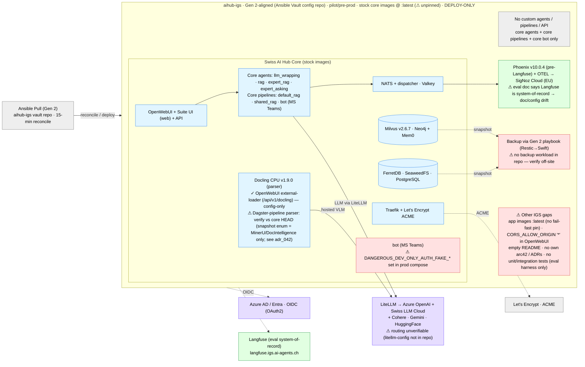
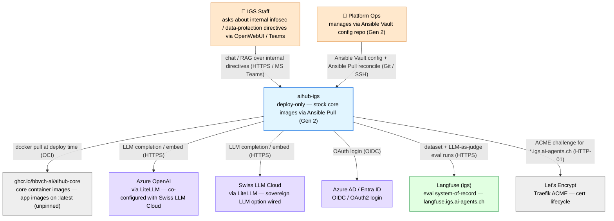

# C4 — aihub-igs

> Snapshot: **aihub-igs** (core app images pinned to `:latest` — unpinned, see warnings) as of 2026-05-29.
> **NEW** in this review. **Deploy-only + config repo** (no custom agents, pipelines, API, or bot — uses stock core
> images). **First Gen 2-aligned customer** (Ansible Vault config repo `aihub-igs` → Ansible Pull on Infomaniak
> OpenStack); status **pre-production / pilot**. Use case: internal **information-security & data-protection
> directive** RAG assistant ("IGS Guisan", German) — answers staff questions about ICT-Sicherheitsweisung,
> Information Security Policy, KI-Weisung.
>
> ⚠️ **`:latest` is ahead of the review snapshot.** The review-snapshot core (v0.290.4) contains **no Docling** in code
> (no `/api/v1/docling` route, no `DoclingLoader`, parser enum = MinerU / Document Intelligence only). IGS's generated
> compose **references** `/api/v1/docling` + `DOCLING_*`, so IGS runs a **newer core than the snapshot**. Docling is
> confirmed on the **OpenWebUI external-loader path** (config-only); whether it is first-class in the **Dagster RAG
> pipeline** must be verified against the actual core HEAD that `:latest` resolved to (this is the unpinned-`:latest`
> risk in action; see proposed `adr_042` for making the pipeline parser registry pluggable).

## Level 0 — High-Level Solution Architecture

Boundary-first view: core touchpoints (blue), Azure (purple), observability (green), known issues (red). IGS has **no
custom code** — it is a pure platform deployment configured via an Ansible-Vault customer repo (Gen 2 pattern).



**Read in one line**: deploy-only — stock core images (⚠ app images on `:latest`, unpinned), no custom code; the most
**core-aligned customer stack** (FerretDB + Valkey + **Docling** + LiteLLM v1.80.5), serving an internal
security-directive RAG assistant in German. LLM via LiteLLM with **both Azure OpenAI and Swiss LLM Cloud** wired
(routing unverifiable from repo); identity Azure AD/Entra OIDC. Gen 2-aligned (Ansible-Vault repo). Open issues: **bot
ships `DANGEROUS_DEV_ONLY_AUTH_FAKE_*` in the production compose** (auth-bypass), `:latest` app images,
`CORS_ALLOW_ORIGIN '*'`, **Phoenix in compose vs Langfuse in eval docs** (drift), empty README / no own arc42 / no
tests (eval harness only).

## Level 1 — System Context



**Trust boundary**: IGS staff / platform ops / IGS deployment / Azure AD / Let's Encrypt are *trusted*. **LLM routing
is unverifiable from the repo** — LiteLLM is wired for both Azure OpenAI and Swiss LLM Cloud (plus Cohere/Gemini/HF),
but `configs/litellm/litellm-config.latest.yml` is provided by the Gen 2 playbook and is **not tracked** in this repo;
sovereignty status is therefore **mixed / pending confirmation** (analogous to demoscope's partial sovereignty). The
**bot service sets `DANGEROUS_DEV_ONLY_AUTH_FAKE_NAME/EMAIL/OID/ROLES`** in `docker-compose.latest.yml` — a dev-only
auth-bypass that must not reach production (see proposed `adr_048`).

## Level 2 — Container

```mermaid
flowchart TB
  classDef core fill:#e1f5ff,stroke:#3d8be8,color:#000
  classDef db fill:#d8f5f0,stroke:#2bb0a0,color:#000
  classDef ext fill:#eeeeee,stroke:#888888,color:#000
  classDef azure fill:#e6ddff,stroke:#7a5cff,color:#000
  classDef obs fill:#e1ffe1,stroke:#3da35a,color:#000
  classDef warn fill:#ffe1e1,stroke:#e05a5a,color:#000

  GHCR["ghcr.io/bbvch-ai/aihub-core<br/>image registry — app images :latest"]:::ext
  AOAI["Azure OpenAI + Swiss LLM Cloud<br/>via LiteLLM proxy"]:::azure
  EID["Azure AD / Entra<br/>OAuth / OIDC"]:::azure
  LF["Langfuse (igs)<br/>eval system-of-record"]:::obs
  LE["Let's Encrypt<br/>TLS cert issuer"]:::ext

  subgraph IGS["aihub-igs (Gen 2 deployment, ~30 containers)"]
    direction TB

    subgraph EDGE["Ingress & Auth"]
      direction LR
      TR["Traefik v3.6.2<br/>reverse proxy · TLS via Let's Encrypt; docker-socket-proxy gated"]:::core
      OAP["oauth2-proxy ×3<br/>gates SeaweedFS / Attu / Dagster via Azure AD"]:::core
    end

    subgraph APP["Application"]
      direction LR
      OWUI["OpenWebUI v0.6.41<br/>Chat UI · user-facing chat; ⚠️ CORS '*' (TODO)"]:::warn
      WEB["Suite UI (web)<br/>Nuxt frontend (core image)"]:::core
      API["API Gateway<br/>FastAPI (core image) · REST + WS"]:::core
      LLM["LiteLLM v1.80.5 (core image)<br/>Azure OpenAI + Swiss LLM Cloud + Cohere/Gemini/HF + Presidio"]:::core
      PRES["Presidio analyzer + anonymizer<br/>PII filtering via LiteLLM (core image)"]:::core
      DOC["Docling CPU v1.9.0 (docling-serve)<br/>OpenWebUI external-loader via /api/v1/docling; Dagster-path use TBD vs core HEAD (adr_042)"]:::core
    end

    subgraph AG["Agents & Pipelines (core images)"]
      direction LR
      A1["llm_wrapping_agent<br/>core default agent"]:::core
      A2["rag_agent<br/>core default RAG agent"]:::core
      A3["expert_rag_agent<br/>RAG + HITL consent"]:::core
      A4["expert_asking_agent<br/>HITL escalation (Teams/Slack)"]:::core
      P1["default_rag_pipeline<br/>core Dagster · per-bucket ingestion"]:::core
      P2["shared_rag_pipeline<br/>core Dagster · shared-bucket ingestion + Mem0"]:::core
      BOT["bot (MS Teams)<br/>⚠️ DANGEROUS_DEV_ONLY_AUTH_FAKE_* in prod compose"]:::warn
    end

    subgraph DATA["Data & Storage"]
      direction LR
      FERRET[("FerretDB 2.5<br/>document store (over PostgreSQL)")]:::db
      MILVUS[("Milvus v2.6.7<br/>vector DB · RAG knowledge")]:::db
      NEO[("Neo4j 5.26<br/>graph DB · Mem0 memory")]:::db
      SW[("SeaweedFS 3.97<br/>object store · uploads / artifacts")]:::db
      PG[("PostgreSQL 17 + pgvector<br/>openwebui / phoenix / dagster / litellm")]:::db
      VAL[("Valkey 8.0.5<br/>cache · sessions / dedup / Mem0")]:::db
      NATS["NATS 2.11 JetStream<br/>events"]:::db
      RCL["rclone 1.71<br/>70+ source connectors (RC API)"]:::core
    end

    subgraph OBS["Observability"]
      direction LR
      PHX["Phoenix v10.0.4<br/>⚠️ pre-Langfuse (ADR 2026_02_10) — eval uses Langfuse"]:::warn
      OTEL["OTEL collector<br/>ships to SigNoz Cloud EU"]:::obs
    end
  end

  GHCR -->|docker pull (OCI)| IGS
  TR -->|auth gate| OAP
  TR -->|after auth| OWUI
  TR -->|static frontend| WEB
  TR -->|API routes| API
  OAP -->|OAuth (OIDC)| EID
  TR -->|ACME cert lifecycle (HTTP-01)| LE

  OWUI -->|OpenAI-compat (HTTPS)| API
  API -->|LLM calls| LLM
  LLM -->|completion / embed / rerank (HTTPS)| AOAI
  API -->|document parsing| DOC
  API -->|entities| FERRET
  API -->|sessions| VAL
  API -->|events| NATS
  API -->|eval datasets / runs| LF

  A2 -->|vector search| MILVUS
  A2 -->|LLM calls| LLM
  A4 -->|HITL escalation (Teams)| BOT
  P1 -->|documents| SW
  P1 -->|insert vectors| MILVUS
  P2 -->|Mem0 memory| NEO
  FERRET -->|storage backend| PG
  OTEL -->|trace ingest| NATS
```

### IGS-specific observations

- **Deploy-only**: no custom agents, pipelines, API, or bot. Uses stock core `llm_wrapping_agent`, `rag_agent`,
  `expert_rag_agent`, `expert_asking_agent`, `default_rag_pipeline`, `shared_rag_pipeline`, and `bot` images.
- **Most core-aligned customer stack**: FerretDB + Valkey (not Mongo + Redis like demoscope/fmh), **Docling CPU**
  parser (CPU-friendly, no GPU — sensible for the Infomaniak VM), Milvus v2.6.7, LiteLLM v1.80.5 (newer than other
  customers).
- **Docling — two parsing paths, different swap mechanism** (the snapshot core v0.290.4 has **no Docling in code**, so
  `:latest` is newer):
  - **OpenWebUI external-loader (config-only)**: `CONTENT_EXTRACTION_ENGINE: external` →
    `EXTERNAL_DOCUMENT_LOADER_URL: http://api:8000/api/v1/docling` → docling-serve. Swap = an env var; no core code.
    This is the path that is **confirmed** to use Docling.
  - **Dagster RAG pipeline (code-level)**: core's `DocumentParserResource` selects a `BaseReader` via a **closed enum**
    (`LoaderType = MINERU | DOCUMENT_INTELLIGENCE`) — no `DOCLING` in the snapshot. Making Docling first-class here
    needs the change in [`adr_042`](../05_proposed_adrs/adr_042_pluggable_document_parser_docling.md) (add
    `DoclingLoader` + open the registry). **Verify** which engine the IGS pipeline actually runs against core HEAD.
- **App images on `:latest`** (`api`, `web`, `bot`, all agents/pipelines pull `:latest`; infra images like Milvus /
  LiteLLM / SeaweedFS are pinned). No fail-fast version pin → drift unbounded and builds non-reproducible. Same family
  of issue as [`adr_040`](../05_proposed_adrs/adr_040_k8s_chart_core_version_pinning.md) /
  [`adr_001`](#) (SDK versioning).
- **Bot dev-auth bypass in prod compose**: `bot` sets `DANGEROUS_DEV_ONLY_AUTH_FAKE_NAME/EMAIL/OID/ROLES`. If populated
  in the live deployment this bypasses real authentication — **CRITICAL**; see proposed `adr_048`.
- **Phoenix vs Langfuse drift**: `docker-compose.latest.yml` runs **Phoenix v10.0.4** (pre-Langfuse, ADR `2026_02_10`)
  + OTEL → SigNoz Cloud, but `eval/README.md` states **Langfuse** (`langfuse.igs.ai-agents.ch`) is the eval
  system-of-record. The compose has no Langfuse service → doc/config drift; see proposed `adr_049`.
- **Sovereignty mixed / unverifiable**: LiteLLM is wired for Azure OpenAI **and** Swiss LLM Cloud (plus Cohere, Gemini,
  HuggingFace). The actual model routing lives in `configs/litellm/litellm-config.latest.yml`, supplied by the Gen 2
  playbook and **not tracked** here — sovereignty status pending confirmation (Overview §3.7, `adr_000`).
- **`CORS_ALLOW_ORIGIN: "*"`** in OpenWebUI (explicit `# TODO: Make this more secure`).
- **Eval framework present** (like fmh): custom `Citation Quality` LLM-as-judge + `igs_guisan` test set (13 items) for
  the internal-directive RAG agent; runs in Langfuse. Strength for answer-quality governance.
- **Backup**: no backup workload in the repo; expected to be handled by the Gen 2 playbook `os_backups` role
  (Restic → Swift) — **verify off-site** (Overview §3.7, `adr_030`).
- **Docs**: `README.md` is empty; no own arc42 chapters or ADRs.
- **Tests**: no unit/integration tests; only the Langfuse eval harness.

### Scaling readiness

| Container            | Stateless? | Horizontal scale ready? | Notes                                              |
| -------------------- | :--------: | :---------------------: | -------------------------------------------------- |
| Traefik              |     ✅     |           ⚠️            | ACME cert state local; needs shared store          |
| oauth2-proxy (×3)    |     ✅     |           ✅            | Token verification                                 |
| OpenWebUI            |     ⚠️     |           ⚠️            | DB-backed sessions; inherits core issue            |
| Suite UI (web)       |     ✅     |           ✅            | Static frontend                                    |
| API Gateway          |     ✅     |           ✅            | Core image                                         |
| LiteLLM              |     ✅     |           ✅            | Core image                                         |
| core agents (×4)     |     ✅     |           ✅            | Core images                                        |
| default/shared pipeline | ❌     |           ❌            | Core Dagster `in_process_executor`                 |
| Docling CPU          |     ✅     |           ⚠️            | CPU parsing throughput-bound                       |
| Milvus / FerretDB / SeaweedFS / Neo4j / Valkey / NATS / PG | ❌ | ❌ | All single-instance; core defaults     |

## Cross-reference

- Customer priority items: [`../01_architecture_review_overview.en.md#37-aihub-igs`](../01_architecture_review_overview.en.md).
- Customer concerns: [`../01_architecture_review_overview.en.md#57-aihub-igs`](../01_architecture_review_overview.en.md).
- Deployment generations (IGS = first Gen 2-aligned pilot): [`deployment_generations.md`](deployment_generations.md).
- Bot dev-auth removal: [`../05_proposed_adrs/adr_048_remove_dev_fake_auth_bot.md`](../05_proposed_adrs/adr_048_remove_dev_fake_auth_bot.md).
- Phoenix → Langfuse reconciliation: [`../05_proposed_adrs/adr_049_igs_phoenix_to_langfuse.md`](../05_proposed_adrs/adr_049_igs_phoenix_to_langfuse.md).
- Pluggable Docling parser: [`../05_proposed_adrs/adr_042_pluggable_document_parser_docling.md`](../05_proposed_adrs/adr_042_pluggable_document_parser_docling.md).
- Core-version pin policy (relates to `:latest`): [`../05_proposed_adrs/adr_040_k8s_chart_core_version_pinning.md`](../05_proposed_adrs/adr_040_k8s_chart_core_version_pinning.md).
- Sovereignty path: [`../05_proposed_adrs/adr_000_sovereignty_compliance_path.md`](../05_proposed_adrs/adr_000_sovereignty_compliance_path.md).
- Off-site backup / 3-2-1: [`../05_proposed_adrs/adr_030_offsite_backup_replication.md`](../05_proposed_adrs/adr_030_offsite_backup_replication.md).
- Aggregate deployment + multi-customer topology: [`../03_c4_diagrams.md`](../03_c4_diagrams.md).
