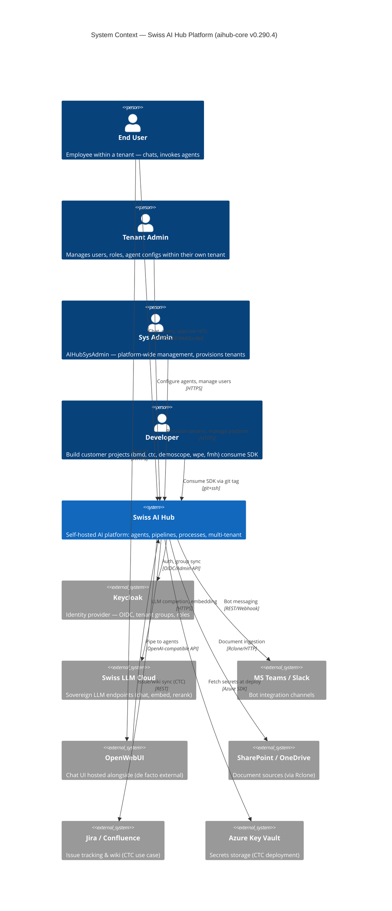
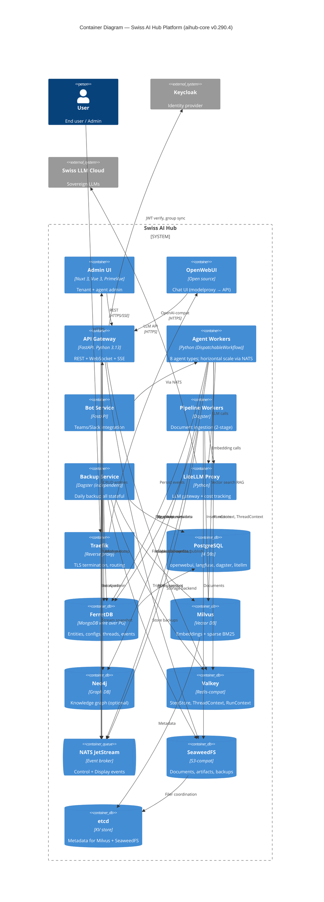

# C4 — aihub-core (Platform)

> Extracted from [`../03_c4_diagrams.md`](../03_c4_diagrams.md) §1 (System Context) + §2.1 (Container Diagram). Kept in
> sync with the aggregate file. Snapshot: **aihub-core v0.290.4** (2026-05-28).

## Level 0 — High-Level Solution Architecture

Boundary-first view of the platform's own architecture, organised by its five Docker network zones. App services (blue),
data/brokers (teal), LLM gateway/inference (orange), observability (green), external (grey), known gaps (red). This is
the reference architecture every customer deployment inherits.

```mermaid
flowchart TB
  classDef face fill:#eef6ff,stroke:#3d8be8,color:#000
  classDef svc fill:#e1f5ff,stroke:#3d8be8,color:#000
  classDef data fill:#d8f5f0,stroke:#2bb0a0,color:#000
  classDef llm fill:#ffe9d6,stroke:#e8772d,color:#000
  classDef obs fill:#e1ffe1,stroke:#3da35a,color:#000
  classDef ext fill:#eeeeee,stroke:#888888,color:#000
  classDef warn fill:#ffe1e1,stroke:#e05a5a,color:#000

  DEV["Customer SDKs<br/>bmd · ctc · demoscope · wpe · fmh<br/>(consume via git tag)"]:::ext
  KC["Keycloak<br/>OIDC · tenants · roles"]:::ext
  SRC[("SharePoint / OneDrive · Jira / Confluence<br/>document & data sources")]:::ext
  CH["MS Teams / Slack"]:::ext

  subgraph CORE["aihub-core · Swiss AI Hub Platform v0.290.4 · Gen 2 (Ansible) → Gen 3 (K8s, emerging) · ⚠ stateful services single-instance (no HA)"]
    direction TB

    subgraph PROXY["proxy zone (DMZ)"]
      TRAEFIK["Traefik<br/>TLS · routing"]:::svc
      OWUI["OpenWebUI<br/>chat UI · ⚠ RBAC bypass to agents"]:::warn
      ADMIN["Admin UI / Process UI<br/>Nuxt 3"]:::face
    end

    subgraph BACKEND["backend zone (app tier)"]
      API["API Gateway<br/>FastAPI · REST/WS/SSE<br/>⚠ no audit log entity · no GDPR erasure endpoint"]:::svc
      AGENTS["Agent Workers<br/>DispatchableWorkflow · 8 types<br/>⚠ MCP tool args bypass Presidio"]:::svc
      BOTS["Bot Service<br/>Teams/Slack<br/>⚠ no OTEL instrumentation"]:::svc
      PIPE["Pipeline Workers<br/>Dagster · 2-stage RAG<br/>⚠ in_process_executor (no parallelism)"]:::warn
      PROCESS["Process Engine (packages/process)<br/>⚠ DEAD CODE — zero external imports (DTC-8)"]:::warn
      BACKUP["Backup Service<br/>Dagster (independent)<br/>⚠ writes to same-host SeaweedFS (no off-site, adr_030)"]:::warn
      LITELLM["LiteLLM Proxy<br/>single LLM gateway + cost<br/>⚠ UsageLimits partial — no hard cap (adr_012)"]:::llm
      PRESIDIO["Presidio<br/>PII scrub · ⚠ DE-only (FR/IT/EN miss)"]:::warn
    end

    subgraph DATA["data zone · ⚠ NOT tenant-isolated (only Keycloak knows tenants — adr ADR-NEW-002)"]
      PG[("PostgreSQL<br/>4 DBs")]:::data
      FERRET[("FerretDB<br/>entities · events · threads<br/>⚠ no tenant_id · no TTL")]:::data
      MILVUS[("Milvus<br/>vectors · ⚠ single-node HNSW wall<br/>⚠ no doc-ACL inheritance (adr_020)")]:::data
      NEO4J[("Neo4j<br/>graph memory")]:::data
      VALKEY[("Valkey<br/>RunContext · StepStore")]:::data
      NATS["NATS JetStream<br/>Control + Display events<br/>⚠ no DLQ (poison-msg crash loop)"]:::data
      ETCD[("etcd<br/>metadata")]:::data
    end

    subgraph STORAGE["storage zone"]
      SEAWEED[("SeaweedFS<br/>S3 · docs · artifacts · backups<br/>⚠ replication=000")]:::data
    end

    subgraph INFER["local inference (GPU deployments)"]
      VLLM["vLLM<br/>chat · embed · rerank"]:::llm
      MINERU["MinerU<br/>OCR · ⚠ unstable on CPU"]:::warn
      SPEACHES["Speaches<br/>STT / TTS"]:::llm
    end

    OBS["Observability<br/>OTEL Collector + Langfuse<br/>trace · logs · metrics · cost<br/>⚠ no alerting (Prometheus/AlertManager missing) · no circuit breaker"]:::obs
  end

  SLC["Swiss LLM Cloud<br/>sovereign LLM endpoints"]:::ext

  ADMIN --> API
  OWUI -->|OpenAI-compat| API
  CH -->|webhook| BOTS

  API --> NATS
  AGENTS --> NATS
  BOTS --> NATS
  PIPE --> NATS
  AGENTS -->|RAG search| MILVUS
  AGENTS --> VALKEY
  AGENTS --> FERRET
  AGENTS --> NEO4J

  SRC -->|Rclone ingest| PIPE
  PIPE --> SEAWEED
  PIPE --> MILVUS
  PIPE -->|parse| MINERU

  AGENTS --> LITELLM
  PIPE -->|embed| LITELLM
  LITELLM -->|PII scrub| PRESIDIO
  LITELLM --> VLLM
  LITELLM -.egress.-> SLC

  FERRET --> PG
  MILVUS --> ETCD
  SEAWEED --> ETCD
  BACKUP -.snapshot.-> SEAWEED

  API --> OBS
  AGENTS --> OBS
  LITELLM --> OBS

  CORE -.OIDC.-> KC
  DEV -.git tag.-> CORE
```

**Read in one line**: five network zones isolate the tiers; all inter-service comms flow through **NATS** (Control vs
Display events); **LiteLLM is the single LLM gateway** (Presidio PII scrub → local vLLM or Swiss LLM Cloud egress);
Dagster ingests via MinerU→Milvus; **OTEL + Langfuse** observe everything; **Keycloak** owns identity; customers consume
the SDK by git tag. Red = the analyzed platform gaps: **`packages/process` is dead code** (zero external imports,
DTC-8), no HA (single-instance stateful), **data layer not tenant-isolated** (only Keycloak knows tenants), OpenWebUI
bypasses RBAC, **no audit log / no GDPR erasure**, **MCP tool args bypass Presidio**, Presidio DE-only, **no DLQ on
NATS**, in-process Dagster executor (no parallelism), **UsageLimits has no hard cap**, Milvus single-node wall + no
doc-ACL inheritance, SeaweedFS `replication=000`, same-host backup, bot has no OTEL, **no alerting / no circuit
breaker**, MinerU unstable on CPU.

## Level 1 — System Context

**Trust boundary**: end users, tenant admins, sys admins, developers, Swiss AI Hub itself, and Keycloak sit inside the
*internal/trusted* zone. Swiss LLM Cloud, Teams/Slack, SharePoint, Jira/Confluence, Azure Key Vault sit outside
*untrusted* with TLS termination at Traefik.

**Visible gaps at this level**:

- OpenWebUI is outside the trust boundary but has direct access to agents → RBAC bypass risk (Overview §3.1 #16).
- LiteLLM Cloud may receive PII not scrubbed by Presidio (Overview §3.1 #5).

## Level 2 — Container

### Container-vs-scaling-readiness

| Container        | Stateless? | Horizontal scale ready? | Bottleneck                         |
| ---------------- | :--------: | :---------------------: | ---------------------------------- |
| Admin UI (Nuxt)  |     ✅     |           ✅            | Asset CDN needed                   |
| OpenWebUI        |     ⚠️     |           ⚠️            | DB-backed sessions                 |
| API Gateway      |     ✅     |           ✅            | Keycloak call per request          |
| Agent Workers    |     ✅     |           ✅            | NATS consumer groups OK            |
| Bot Service      |     ✅     |           ✅            | -                                  |
| Pipeline Workers |     ❌     |           ❌            | `in_process_executor` (DTC-6)      |
| Backup Service   |     ❌     |           N/A           | Singleton design OK                |
| LiteLLM Proxy    |     ✅     |           ✅            | Single instance currently          |
| PostgreSQL       |     ❌     |           ❌            | Single instance                    |
| FerretDB         |     ❌     |           ❌            | FerretDB doesn't shard             |
| Milvus           |     ❌     |           ❌            | Single-node, HNSW wall             |
| Neo4j            |     ❌     |           ⚠️            | Cluster mode feasible              |
| Valkey           |     ❌     |           ❌            | Single instance                    |
| NATS JetStream   |     ⚠️     |           ⚠️            | Single node currently              |
| SeaweedFS        |     ❌     |           ⚠️            | `replication="000"` (no replicate) |

## Cross-reference

- L3 component diagrams + dynamic sequences + deployment + cross-customer topology:
  [`../03_c4_diagrams.md`](../03_c4_diagrams.md).
- Platform priority items:
  [`../01_architecture_review_overview.en.md#31-aihub-core-platform`](../01_architecture_review_overview.en.md).
- Proposed ADRs for the platform: [`../05_proposed_adrs/`](../05_proposed_adrs/).
