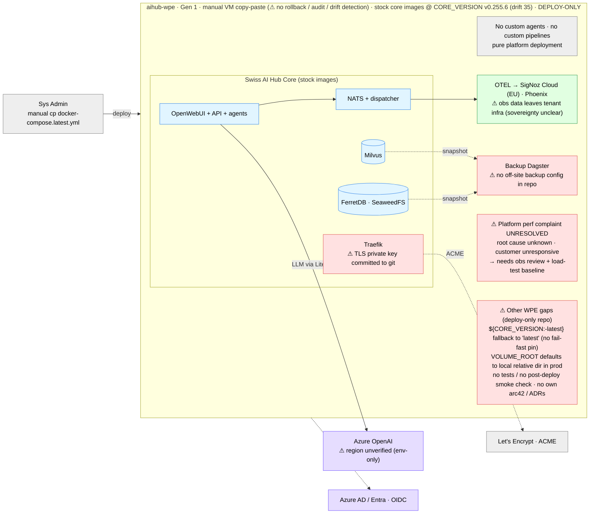
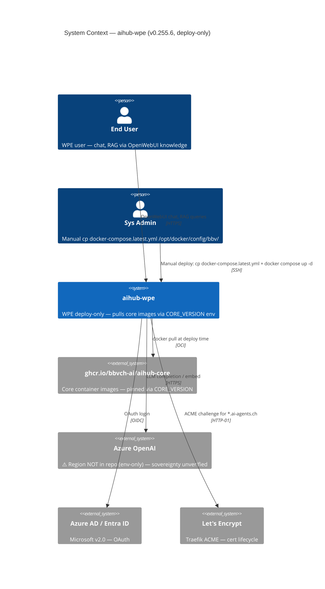
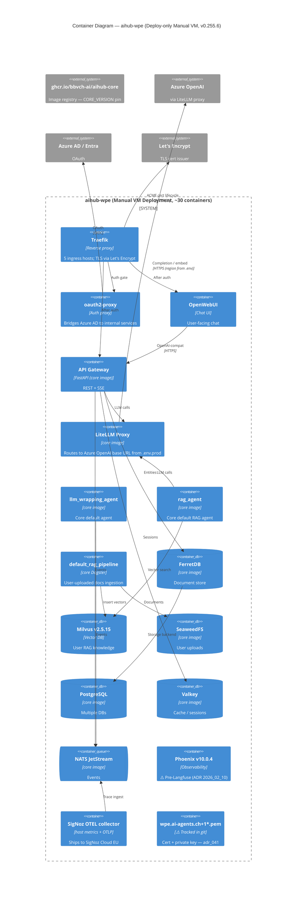

# C4 — aihub-wpe

> Snapshot: **aihub-wpe v0.255.6** (drift 35 minors behind core v0.290.4) as of 2026-05-28.
> New file in this review. **Deploy-only repo**: no custom agents, pipelines, API, or bot. **Security incident**:
> TLS private key committed to git — see [`adr_041`](../05_proposed_adrs/adr_041_tls_key_committed_remediation.md).

## Level 0 — High-Level Solution Architecture

Boundary-first view: core touchpoints (blue), Azure (purple), observability (green), known issues (red). WPE has **no
custom code** — it is a pure platform deployment.

**Read in one line**: deploy-only — stock core images pinned by `CORE_VERSION`, no custom agents/pipelines; LLM via Azure
OpenAI (⚠ region unverified); identity Azure AD; Traefik holds a **TLS key that leaked into git** (adr_041). The open
problem: the customer reports **poor platform performance**, root cause is unknown and they are **unresponsive** — needs
observability review + a load-test baseline to diagnose. Other gaps: manual copy-paste deploy (no rollback/audit),
`${CORE_VERSION:-latest}` fallback, VOLUME_ROOT local default, no off-site backup in repo, no tests/smoke, no own
arc42/ADRs, SigNoz Cloud EU (sovereignty), drift 35.

## Level 1 — System Context

**Trust boundary**: end user / sys admin / WPE deployment / Azure AD / Let's Encrypt are *trusted*. **Azure OpenAI
region is unverifiable from repo** — only `AZURE_OPENAI_BASE_URL` env var in `.env.prod` (sensitive-file-guarded);
sovereignty status undefined (Overview §3.5 #3). **`wpe.ai-agents.ch+1-key.pem` and `wpe.ai-agents.ch+1.pem`
are tracked in git** alongside production-domain certificate — see remediation runbook
[`adr_041`](../05_proposed_adrs/adr_041_tls_key_committed_remediation.md).

## Level 2 — Container

### WPE-specific observations

- **Deploy-only**: no custom agents, pipelines, API, or bot. Uses core `llm_wrapping_agent` + `rag_agent` +
  `default_rag_pipeline` from images pulled via `CORE_VERSION` env.
- **`CORE_VERSION="v0.255.6"`** pinned in `.env.prod`, but `docker-compose.latest.yml` has
  `${CORE_VERSION:-latest}` fallback — Overview §3.5 #5. Reproducibility risk if env var unset.
  Same anti-pattern as `aihub-k8s` (see [`adr_040`](../05_proposed_adrs/adr_040_k8s_chart_core_version_pinning.md)).
- **TLS key + cert tracked in git** (`wpe.ai-agents.ch+1-key.pem`, `wpe.ai-agents.ch+1.pem`). `.gitignore` only
  excludes `.env`. **Critical security issue** — see
  [`adr_041`](../05_proposed_adrs/adr_041_tls_key_committed_remediation.md). Production runs Traefik + Let's
  Encrypt ACME, so the committed cert is dead weight but the private key is permanently disclosed until history
  is rewritten.
- **LLM region unverifiable** from repo (Overview §3.5 #3). Sovereignty status undefined.
- **`VOLUME_ROOT:-./.docker-volumes` defaults to relative dir** — snapshot paths depend on `pwd` at compose
  invocation (Overview §3.5 #6).
- **Off-site backup not in repo** (Overview §3.5 #7). Unknown if backup exists out-of-repo.
- **Test coverage**: N/A — deploy-only, no custom code. **No smoke tests either** (Overview §3.5 #9).
- **Stack**: Phoenix v10.0.4 (pre-Langfuse), Milvus v2.5.15. Inherits core baseline at the pin's version.
- **OTEL**: SigNoz Cloud "EU" region — sovereignty implication unclear (Overview §5.8 SigNoz Cloud concern).

### Scaling readiness

| Container          | Stateless? | Horizontal scale ready? | Notes                                                  |
| ------------------ | :--------: | :---------------------: | ------------------------------------------------------ |
| Traefik            |     ✅     |           ⚠️            | ACME cert state local; would need shared store         |
| oauth2-proxy       |     ✅     |           ✅            | Token verification                                     |
| OpenWebUI          |     ⚠️     |           ⚠️            | DB-backed sessions; inherits core issue                |
| API Gateway        |     ✅     |           ✅            | Core image                                             |
| llm_wrapping_agent |     ✅     |           ✅            | Core image                                             |
| rag_agent          |     ✅     |           ✅            | Core image                                             |
| default_rag_pipeline |   ❌     |           ❌            | Core Dagster `in_process_executor`                     |
| Milvus / FerretDB / SeaweedFS / Valkey / NATS / PG | ❌ | ❌  | All single-instance; core defaults                     |

## Cross-reference

- Customer priority items: [`../01_architecture_review_overview.en.md#35-aihub-wp`](../01_architecture_review_overview.en.md).
- Customer concerns: [`../01_architecture_review_overview.en.md#55-aihub-wp`](../01_architecture_review_overview.en.md).
- **TLS-key incident remediation**: [`../05_proposed_adrs/adr_041_tls_key_committed_remediation.md`](../05_proposed_adrs/adr_041_tls_key_committed_remediation.md).
- K8s chart pinning policy (relates to CORE_VERSION fallback):
  [`../05_proposed_adrs/adr_040_k8s_chart_core_version_pinning.md`](../05_proposed_adrs/adr_040_k8s_chart_core_version_pinning.md).
- Sovereignty path: [`../05_proposed_adrs/adr_000_sovereignty_compliance_path.md`](../05_proposed_adrs/adr_000_sovereignty_compliance_path.md).
- Aggregate deployment + multi-customer topology: [`../03_c4_diagrams.md`](../03_c4_diagrams.md).
