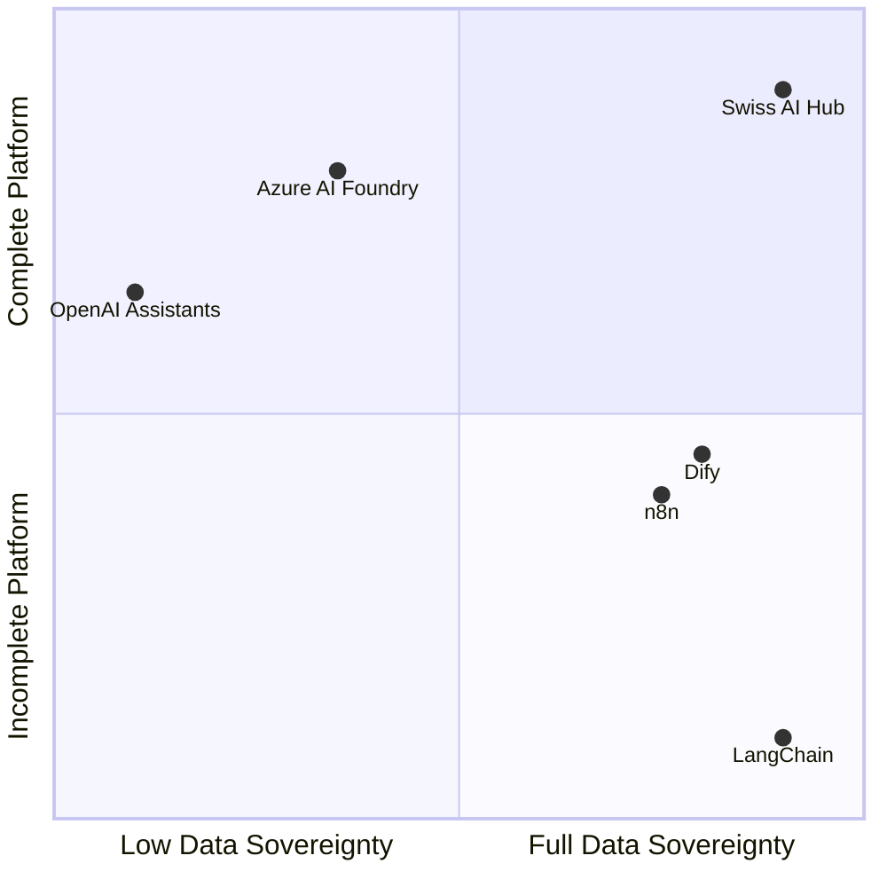

# Vergleichsmatrix: Wo der Swiss AI Hub passt

Verschiedene Organisationen benötigen unterschiedliche KI-Lösungen. Manche priorisieren die Benutzerfreundlichkeit, andere benötigen vollständige Kontrolle. Das Verständnis dieser Kompromisse hilft Ihnen, den richtigen Ansatz für Ihre Anforderungen zu wählen.

## Marktpositionierung (Kurzfassung)

Dieses Kapitel erklärt, wann der Swiss AI Hub die richtige Lösung ist und wann nicht. Wenn Sie jedoch die stark vereinfachte Version wünschen:

Grosse Cloud-Plattformen bieten Ihnen alles out-of-the-box – Authentifizierung, Monitoring, Schnittstellen, alles. Aber Sie besitzen nichts und zahlen für immer.

Programmier-Frameworks wie LangChain ermöglichen es Ihnen, überall zu deployen und den Code zu besitzen. Aber sie sind nur Bibliotheken. Sie kümmern sich selbst um Authentifizierung, Deployment, Monitoring und Schnittstellen.

Der Swiss AI Hub befindet sich im Quadranten „Alles besitzen“: eine vollständige, batteries-included Plattform, die Sie deployen und besitzen. Sie erhalten die Vollständigkeit von Cloud-Plattformen mit dem Eigentum an Open-Source-Frameworks.

Der Rest dieses Kapitels erläutert die spezifischen Kompromisse. Lesen Sie weiter für das nuancierte Bild, aber wenn Sie wenig Zeit haben: **Wir bieten Ihnen eine vollständige Plattform ohne Vendor Lock-in**.

## Die 12 KI-Bedürfnisse von Unternehmen

Wir haben zwölf kritische Bedürfnisse identifiziert, denen Organisationen bei der Einführung von KI begegnen:

| Bedürfnis                      | Bedeutung                                                    | Warum es wichtig ist                                       |
| :----------------------------- | :----------------------------------------------------------- | :--------------------------------------------------------- |
| **Datensouveränität**          | Kontrolle darüber, wo Daten gespeichert und verarbeitet werden | Rechtliche Compliance und Richtlinienanforderungen         |
| **Kalkulierbare Kosten**       | Transparente Preisgestaltung ohne Überraschungen             | Budgetplanung und ROI-Berechnung                           |
| **Vertrauen in Ergebnisse**    | Einblick in KI-Argumentation und -Entscheidungen             | Risikomanagement und Benutzerakzeptanz                     |
| **Time-to-Value**              | Geschwindigkeit vom Deployment zum funktionierenden System   | Nachweis des ROI und Aufrechterhaltung der Dynamik         |
| **Tool-Integration**           | Kompatibilität mit bestehender Infrastruktur                 | Vermeidung von Workflow-Unterbrechungen                    |
| **Zugänglichkeit der Fähigkeiten** | Ermöglichung von Teams ohne KI-Expertise                     | Demokratisierung der KI-Entwicklung                        |
| **Skalierbarkeit**             | Wachsende Nutzung ohne Komplexität                           | Unterstützung der unternehmensweiten Einführung            |
| **Herstellerunabhängigkeit**   | Vermeidung von Lock-in und Beibehaltung der Kontrolle        | Langfristige Flexibilität und Verhandlungsposition         |
| **Einheitliche Governance**    | Konsistente Sicherheit und Compliance                        | Erfüllung von Unternehmensanforderungen                    |
| **Produktionszuverlässigkeit** | Konsistente Leistung für kritische Operationen               | Geschäftskontinuität                                       |
| **Visuelle Entwicklung**       | Drag-and-Drop-Workflow-Erstellung                            | Befähigung von Citizen Developern                          |
| **Kein Wartungsaufwand**       | Vollständig verwaltete Operationen                           | Fokus auf Anwendungsfälle, nicht auf Infrastruktur        |

## Vergleich verschiedener Ansätze

### Position des Swiss AI Hub

Der Swiss AI Hub bietet:

-   **Volle Punktzahl** für Souveränität, Kostenkontrolle, Vertrauen, Unabhängigkeit und Governance durch selbstgehostete Open-Source-Architektur
-   **Starke Fähigkeiten** in Integration, Skill-Bridging, Skalierung und Zuverlässigkeit durch Plattformvollständigkeit
-   **Schnelles Deployment** mit vorgefertigten Komponenten, das jedoch eine anfängliche Einrichtung erfordert
-   **Code-First-Ansatz** anstelle von visuellen Entwicklungstools

### Bibliotheken und Frameworks

Tools wie **LangChain**, **LlamaIndex** und **Semantic Kernel** zeichnen sich durch die Bereitstellung von KI-Entwicklungsabstraktionen aus, überlassen Ihnen aber die Infrastruktur vollständig. Sie bieten Herstellerunabhängigkeit durch Open Source, erfordern aber den Aufbau von allem anderen: Deployment, Monitoring, Authentifizierung, Benutzeroberflächen und Governance. Diese Tools lösen das Problem der KI-Logik, schaffen aber ein Infrastrukturproblem.

### Verwaltete Cloud-Plattformen

Services wie **Azure AI Foundry**, **Google Vertex AI** und **AWS Bedrock** bewältigen die Komplexität der Infrastruktur und bieten Unternehmensfunktionen. Sie tauschen Souveränität und Unabhängigkeit gegen operative Einfachheit ein. Ihre Daten leben in ihrer Cloud (auch wenn die Region wählbar ist), Sie zahlen deren Margen auf unbestimmte Zeit und arbeiten innerhalb ihrer Einschränkungen. Sie lösen das Infrastrukturproblem, schaffen aber einen Vendor Lock-in.

### Visuelle Entwicklungsplattformen

Plattformen wie **Dify** und **Flowise** demokratisieren KI durch Drag-and-Drop-Oberflächen. Sie machen KI für Nicht-Entwickler zugänglich, aber es fehlen oft Unternehmensanforderungen wie Governance, detaillierte Observability und Produktionszuverlässigkeit. Diese Plattformen eignen sich hervorragend für schnelles Prototyping, kämpfen aber mit komplexen, produktionsreifen Workflows, die eine Kontrolle auf Code-Ebene erfordern.

### Automatisierungsplattformen mit KI

Tools wie **n8n** und **Zapier AI** sind Workflow-Automatisierungsplattformen, die KI-Funktionen hinzugefügt haben. Sie zeichnen sich durch die Verbindung von Systemen und die Befähigung nicht-technischer Benutzer aus, behandeln KI jedoch als Black-Box-Komponenten. Es fehlen ihnen eine tiefe KI-Observability, ein einheitliches Modellmanagement und die Transparenz, die für ein vertrauenswürdiges KI-Deployment erforderlich ist.

## Der detaillierte Vergleich

| Framework             | Datensouveränität | Kalkulierbare Kosten | Vertrauen in Ergebnisse | Time-to-Value | Tool-Integration | Zugänglichkeit der Fähigkeiten | Skalierbarkeit | Herstellerunabhängigkeit | Einheitliche Governance | Produktionszuverlässigkeit | Visuelle Entwicklung | Kein Wartungsaufwand |
| :-------------------- | :---------------: | :-----------------: | :---------------------: | :-----------: | :--------------: | :----------------------------: | :------------: | :----------------------: | :---------------------: | :------------------------: | :------------------: | :------------------: |
| **Swiss AI Hub**      |        ✅         |        ✅           |           ✅            |      ⚠️       |        ✅        |               ✅               |       ✅       |            ✅            |            ✅             |             ✅             |          ❌          |          ❌          |
| **LangChain**         |        ⚠️         |        ❌           |           ⚠️            |      ❌       |        ✅        |               ⚠️               |       ❌       |            ✅            |            ❌             |             ❌             |          ⚠️          |          ❌          |
| **Azure AI Foundry**  |        ⚠️         |        ⚠️           |           ⚠️            |      ⚠️       |        ✅        |               ⚠️               |       ✅       |            ❌            |            ✅             |             ✅             |          ✅          |          ✅          |
| **OpenAI Assistants** |        ❌         |        ⚠️           |           ⚠️            |      ✅       |        ✅        |               ✅               |       ✅       |            ❌            |            ❌             |             ✅             |          ⚠️          |          ✅          |
| **Dify**              |        ✅         |        ✅           |           ⚠️            |      ✅       |        ⚠️        |               ✅               |       ⚠️       |            ✅            |            ⚠️             |             ⚠️             |          ✅          |          ✅          |
| **n8n**               |        ✅         |        ✅           |           ❌            |      ✅       |        ✅        |               ✅               |       ⚠️       |            ✅            |            ❌             |             ⚠️             |          ✅          |          ⚠️          |

> **Legende**\
> ✅ Volle Funktionalität\
> ⚠️ Partielle Funktionalität\
> ❌ Nicht abgedeckt

## Die richtige Wahl treffen

Der Vergleich offenbart klare Muster:

**Wählen Sie Bibliotheken** (LangChain, LlamaIndex), wenn Sie über starke Engineering-Teams verfügen, die Infrastruktur aufbauen und warten können. Sie erhalten maximale Flexibilität, müssen aber jede Produktionsherausforderung selbst lösen.

**Wählen Sie verwaltete Plattformen** (Azure, Google, AWS), wenn operative Einfachheit Souveränitätsbedenken überwiegt. Sie erhalten Zuverlässigkeit und Skalierbarkeit, akzeptieren aber Vendor Lock-in und laufende Kosten.

**Wählen Sie visuelle Plattformen** (Dify, Flowise), wenn schnelles Prototyping und Citizen Development Prioritäten sind. Sie erhalten Zugänglichkeit, können aber in Produktionsszenarien an Grenzen stossen.

**Wählen Sie Automatisierungsplattformen** (n8n, Zapier), wenn KI eine Erweiterung bestehender Workflows und nicht die Kernfunktion ist. Sie erhalten eine breite Integration, aber eine begrenzte KI-Tiefe.

**Wählen Sie den Swiss AI Hub**, wenn Sie die Vollständigkeit einer verwalteten Plattform mit der Kontrolle einer selbstgehosteten Infrastruktur benötigen. Sie erhalten Unternehmensfunktionen, volle Souveränität und Herstellerunabhängigkeit, müssen sich aber selbst um Deployment und Operationen kümmern.

Der Swiss AI Hub nimmt eine einzigartige Position ein: eine komplette Plattform, die Sie besitzen und kontrollieren. Dieser Ansatz erfordert mehr anfängliche Einrichtung als verwaltete Services, bietet aber langfristige Vorteile in Bezug auf Souveränität, Kostenkontrolle und Flexibilität, die sich im Laufe der Zeit vervielfachen.
