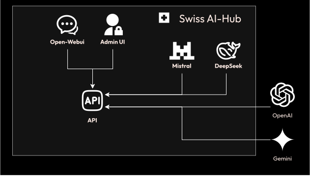
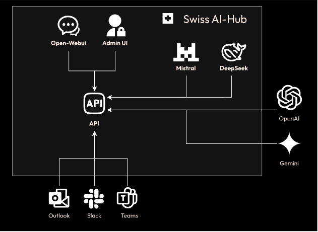
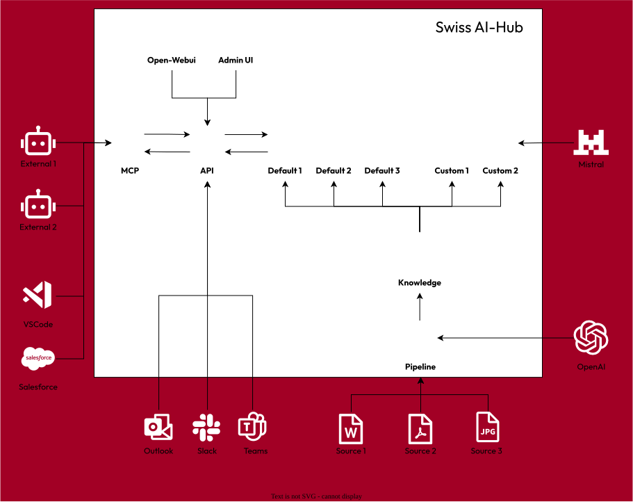
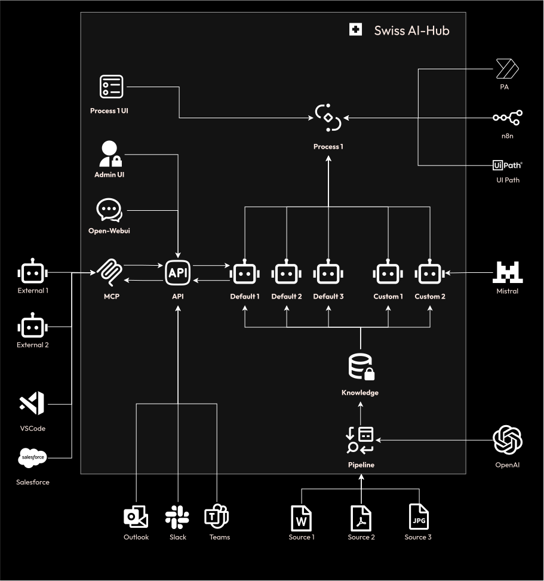

# Kernkomponenten

Der Swiss AI Hub ist eine vollständige Plattform, die Infrastruktur für Agents, Pipelines und Prozessautomatisierung
umfasst. Das hier beschriebene Stufenmodell ist ein empfohlener Einführungspfad und keine Reihe separater
Softwareversionen.

Organisationen tun sich oft schwer, wenn sie komplexe Automatisierungsprojekte angehen, ohne zuvor eine grundlegende
KI-Kompetenz aufzubauen. Das Stufenmodell bietet einen strukturierten Ansatz, der sich an erfolgreichen
Einführungsmustern orientiert.

**Tier 1** bietet sicheren LLM-Zugriff für jeden in der Organisation. Durch direkte Erfahrung lernen Benutzer die
Fähigkeiten und Einschränkungen der Modelle kennen, verbessern ihre Fähigkeiten im Prompt-Writing und identifizieren
Aufgaben in ihrer täglichen Arbeit, bei denen KI von Vorteil sein könnte.

Nach einer Nutzungsdauer wird die Reibung beim Wechsel zwischen Arbeitsanwendungen und einer dedizierten
KI-Schnittstelle zu einem häufigen Problem. Dies führt zu **Tier 1+**, das dieselben KI-Funktionen direkt in Tools wie
Microsoft Teams, Slack und Outlook integriert. Dies reduziert Workflow-Unterbrechungen und fördert eine breitere
Akzeptanz.

Benutzer können dann feststellen, dass die generischen Modelle einen spezifischen Unternehmenskontext vermissen lassen.
Ein Modell, das beispielsweise eine Bewerbung bewerten soll, wäre sich der internen Einstellungspolitik einer
Organisation nicht bewusst. Dies signalisiert die Bereitschaft für **Tier 2**.

**Tier 2** führt spezialisierte Agents ein, die Zugriff auf organisatorisches Wissen erhalten. Ein HR-Agent kann
konfiguriert werden, um Einstellungskriterien aus Mitarbeiterhandbüchern zu verstehen. Ein Finanz-Agent kann der
Kontenplan des Unternehmens beigebracht werden, um Finanzsysteme abzufragen. Diese Agents nutzen spezifische Daten einer
Organisation, um relevante, kontextbezogene Antworten zu liefern.

Mit zunehmender Nutzung von Agents entstehen repetitive Orchestrierungsmuster. Ein Mitarbeiter könnte ein Dokument
manuell an einen Agent zur Analyse, dann an einen Manager zur Überprüfung und schliesslich an einen weiteren Agent für
eine Hintergrundprüfung weiterleiten. Diese Art der mehrschrittigen, manuellen Weiterleitung deutet auf die
Notwendigkeit von **Tier 3** hin.

**Tier 3** automatisiert diese Muster als formale Prozesse. Das System kann konfiguriert werden, um Bewerbungen
aufzunehmen, sie an einen HR-Agent zur Vorprüfung weiterzuleiten, eine menschliche Überprüfung nur für Grenzfälle
anzufordern, Hintergrundprüfungen über externe Systeme auszulösen und die zuständigen Personalverantwortlichen zu
benachrichtigen. Dies ermöglicht es menschlichen Mitarbeitern, sich auf Entscheidungsfindung und Ausnahmebehandlung zu
konzentrieren.

Die Plattform umfasst all diese Funktionen von Anfang an. Das Stufenmodell beantwortet die Frage, wann welche Funktion
eingeführt werden sollte, basierend auf der organisatorischen Bereitschaft. Die Progression gibt den Menschen Zeit,
Workflows anzupassen, Fähigkeiten zu entwickeln und Vertrauen in das System aufzubauen.

## Tier 1: Grundlage für sicheren KI-Zugriff

Der primäre Benutzereinstiegspunkt ist die Open-WebUI-Weboberfläche, die Text-, Dokument- und Spracheingaben
unterstützt.

Alle Anfragen werden über eine API-Schicht verarbeitet, die die Authentifizierung handhabt, Berechtigungen für das
angeforderte Modell überprüft und die Interaktion zur Überprüfung protokolliert. Die Anfrage wird dann an das
entsprechende LLM, wie ein OpenAI- oder Google Gemini-Modell, basierend auf der Systemkonfiguration, weitergeleitet.

Antworten vom LLM werden mittels Server-Sent Events an den Browser zurückgestreamt, wodurch der Benutzer den Text sieht,
während er generiert wird. Diese Architektur gewährleistet eine reaktionsschnelle Oberfläche, selbst für Anfragen, die
längere Verarbeitungszeiten erfordern.

Eine separate Admin-UI, die mit Nuxt erstellt wurde, bietet Administratoren Einblick in Systemnutzung,
Benutzerverwaltung und Modellkonfiguration. Sie ermöglicht es ihnen, die Modellnutzung zu überwachen, Kostenlimits
festzulegen und Audit-Logs zu überprüfen.

Alle Daten, einschliesslich Benutzeranfragen, LLM-Antworten, Konversationshistorie und Systemprotokolle, werden in der
internen Datenbank der Plattform gespeichert. Dies stellt sicher, dass Daten innerhalb der kontrollierten Infrastruktur
der Organisation verbleiben, es sei denn, der Zugriff auf externe Modelle ist explizit konfiguriert.

## Tier 1+: Nutzer dort abholen, wo sie arbeiten

Die Einschränkung einer eigenständigen Weboberfläche ist die Workflow-Unterbrechung, die durch Kontextwechsel verursacht
wird. Tier 1+ löst dies, indem die Funktionen der Plattform in die Anwendungen erweitert werden, die Mitarbeiter täglich
nutzen. Ein Benutzer in Microsoft Teams kann einen Konversationsverlauf direkt in der Anwendung zusammenfassen, und die
Antwort der KI erscheint im selben Kanal.

::: details Unterstützte Kanäle
Die Plattform nutzt das Azure Bot Framework für Integrationen. Unterstützte Kanäle umfassen:

- Alexa
- Email
- Facebook
- MS Teams
- Outlook
- Skype
- Slack
- Telegram
- WeChat
- Web
- ... und mehr
:::

Jede Integration passt sich den Interaktionsmustern des Host-Tools an. Zum Beispiel könnte eine KI-Antwort in Slack in
einem Thread gepostet werden, während sie in Outlook beim Verfassen von E-Mail-Antworten helfen könnte. Die zentrale
API-Schicht stellt sicher, dass alle Interaktionen, unabhängig von ihrem Ursprung, den gleichen Sicherheits-,
Governance- und Logging-Richtlinien unterliegen.

## Tier 2: Von Daten zu kontextbezogener Intelligenz

Tier 2 führt Funktionen zur Aufnahme und Strukturierung organisatorischer Daten ein, um KI-Agents Kontext
bereitzustellen. Der Prozess beginnt mit Informationsquellen wie SharePoint-Dokumentbibliotheken.

Eine Pipeline orchestriert den Datenverarbeitungs-Workflow. Sie überwacht verbundene Quellen auf neue oder aktualisierte
Dateien und löst eine Verarbeitungssequenz aus. Dokumente werden geparst, um nicht nur Text, sondern auch strukturelle
Elemente wie Überschriften und Tabellen zu extrahieren. Der Inhalt wird dann in semantisch bedeutungsvolle Chunks
unterteilt, basierend auf Themenwechseln oder Abschnittstrennungen. Jeder Chunk wird unter Verwendung eines Modells wie
Mistral in ein Vektorenbett (Vector Embedding) umgewandelt.

::: tip
Die hier beschriebene Pipeline ist eine Standardkonfiguration. Das SDK ermöglicht die Erstellung kundenspezifischer
Pipelines, um andere Quellen (Datenbanken, APIs, FTP-Server) anzubinden, die Dokumentenverarbeitung anzupassen und Daten
anzureichern.
:::

Diese Embeddings werden in einer Vektordatenbank gespeichert und indiziert, die als Wissensbasis der Plattform dient.
Dies ermöglicht eine semantische Suche, wodurch Agents Informationen basierend auf Bedeutung statt exakter
Schlüsselwortübereinstimmungen abrufen können. Das System pflegt eine klare Nachvollziehbarkeit von jedem Embedding
zurück zum Quelldokument für Rückverfolgbarkeit und Überprüfung.

Mit einer etablierten Wissensbasis kann die Plattform mehrere Agents unterstützen. Standard-Agents könnten einen
Dokumentenanalysten oder einen Dateninterpreter umfassen. Benutzerdefinierte Agents können mit dem SDK erstellt werden,
um organisationsspezifische Aufgaben zu bearbeiten, interne Terminologie zu verstehen oder domänenspezifische
Schlussfolgerungen anzuwenden.

Die Plattform ist auch nach aussen offen, unter Verwendung des Model Context Protocol (MCP). Über MCP können Agents von
anderen Systemen sicher auf die Plattform und deren Agents zugreifen.

## Tier 3: Orchestrierung von Geschäftsprozessen

Tier 3 führt eine Prozess-Orchestrierungsengine ein, um mehrschrittige Workflows zu automatisieren, die KI-Agents,
Menschen und externe Systeme involvieren.

Eine dedizierte Prozess-UI ermöglicht es Benutzern, diese Workflows zu visualisieren und mit ihnen zu interagieren. Sie
zeigt aktive Prozesse als Flussdiagramme an, die den aktuellen Schritt, die verantwortliche Entität (Mensch, Agent oder
externes System) und die nachfolgenden Schritte zeigen.

Wenn ein Prozess ausgelöst wird, bewertet die Prozess-Orchestrierungsengine den ersten Schritt. Wenn der Schritt eine
Dokumentenanalyse erfordert, wird die Aufgabe an einen KI-Agent delegiert. Der Output des Agents wird an den
Orchestrator zurückgegeben, der dann mit dem nächsten Schritt fortfährt. Wenn ein Schritt menschliches Urteilsvermögen
erfordert, wird eine Aufgabe im Arbeitsbereich des jeweiligen Benutzers in der Prozess-UI erstellt. Die Schnittstelle
liefert die KI-Analyse, das Quelldokument und den Kontext für die Entscheidung. Sobald der Mensch die Aufgabe
abgeschlossen hat, wird der Prozess fortgesetzt.

Externe Systeme können über Konnektoren integriert werden. Power Automate-Verbindungen können Flows auslösen, um
SharePoint-Listen zu aktualisieren oder E-Mails zu senden. Eine n8n-Integration ermöglicht die Kommunikation mit UiPath
für Aufgaben der Robotic Process Automation, die Legacy-Systeme betreffen.

::: tip
Der hier beschriebene Prozess ist ein Beispiel. Das SDK kann verwendet werden, um benutzerdefinierte Prozesse zu
erstellen, die eine Verbindung zu verschiedenen externen und internen Systemen herstellen.
:::

Die Orchestrierungsengine verwaltet den Status jedes Prozesses, verwaltet Zeitüberschreitungen und behandelt Fehler.
Wenn ein externes System nicht reagiert, kann der Prozess so konfiguriert werden, dass die Aufgabe zur manuellen
Intervention an einen Menschen weitergeleitet wird. Die API-Schicht wird in diesem Tier erweitert, um
Konversationskontexte zu verwalten, die sich über mehrere Teilnehmer und lange Zeiträume erstrecken.
