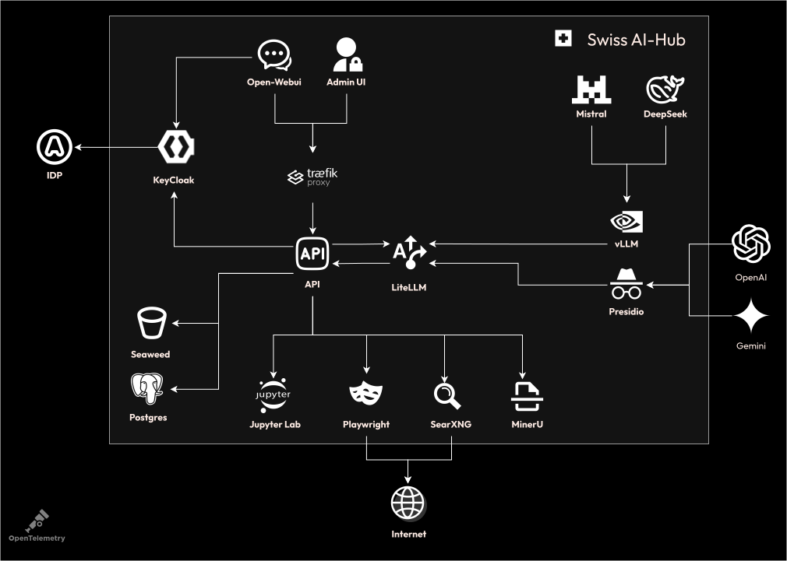
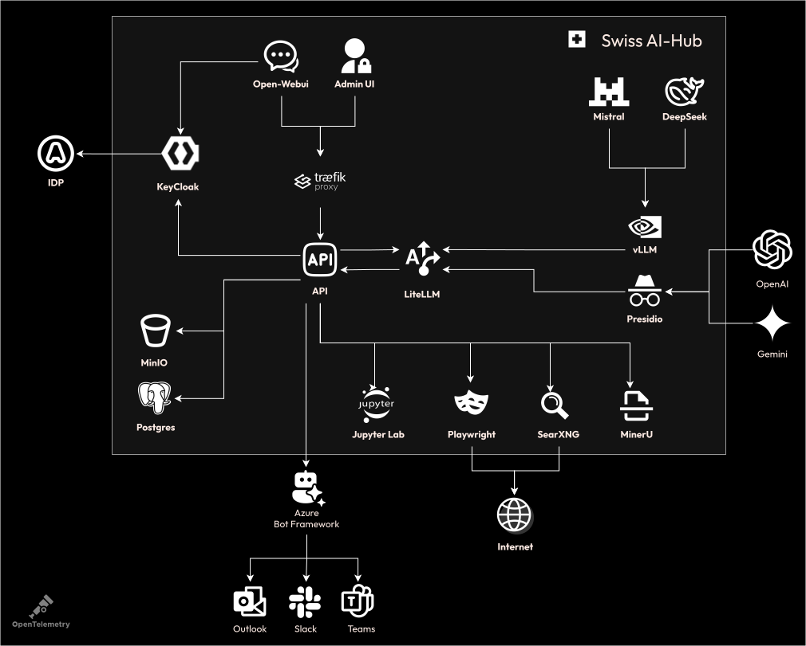

# Die Infrastruktur-Ebenen

::: warning
Diese Dokumentation richtet sich an Leser, die die in der Plattform enthaltenen Infrastrukturkomponenten und deren Rolle
vollständig verstehen möchten. Dieses Verständnis ist nicht erforderlich, um die Plattform zu betreiben oder zu
deployen, erweist sich jedoch als hilfreich, wenn Sie sie erweitern, skalieren oder modifizieren möchten. Die folgenden
Abschnitte übersetzen die geschäftliche Perspektive in technische Implementierungsdetails.
:::

## Ebene 1: Kernkomponenten der Infrastruktur

Das Fundament beginnt mit **OAuth2**, das die Authentifizierung handhabt. Wenn Benutzer auf Open-WebUI oder die Admin UI
zugreifen, validiert OAuth2 deren Anmeldeinformationen gegenüber dem Identity Provider Ihrer Organisation. Diese
Komponente wurde gegenüber einfacheren Authentifizierungsmethoden gewählt, da sie sich in bestehende Unternehmenssysteme
wie Azure AD oder Keycloak integrieren lässt, ohne Passwörter zu synchronisieren oder eine benutzerdefinierte
Benutzerverwaltung zu erfordern.

::: info
Die Architekturdiagramme vereinfachen bestimmte Aspekte zugunsten der Lesbarkeit. Mehrere Hilfsdatenbanken, die einige
Tools erfordern, wurden weggelassen, und einige Verbindungen zwischen Komponenten sind vereinfacht dargestellt, um
visuelle Unübersichtlichkeit zu vermeiden. Die Diagramme erfassen die konzeptionellen Beziehungen zwischen
Infrastrukturkomponenten und nicht jedes technische Detail.
:::

Hinter der Authentifizierungsschicht fungiert **Traefik** als Reverse Proxy und API Gateway. Jede HTTP-Anfrage
durchläuft Traefik, das den Datenverkehr basierend auf Pfadmustern routet, die TLS-Terminierung handhabt und den
Lastausgleich bereitstellt, wenn Sie Komponenten horizontal skalieren. Die dynamischen Konfigurationsfähigkeiten von
Traefik ermöglichen es der Plattform, neue Services ohne Neustarts zu registrieren, was für das Hinzufügen
benutzerdefinierter Agents oder zusätzlicher UI-Komponenten entscheidend ist.

Die auf FastAPI basierende **API**-Schicht bietet mehr als nur einfaches Request-Routing. Sie unterhält
WebSocket-Verbindungen für Echtzeit-Streaming, verwaltet den Session State für Konversationen, erzwingt Rate Limits pro
Benutzer und transformiert Requests zwischen verschiedenen Komponentenprotokollen. FastAPI wurde aufgrund seiner
asynchronen Fähigkeiten, der automatischen OpenAPI-Dokumentationsgenerierung und seiner hervorragenden Performance unter
gleichzeitiger Last ausgewählt.

**LiteLLM** fungiert als universelles LLM-Gateway. Anstatt separate Integrationen für OpenAI, Anthropic, Google und
lokale Modelle zu implementieren, bietet LiteLLM eine einheitliche Schnittstelle. Es handhabt die Wiederholungslogik,
wenn Modelle überlastet sind, verfolgt die Token-Nutzung für die Kostenverteilung, verwaltet unterschiedliche Rate
Limits über Anbieter hinweg und konvertiert zwischen verschiedenen modellspezifischen Formaten. Das Gateway-Muster
ermöglicht den Modellwechsel ohne Codeänderungen, was entscheidend ist, um Vendor Lock-in zu vermeiden.

Für modellspezifische Funktionen bietet **vLLM** Hochleistungs-Inferenz für lokal gehostete Modelle wie Mistral oder
DeepSeek. Es verwendet PagedAttention für effizientes Speichermanagement, wodurch größere Modelle auf verfügbarer
Hardware ausgeführt werden können. **Presidio** ergänzt die PII-Erkennung und -Anonymisierung, indem es Text nach
sensiblen Datenmustern scannt, bevor er an externe Modelle gesendet oder in Datenbanken gespeichert wird.

Die Speicherinfrastruktur verwendet **SeaweedFS** für S3-kompatiblen Objektspeicher und **MongoDB** für
Dokumentspeicher. SeaweedFS speichert hochgeladene Dateien, generierte Berichte und Modell-Artefakte mit Versionierungs-
und Lebenszyklusrichtlinien. Der SeaweedFS Filer verwendet **etcd** als sein Metadaten-Backend und ermöglicht so
Hochverfügbarkeits-Deployments mit mehreren Filer-Instanzen. Die Plattform stellt zwei Schnittstellen bereit: die **S3
API** unter `s3.${DOMAIN}` mit AWS-Signaturauthentifizierung für den programmatischen Zugriff und die **Filer web UI**
unter `datalake.${DOMAIN}` über einen OAuth2 Proxy für Entwickler, um Dateien zu durchsuchen und zu debuggen (erfordert
die Rolle AIHubDeveloper). MongoDB speichert Gesprächsverläufe, Benutzerpräferenzen, Anwendungsdaten und
Ereignisverläufe dauerhaft. Diese Auswahl bietet Cloud-native Speicherstrategien, die On-Premise oder in
Cloud-Umgebungen identisch funktionieren.

Die Plattform umfasst integrierte KI-Tools, die das Chat-Erlebnis verbessern. **Jupyter Lab** ermöglicht die
Code-Interpretation und -Ausführung, wenn Benutzer den LLM bitten, Daten zu analysieren oder Berechnungen durchzuführen.
Der LLM kann Python-Code schreiben, der sicher in einer isolierten Jupyter-Umgebung ausgeführt wird und die Ergebnisse
direkt in der Konversation zurückgibt. **SearXNG** bietet Web-Suchfunktionen, wenn Benutzer aktuelle Informationen
benötigen, indem es Ergebnisse von mehreren Suchmaschinen aggregiert und gleichzeitig die Privatsphäre wahrt.
**Playwright** extrahiert Inhalte von Websites, die über die Suche entdeckt wurden, und extrahiert den vollständigen
Text, wenn Such-Snippets nicht ausreichen. **MinerU** parst Dokumente, die Benutzer in den Chat hochladen, und
extrahiert Text und Struktur aus PDFs, Word-Dokumenten und Präsentationen, wobei Tabellen und Formatierungen erhalten
bleiben, die für eine präzise Beantwortung von Fragen erforderlich sind.

Die Observability beginnt vom ersten Tag an, wobei **OpenTelemetry** Metriken, Traces und Logs von jeder Komponente
sammelt. Die Daten fliessen an entsprechende Backends: Metriken an Prometheus, Traces an Jaeger, Logs an Loki. Dieser
standardisierte Observability-Stack bietet vereinheitlichte Dashboards, verteiltes Tracing über Services hinweg und
zentralisierte Log-Aggregation ohne Vendor Lock-in.

## Ebene 1+: Integrationsinfrastruktur

Das **Azure Bot Framework** bildet die Brücke zwischen der Plattform und externen Kommunikationskanälen. Wenn eine
Nachricht von Teams, Slack oder Outlook eingeht, normalisiert das Bot Framework diese in ein Standardaktivitätsformat,
handhabt die kanalspezifische Authentifizierung, verwaltet den Konversationskontext und leitet sie an den entsprechenden
Handler in der API weiter.

Das Bot Framework wurde gegenüber dem Aufbau separater Integrationen gewählt, da es eine einzige Abstraktion über
mehrere Kanäle bietet. Kanalspezifische Features wie Teams Adaptive Cards oder Slack Blocks werden über dieselbe
Schnittstelle gehandhabt. Das Framework verwaltet Konversationsreferenzen und ermöglicht es der Plattform, proaktive
Nachrichten Stunden oder Tage nach der anfänglichen Interaktion an Benutzer zurückzusenden.

Die Verbindung zwischen dem Bot Framework und der Plattform-API erfolgt über Webhook-Endpunkte. Die API implementiert
das Bot Framework-Protokoll, akzeptiert Aktivitäten und gibt entsprechende Antworten zurück. Diese lose Kopplung
bedeutet, dass die Plattform andere Bot Frameworks oder direkte Integrationen ohne architektonische Änderungen
unterstützen kann.

## Ebene 2: Wissens- und Agenten-Infrastruktur

**NATS** transformiert die Plattform von einer Request-Response-Architektur in eine ereignisgesteuerte Architektur.
Agents abonnieren Event Streams, die API veröffentlicht Benutzernachrichten, und Komponenten kommunizieren asynchron
ohne direkte Abhängigkeiten. NATS JetStream bietet persistente Message Queues, wodurch sichergestellt wird, dass keine
Events während Agent-Neustarts verloren gehen. Die Wahl von NATS gegenüber Alternativen wie RabbitMQ oder Kafka rührt
von seiner Einfachheit, dem integrierten Clustering und der exzellenten Performance für die in der Agentenkommunikation
üblichen Small-Message-Muster her.

Die Agenten-Infrastruktur unterstützt mehrere gleichzeitige Agents (Standard 1-3, Custom 1-2 im Diagramm). Jeder Agent
läuft als unabhängiger Service, abonniert relevante NATS-Topics und veröffentlicht Antworten. Agents können ihren
Zustand durch Wiederholung des Ereignisverlaufs aufbauen, auf die Vector Stores zugreifen und Telemetriedaten über
OpenTelemetry melden. Dieses Microservice-Muster ermöglicht es, Agents unabhängig zu entwickeln und zu skalieren sowie
zu aktualisieren, ohne andere Agents oder die Plattform zu beeinflussen.

**Dagster** orchestriert die Data Pipeline-Infrastruktur. Es plant die Dokumentenerfassung aus Quellen wie SharePoint,
überwacht die Pipeline-Gesundheit, verwaltet Abhängigkeiten zwischen Verarbeitungsschritten und bietet eine Web-UI für
die Pipeline-Überwachung. Dagsters asset-basierter Ansatz behandelt jedes verarbeitete Dokument als verwaltetes Asset
mit Lineage, Versionierung und Qualitätsprüfungen. Die Wahl von Dagster gegenüber Alternativen wie Airflow ergibt sich
aus seiner überlegenen lokalen Entwicklungserfahrung und nativen Python-Integration.

Pipeline Worker implementieren die eigentliche Dokumentenverarbeitung. Sie stellen eine Verbindung zur Quelle her, laden
Dokumente zur Verarbeitung in SeaweedFS herunter, parsen Inhalte mit MinerU, generieren Embeddings mithilfe
konfigurierter Modelle und speichern die Ergebnisse in der Vektordatenbank. Worker skalieren horizontal, wobei Dagster
die Arbeit auf die verfügbaren Instanzen verteilt.

**Milvus** bietet Vektorspeicher für die semantische Suche. Es indiziert hochdimensionale Embeddings, führt ungefähre
Nächste-Nachbarn-Suchen durch, unterstützt gefilterte Suchen, die Vektor- und Metadatenabfragen kombinieren, und
skaliert durch Sharding auf Milliarden von Vektoren. Milvus wurde gegenüber Alternativen wie Pinecone oder Weaviate
aufgrund seiner Open-Source-Natur, On-Premise-Deployment-Optionen und exzellenten Performance-Eigenschaften ausgewählt.

**Redis** bietet schnellen State Storage, den Agents verwenden, um Daten unabhängig von Events persistent zu speichern.
Agents speichern den State in Redis, wenn sie Daten benötigen, die über Konversationsrunden hinweg bestehen bleiben oder
für andere Agent-Instanzen zugänglich sein müssen. Redis wurde aufgrund seiner extrem schnellen In-Memory-Performance
und seiner Unabhängigkeit von Python-Prozessen gewählt, wodurch in jeder Sprache geschriebene Agents auf denselben State
Store zugreifen können.

**Langfuse** bietet KI-spezifische Observability über OpenTelemetry hinaus. Es erfasst LLM-Interaktionen mit
vollständigen Prompts und Responses, verfolgt RAG-Retrievals, die zeigen, welche Dokumente verwendet wurden, erfasst
Kosten pro Trace und pro Benutzer und bietet Dataset-Management mit Experimentbewertung. Langfuse integriert sich in die
bestehende OpenTelemetry-Infrastruktur und fügt Standard-Traces KI-spezifischen Kontext hinzu. Es unterstützt Azure AD
SSO für die Produktionszugriffskontrolle.

**MCP (Model Context Protocol)** öffnet die Plattform für externe Tools. VSCode-Erweiterungen können sich mit laufenden
Agents zum Debuggen verbinden, externe KI-Systeme können mit unseren Agents interagieren, und Automatisierungstools
können Arbeitsaufgaben an Prozesse übermitteln. MCP verwendet JSON-RPC über WebSockets und bietet einen
sprachunabhängigen Integrationspunkt. Dieses Protokoll wurde speziell für den Swiss AI Hub entwickelt, um die
Tool-Integration zu ermöglichen, ohne interne APIs freizulegen.

In allen Ebenen kommunizieren Komponenten über klar definierte Schnittstellen. HTTP/REST für synchrone Requests, NATS
für asynchrone Events und WebSockets/SSE für Echtzeit-Streaming. Dieser polyglotte Ansatz verwendet für jeden
Anwendungsfall das richtige Protokoll, anstatt alles durch ein einziges Muster zu erzwingen.

Die Wahl der Infrastruktur spiegelt operationale Anforderungen wider, die durch Produktions-Deployments ermittelt
wurden. Jede Komponente kann in Containern laufen, skaliert horizontal mit Lastausgleich, bietet Health Checks für
Orchestrierungsplattformen, stellt Metriken zur Überwachung bereit und unterstützt die Konfiguration über
Umgebungsvariablen. Diese operationalen Eigenschaften sind beim Aufbau einer Plattform für den Unternehmenseinsatz
ebenso wichtig wie die funktionalen Fähigkeiten.

## Ebene 3: Prozess-Orchestrierungs-Infrastruktur

Die **Process UI** führt ein neues User Interface Paradigma ein, das für die Workflow-Interaktion und nicht für
Konversationen konzipiert ist. Mit Vue.js erstellt und über WebSockets verbunden, bietet sie
Echtzeit-Workflow-Visualisierung, Task Queues für menschliche Teilnehmer, Form Builder für strukturierte Eingaben und
Audit Trails für die Compliance. Die Trennung von der Chat UI spiegelt die unterschiedlichen Interaktionsmuster wider:
Chat ist explorativ und konversationell, während die Prozessinteraktion strukturiert und aufgabenorientiert ist.

Die **Prozess-Orchestrierung** (Prozess 1 im Diagramm) läuft als separater Service und verwaltet den Workflow State. Sie
interpretiert in Python geschriebene Workflow-Definitionen, verwaltet den Prozessinstanz-State in MongoDB, koordiniert
die Arbeitsverteilung über NATS, handhabt Timeouts und Fehlerbedingungen und bietet Prozessanalysen. Der Orchestrator
wurde kundenspezifisch entwickelt, anstatt bestehende BPMN Engines zu verwenden, da die Integration von KI-Agents
Fähigkeiten erforderte, die über Standard-Business-Process-Muster hinausgehen.

Externe Integrationen erweitern die Reichweite der Plattform. Die **Power Automate (PA)**-Integration erfolgt über die
Microsoft Graph API, wodurch Flows ausgelöst und Callbacks empfangen werden. **n8n** bietet eine selbst gehostete
Alternative für die Workflow-Automatisierung, die über ihre Node Library mit Hunderten von Services verbunden ist. Die
**UiPath**-Integration ermöglicht es RPA Bots, an Prozessen teilzunehmen, indem sie Legacy-System-Interaktionen
handhaben, denen APIs fehlen. Diese Integrationen verwenden, wo möglich, Webhook-Muster und greifen auf Polling zurück,
wenn Webhooks nicht verfügbar sind.
