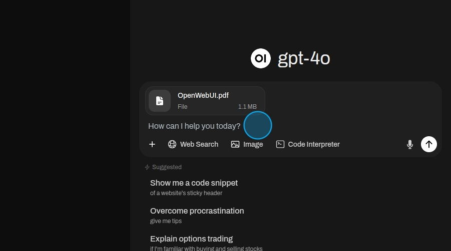

To upload files click the "More" button.

Then select "Upload Files". In the pop up navigate to the files you want to use and upload them.

After uploading the files write ask a question.

The model will use the files to answer the question.

Click on a reference to view which parts where used to answer the question.

The citation gives a clear rundown of the different parts used to generate the answer.

## Attaching files to an agent

Agents read attached files too, and they keep working across turns: attach a second file later in the
conversation and the agent answers from it, while the earlier one stays available for questions that call for
it. Up to 20 files can be attached to one chat.

An agent searches each attachment rather than reading it whole, so it says which attachments it could not
read — a file the upload has not finished indexing, or one that could not be parsed — instead of answering as
if it were never sent.

A knowledge collection attached from the chat is **not** read by an agent. Agents answer from the knowledge
bases configured on their own profile; attach one in the chat and the agent says so rather than ignoring it
silently.
