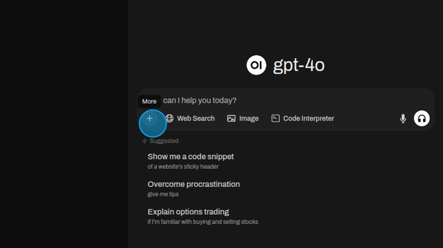
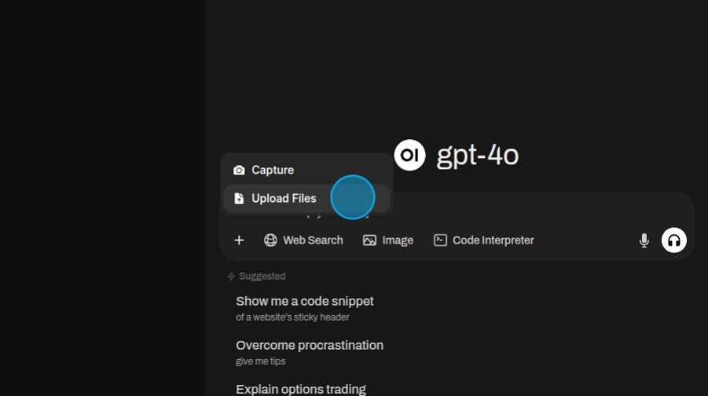
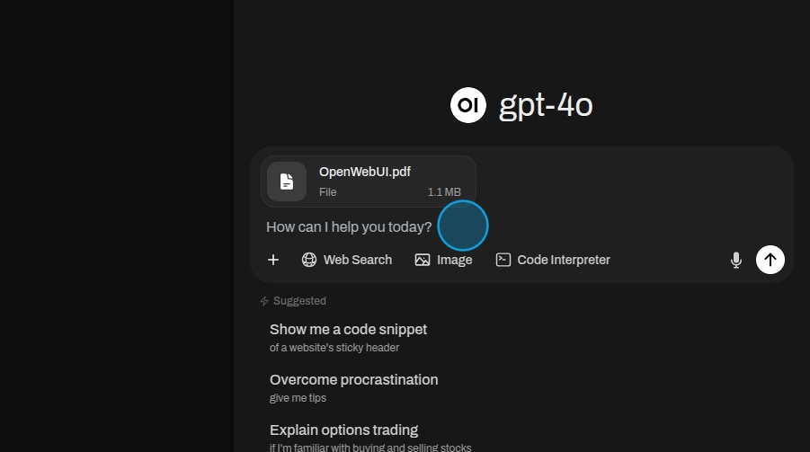
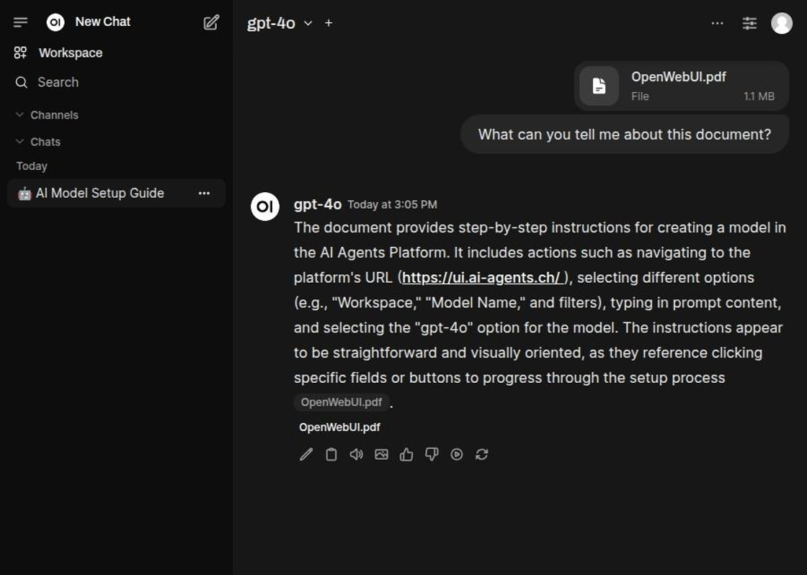
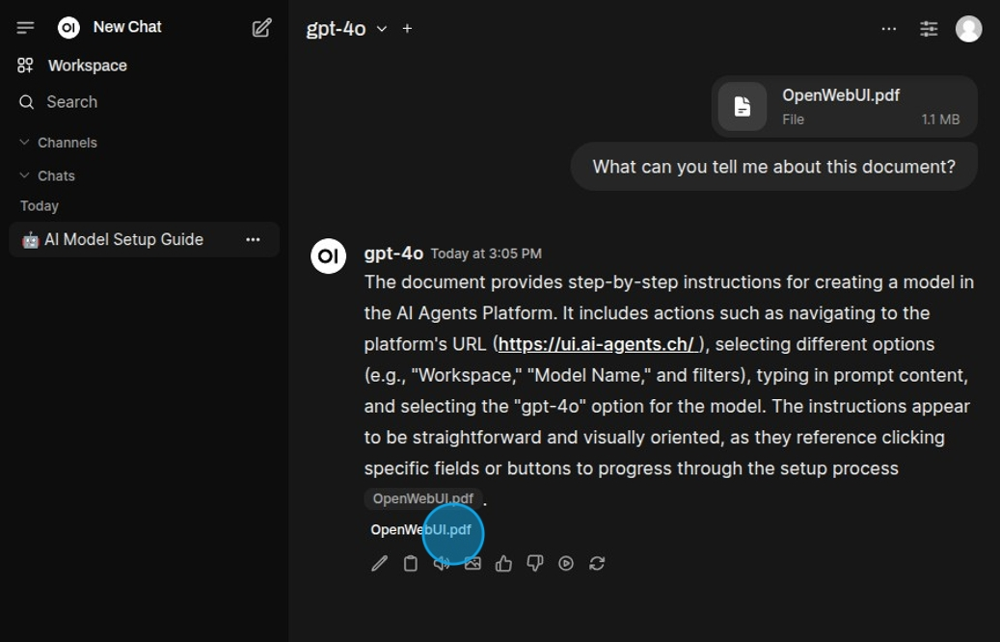
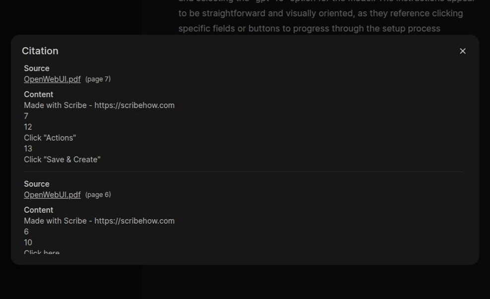

To upload files click the "More" button.

Then select "Upload Files". In the pop up navigate to the files you want to use and upload them.

After uploading the files write ask a question.

The model will use the files to answer the question.

::: tip Several files in one conversation
An AI agent reads the files of the whole conversation on every message, so you can keep asking about a document you
attached earlier, and an edited or regenerated message sees only the files of its own branch. Large documents are read
whole when they fit; otherwise the agent keeps the parts that matter for your question and tells you that its answer is
based on part of the file.
:::

::: tip Point an agent at company knowledge with #
Type `#` in the message box to pick one of the company's knowledge collections. The agent searches it for your question
and cites what it finds, but only if your roles let you read the collection.
:::

::: tip Too large for the model
If your message itself, for example a long pasted text, is larger than the model can take at all, the agent says so in
the chat instead of failing with an error. Shorten the message or split it up.
:::

Click on a reference to view which parts where used to answer the question.

The citation gives a clear rundown of the different parts used to generate the answer.

