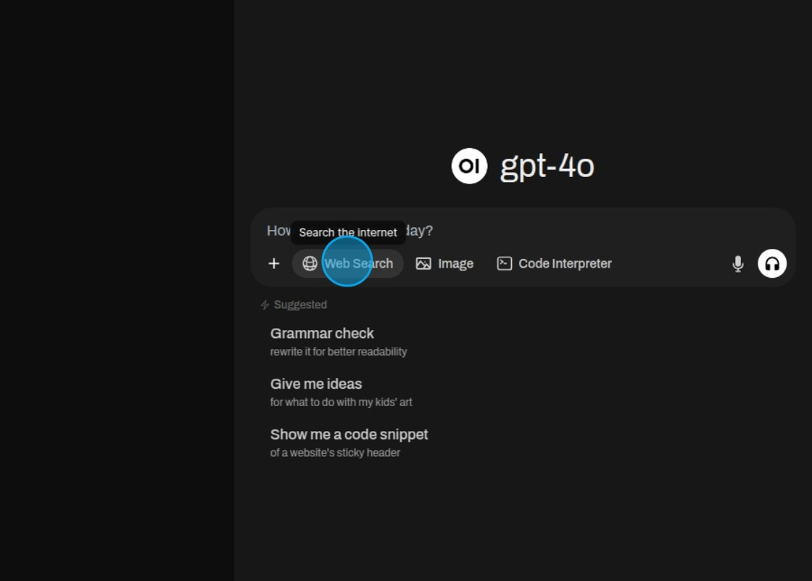

# Websuchfunktion

Agents können auf Webinformationen zugreifen, um Fragen zu beantworten, die aktuelle Daten erfordern, die über ihr
Training oder interne Wissensdatenbanken hinausgehen. Organisationen steuern dies durch Konfiguration.

Wählen Sie „Web Search“ aus.

Geben Sie etwas ein, wonach Sie suchen möchten.

Das Modell benötigt einige Zeit, um eine Suchanfrage zu formulieren und diese Suche dann auszuführen. Danach wird es
ausgeben, was es gefunden hat.

Die Websites, von denen die Informationen abgerufen wurden, werden als Referenzen aufgeführt.

## Suchkonfiguration

Die Websuche kann pro Agent aktiviert oder deaktiviert werden. Für verschiedene Anwendungsfälle oder Benutzergruppen
gelten unterschiedliche Richtlinien.

Jeder Agent hat eine unabhängige Websuchkonfiguration basierend auf Zweck und Risikoprofil. Die Websuche kann auf
bestimmte Benutzerrollen über rollenbasierte Zugriffskontrolle beschränkt werden. Suchfunktionen können zur Laufzeit
ohne Systemänderungen angepasst werden.

## Suchbeschränkungen

Organisationen können Suchen auf zugelassene Domains, vertrauenswürdige Quellen oder spezifische Inhaltstypen wie
akademische Einrichtungen oder Regierungswebsites beschränken.

Suchanfragen können validiert, gefiltert oder transformiert werden, um die Einhaltung von Datenschutzrichtlinien
sicherzustellen und das Abfliessen sensibler Informationen zu verhindern.

Abgerufene Webinhalte können vor der Präsentation anhand von Organisationsstandards validiert werden.

Suchbeschränkungen können sich an Branchenvorschriften, internen Richtlinien oder vertraglichen Verpflichtungen
ausrichten.

## Quellenangabe

Wenn Agents die Websuche verwenden, bietet das System eine nachvollziehbare Quellenangabe für externe Quellen.

Benutzer sehen klare Unterscheidungen zwischen internem Wissen und externen Webquellen. Webergebnisse erscheinen als
strukturierte, anklickbare Zitationen mit URLs, Titeln und Inhaltsvorschauen. Benutzer erhalten Informationen darüber,
warum bestimmte Quellen abgerufen wurden.

Jede Suchanfrage, jedes abgerufene Ergebnis und jede Benutzerinteraktion wird zu Prüfzwecken erfasst. Der gesamte
Suchprozess – von der Abfragevalidierung über die Ergebnisfilterung bis zur Präsentation – ist über die
Observability-Infrastruktur nachvollziehbar.

## Anwendungsfälle

Agents ergänzen internes Wissen mit aktuellen Marktdaten, regulatorischen Updates, Branchennachrichten oder technischen
Dokumentationen aus externen Quellen.

Wenn interne Wissensdatenbanken Lücken aufweisen, greifen Agents auf externe Informationen zu und weisen die Quellen
klar zu.

Agents können interne Daten anhand autoritativer externer Quellen validieren.

Komplexe Forschungsaufgaben profitieren von der Orchestrierung sowohl interner als auch externer Quellen.

## Governance und Sicherheit

Organisationen können sicherstellen, dass Suchanfragen keine sensiblen Informationen an externe Anbieter weitergeben,
durch Abfragevalidierung und Filterung.

Webinhalte werden vor der Präsentation anhand von Organisationsstandards validiert, wodurch verhindert wird, dass
unangemessene oder unzuverlässige Quellen Benutzer erreichen.

Das Berechtigungssystem ermöglicht die Kontrolle darüber, welche Benutzer oder Gruppen die Websuche für welche Zwecke
verwenden dürfen.

Vollständige Audit-Trails und transparente Quellenangaben unterstützen die Einhaltung von Datengovernance-Vorschriften
und Industriestandards.

Konfigurierbare Beschränkungen und Validierungsmechanismen ermöglichen es Organisationen, den Wert externer
Informationen mit ihrer Risikotoleranz und ihren Compliance-Verpflichtungen abzuwägen.
