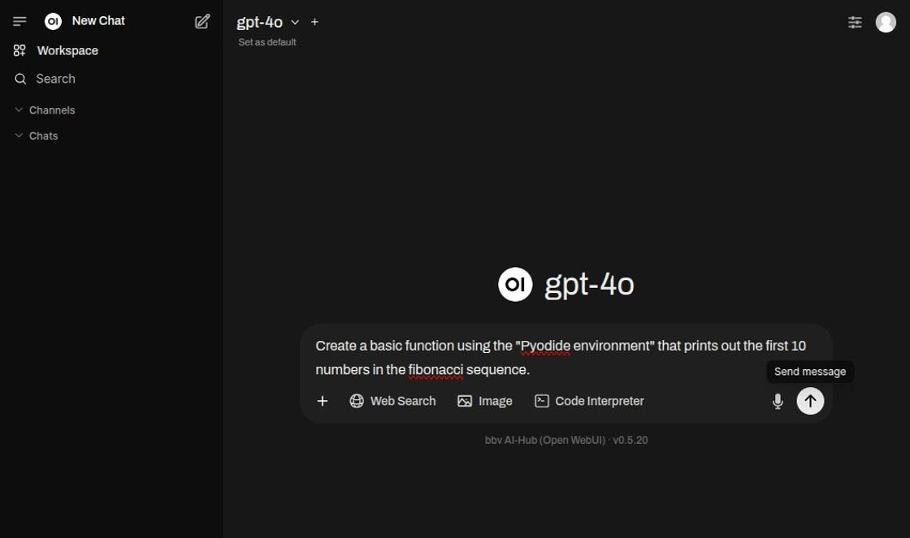
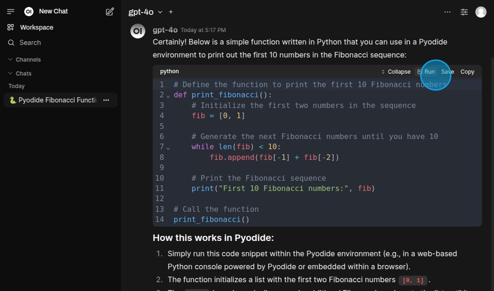
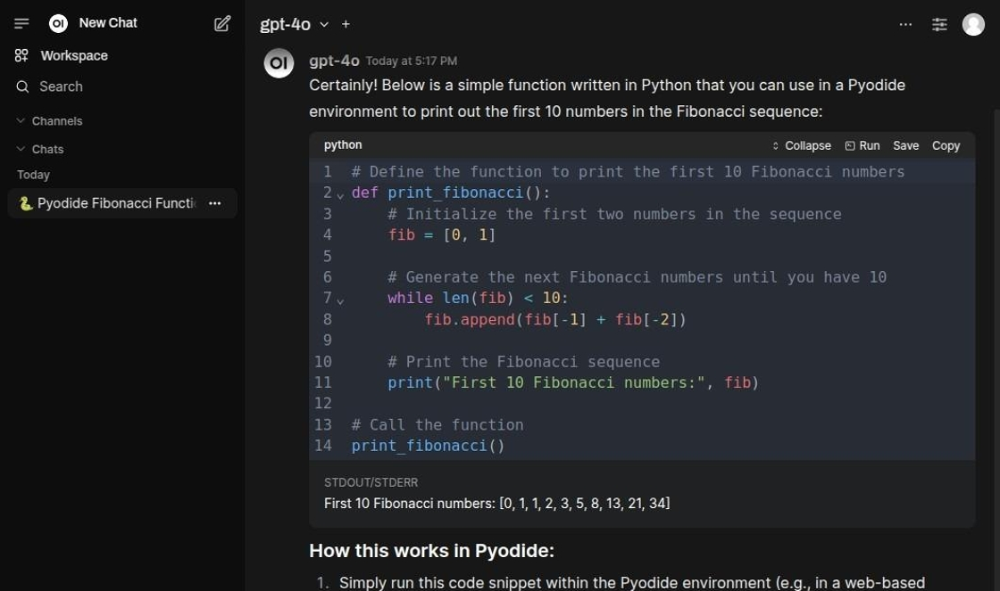
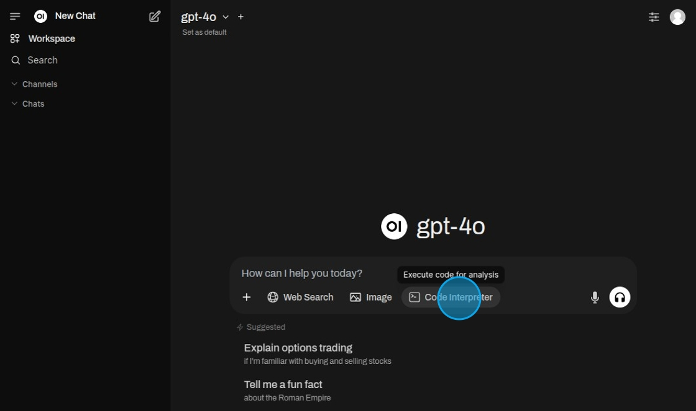
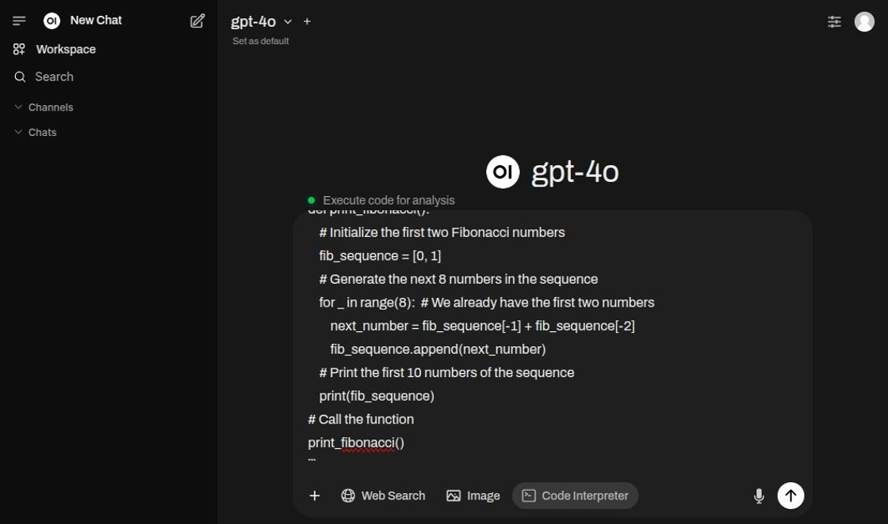
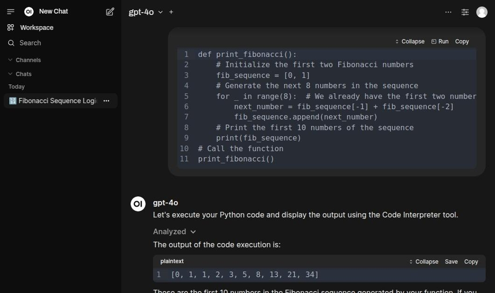

# Programmierung / Softwareentwicklung

OpenWebUI integriert **Open Terminal** — eine gesandboxte Linux-Umgebung mit Python 3.12, gängigen Dokumenten-Libraries
(pandas, openpyxl, xlsxwriter, python-docx, python-pptx, reportlab, fpdf2, weasyprint, pypdf, matplotlib, Pillow, numpy,
scipy, lxml, PyYAML) sowie den Command-Line Tools `ffmpeg` und `pandoc`. Der Code läuft in einer isolierten Umgebung pro
Benutzer, und zwar im Home-Verzeichnis dieses Benutzers innerhalb der Sandbox.

::: warning Voraussetzungen & aktuelle Einschränkungen
- **Nur einfache LLM-Modelle, mit aktiviertem Native Function Calling.** OpenWebUI stellt dem Modell die Sandbox als
  eine Reihe von Tools bereit (`run_command`, `write_file`, `display_file` und weitere), die aus der
  Terminal-Server-Integration aufgelöst werden — nicht über das eingebaute `execute_code`-Tool. **Das Modell muss Native
  Function Calling verwenden**: Nur dann werden diese Tools dem Modell als echte Function-Definitionen übergeben, was es
  ihm erlaubt, einen Schritt auszuführen, das Ergebnis zu lesen und fortzufahren. Unter Legacy fällt OpenWebUI auf einen
  einzelnen prompt-basierten Tool-Auswahldurchlauf zurück, was für einen mehrstufigen Aufbau nicht ausreicht.
  **Kimi-K2.6 ist standardmäßig auf Native gesetzt**; jedes andere Modell steht standardmäßig auf Legacy. Um ein anderes
  Modell zu verwenden, stellen Sie Function Calling für diese Konversation im Chat unter Controls → Advanced Params auf
  Native um. Eine Änderung unter Admin → Settings → Models hat keinen Bestand: AI-Hub setzt sie beim nächsten Start der
  API zurück, und ein Betreiber ändert den Standard eines Modells stattdessen in der LiteLLM-Konfiguration. Modelle ohne
  Function-Calling-Unterstützung können die Sandbox überhaupt nicht ansteuern.
- **Das Terminal muss für die Konversation aktiv sein.** Die Tools werden nur aufgelöst, wenn im Chat ein Terminal
  ausgewählt ist.
- **Unter den AI-Hub Agents führt nur der [Universal Agent](../../5_agents/13_universal_agent/) Code aus.** Mit
  eingeschaltetem Code Interpreter arbeitet er im selben Sandbox-Home wie Ihre Chats mit einfachen Modellen, in einem
  Ordner pro Konversation, und hängt die Dateien, die er Ihnen zeigt, an seine Antwort an. Andere Agents führen keinen
  Code aus.
:::

Es gibt zwei Hauptwege, die Code-Ausführung zu nutzen.

1. Bitten Sie das Modell, Code zu schreiben und auszuführen. Die Nennung eines konkreten Ziels (z. B. „ein Diagramm
   erstellen", „diese Daten verarbeiten") gibt dem Modell den Kontext, um Python-Code zu generieren und auszuführen, der
   das Ergebnis direkt im Chat erzeugt.
2. Stellen Sie bestehenden Code bereit und bitten Sie das Modell, ihn auszuführen oder zu verbessern.

## Programmierung mit dem LLM

Geben Sie einen Prompt ein, der die „Pydiode environment" erwähnt, um Code zu generieren.

Mit dem „Run"-Button kann der Code direkt im Chat getestet werden.

::: tip Zwei Ausführungspfade — nur einer kann eine Datei erzeugen
**Modellgesteuerte Ausführung**, bei der das Modell die Tools der Sandbox selbst aufruft, läuft serverseitig in **Open
Terminal** mit den oben genannten Libraries, im Home-Verzeichnis des jeweiligen Benutzers. Dies ist der einzige Pfad,
der eine herunterladbare Datei erzeugen kann.

Der manuelle **„Run"-Button** an einem Code-Block — und das eingebaute `execute_code`-Tool von OpenWebUI, dessen
`CODE_INTERPRETER_ENGINE` standardmäßig auf `pyodide` steht — nutzen stattdessen die **Pyodide**-Engine:
In-Browser-WebAssembly, leichtgewichtig, auf die mitgelieferten Packages beschränkt und **nicht in der Lage, Dateien auf
dem Server zu schreiben**. Diagramme kommen auf diesem Pfad als Inline-Bilder zurück, nicht als Dateien.
:::

Nach der Ausführung gibt das Code-Snippet das Ergebnis unterhalb der Zelle aus.

## Ausführen von bestehendem Code

Wählen Sie „Code Interpreter".

Fassen Sie den Code in Backticks ein, um ihn als auszuführenden Code zu kennzeichnen.

Wenn der Code ausgeführt wurde, wird das Ergebnis ausgegeben.

## Generierte Dateien

Während der Code-Ausführung geschriebene Dateien (Reports, Spreadsheets, Diagramme usw.) werden im Home-Verzeichnis des
jeweiligen Benutzers innerhalb der Sandbox erstellt (`/home/<user>`). Das Modell übergibt eine fertige Datei mit
`display_file`, wodurch sie im File-Viewer des Benutzers geöffnet wird; die Dateien bleiben zudem über den File-Browser
des Terminal-Panels erreichbar.

Das Erzeugen von Dokumenten ist eine eigenständige Capability und erfordert kein Schreiben von Code. Siehe
[Dateigenerierung](../13_file_generation/) für das empfohlene Modell, die verifizierte Liste der Ausgabeformate und die
dafür geltenden Einschränkungen.

## Isolation und Einschränkungen

::: warning Geteilter Container, Isolation pro Benutzer
Open Terminal läuft in **einem einzigen geteilten Container** mit aktiviertem `OPEN_TERMINAL_MULTI_USER`: Jeder Benutzer
erhält einen separaten Linux-Account und ein eigenes Home-Verzeichnis (`/home/<user>`), und die
Standard-Dateisystemberechtigungen halten die Dateien eines Benutzers vor anderen privat. Dies ist **Isolation pro
Benutzer innerhalb eines Containers**, kein Container-pro-Benutzer-Modell — alle Benutzer teilen denselben Kernel, CPU,
Memory, `/tmp` und die Prozessliste. Es eignet sich für kleine, vertrauenswürdige Gruppen; es ist **keine** harte
Multi-Tenant-Sicherheitsgrenze. Betrachten Sie die Sandbox als Komfort für Mitarbeitende, nicht als Barriere zwischen
sich gegenseitig nicht vertrauenden Parteien.
:::

::: tip Gespeicherte Dateien wachsen über die Zeit
Die generierten Dateien jedes Benutzers persistieren auf dem Host (das `/home`-Volume von `open-terminal`) und werden
**nicht** automatisch aufgeräumt — es gibt derzeit keine Retention- oder Quota-Policy. Der Speicherbedarf wächst mit der
Nutzung; Betreiber sollten das Volume überwachen und alte Benutzerdaten manuell entfernen, bis ein automatisches
Cleanup/TTL hinzugefügt wird.
:::
