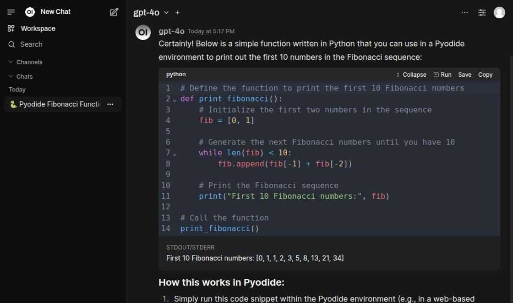

# Coding / Software Development

OpenWebUI integrates with **Open Terminal** — a sandboxed Linux environment with Python 3.12, common document libraries
(pandas, openpyxl, xlsxwriter, python-docx, python-pptx, reportlab, fpdf2, weasyprint, pypdf, matplotlib, Pillow, numpy,
scipy, lxml, PyYAML) and the `ffmpeg` and `pandoc` command-line tools. Code runs in an isolated per-user environment, in
that user's own home directory inside the sandbox.

::: warning Requirements & current limitations
- **Plain LLM models only, with Native Function Calling enabled.** OpenWebUI exposes the sandbox to the model as a set
  of tools (`run_command`, `write_file`, `display_file` and so on) resolved from its terminal-server integration — not
  through the built-in `execute_code` tool. **Native Function Calling must be enabled** for the model (Admin → Settings
  → Models → the model's advanced params): only then are those tools handed to the model as real function definitions,
  which is what lets it run a step, read the result and continue. Left at the default, OpenWebUI falls back to a single
  prompt-based tool-selection pass, which is not enough for a multi-step build. Models without function-calling support
  cannot drive the sandbox at all.
- **The terminal has to be active for the conversation.** The tools are resolved only when a terminal is selected in the
  chat.
- **AI-Hub agents are not supported yet.** Agent chats own their own generation and do not expose OpenWebUI's
  tool-calling handshake, so code execution does **not** engage for them. This is a planned follow-up.
:::

There are two main ways to use code execution.

1. Ask the model to write and run code. Mentioning a specific goal (e.g. "create a chart", "process this data") gives
   the model the context to generate and execute Python code that produces the result directly in the chat.
2. Provide existing code and ask the model to run or improve it.

## Coding with the LLM

Enter a prompt mentioning the "Pydiode environment" in order to generate code.

Using the "Run" button the code can be tested directly inside the chat.

::: tip Two execution paths — only one of them can produce a file
**Model-driven execution**, where the model calls the sandbox's tools itself, runs server-side in **Open Terminal** with
the libraries above, inside the user's own home directory. This is the only path that can produce a downloadable file.

The manual **"Run" button** on a code block — and OpenWebUI's built-in `execute_code` tool, whose
`CODE_INTERPRETER_ENGINE` defaults to `pyodide` — both use the **Pyodide** engine instead: in-browser WebAssembly, which
is lightweight, limited to its bundled packages, and **cannot write files to the server**. Charts come back as inline
images on that path, not as files.
:::

After running the code snippet prints the result below the cell.

## Executing existing code

Select "Code Interpreter".

Encase the code in back-ticks to mark it as code for execution.

When the code has run through the result is printed out.

## Generated files

Files written during code execution (reports, spreadsheets, charts, etc.) are created in the user's own home directory
inside the sandbox (`/home/<user>`). The model surfaces a finished file by calling `display_file`, which opens it in the
user's file viewer; the files also stay reachable through the terminal panel's own file browser.

Producing documents is a capability in its own right and does not require writing any code. See
[File generation](../13_file_generation/) for the recommended model, the verified list of output formats, and the
limitations that apply to them.

## Isolation and limitations

::: warning Shared-container, per-user isolation
Open Terminal runs in **a single shared container** with `OPEN_TERMINAL_MULTI_USER` enabled: each user gets a separate
Linux account and home directory (`/home/<user>`), and standard filesystem permissions keep one user's files private
from another. This is **per-user isolation inside one container**, not a container-per-user model — all users share the
same kernel, CPU, memory, `/tmp`, and process list. It suits small, trusted groups; it is **not** a hard multi-tenant
security boundary. Treat the sandbox as a convenience for collaborators, not as a barrier between mutually untrusted
parties.
:::

::: tip Stored files grow over time
Each user's generated files persist on the host (the `open-terminal` `/home` volume) and are **not** cleaned up
automatically — there is currently no retention or quota policy. Disk usage grows with use; operators should monitor the
volume and prune old per-user data manually until an automated cleanup/TTL is added.
:::
