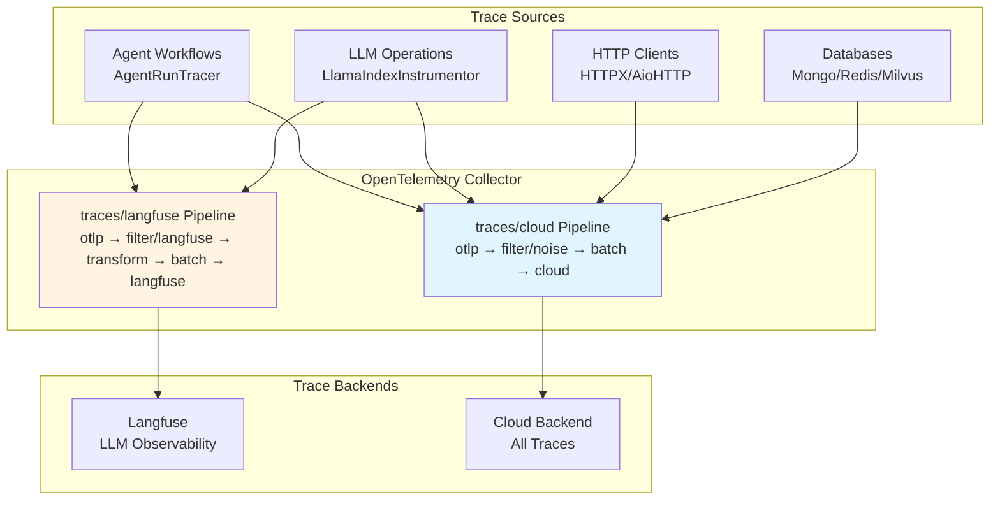
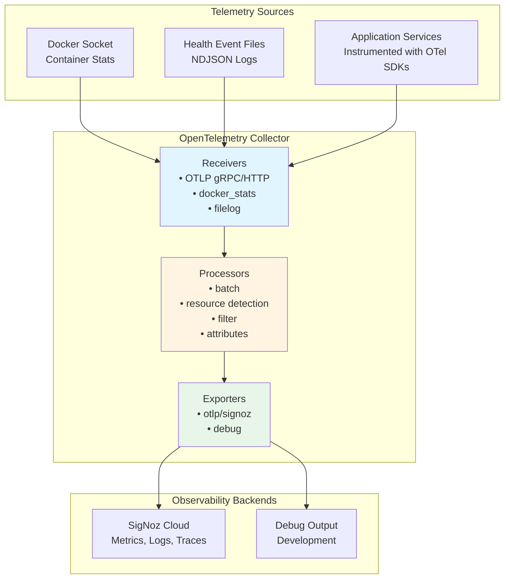

# Tiefe Observability mit OpenTelemetry :telescope: :100:

::: info **TL;DR – Was ist Deep Observability?**
Der Swiss AI Hub bietet **durchgängiges verteiltes Tracing und tiefe Observability** unter Verwendung von OpenTelemetry-Standards, wodurch Sie vollständige Transparenz über jeden Aspekt Ihrer KI-Workflows erhalten. Von einzelnen Agent-Schritten bis hin zu komplexen Multi-Service-Prozessen können Sie jede Komponente Ihres KI-Ökosystems mit unternehmensgerechter Observability verfolgen, überwachen und optimieren, die sich nahtlos in Industriestandard-Tools wie Langfuse, SigNoz oder DataDog integrieren lässt.
:::

## Was ist Deep Observability und wie implementiert der Swiss AI Hub diese? :brain:

**Deep Observability** geht weit über traditionelles Logging und Monitoring hinaus. Der Swiss AI Hub implementiert eine umfassende Observability-Strategie, die **verteiltes Tracing**, **semantische Konventionen** und **KI-spezifische Instrumentierung** kombiniert, um eine beispiellose Transparenz Ihrer KI-Systeme zu gewährleisten.

Die Plattform nutzt **OpenTelemetry** als ihr grundlegendes Observability-Framework, ergänzt durch **OpenInference semantische Konventionen** für KI/ML-Workloads. Das bedeutet, dass jede Interaktion, von einer einfachen Benutzernachricht bis hin zu komplexen Multi-Agent-Orchestrierungen, automatisch mit reichhaltigen kontextuellen Informationen nachverfolgt wird, einschliesslich:

- **Vollständige Anfrage-Workflows**: Verfolgen Sie eine Benutzeranfrage, wie sie durch APIs, Agents, Datenbanken und externe Services fliesst
- **KI-spezifische Semantik**: Erfassen Sie LLM-Aufrufe, Embeddings, Retrievals und Modellinteraktionen mit spezialisierten semantischen Attributen
- **Performance-Metriken**: Verfolgen Sie Latenz, Token-Nutzung, Kostenattribution und Ressourcenauslastung über alle Komponenten hinweg
- **Fehlerkontext**: Erhalten Sie detaillierte Fehler-Traces mit dem vollständigen Kontext dessen, was zu Fehlern führte
- **Service-Abhängigkeiten**: Automatische Kartierung, wie Ihre Services, Agents und Prozesse in Echtzeit interagieren

Das System instrumentiert automatisch **jede Komponente**, einschliesslich NATS-Messaging, Datenbankoperationen, HTTP-Aufrufe, LLM-Interaktionen, Vektorsuchen und benutzerdefinierte Agent-Workflows, ohne Codeänderungen zu erfordern.

## Warum dies für den Erfolg von Enterprise AI entscheidend ist :trophy:

Tiefe Observability transformiert die Art und Weise, wie Sie KI-Systeme in der Produktion entwickeln, debuggen und skalieren:

**🔍 Vollständige Systemtransparenz**: Sehen Sie genau, wie Ihre KI-Workflows in der Produktion ausgeführt werden, von der Benutzereingabe bis zur endgültigen Ausgabe, über alle Microservices und Agents hinweg. Keine blinden Flecken mehr in komplexen verteilten KI-Systemen.

**🚀 Performance-Optimierung**: Identifizieren Sie Engpässe in Ihren KI-Pipelines präzise. Wissen Sie genau, welche LLM-Aufrufe langsam sind, welche Retrievals ineffizient sind und wo Ihre Workflows für Geschwindigkeit und Kosten optimiert werden können.

**🛡️ Proaktive Problem-Erkennung**: Erkennen Sie Probleme, bevor sie Benutzer betreffen. Erweitertes Tracing zeigt Muster auf, die zu Fehlern führen, sodass Sie Probleme proaktiv statt reaktiv beheben können.

**💰 Kostenattribution und -kontrolle**: Verfolgen Sie die Token-Nutzung, API-Aufrufe und Compute-Kosten bis hin zu einzelnen Benutzern, Agents oder Workflows. Treffen Sie datengestützte Entscheidungen über Ressourcenzuweisung und Kostenoptimierung.

**🌐 Herstellerunabhängige Flexibilität**: OpenTelemetry stellt sicher, dass Ihre Observability-Daten mit jedem OTLP-kompatiblen Backend funktionieren. Beginnen Sie mit Langfuse für KI-spezifische Analysen und migrieren Sie dann zu Unternehmens-Tools wie DataDog oder New Relic, ohne Daten zu verlieren oder die Instrumentierung zu ändern.

::: details **Abdeckung der automatischen Instrumentierung**
Der Swiss AI Hub instrumentiert diese Komponenten automatisch ohne Codeänderungen:

### Kerninfrastruktur

- **NATS-Messaging**: Vollständiges Nachrichtenfluss-Tracing über Microservices hinweg
- **Datenbankoperationen**: FeretDB-, ValKey- und Vektordatenbank-Abfragen
- **HTTP-Clients**: Alle externen API-Aufrufe und Webhooks
- **Hintergrundaufgaben**: Asynchrone Operationen und geplante Jobs

### KI-spezifische Komponenten

- **LLM-Interaktionen**: Token-Nutzung, Modellaufrufe und Antwortzeiten
- **Embeddings**: Vektorgenerierung und Ähnlichkeitssuchen
- **Retrieval**: RAG-Operationen und Wissensdatenbank-Abfragen
- **Agent-Workflows**: Schrittweise Ausführungs-Traces mit semantischem Kontext
:::

## Erste Schritte

Um Deep Observability in Ihrem Swiss AI Hub Deployment zu aktivieren:

1. **Umgebungsvariablen konfigurieren**: Setzen Sie die OTEL-Konfigurationsvariablen für Ihr Ziel-Observability-Backend
2. **Mit aktiviertem Tracing deployen**: Starten Sie Ihre Swiss AI Hub Services neu, um die automatische Instrumentierung zu aktivieren
3. **Auf Ihr Observability-Dashboard zugreifen**: Zeigen Sie Traces, Metriken und Analysen in Ihrer gewählten Observability-Plattform an

Das System erfordert keine Codeänderungen – die gesamte Instrumentierung erfolgt automatisch und folgt den OpenTelemetry-Standards für maximale Kompatibilität und minimale Performance-Auswirkungen.

# Traces

## Überblick

Traces verfolgen einzelne Anfragen durch die Swiss AI Hub Plattform und zeigen den vollständigen Pfad von Anfang bis Ende. Jede Operation erhält automatisch einen einzigartigen Trace-Identifikator, der alle zugehörigen Aktivitäten über Services hinweg verbindet und genau aufzeigt, was passiert ist, wo Zeit verbracht wurde und wie Komponenten zusammengearbeitet haben.

Der Swiss AI Hub verwendet OpenTelemetry für das Tracing mit spezialisierter Unterstützung für KI-Operationen durch OpenInference semantische Konventionen.

______________________________________________________________________

## Was wir erfassen

### Agent-Workflow-Ausführung (Operativ)

Agent-Läufe werden mit hierarchischen Span-Strukturen getraced, die den vollständigen Workflow zeigen:

**Agent-Spans**: Root-Span, der den Beginn einer Agent-Ausführung mit Benutzereingabe und Agent-Identifikation markiert.

**Chain-Spans**: Langlebiger Span, der die gesamte Laufzeit von Start bis zur endgültigen Ausgabe erfasst.

**Step-Spans**: Einzelne Workflow-Schritte, die Eingaben, Ausgaben, Verarbeitungszeit und semantische Ereignisse zeigen.

**Trace-Attribute**:

- Sitzungs-/Thread-Identifikatoren für den Konversationskontext
- Eingabe- und Ausgabewerte im JSON-Format
- OpenInference Span-Typen (AGENT, CHAIN, TOOL, LLM, RETRIEVER)
- Tags zum Filtern (thread_id, display_id, run_id)

**Implementierung**: Der `AgentRunTracer` erstellt für jeden Workflow-Schritt einen CHAIN-Span, der Eingaben, Ausgaben, Verarbeitungszeit und semantische Ereignisse erfasst. Langfuse Trace-Level-Attribute (Name, Sitzung, Benutzer, Eingabe/Ausgabe) werden über Span-Attribute gesetzt, sodass Langfuse alle Step-Spans in einem einzigen Trace pro Lauf gruppiert.

**Agent-in-the-Loop (AITL) Delegation**: Wenn Agent A über AITL an Agent B delegiert, erstellt der Tracer einen langlebigen AGENT-Wrapper-Span unter dem Schritt von Agent A. Der Kontext des Wrapper-Spans wird über Redis (mit W3C TraceContext) propagiert, sodass die Step-Spans von Agent B unter diesem neu zugeordnet werden. Agent B unterdrückt `langfuse.trace.*`-Attribute, um ein Überschreiben der Trace-Level-Anzeige von Agent A zu vermeiden. Dies erzeugt eine verschachtelte Hierarchie in Langfuse, bei der die Schritte des delegierten Agents unter dem Trace des delegierenden Agents erscheinen.

### KI-Modell-Operationen (Operativ)

LLM-Operationen werden automatisch über die LlamaIndex-Instrumentierung getraced:

**LLM-Aufrufe**: Modellauswahl, Prompt-Konstruktion, Token-Nutzung und Antwortgenerierung.

**Retrieval-Operationen**: Vektordatenbank-Abfragen, Dokument-Retrieval und Kontextzusammenstellung.

**Embeddings**: Text-Embedding-Generierung für die Dokumentenindexierung und Ähnlichkeitssuche.

**Semantische Ereignisse**: KI-spezifische Operationen emittieren semantische Ereignisse, die detaillierte Metadaten (Token-Anzahl, Modellnamen, abgerufene Dokumente) enthalten, die Traces mit domänenspezifischen Informationen anreichern.

**Transparenz**: Alle KI-Operationen erscheinen in der Langfuse Tracing UI mit spezialisierten Ansichten für die LLM-Performance-Analyse.

### HTTP- und Datenbank-Operationen (Operativ)

Instrumentierte Bibliotheken erstellen automatisch Spans für externe Service-Aufrufe:

**HTTP-Clients**: HTTPX- und aiohttp-Anfragen mit Methode, URL, Statuscode und Timing.

**Datenbanken**: FerretDB-, PostgreSQL- und ValKey-Operationen mit Abfrageinformationen.

**Vektordatenbank**: Milvus-Ähnlichkeitssuchen und Indexierungsoperationen.

**Filterung**: Health Checks, Metrik-Endpoints und Datenbankabfragen mit hohem Volumen werden aus den Traces gefiltert, um Rauschen zu reduzieren.

______________________________________________________________________

## Architektur der Trace-Erfassung



### Erfassungs-Pipelines

Der OpenTelemetry Collector verarbeitet Traces über zwei spezialisierte Pipelines:

**traces/cloud**: Sendet alle Traces an das Cloud-Backend

- Receiver: `otlp` (gRPC Port 4317, HTTP Port 4318)
- Prozessoren: `filter/noise` (entfernt Health Checks, Metrik-Endpoints, routinemässige DB-Abfragen), `batch`
- Exporter: `otlp/cloud`

**traces/langfuse**: Sendet KI-spezifische Traces an Langfuse

- Receiver: `otlp` (gRPC Port 4317, HTTP Port 4318)
- Prozessoren: `filter/langfuse` (behält nur OpenInference-Spans bei), `transform/langfuse` (fügt Projektmetadaten hinzu), `batch`
- Exporter: `otlphttp/langfuse` (Langfuse OTEL Ingestion-Endpoint, authentifiziert mit `LANGFUSE_PUBLIC_KEY` / `LANGFUSE_SECRET_KEY`)

### Instrumentierung

Services emittieren automatisch Traces durch OpenTelemetry-Instrumentierung, konfiguriert durch `AihubInstrumentor`:

**Automatische Instrumentierung** (via `AihubInstrumentor`):

- `AsyncioInstrumentor`: Asynchrone Operationen und Aufgaben-Ausführung
- `HTTPXClientInstrumentor` / `AioHttpClientInstrumentor`: HTTP-Anfragen
- `PymongoInstrumentor` / `RedisInstrumentor` / `MilvusInstrumentor`: Datenbankoperationen
- `LlamaIndexInstrumentor`: LLM- und RAG-Operationen mit OpenInference-Konventionen

**Benutzerdefiniertes Tracing** (via `AgentRunTracer`):

- Agent-Workflow-Ausführung mit CHAIN-Spans pro Schritt
- AITL-Delegations-Tracing mit AGENT-Wrapper-Spans und Redis-basierter W3C-Kontext-Propagierung
- Langfuse Trace-Anreicherung (Name, Sitzung, Benutzer, Eingabe/Ausgabe, Token-Nutzung, Modell)

**Smart Tracing**: Der `SmartTracer` berücksichtigt den `suppress_instrumentation`-Kontext und ermöglicht eine selektive Tracing-Steuerung.

______________________________________________________________________

## Geschäftlicher Nutzen

### Performance-Optimierung

Traces zeigen genau auf, wo in jeder Operation Zeit verbraucht wird. Die Identifizierung von Engpässen wird präzise statt spekulativ. Wenn der Dokumenten-Retrieval drei Sekunden dauert, während die KI-Verarbeitung 500 ms benötigt, werden die Optimierungsprioritäten klar.

### Kostenmanagement

KI-Operationen umfassen die Token-Nutzung und Kostenattribution durch semantische Ereignisse. Die Verfolgung, welche Operationen, Benutzer oder Abteilungen die meisten KI-Ressourcen verbrauchen, ermöglicht datengestützte Entscheidungen über Modellauswahl und Feature-Preise.

### Ursachenanalyse

Fehlgeschlagene Operationen bewahren den vollständigen Kontext und zeigen genau, wo und warum Fehler auftraten. Fehler-Traces umfassen Stack-Traces, Eingabedaten und die Abfolge der Ereignisse, die zum Fehler führten, was die Problembehebungszeit drastisch reduziert.

### KI-Transparenz

Traces zeigen, welche Informationen die KI bei der Generierung von Antworten berücksichtigte. Abgerufene Dokumente, Token-Nutzung und Modellauswahl werden sichtbar, was die Einhaltung gesetzlicher Vorschriften unterstützt und das Vertrauen der Benutzer stärkt.

______________________________________________________________________

## Zugriff auf Trace-Informationen

### Langfuse UI

Langfuse bietet spezialisierte LLM-Observability unter `http://localhost:6006` (Dev) oder `https://langfuse.<domain>` (Produktion):

**Funktionen**:

- Timeline-Ansichten, die Span-Dauer und -Beziehungen zeigen
- Token-Nutzung und Kostenverfolgung pro Trace, Benutzer und Agent
- Inspektion abgerufener Dokumente für RAG-Systeme
- Trace-Filterung nach Sitzung, Tags oder Zeitbereich
- Performance-Analyse und Latenzverteilungen
- Dataset-Management und Experimentbewertung
- Azure AD SSO-Integration für die Zugriffskontrolle in der Produktion

**Fokus**: KI-spezifische Operationen mit OpenInference semantischen Konventionen (LLM-, CHAIN-, AGENT-, RETRIEVER-, EMBEDDING-Spans).

### Cloud-Backend (Produktion)

Traces werden für langfristige Speicherung und Analyse an Cloud-Observability-Plattformen exportiert. Die Plattform unterstützt jedes OTLP-kompatible Backend ausschliesslich durch Konfigurationsänderungen.

______________________________________________________________________

## Sicherheit und Datenschutz

### Trace-Inhalt

Traces erfassen Operationsmetadaten, Timing-Informationen und Routing-Details. Entwickler sind dafür verantwortlich, dass sensible Daten nicht in Trace-Attributen enthalten sind.

**Infrastruktur**: OpenInference Spans enthalten Sitzungs-IDs, Modellnamen, Token-Anzahlen und Metadaten abgerufener Dokumente.

**Verantwortung der Anwendung**: Entwickler müssen vermeiden, tatsächliche Dokumentinhalte, Benutzernachrichten oder andere sensible Informationen in benutzerdefinierten Trace-Attributen zu protokollieren.

### Übertragungssicherheit

Alle Traces werden über verschlüsselte Kanäle (TLS/HTTPS) übertragen, um Abfangen zu verhindern.

### Zugriffskontrolle

Der Trace-Zugriff ist durch die rollenbasierte Zugriffskontrolle der Observability-Plattform eingeschränkt. Nur autorisiertes Personal kann detaillierte Traces einsehen.

______________________________________________________________________

## Integration mit Plattformkomponenten

### Agent-Workflows

Der `AgentRunTracer` erstellt eine strukturierte Tracing-Hierarchie für Agent-Ausführungen:

1. Jeder Workflow-Schritt erhält einen CHAIN-Span mit Eingaben, Ausgaben und semantischen Ereignismetadaten
2. Langfuse Trace-Level-Attribute (Name, Sitzung, Benutzer, Tags) werden auf Step-Spans zur Gruppierung gesetzt
3. Semantische Ereignisse aus KI-Operationen reichern Traces mit Token-Nutzung, Modellnamen und LLM-Ausgabe an
4. Für die AITL-Delegation überbrückt ein AGENT-Wrapper-Span den Schritt von Agent A mit den Step-Spans von Agent B:

```
Trace: "AgentA/profile-1"
  AgentA.start_step           (CHAIN)
    AITL -> AgentB/profile-2  (AGENT, wrapper span)
      AgentB.compute_step     (CHAIN, re-parented via Redis)
      AgentB.stop_step        (CHAIN, re-parented via Redis)
  AgentA.end_step             (CHAIN)
```

### LLM-Operationen

Die LlamaIndex-Instrumentierung traced automatisch:

- Sprachmodell-Aufrufe mit Token-Anzahlen
- RAG-Operationen, die Dokumenten-Retrieval und Kontextzusammenstellung zeigen
- Vektordatenbank-Suchen und Ähnlichkeitsoperationen
- Embedding-Generierung für die Dokumentenverarbeitung

### HTTP-Services

FastAPI-Services tracen eingehende Anfragen automatisch, wenn sie instrumentiert sind. Entwickler können benutzerdefinierte Attribute zu Spans hinzufügen, um anwendungsspezifischen Kontext bereitzustellen.

______________________________________________________________________

## Plattform-Flexibilität

Während Langfuse LLM-spezifische Observability bietet, unterstützt die OpenTelemetry-Grundlage jedes OTLP-kompatible Backend:

**Unterstützte Plattformen**:

- **Langfuse**: Open-Source LLM-Observability mit Kostenverfolgung und -bewertung (aktuelle Standardeinstellung)
- **SigNoz**: Open-Source Observability-Plattform
- **Jaeger**: Verteiltes Tracing, fokussiert auf Microservices
- **Tempo** (Grafana): Cloud-native verteiltes Tracing
- **Datadog APM**: Kommerzielles APM mit umfassendem Tracing
- **New Relic**: Anwendungs-Performance-Monitoring mit KI-Einblicken

Der Wechsel von Backends erfordert lediglich Änderungen an der Collector-Konfiguration. Es sind keine Änderungen am Anwendungscode erforderlich.

______________________________________________________________________

## Zukünftige Entwicklung

### Geplante Erweiterungen

**Tail Sampling**: Intelligente Stichprobenentnahme, die Fehler-Traces und interessante Operationen beibehält, während die Speicherkosten reduziert werden.

**Benutzerdefinierte Geschäftsereignisse**: Höhere Traces für Geschäftsoperationen, die über technische Implementierungsdetails hinausgehen.

**Kostenprognose**: Kostenabschätzungen vor der Ausführung basierend auf historischen Trace-Daten und Abfragekomplexität.

**Performance-Budgets**: Automatische Benachrichtigungen, wenn Operationen die erwartete Dauer basierend auf historischen Mustern überschreiten.

______________________________________________________________________

## Zusammenfassung

Das verteilte Tracing der Plattform bietet:

✅ **Operatives Agent-Tracing**: Vollständige Workflow-Ausführung mit Details auf Schritt-Ebene durch AgentRunTracer

✅ **Transparenz von KI-Operationen**: LLM- und RAG-Operationen, getraced mit OpenInference semantischen Konventionen

✅ **Automatische Instrumentierung**: HTTP-, Datenbank- und asynchrone Operationen ohne manuellen Code getraced

✅ **Duale Backend-Unterstützung**: Langfuse für LLM-spezifische Observability, Cloud-Backend für Full-Stack Produktions-Traces

✅ **Standardbasiert**: OpenTelemetry gewährleistet Herstellerflexibilität durch das OTLP-Protokoll

✅ **Performance-Analyse**: Detaillierte Timing-Informationen ermöglichen eine präzise Engpassidentifikation

✅ **Datenschutz-Grundlage**: Infrastruktur erfasst Metadaten; Entwickler sind für den Datenschutz verantwortlich

Mit zunehmender Tracing-Abdeckung erhalten Unternehmen immer detailliertere Einblicke in die Plattform-Performance, KI-Operationen und das Benutzererlebnis.

# OpenTelemetry-Grundlage

## Überblick

**OpenTelemetry (OTel)** ist die technische Grundlage für die gesamte Observability im Swiss AI Hub. Es bietet ein herstellerneutrales, branchenübliches Framework für das Sammeln, Verarbeiten und Exportieren von Telemetriedaten über Metriken, Logs und Traces hinweg.

Im Gegensatz zu proprietären Monitoring-Lösungen, die Sie an bestimmte Hersteller binden, stellt OpenTelemetry sicher, dass die Plattform sich in jedes kompatible Observability-Backend integrieren lässt. Diese Architektur-Entscheidung bietet Unternehmen maximale Flexibilität bei der Auswahl von Monitoring-Tools, basierend auf ihrer Infrastruktur, Compliance-Anforderungen und operativen Präferenzen.

______________________________________________________________________

## Warum OpenTelemetry?

OpenTelemetry ermöglicht es uns, Services einmal zu instrumentieren und die Tool-Wahl flexibel zu halten. Es standardisiert Metriken, Logs und Traces, sodass Signale standardmässig korrelieren und austauschbare Backends eine Konfigurationsänderung bleiben, keine Neuentwicklung.

**Vorteile**

- **Herstellerneutral im Design:** Verwenden Sie jedes OTLP-kompatible Backend (z.B. SigNoz, Datadog, Grafana, Prometheus, New Relic) ohne Neu-Instrumentierung.
- **Vereinheitlichte Signale:** Konsistente Modelle und gemeinsam genutzter Kontext (Trace-/Span-IDs, Ressourcenattribute) verknüpfen Metriken, Logs und Traces für eine schnellere Fehlerbehebung.
- **Bewährter Standard:** Ein CNCF-Projekt mit breiter Branchenunterstützung und aktiver Entwicklung, das Technologierisiken reduziert.
- **Zukunftssicher:** Entwickeln Sie Plattformen und Richtlinien über den OTel Collector und die Konfiguration weiter, nicht über den Anwendungscode.

______________________________________________________________________

## OpenTelemetry Collector

Der **OpenTelemetry Collector** ist die zentrale Telemetrie-Verarbeitungszentrale für den Swiss AI Hub.

### Architektur



### Komponenten

**Receiver**: Sammeln Telemetrie aus verschiedenen Quellen.

**Prozessoren**: Transformieren, anreichern, filtern und stapeln Telemetrie vor dem Export.

**Exporter**: Senden verarbeitete Telemetrie an Observability-Backends.

**Extensions**: Bieten Hilfsfunktionen wie Health Checks und Profiling.

______________________________________________________________________

## Receiver

Receiver sind Aufnahmepunkte. Sie ziehen Telemetrie von Apps und Infrastruktur in die Plattform.

- **OTLP Receiver:** Standard-Eingang für App-Telemetrie. Services senden Metriken, Logs und Traces unter Verwendung des OpenTelemetry-Protokolls. Konzept: ein Wire-Format für alles.
- **Container-Metriken-Receiver:** Sammelt Ressourcennutzung von laufenden Containern. Konzept: Laufzeit-Health beobachten, ohne den App-Code zu berühren.
- **Datei-Log-Receiver:** Nimmt strukturierte Event-Logs wie Container- und synthetische Health Checks auf. Konzept: operative Signale erfassen, auch wenn Apps keine nativen Endpunkte haben.

Ergebnis: Breite Abdeckung mit minimaler Kopplung an ein einzelnes Tool oder eine einzelne Laufzeit.

______________________________________________________________________

## Prozessoren

Prozessoren formen Telemetrie in Bewegung. Sie fügen Kontext hinzu, reduzieren Rauschen und bereiten Daten für die Analyse vor.

- **Batching:** Gruppiert Daten für effizienten Transport. Konzept: geringerer Overhead ohne Verlust der Genauigkeit.
- **Ressourcenerkennung:** Automatische Anreicherung mit Umgebungsdetails wie Host-, Container- oder Systeminformationen. Konzept: Anbringen von Wer/Wo an jedes Signal.
- **Attributbearbeitung:** Normalisiert Tags wie Umgebung oder Quelle. Konzept: konsistente Labels für zuverlässiges Filtern und Dashboards.
- **Ressourcen-Mapping:** Übersetzt Container-Fakten in Service-Identitäten (z.B. Service-Name, Version). Konzept: Infrastrukturrealität mit Service-Ansichten abgleichen.
- **Filterung:** Verwirft geringwertiges Rauschen wie routinemässige Health Checks. Konzept: Signal-Rausch-Verhältnis verbessern und Kosten kontrollieren.

Ergebnis: Saubere, kontextuelle und analysebereite Telemetrie.

______________________________________________________________________

## Exporter

Exporter liefern Telemetrie an Ziele.

- **Primärer Backend-Exporter:** Sendet Daten an die gewählte OTLP-kompatible Plattform. Konzept: Wählen oder ändern Sie Ihr Analyse-Tool, ohne neu zu instrumentieren.
- **Debug-Exporter:** Druckt oder zeigt Daten zur Validierung an. Konzept: Pipelines lokal verifizieren, bevor sie skaliert werden.

Ergebnis: Steckbare Ausgaben mit sicheren Entwicklungs-Workflows.

______________________________________________________________________

## Telemetrie-Pipelines

Pipelines sind End-to-End-Flows pro Signaltyp. Jede definiert, welche Receiver, Prozessoren und Exporter zu verwenden sind.

- **Metrik-Pipelines:** Optimieren für Durchsatz und Trendanalyse. Anreichern mit Service-Kontext.
- **Log-Pipelines:** Struktur und Reihenfolge bewahren. Attribute für Abfragen und Korrelation extrahieren.
- **Trace-Pipelines:** Parent-Child-Beziehungen intakt halten. Sorgfältig batchen, um die Trace-Integrität zu gewährleisten.

Konzept: zweckgebundene Bahnen, die Signale über den gesamten Stack hinweg konsistent und verknüpfbar halten.

______________________________________________________________________

## Extensions

Extensions erweitern die operativen Fähigkeiten des Collectors selbst.

- **Health Checks:** Exponieren Sie den Collector-Status zur Überwachung. Konzept: Observability als erstklassigen Service behandeln.
- **Profiling (pprof):** Performance unter Last überprüfen. Konzept: Pipeline-Engpässe diagnostizieren.
- **Diagnose (zPages):** Interne Metriken und den Status anzeigen. Konzept: schnellere Fehlerbehebung ohne externe Tools.

Ergebnis: Eine verwaltbare, inspizierbare Observability-Kontrollebene.

______________________________________________________________________

## Integration mit Plattform-Services

### Anwendungs-Instrumentierung

Mit OpenTelemetry SDKs instrumentierte Services emittieren automatisch Telemetrie:

**Python-Services** (API, Agents, Pipelines):

- `opentelemetry-instrumentation-*-Bibliotheken` für die automatische Framework-Instrumentierung
- Benutzerdefinierte Instrumentierung für Geschäftslogik
- OpenInference für semantische KI/ML-Konventionen

**Instrumentierte Komponenten**:

- FastAPI HTTP-Anfragen und -Antworten
- Datenbankoperationen (MongoDB, PostgreSQL, Redis, Milvus)
- HTTP-Client-Anfragen (httpx, aiohttp, requests)
- LlamaIndex LLM-Operationen
- Python-Logging-Framework

### Infrastruktur-Integration

Nicht instrumentierte Services stellen Telemetrie über Infrastruktur-Monitoring bereit:

**Container-Metriken**: Der Docker-Stats-Receiver sammelt Ressourcenmetriken für alle Container, unabhängig von der Instrumentierung.

**Health Monitoring**: Datei-Log-Receiver erfassen den Health-Status sowohl von Docker-Events als auch von synthetischen Checks.

**Netzwerk-Observability**: Traefik Proxy-Logs und -Metriken bieten Transparenz beim Anforderungs-Routing.

______________________________________________________________________

## Multi-Plattform-Unterstützung

### Herstellerflexibilität

Die OpenTelemetry-Grundlage unterstützt den gleichzeitigen Export auf mehrere Plattformen:

**Unterstützte Plattformen**:

- **SigNoz**: Open-Source, OpenTelemetry-native Plattform (aktuelle primäre)
- **Datadog**: Kommerzielles APM mit umfassenden Funktionen
- **Grafana Cloud**: Verwaltetes Prometheus, Loki und Tempo
- **New Relic**: Anwendungs-Performance-Monitoring mit KI-Einblicken
- **Prometheus**: Open-Source Zeitreihen-Datenbank
- **Elasticsearch/ELK**: Log-Analyse- und Suchplattform
- **Splunk**: Enterprise SIEM und Observability-Plattform

### Hinzufügen von Exportzielen

Neue Observability-Plattformen erfordern nur Änderungen an der Collector-Konfiguration:

1. Exporter in der Collector-Konfiguration definieren
2. Exporter zu relevanten Pipelines hinzufügen
3. Authentifizierung über Umgebungsvariablen konfigurieren

Keine Änderungen am Anwendungscode erforderlich.

## Sicherheit

### Sichere Übertragung

Alle Telemetrie-Exporte verwenden TLS-Verschlüsselung, um Abfangen oder Manipulation zu verhindern.

### Zugriffskontrolle

Collector-Konfiguration und Zugriff sind auf Infrastrukturadministratoren beschränkt. Anwendungs-Services emittieren Telemetrie über definierte Schnittstellen ohne Collector-Zugriff.

### Geheimnisverwaltung

Authentifizierungsschlüssel werden über Umgebungsvariablen verwaltet, getrennt von Konfigurationsdateien, was eine sichere Rotation von Geheimnissen ermöglicht.
