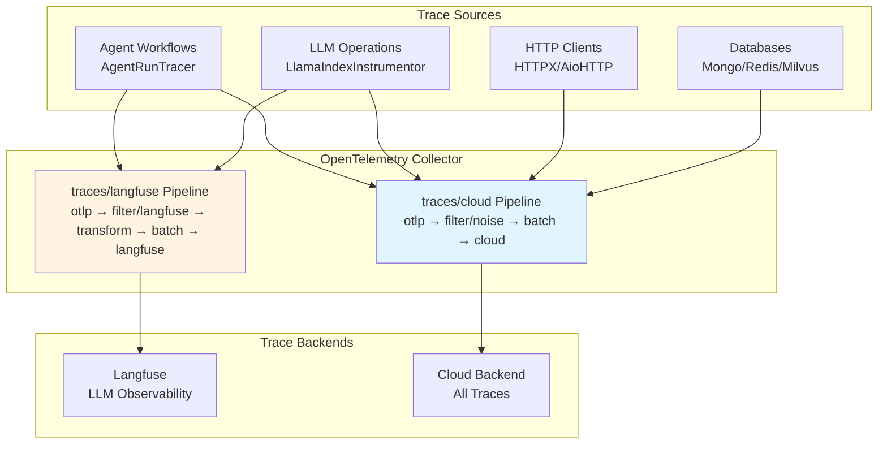
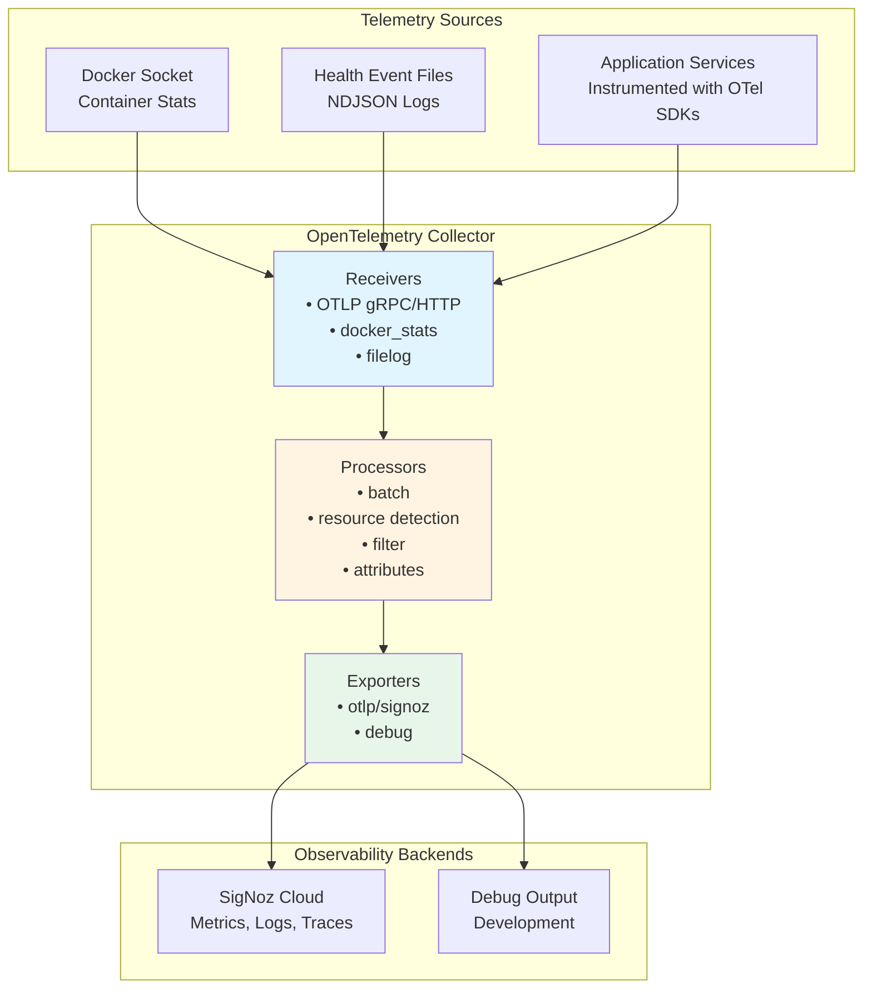

# Deep Observability with OpenTelemetry :telescope: :100:

::: info **TL;DR - What is Deep Observability?**
The Swiss AI Hub provides **end-to-end distributed tracing and deep observability** using OpenTelemetry standards,
giving you complete visibility into every aspect of your AI workflows. From individual agent steps to complex
multi-service processes, you can trace, monitor, and optimize every component of your AI ecosystem with enterprise-grade
observability that integrates seamlessly with industry-standard tools like Langfuse, SigNoz, or DataDog.
:::

## What is Deep Observability and How Does Swiss AI Hub Implement It? :brain:

**Deep Observability** goes far beyond traditional logging and monitoring. The Swiss AI Hub implements a comprehensive
observability strategy that combines **distributed tracing**, **semantic conventions**, and **AI-specific
instrumentation** to provide unprecedented visibility into your AI systems.

The platform uses **OpenTelemetry** as its foundational observability framework, enhanced with **OpenInference semantic
conventions** for AI/ML workloads. This means every interaction, from a simple user message to complex multi-agent
orchestrations, is automatically traced with rich contextual information including:

- **Complete Request Flows**: Follow a user request as it flows through APIs, agents, databases, and external services
- **AI-Specific Semantics**: Capture LLM calls, embeddings, retrievals, and model interactions with specialized semantic
  attributes
- **Performance Metrics**: Track latency, token usage, cost attribution, and resource utilization across all components
- **Error Context**: Get detailed error traces with full context of what led to failures
- **Service Dependencies**: Automatically map how your services, agents, and processes interact in real-time

The system automatically instruments **every component** including NATS messaging, database operations, HTTP calls, LLM
interactions, vector searches, and custom agent workflows without requiring code changes.

## Why This is Critical for Enterprise AI Success :trophy:

Deep observability transforms how you build, debug, and scale AI systems in production:

**🔍 Complete System Visibility**: See exactly how your AI workflows execute in production, from user input to final
output, across all microservices and agents. No more blind spots in complex distributed AI systems.

**🚀 Performance Optimization**: Identify bottlenecks in your AI pipelines with precision. Know exactly which LLM calls
are slow, which retrievals are inefficient, and where your workflows can be optimized for speed and cost.

**🛡️ Proactive Issue Detection**: Catch problems before they affect users. Advanced tracing reveals patterns that lead
to failures, allowing you to fix issues proactively rather than reactively.

**💰 Cost Attribution and Control**: Track token usage, API calls, and compute costs down to individual users, agents, or
workflows. Make data-driven decisions about resource allocation and cost optimization.

**🌐 Vendor-Agnostic Flexibility**: OpenTelemetry ensures your observability data works with any OTLP-compatible backend.
Start with Langfuse for AI-specific analysis, then migrate to enterprise tools like DataDog or New Relic without losing
data or changing instrumentation.

::: details **Automatic Instrumentation Coverage**
The Swiss AI Hub automatically instruments these components without code changes:

### Core Infrastructure

- **NATS Messaging**: Complete message flow tracing across microservices
- **Database Operations**: FeretDB, ValKey, and vector database queries
- **HTTP Clients**: All external API calls and webhooks
- **Background Tasks**: Async operations and scheduled jobs

### AI-Specific Components

- **LLM Interactions**: Token usage, model calls, and response times
- **Embeddings**: Vector generation and similarity searches
- **Retrieval**: RAG operations and knowledge base queries
- **Agent Workflows**: Step-by-step execution traces with semantic context
:::

## Getting Started

To enable deep observability in your Swiss AI Hub deployment:

1. **Configure Environment Variables**: Set the OTEL configuration variables for your target observability backend
2. **Deploy with Tracing Enabled**: Restart your Swiss AI Hub services to activate automatic instrumentation
3. **Access Your Observability Dashboard**: View traces, metrics, and analytics in your chosen observability platform

The system requires no code changes - all instrumentation is automatic and follows OpenTelemetry standards for maximum
compatibility and minimal performance impact.

# Traces

## Overview

Traces follow individual requests through the Swiss AI Hub platform, showing the complete path from start to finish.
Each operation automatically receives a unique trace identifier that connects all related activities across services,
revealing exactly what happened, where time was spent, and how components collaborated.

The Swiss AI Hub uses OpenTelemetry for tracing with specialized support for AI operations through OpenInference
semantic conventions.

______________________________________________________________________

## What We Capture

### Agent Workflow Execution (Operational)

Agent runs are traced with hierarchical span structures showing the complete workflow:

**Agent Spans**: Root span marking the start of an agent execution with user input and agent identification.

**Chain Spans**: Long-running span capturing the complete run duration from start to final output.

**Step Spans**: Individual workflow steps showing inputs, outputs, processing time, and semantic events.

**Trace Attributes**:

- Session/thread identifiers for conversation context
- Input and output values in JSON format
- OpenInference span kinds (AGENT, CHAIN, TOOL, LLM, RETRIEVER)
- Tags for filtering (thread_id, display_id, run_id)

**Implementation**: The `AgentRunTracer` creates a CHAIN span for each workflow step, capturing inputs, outputs,
processing time, and semantic events. Langfuse trace-level attributes (name, session, user, input/output) are set via
span attributes so Langfuse groups all step spans into a single trace per run.

**Agent-in-the-Loop (AITL) Delegation**: When Agent A delegates to Agent B via AITL, the tracer creates a long-lived
AGENT wrapper span under Agent A's step. The wrapper span's context is propagated via Redis (using W3C TraceContext) so
Agent B's step spans re-parent under it. Agent B suppresses `langfuse.trace.*` attributes to avoid overwriting Agent A's
trace-level display. This produces a nested hierarchy in Langfuse where the delegated agent's steps appear under the
delegating agent's trace.

### AI Model Operations (Operational)

LLM operations are automatically traced through LlamaIndex instrumentation:

**LLM Invocations**: Model selection, prompt construction, token usage, and response generation.

**Retrieval Operations**: Vector database queries, document retrieval, and context assembly.

**Embeddings**: Text embedding generation for document indexing and similarity search.

**Semantic Events**: AI-specific operations emit semantic events containing detailed metadata (token counts, model
names, retrieved documents) that enrich traces with domain-specific information.

**Visibility**: All AI operations appear in the Langfuse tracing UI with specialized views for LLM performance analysis.

### HTTP and Database Operations (Operational)

Instrumented libraries automatically create spans for external service calls:

**HTTP Clients**: HTTPX and aiohttp requests with method, URL, status code, and timing.

**Databases**: FerretDB, PostgreSQL, and ValKey operations with query information.

**Vector Database**: Milvus similarity searches and indexing operations.

**Filtering**: Health checks, metrics endpoints, and high-volume database queries are filtered from traces to reduce
noise.

______________________________________________________________________

## Trace Collection Architecture



### Collection Pipelines

The OpenTelemetry Collector processes traces through two specialized pipelines:

**traces/cloud**: Sends all traces to cloud backend

- Receiver: `otlp` (gRPC port 4317, HTTP port 4318)
- Processors: `filter/noise` (removes health checks, metrics endpoints, routine DB queries), `batch`
- Exporter: `otlp/cloud`

**traces/langfuse**: Sends AI-specific traces to Langfuse

- Receiver: `otlp` (gRPC port 4317, HTTP port 4318)
- Processors: `filter/langfuse` (keeps only OpenInference spans), `transform/langfuse` (adds project metadata), `batch`
- Exporter: `otlphttp/langfuse` (Langfuse OTEL ingestion endpoint, authenticated with `LANGFUSE_PUBLIC_KEY` /
  `LANGFUSE_SECRET_KEY`)

### Instrumentation

Services automatically emit traces through OpenTelemetry instrumentation configured by `AihubInstrumentor`:

**Automatic Instrumentation** (via `AihubInstrumentor`):

- `AsyncioInstrumentor`: Async operations and task execution
- `HTTPXClientInstrumentor` / `AioHttpClientInstrumentor`: HTTP requests
- `PymongoInstrumentor` / `RedisInstrumentor` / `MilvusInstrumentor`: Database operations
- `LlamaIndexInstrumentor`: LLM and RAG operations with OpenInference conventions

**Custom Tracing** (via `AgentRunTracer`):

- Agent workflow execution with per-step CHAIN spans
- AITL delegation tracing with AGENT wrapper spans and Redis-based W3C context propagation
- Langfuse trace enrichment (name, session, user, input/output, token usage, model)

**Smart Tracing**: The `SmartTracer` respects `suppress_instrumentation` context, allowing selective tracing control.

______________________________________________________________________

## Business Benefits

### Performance Optimization

Traces reveal exactly where time is spent in each operation. Bottleneck identification becomes precise rather than
speculative. When document retrieval takes three seconds while AI processing takes 500ms, optimization priorities become
clear.

### Cost Management

AI operations include token usage and cost attribution through semantic events. Tracking which operations, users, or
departments consume the most AI resources enables data-driven decisions about model selection and feature pricing.

### Root Cause Analysis

Failed operations preserve complete context showing exactly where and why failures occurred. Error traces include stack
traces, input data, and the sequence of events leading to failure, dramatically reducing problem resolution time.

### AI Transparency

Traces show what information the AI considered when generating answers. Retrieved documents, token usage, and model
selection become visible, supporting regulatory compliance and building user trust.

______________________________________________________________________

## Accessing Trace Information

### Langfuse UI

Langfuse provides specialized LLM observability at `http://localhost:6006` (dev) or `https://langfuse.<domain>`
(production):

**Features**:

- Timeline views showing span duration and relationships
- Token usage and cost tracking per trace, user, and agent
- Retrieved document inspection for RAG systems
- Trace filtering by session, tags, or time range
- Performance analysis and latency distributions
- Dataset management and experiment evaluation
- Azure AD SSO integration for production access control

**Focus**: AI-specific operations with OpenInference semantic conventions (LLM, CHAIN, AGENT, RETRIEVER, EMBEDDING
spans).

### Cloud Backend (Production)

Traces are exported to cloud observability platforms for long-term storage and analysis. The platform supports any
OTLP-compatible backend through configuration changes only.

______________________________________________________________________

## Security and Privacy

### Trace Content

Traces capture operation metadata, timing information, and routing details. Developers are responsible for ensuring
sensitive data is not included in trace attributes.

**Infrastructure**: OpenInference spans include session IDs, model names, token counts, and retrieved document metadata.

**Application Responsibility**: Developers must avoid logging actual document content, user messages, or other sensitive
information in custom trace attributes.

### Transmission Security

All traces are transmitted via encrypted channels (TLS/HTTPS) to prevent interception.

### Access Control

Trace access is restricted through observability platform role-based access control. Only authorized personnel can view
detailed traces.

______________________________________________________________________

## Integration with Platform Components

### Agent Workflows

The `AgentRunTracer` creates a structured tracing hierarchy for agent executions:

1. Each workflow step gets a CHAIN span with inputs, outputs, and semantic event metadata
2. Langfuse trace-level attributes (name, session, user, tags) are set on step spans for grouping
3. Semantic events from AI operations enrich traces with token usage, model names, and LLM output
4. For AITL delegation, an AGENT wrapper span bridges Agent A's step to Agent B's step spans:

```
Trace: "AgentA/profile-1"
  AgentA.start_step           (CHAIN)
    AITL -> AgentB/profile-2  (AGENT, wrapper span)
      AgentB.compute_step     (CHAIN, re-parented via Redis)
      AgentB.stop_step        (CHAIN, re-parented via Redis)
  AgentA.end_step             (CHAIN)
```

### LLM Operations

LlamaIndex instrumentation automatically traces:

- Language model invocations with token counts
- RAG operations showing document retrieval and context assembly
- Vector database searches and similarity operations
- Embedding generation for document processing

### HTTP Services

FastAPI services automatically trace incoming requests when instrumented. Developers can add custom attributes to spans
for application-specific context.

______________________________________________________________________

## Platform Flexibility

While Langfuse provides LLM-specific observability, the OpenTelemetry foundation supports any OTLP-compatible backend:

**Supported Platforms**:

- **Langfuse**: Open-source LLM observability with cost tracking and evaluation (current default)
- **SigNoz**: Open-source observability platform
- **Jaeger**: Distributed tracing focused on microservices
- **Tempo** (Grafana): Cloud-native distributed tracing
- **Datadog APM**: Commercial APM with comprehensive tracing
- **New Relic**: Application performance monitoring with AI insights

Switching backends requires only collector configuration changes. No application code modifications are needed.

______________________________________________________________________

## Future Development

### Planned Enhancements

**Tail Sampling**: Intelligent sampling that keeps error traces and interesting operations while reducing storage costs.

**Custom Business Events**: Higher-level traces for business operations beyond technical implementation details.

**Cost Prediction**: Pre-execution cost estimates based on historical trace data and query complexity.

**Performance Budgets**: Automatic alerts when operations exceed expected duration based on historical patterns.

______________________________________________________________________

## Summary

The platform's distributed tracing delivers:

✅ **Operational Agent Tracing**: Complete workflow execution with step-level detail through AgentRunTracer

✅ **AI Operation Visibility**: LLM and RAG operations traced with OpenInference semantic conventions

✅ **Automatic Instrumentation**: HTTP, database, and async operations traced without manual code

✅ **Dual Backend Support**: Langfuse for LLM-specific observability, cloud backend for full-stack production traces

✅ **Standards-Based**: OpenTelemetry ensures vendor flexibility through OTLP protocol

✅ **Performance Analysis**: Detailed timing information enables precise bottleneck identification

✅ **Privacy Foundation**: Infrastructure captures metadata; developers responsible for data protection

As tracing coverage expands, organizations gain increasingly detailed insights into platform performance, AI operations,
and user experience.

# OpenTelemetry Foundation

## Overview

**OpenTelemetry (OTel)** is the technical foundation for all observability in the Swiss AI Hub. It provides a
vendor-neutral, industry-standard framework for collecting, processing, and exporting telemetry data across metrics,
logs, and traces.

Unlike proprietary monitoring solutions that lock you into specific vendors, OpenTelemetry ensures the platform can
integrate with any compatible observability backend. This architectural decision provides organizations with maximum
flexibility in choosing monitoring tools based on their infrastructure, compliance requirements, and operational
preferences.

______________________________________________________________________

## Why OpenTelemetry?

OpenTelemetry lets us instrument services once and keep tool choice flexible. It standardizes metrics, logs, and traces
so signals correlate by default and switchable backends remain a config change, not a rewrite.

**Benefits**

- **Vendor-neutral by design:** Use any OTLP-compatible backend (e.g., SigNoz, Datadog, Grafana, Prometheus, New Relic)
  without re-instrumentation.
- **Unified signals:** Consistent models and shared context (trace/span IDs, resource attributes) link metrics, logs,
  and traces for faster troubleshooting.
- **Proven standard:** A CNCF project with broad industry support and active development, reducing technology risk.
- **Future-ready:** Evolve platforms and policies through the OTel Collector and configuration, not application code.

______________________________________________________________________

## OpenTelemetry Collector

The **OpenTelemetry Collector** is the central telemetry processing hub for the Swiss AI Hub.

### Architecture



### Components

**Receivers**: Collect telemetry from various sources.

**Processors**: Transform, enrich, filter, and batch telemetry before export.

**Exporters**: Send processed telemetry to observability backends.

**Extensions**: Provide auxiliary capabilities like health checks and profiling.

______________________________________________________________________

## Receivers

Receivers are intake points. They pull telemetry from apps and infrastructure into the platform.

- **OTLP receiver:** Standard entry for app telemetry. Services send metrics, logs, and traces using the OpenTelemetry
  protocol. Concept: one wire format for everything.
- **Container metrics receiver:** Collects resource usage from running containers. Concept: observe runtime health
  without touching app code.
- **File log receivers:** Ingest structured event logs like container and synthetic health checks. Concept: capture
  operational signals even when apps lack native endpoints.

Outcome: Broad coverage with minimal coupling to any single tool or runtime.

______________________________________________________________________

## Processors

Processors shape telemetry in motion. They add context, reduce noise, and prepare data for analysis.

- **Batching:** Groups data for efficient transport. Concept: lower overhead without losing fidelity.
- **Resource detection:** Auto-enriches with environment details such as host, container, or system info. Concept:
  attach who/where to every signal.
- **Attribute editing:** Normalizes tags like environment or source. Concept: consistent labels for reliable filtering
  and dashboards.
- **Resource mapping:** Translates container facts into service identities (e.g., service name, version). Concept: align
  infra reality with service views.
- **Filtering:** Drops low-value noise such as routine health checks. Concept: improve signal-to-noise and control cost.

Outcome: Clean, contextual, and analysis-ready telemetry.

______________________________________________________________________

## Exporters

Exporters deliver telemetry to destinations.

- **Primary backend exporter:** Sends data to the chosen OTLP-compatible platform. Concept: pick or change your analysis
  tool without re-instrumenting.
- **Debug exporter:** Prints or previews data for validation. Concept: verify pipelines locally before scaling.

Outcome: Pluggable outputs with safe development workflows.

______________________________________________________________________

## Telemetry Pipelines

Pipelines are end-to-end flows per signal type. Each defines which receivers, processors, and exporters to use.

- **Metrics pipelines:** Optimize for throughput and trend analysis. Enrich with service context.
- **Log pipelines:** Preserve structure and order. Extract attributes for querying and correlation.
- **Trace pipelines:** Keep parent–child relationships intact. Batch carefully to maintain trace integrity.

Concept: purpose-built lanes that keep signals consistent and linkable across the stack.

______________________________________________________________________

## Extensions

Extensions add operational capabilities around the collector itself.

- **Health checks:** Expose collector status for monitoring. Concept: treat observability as a first-class service.
- **Profiling (pprof):** Inspect performance under load. Concept: diagnose pipeline bottlenecks.
- **Diagnostics (zPages):** View internal metrics and state. Concept: faster debugging without external tools.

Outcome: A manageable, inspectable observability control plane.

______________________________________________________________________

## Integration with Platform Services

### Application Instrumentation

Services instrumented with OpenTelemetry SDKs automatically emit telemetry:

**Python Services** (API, Agents, Pipelines):

- `opentelemetry-instrumentation-*` libraries for automatic framework instrumentation
- Custom instrumentation for business logic
- OpenInference for AI/ML semantic conventions

**Instrumented Components**:

- FastAPI HTTP requests and responses
- Database operations (MongoDB, PostgreSQL, Redis, Milvus)
- HTTP client requests (httpx, aiohttp, requests)
- LlamaIndex LLM operations
- Python logging framework

### Infrastructure Integration

Non-instrumented services provide telemetry through infrastructure monitoring:

**Container Metrics**: Docker stats receiver collects resource metrics for all containers regardless of instrumentation.

**Health Monitoring**: File log receivers capture health status from both Docker events and synthetic checks.

**Network Observability**: Traefik proxy logs and metrics provide request routing visibility.

______________________________________________________________________

## Multi-Platform Support

### Vendor Flexibility

The OpenTelemetry foundation supports simultaneous export to multiple platforms:

**Supported Platforms**:

- **SigNoz**: Open-source, OpenTelemetry-native platform (current primary)
- **Datadog**: Commercial APM with comprehensive capabilities
- **Grafana Cloud**: Managed Prometheus, Loki, and Tempo
- **New Relic**: Application performance monitoring with AI insights
- **Prometheus**: Open-source time-series database
- **Elasticsearch/ELK**: Log analytics and search platform
- **Splunk**: Enterprise SIEM and observability platform

### Adding Export Destinations

New observability platforms require only collector configuration changes:

1. Define exporter in collector configuration
2. Add exporter to relevant pipelines
3. Configure authentication via environment variables

No application code changes required.

## Security

### Secure Transmission

All telemetry exports use TLS encryption preventing interception or tampering.

### Access Control

Collector configuration and access restricted to infrastructure administrators. Application services emit telemetry
through defined interfaces without collector access.

### Secret Management

Authentication keys managed via environment variables, separate from configuration files, enabling secure secret
rotation.
