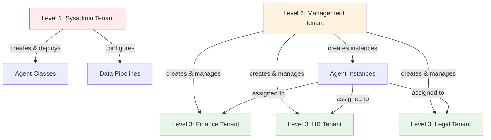

# Einrichten von Mandanten

Das Erstellen von Mandanten erfordert eine sorgfältige Planung Ihrer Organisationsstruktur und ein klares Verständnis
dessen, was jede Benutzergruppe tun können sollte. Dieses Kapitel beleuchtet praktische Ansätze für das
Mandanten-Design.

## Planung Ihrer Mandantenstruktur

Beginnen Sie mit der Identifizierung der Gruppen, die getrennte Arbeitsbereiche benötigen. Gängige Muster sind:

**Organisationshierarchie**: Systemadministratoren, Manager und Abteilungen erhalten jeweils einen eigenen Mandanten.
Dies trennt technische Operationen von der Geschäftsverwaltung und der täglichen Arbeit.

**Geschäftseinheiten**: Marketing, Vertrieb, Engineering, Betrieb erhalten jeweils einen Mandanten. Sie teilen sich
einige Ressourcen (unternehmensweite Agents), verfügen aber über einheitsspezifische Agents.

**Kundenisolation**: Jeder Kunde erhält einen eigenen Mandanten. Dies ist nützlich für Dienstleister oder
SaaS-Deployments, bei denen Kunden niemals die Daten oder Agents anderer Kunden sehen dürfen.

**Umgebungstrennung**: Entwicklung, Staging und Produktion laufen als separate Mandanten. Entwickler können im
Entwicklungs-Mandanten experimentieren, ohne die Produktionsbenutzer zu beeinträchtigen.

**Compliance-Grenzen**: Rechtliche Anforderungen können eine Trennung zwischen Entitäten, geografischen Regionen oder
Datenklassifizierungen vorschreiben. Jede regulierte Grenze wird zu einem Mandanten.

## Das Drei-Ebenen-Muster

Die meisten Deployments profitieren von drei Ebenen von Mandanten:



### Ebene 1: Systemadministration

Erstellen Sie einen Mandanten für Personen, die die Plattforminfrastruktur warten. Diese Benutzer:

- Deployen Agent- und Prozesscode auf die Plattform
- Konfigurieren Daten-Pipelines für das Einpflegen von Dokumenten
- Verwalten Plattform-Services und Monitoring
- Haben vollständigen Zugriff auf alle Plattformfunktionen

Dies sind typischerweise 2-5 Personen: Ihr DevOps-Team, Lead-Entwickler oder IT-Mitarbeiter, die für die Plattform
verantwortlich sind.

### Ebene 2: Geschäftsadministration

Erstellen Sie einen Mandanten für Personen, die die Plattform für Geschäftsbenutzer administrieren. Diese Benutzer:

- Erstellen und konfigurieren neue Mandanten
- Fügen Benutzer zu Mandanten hinzu und weisen Rollen zu
- Erstellen Agent-Instanzen aus deployten Klassen
- Überwachen die Agent-Performance und führen Evaluierungen durch
- Verwalten Wissensdatenbanken (Ingestionsstatus anzeigen, Probleme beheben)

Dies sind Business-Analysten, Projektmanager oder Abteilungsleiter, die die Bedürfnisse der Organisation verstehen, aber
keinen Code schreiben.

### Ebene 3: Endbenutzer

Erstellen Sie Mandanten für Personen, die Agents nutzen, um Aufgaben zu erledigen. Diese Benutzer:

- Chatten mit Agents, die für ihre Rolle relevant sind
- Nehmen an Prozessen teil, die ihre Abteilung betreffen
- Können keine administrativen Oberflächen sehen oder Agent-Instanzen erstellen

Dies sind alle anderen in Ihrer Organisation.

## Einen Mandanten erstellen

Navigieren Sie in der Admin-Oberfläche zu **Service** → **Tenants**. Sie müssen sich in einem Mandanten befinden, der
administrativen Zugriff auf den Mandanten-Service hat.

Klicken Sie auf **Create Tenant**. Sie benötigen drei Informationen:

**Name**: Wählen Sie etwas Klares und Beschreibendes. „Finanzabteilung“, „Kunde - Acme Corp“, „Produktionsumgebung“.
Benutzer sehen diesen Namen, wenn sie auswählen, in welchem Mandanten sie arbeiten möchten.

**Beschreibung**: Erklären Sie, wofür dieser Mandant gedacht ist. „Benutzer der Finanzabteilung – Zugriff auf
Finanzberichts-Agents und Abteilungsrichtlinien.“ Dies hilft sowohl aktuellen als auch zukünftigen Administratoren, den
Zweck des Mandanten zu verstehen.

**Geltungsbereich**: Definieren Sie, auf welche Ressourcen dieser Mandant zugreifen kann. Für das Drei-Ebenen-Muster:

- Sysadmin-Ebene: Voller Plattformzugriff
- Management-Ebene: Administrative Services, aber keine Deployment-Fähigkeiten
- Endbenutzer-Ebene: Spezifische Agents und Prozesse, keine Services

## Mandanten-Scoping

Der Geltungsbereich des Mandanten bestimmt den maximalen Zugriff, den jeder in diesem Mandanten haben kann. Stellen Sie
es sich vor, wie das Ziehen einer Grenze um Ressourcen.

Für einen Mandanten der Finanzabteilung könnten Sie den Geltungsbereich festlegen auf:

- Finanzbezogene Agents (Reporting-Agents, Richtlinien-Agents, Genehmigungs-Workflows)
- Finanz-Wissensdatenbanken (für Manager, die Probleme mit der Datenaufnahme beheben)
- Spezifische Prozesse (Budgetgenehmigungs-Workflow, Spesenabrechnung)

Ein Benutzer im Finanz-Mandanten kann nicht auf HR-Agents zugreifen, selbst wenn Sie ihm eine Admin-Rolle innerhalb des
Finanz-Mandanten geben. Die Mandanten-Grenze verhindert dies.

### Breiter versus enger Geltungsbereich

Sie haben zwei Ansätze:

**Breiter Geltungsbereich**: Geben Sie dem Mandanten zunächst Zugriff auf alles. Benutzer können alle Agents, alle
Services, alle Prozesse sehen. Wenn Sie herausfinden, was sie tatsächlich benötigen, grenzen Sie den Geltungsbereich
ein, indem Sie den Zugriff auf ungenutzte Ressourcen entfernen.

**Enger Geltungsbereich**: Geben Sie dem Mandanten nur Zugriff auf spezifische Ressourcen. Wenn Benutzer mehr Funktionen
anfragen, erweitern Sie den Geltungsbereich schrittweise.

Ein breiter Geltungsbereich ist anfänglich einfacher, erfordert aber später mehr Bereinigungsaufwand. Ein enger
Geltungsbereich ist sicherer, aber Benutzer werden den Zugriff anfragen, wenn sie neue Bedürfnisse entdecken.

Für Endbenutzer-Mandanten (Abteilungen, Kunden) beginnen Sie eng. Diese Benutzer benötigen keine breite Sichtbarkeit –
sie benötigen spezifische Tools. Für Management-Mandanten beginnen Sie breit, da diese Benutzer Flexibilität zur
Administration der Plattform benötigen.

## Rollen innerhalb von Mandanten konfigurieren

Nachdem Sie den Mandanten erstellt haben, konfigurieren Sie die Rollen, die Benutzer in diesem Mandanten haben können.
Rollen definieren, was Benutzer innerhalb der Grenzen des Mandanten tun können.

Für einen Abteilungs-Mandanten könnten Sie erstellen:

**Standardbenutzer**: Kann mit Abteilungs-Agents chatten, an Prozessen teilnehmen, aber nichts erstellen oder ändern.

**Teamleiter**: Kann Agent-Instanzen erstellen, Agents für sein Team konfigurieren, Evaluierungsergebnisse anzeigen,
aber keine Benutzer verwalten oder Mandanteneinstellungen ändern.

**Abteilungsadministrator**: Volle Kontrolle innerhalb des Abteilungs-Mandanten – kann Benutzer hinzufügen, Rollen
zuweisen, Agents erstellen und alle Abteilungsressourcen verwalten.

Diese Rollen gelten nur innerhalb dieses Mandanten. Ein Benutzer, der „Abteilungsadministrator“ in Finanzen ist, hat
keine Berechtigungen im HR-Mandanten, es sei denn, diese wurden explizit gewährt.

## Benutzer zu Mandanten hinzufügen

Nachdem Sie Rollen erstellt haben, fügen Sie Benutzer dem Mandanten hinzu und weisen Sie ihnen Rollen zu.

Suchen Sie nach Benutzern per E-Mail oder Namen. Wenn ein Benutzer noch nicht existiert (er hat sich noch nicht
angemeldet), können Sie ihn trotzdem hinzufügen. Sein Profil wird erstellt, wenn er sich zum ersten Mal über Ihren
Identitätsanbieter authentifiziert.

Benutzer können mehreren Mandanten angehören. Jemand könnte sein:

- Standardbenutzer in seinem Abteilungs-Mandanten
- Teamleiter in einem funktionsübergreifenden Projekt-Mandanten
- Admin in einem Test-Mandanten zum Ausprobieren neuer Funktionen

## Standardverhalten für Mandanten

Wenn sich jemand zum ersten Mal anmeldet, tritt er automatisch dem Standard-Mandanten mit Standardbenutzerrollen bei.
Konfigurieren Sie dieses Verhalten mit Umgebungsvariablen:

```bash
AIHUB_USER_SIGNUP_DEFAULT_TENANT="default"
AIHUB_USER_SIGNUP_DEFAULT_ROLES="AIHubUser"
FIRST_AIHUB_USER_SIGNUP_DEFAULT_ROLES="AIHubAdmin"
```

Die erste Person, die sich anmeldet, erhält Administratorrollen, um sicherzustellen, dass jemand die Plattform sofort
administrieren kann. Nachfolgende Benutzer erhalten Standardrollen.

Diese automatische Zuweisung erfolgt nur einmal pro Benutzer. Danach fügen Sie sie bei Bedarf explizit zu anderen
Mandanten hinzu.

## Gängige Konfigurationen

### Einzelnes Unternehmen mit Abteilungen

Sysadmin-Mandant → Management-Mandant → Ein Mandant pro Abteilung

Manager erstellen Abteilungs-Mandanten und konfigurieren, auf welche Agents jede Abteilung zugreifen kann.
Abteilungsbenutzer sehen nur die Ressourcen ihrer Abteilung.

### Multi-Kunden-SaaS

Sysadmin-Mandant → Management-Mandant → Ein Mandant pro Kunde

Jeder Kunden-Mandant ist isoliert. Kunden können die Agents oder Daten anderer Kunden nicht sehen. Manager nehmen neue
Kunden auf, indem sie einen Mandanten erstellen, relevante Agents konfigurieren und die Benutzer dieses Kunden
hinzufügen.

### Beratungsunternehmen

Sysadmin-Mandant → Management-Mandant → Ein Mandant pro Kundenprojekt

Projekt-Mandanten gewähren Beratern Zugriff auf kundenspezifische Agents und Wissen. Wenn ein Projekt endet, archivieren
Sie den Mandanten. Wenn ein Berater einem neuen Projekt beitritt, fügen Sie ihn dem Mandanten dieses Projekts hinzu.

### Entwicklungs-Workflow

Sysadmin-Mandant → Dev-Mandant → Staging-Mandant → Produktions-Mandant

Entwickler arbeiten im Dev-Mandanten mit gelockerten Kontrollen. Der Staging-Mandant spiegelt die Produktion zum Testen
wider. Der Produktions-Mandant hat strenge Zugriffskontrollen. Dieselben Agents, derselbe Code, unterschiedliche
Mandanten für unterschiedliche Zwecke.

## Mandanten-Zustände

Da Mandanten in zwei Speichern existieren — Keycloak (Gruppe unter `/tenants/<id>`, die Quelle der Wahrheit für die
Existenz) und dem eigenen Metadaten-Speicher der Plattform (Anzeigename, Beschreibung, Zugriffsregeln) — können sie in
drei Zuständen beobachtet werden:

- **Active**: Sowohl die Keycloak-Gruppe als auch die Metadaten sind vorhanden. Endbenutzer können den Mandanten
  erreichen.
- **Orphaned**: Metadaten sind vorhanden, aber die Keycloak-Gruppe ist verschwunden (z.B. hat ein Operator die Gruppe
  out of band entfernt). Endbenutzer können den Mandanten nicht erreichen. Sysadmins sehen ihn als schreibgeschützt mit
  nur einer Lösch-Metadaten-Aktion.
- **Unconfigured**: Die Keycloak-Gruppe existiert, aber es wurden keine Metadaten angehängt. Endbenutzer können den
  Mandanten noch nicht erreichen. Sysadmins sehen ihn im „Mandanten konfigurieren“-Workflow, wo das Anhängen von
  Metadaten ihn zu Active hochstuft.

Die Sysadmin-Mandantenadministrations-UI unter `/sysadmin/tenants/` zeigt alle drei Zustände an. Die Aktion „Mandanten
konfigurieren“ hängt Metadaten an eine Unconfigured-Gruppe an und ist der primäre Pfad, über den eine von einem Operator
erstellte Keycloak-Gruppe (z.B. für eine IDP-zu-Mandanten-Zuordnung) zu einem nutzbaren Mandanten wird.

## Mandanten-Lebenszyklus

Mandanten bleiben bestehen, bis sie explizit gelöscht werden. Sie können:

**Einen Mandanten archivieren**: Alle Benutzer entfernen, aber den Mandanten und seine Rollen behalten. Nützlich für
abgeschlossene Projekte oder inaktive Kunden. Niemand kann darauf zugreifen, aber die Konfiguration bleibt erhalten,
falls Sie ihn reaktivieren müssen.

**Einen Mandanten löschen**: Die Metadaten der Plattform für den Mandanten entfernen. Die Keycloak-Gruppe selbst bleibt
unberührt — die Bereinigung der Gruppe ist ein separater Schritt in der Keycloak-Admin-Konsole. Die Löschung ist auf
Metadaten-Seite permanent.

::: warning Schutz des letzten Mandanten
Die Plattform erfordert, dass mindestens ein Mandant verbleibt. Das Löschen wird blockiert, wenn es das System ohne
verbleibende Mandanten hinterlassen würde. Jeder Mandant – einschliesslich des Standardmandanten – kann gelöscht werden,
solange mindestens ein anderer Mandant existiert. Das `is_default`-Flag ist nun ein passiver Marker für „Mandant bei
Start erstellt“ und hat keine Löschschutz-Semantik.
:::

## Praktische Tipps

::: tip Best Practices **Dokumentieren Sie Ihre Entscheidungen**: Schreiben Sie auf, warum Sie jeden Mandanten erstellt haben und welchen Geltungsbereich er haben sollte. Sechs Monate später, wenn sich Rollen geändert haben, verhindert diese Dokumentation Verwirrung.
**Beginnen Sie einfach**: Ein Management-Mandant und ein Endbenutzer-Mandant funktionieren für viele Organisationen.
Fügen Sie Komplexität nur hinzu, wenn Sie sie benötigen.

**Mit eingeschränkten Benutzern testen**: Erstellen Sie ein Testkonto, fügen Sie es einem neuen Mandanten hinzu und
überprüfen Sie, was dieser Benutzer sehen kann. Nicht annehmen – überprüfen.

**Vierteljährliche Überprüfung**: Personen wechseln Rollen. Projekte enden. Neue Abteilungen entstehen. Ihre
Mandantenstruktur sollte sich mit Ihrer Organisation weiterentwickeln.

**Wachstum planen**: „Kunde 1“ funktioniert, wenn Sie drei Kunden haben. „Kunde - Acme Corp“ funktioniert, wenn Sie
dreihundert haben.
:::
