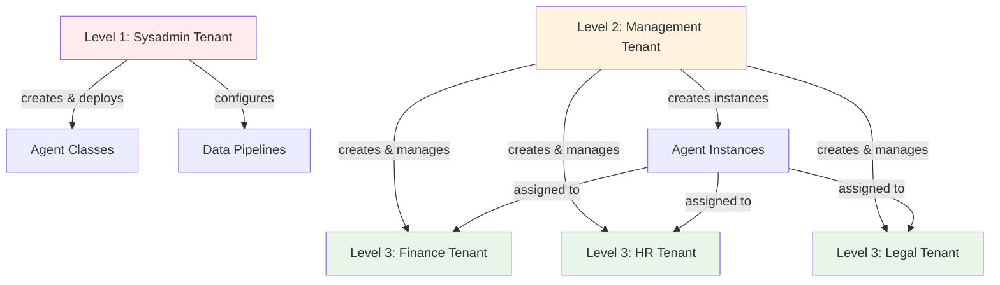
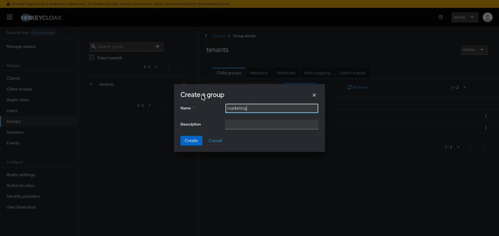
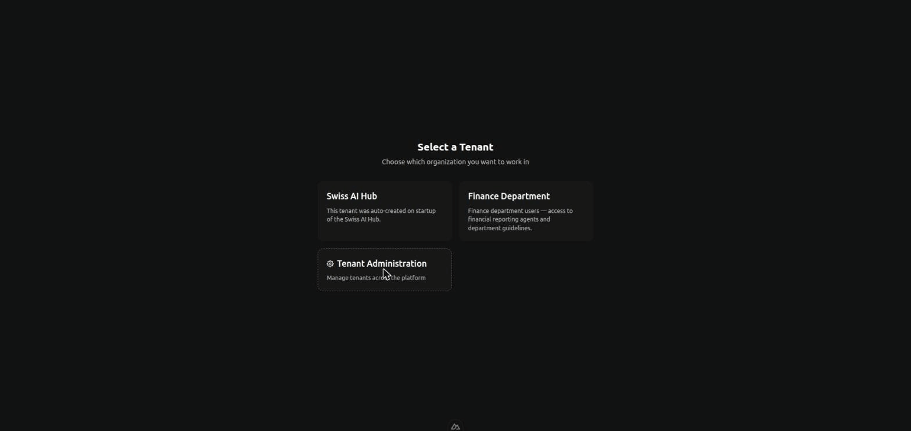
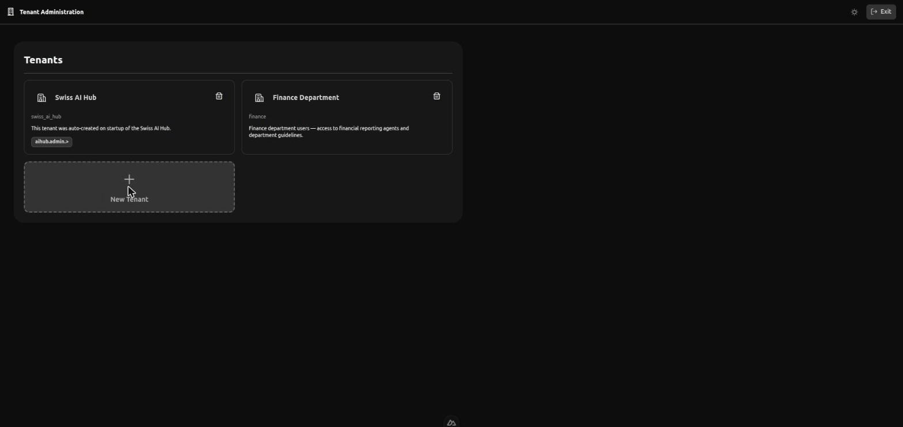
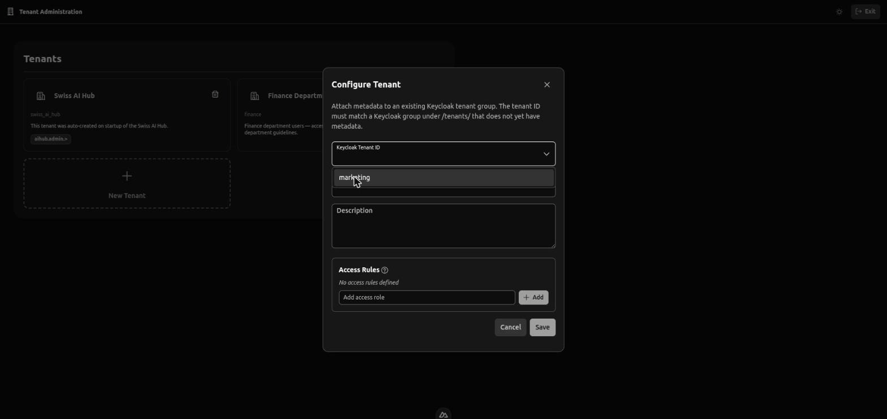
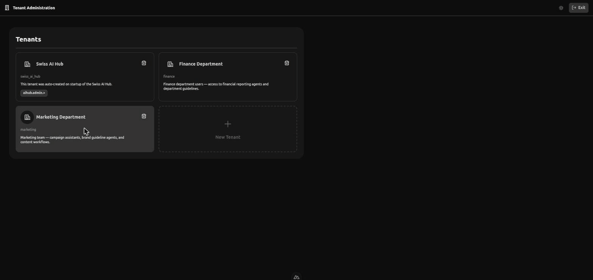

# Einrichten von Mandanten

Das Erstellen von Mandanten erfordert die Planung Ihrer Organisationsstruktur und das Verständnis, welche Aufgaben jede
Benutzergruppe ausführen können sollte. Dieses Kapitel behandelt praktische Ansätze für das Mandanten-Design.

## Planung Ihrer Mandantenstruktur

Beginnen Sie damit, die Gruppen zu identifizieren, die getrennte Arbeitsbereiche benötigen. Häufige Muster:

**Organisationshierarchie**: Systemadministratoren, Manager und Abteilungen erhalten jeweils einen eigenen Mandanten.
Dies trennt technische Operationen von der Geschäftsverwaltung und der täglichen Arbeit.

**Geschäftseinheiten**: Marketing, Vertrieb, Engineering, Operations erhalten jeweils einen Mandanten. Sie teilen sich
einige Ressourcen (unternehmensweite Agents), haben aber einheitsspezifische Agents.

**Kundenisolation**: Jeder Kunde erhält einen eigenen Mandanten. Nützlich für Service Provider oder SaaS-Deployments,
bei denen Kunden niemals die Daten oder Agents anderer Kunden sehen dürfen.

**Umgebungsseparation**: Entwicklung, Staging und Produktion laufen als separate Mandanten. Entwickler können im
Entwicklungs-Mandanten experimentieren, ohne die Produktionsnutzer zu beeinflussen.

**Compliance-Grenzen**: Gesetzliche Anforderungen können eine Trennung zwischen Entitäten, geografischen Regionen oder
Datenklassifizierungen vorschreiben. Jede regulierte Grenze wird zu einem Mandanten.

## Das Drei-Ebenen-Muster

Die meisten Deployments profitieren von drei Ebenen von Mandanten:



### Ebene 1: Systemadministration

Erstellen Sie einen Mandanten für Personen, die die Plattforminfrastruktur warten. Diese Benutzer:

- Deployen Agent- und Prozess-Code auf der Plattform
- Konfigurieren Daten-Pipelines für das Ingestieren von Dokumenten
- Verwalten Plattform-Services und Monitoring
- Haben vollen Zugriff auf alle Plattformfunktionen

Dies sind typischerweise 2-5 Personen: Ihr DevOps-Team, Lead-Entwickler oder IT-Mitarbeiter, die für die Plattform
verantwortlich sind.

### Ebene 2: Geschäftsadministration

Erstellen Sie einen Mandanten für Personen, die die Plattform für Geschäftsbenutzer administrieren. Diese Benutzer:

- Erstellen und konfigurieren neue Mandanten
- Fügen Benutzer zu Mandanten hinzu und weisen Rollen zu
- Erstellen Agent-Instanzen aus deployten Klassen
- Überwachen die Agent-Performance und führen Evaluationen durch
- Verwalten Wissensdatenbanken (Ingestionsstatus anzeigen, Probleme beheben)

Dies sind Business-Analysten, Projektmanager oder Abteilungsleiter, die die Bedürfnisse der Organisation verstehen, aber
keinen Code schreiben.

> In der aktuellen Implementierung erfordert das **Erstellen und Konfigurieren von Mandanten** (Schritte 1–3 unten) die
> `AIHubSysAdmin`-Realm-Rolle. Gewähren Sie diese den Personen, die diese Rolle der Ebene 2 ausfüllen, damit sie den
> Mandanten-Lebenszyklus verwalten können; die verbleibenden Aktivitäten der Ebene 2 (Agent-Instanzen, Evaluationen,
> Wissen) sind gewöhnliche In-Mandanten-Admin-Aufgaben.

### Ebene 3: Endbenutzer

Erstellen Sie Mandanten für Personen, die Agents nutzen, um Aufgaben zu erledigen. Diese Benutzer:

- Chatten mit Agents, die für ihre Rolle relevant sind
- Nehmen an Prozessen teil, die ihre Abteilung betreffen
- Können keine administrativen Oberflächen sehen oder Agent-Instanzen erstellen

Dies sind alle anderen in Ihrer Organisation.

## Erstellen eines Mandanten

Ein Mandant existiert in **zwei Speichern**: einer Keycloak-Gruppe unter `/tenants/<id>` (die Quelle der Wahrheit für
die Existenz und Mitgliedschaft des Mandanten) und dem eigenen Metadaten-Speicher der Plattform (Anzeigename,
Beschreibung, Zugriffsregeln). Das Erstellen eines Mandanten bedeutet daher, **zuerst die Keycloak-Gruppe zu erstellen
und dann Metadaten daran anzuhängen** über die Mandanten-Administrations-UI. Die Reihenfolge ist wichtig – Sie können
keinen Mandanten konfigurieren, dessen Keycloak-Gruppe noch nicht existiert.

::: warning Erforderliche Rolle: `AIHubSysAdmin`
Die Mandantenadministration wird durch die **`AIHubSysAdmin`** Keycloak-Realm-Rolle gesteuert. Nur Benutzer mit dieser
Realm-Rolle sehen die Einstiegspunkte der Mandantenadministration und können den Erstellungs-/Konfigurationsfluss
erreichen. Eine reguläre Mandanten-Admin-Rolle (z. B. `AIHubAdmin`) ist **nicht** ausreichend – diese Rolle
administriert _innerhalb_ eines Mandanten, nicht den Mandanten-Lebenszyklus selbst.
:::

### Schritt 1 – Erstellen der Keycloak-Gruppe (Voraussetzung)

Öffnen Sie die **Keycloak-Admin-Konsole**, wechseln Sie zum **Swiss AI-Hub (`aihub`) Realm** und gehen Sie zu **Groups →
`tenants`**. Klicken Sie auf der Registerkarte **Child groups** auf **Create group** und geben Sie die ID des Mandanten
ein – zum Beispiel `finance`. Dies erstellt die Gruppe `/tenants/finance`.



Die Gruppen-ID wird zum unveränderlichen Bezeichner des Mandanten. Verwenden Sie einen kurzen, kleingeschriebenen,
URL-sicheren Slug (`finance`, `acme-corp`, `production`); der menschenlesbare Anzeigename wird später als Metadaten
festgelegt.

> Mandantengruppen werden auch automatisch durch IDP-zu-Mandanten-Mappings erstellt (siehe _IDP-basierte
> Mandantenzuweisung_). Diese Gruppen kommen **Nicht konfiguriert** an und erscheinen genau im selben
> Konfigurationsfluss, der unten beschrieben wird.

### Schritt 2 – Mandantenadministration öffnen

Die Mandantenadministration ist eine **separate, nur für Systemadministratoren zugängliche Anwendung**, die unter
`sysadmin.<Ihre-Domain>` (in der lokalen Entwicklung: `http://localhost:3334`) bereitgestellt wird. Sie müssen diese URL
nicht eingeben – erreichen Sie sie über die Hauptanwendung auf eine von zwei Weisen:

- **Mandanten-Umschalter** in der oberen Leiste → **Mandantenadministration** (nur für `AIHubSysAdmin`-Benutzer
  sichtbar), oder
- die **Mandantenadministration**-Karte auf dem **Mandanten-Auswahlbildschirm** (`/select-tenant`).



Beide Wege führen Sie zur Seite **Mandanten** (`/tenants`), die jeden Mandanten und seinen Status auflistet (Aktiv,
Verwaist, Nicht konfiguriert — siehe [Mandantenstatus](#mandantenstatus)).

### Schritt 3 – Mandanten konfigurieren

Klicken Sie auf der Seite **Mandanten** auf die gestrichelte Karte **Neuer Mandant**. (Wenn die Karte deaktiviert ist,
gibt es noch keine nicht konfigurierten Keycloak-Gruppen – gehen Sie zurück zu Schritt 1.) Der Dialog **Mandanten
konfigurieren** hängt Metadaten an Ihre Keycloak-Gruppe an:



- **Keycloak Mandanten-ID** – ein Dropdown-Menü der Keycloak-Gruppen unter `/tenants/`, die noch keine Metadaten haben.
  Wählen Sie die Gruppe aus, die Sie in Schritt 1 erstellt haben (z. B. `finance`).
- **Mandantenname** – der menschenlesbare Anzeigename, den Benutzer bei der Auswahl eines Mandanten sehen
  („Finanzabteilung“, „Kunde – Acme Corp“, „Produktion“). Muss eindeutig sein.
- **Beschreibung** – wofür der Mandant ist. Hilft aktuellen und zukünftigen Administratoren, seinen Zweck zu verstehen.
- **Zugriffsregeln** – optionale Regeln, die den **maximalen Umfang** für jeden im Mandanten definieren (siehe
  [Mandantenumfang festlegen](#mandantenumfang-festlegen)). Sie können dies leer lassen und später verfeinern.



Klicken Sie auf **Speichern**. Die Plattform initialisiert die Standardrollen des Mandanten, fügt den aktuellen
Systemadministrator dem Mandanten hinzu und schreibt die Metadaten. Der Mandant wird sofort **Aktiv** und ist für seine
Mitglieder auswählbar.



> Es gibt kein separates „Umfang“-Feld im Erstellungsformular. Mandantengrenzen werden durch **Zugriffsregeln**
> ausgedrückt, die Sie zum Zeitpunkt der Erstellung festlegen oder später über die Registerkarte **Übersicht** des
> Mandanten bearbeiten können.

## Mandantenumfang festlegen

Die **Zugriffsregeln** eines Mandanten (das Feld **Zugriffsregeln** im Konfigurationsformular, später auf der
Registerkarte **Übersicht** bearbeitbar) bestimmen den maximalen Zugriff, den jeder in diesem Mandanten haben kann.
Stellen Sie sich diese als das Ziehen einer Grenze um Ressourcen vor.

Für einen Mandanten der Finanzabteilung könnten Sie den Umfang festlegen auf:

- Finanzbezogene Agents (Reporting-Agents, Richtlinien-Agents, Genehmigungs-Workflows)
- Finanz-Wissensdatenbanken (für Manager, die Ingestionsprobleme beheben)
- Spezifische Prozesse (Budgetgenehmigungs-Workflow, Spesenabrechnung)

Ein Benutzer im Finanz-Mandanten kann nicht auf HR-Agents zugreifen, selbst wenn Sie ihm eine Administratorrolle
innerhalb des Finanz-Mandanten geben. Die Mandantengrenze verhindert dies.

### Breit anfangen vs. eng anfangen

Sie haben zwei Ansätze:

**Breiter Umfang**: Geben Sie dem Mandanten zunächst Zugriff auf alles. Benutzer können alle Agents, alle Services, alle
Prozesse sehen. Wenn Sie lernen, was sie tatsächlich benötigen, schränken Sie den Umfang ein, indem Sie den Zugriff auf
ungenutzte Ressourcen entfernen.

**Enger Umfang**: Geben Sie dem Mandanten nur Zugriff auf bestimmte Ressourcen. Wenn Benutzer weitere Funktionen
anfordern, erweitern Sie den Umfang schrittweise.

Ein breiter Umfang ist anfänglich einfacher, erfordert aber später mehr Bereinigung. Ein enger Umfang ist sicherer, aber
Benutzer werden Zugriff anfordern, sobald sie Bedürfnisse entdecken.

Für Endbenutzer-Mandanten (Abteilungen, Kunden) beginnen Sie eng. Diese Benutzer benötigen keine breite Sichtbarkeit –
sie benötigen spezifische Tools. Für Management-Mandanten beginnen Sie breit, da diese Benutzer Flexibilität benötigen,
um die Plattform zu administrieren.

## Rollen innerhalb von Mandanten konfigurieren

Das Speichern eines neuen Mandanten **initialisiert automatisch eine Reihe von Standardrollen**, sodass der Mandant
sofort nutzbar ist. Um diese zu überprüfen oder zu erweitern, öffnen Sie den Mandanten aus der Mandantenliste und
wechseln Sie zur Registerkarte **Rollen** (`/tenants/<id>/roles`). Rollen definieren, was Benutzer innerhalb der
Mandantengrenzen tun können; jede Rolle trägt ihre eigenen Zugriffsregeln, die durch die des Mandanten begrenzt sind.

Für einen Abteilungs-Mandanten könnten Sie hinzufügen:

**Standardbenutzer**: Kann mit Abteilungs-Agents chatten, an Prozessen teilnehmen, aber nichts erstellen oder ändern.

**Teamleiter**: Kann Agent-Instanzen erstellen, Agents für sein Team konfigurieren, Evaluationsergebnisse anzeigen, aber
keine Benutzer verwalten oder Mandanteneinstellungen ändern.

**Abteilungsadministrator**: Volle Kontrolle innerhalb des Abteilungs-Mandanten – kann Benutzer hinzufügen, Rollen
zuweisen, Agents erstellen und alle Abteilungsressourcen verwalten.

Diese Rollen gelten nur innerhalb dieses Mandanten. Ein Benutzer, der im Finanz-Mandanten „Abteilungsadministrator“ ist,
hat keine Privilegien im HR-Mandanten, es sei denn, diese wurden explizit gewährt.

## Rollen an Benutzer zuweisen

Öffnen Sie den Mandanten und wechseln Sie zur Registerkarte **Benutzer** (`/tenants/<id>/users`). Sie listet die der
Plattform bekannten Benutzer auf; für jeden weisen Sie **die Rollen dieses Mandanten zu oder entziehen sie**.

Der Benutzer-_Lebenszyklus_ – das Erstellen von Konten, das Löschen von Konten, das Föderieren von einem externen
Identitätsanbieter – wird in **Keycloak** verwaltet, nicht hier. Ein Benutzer wird Mandantenmitglied durch die
Keycloak-Gruppenmitgliedschaft (die Gruppe `/tenants/<id>`), was auch der Weg ist, wie IDP-basierte Mappings Benutzer
automatisch hinzufügen. Die Registerkarte „Benutzer“ ist der Ort, an dem Sie diesen Mitgliedern ihre In-Mandanten-Rollen
zuweisen.

Benutzer können zu mehreren Mandanten gehören. Jemand könnte sein:

- Standardbenutzer in ihrem Abteilungs-Mandanten
- Teamleiter in einem funktionsübergreifenden Projekt-Mandanten
- Administrator in einem Test-Mandanten zum Ausprobieren neuer Funktionen

## Startverhalten des Mandanten

Wenn sich jemand zum ersten Mal anmeldet, tritt er automatisch dem Startup-Mandanten (dem, den die Plattform beim ersten
Start initialisiert hat – siehe `AIHUB_STARTUP_TENANT_*`) mit Standard-Benutzerrollen bei. Konfigurieren Sie dieses
Verhalten mit Umgebungsvariablen:

```bash
AIHUB_USER_SIGNUP_DEFAULT_TENANT="default"
AIHUB_USER_SIGNUP_DEFAULT_ROLES="AIHubUser"
FIRST_AIHUB_USER_SIGNUP_DEFAULT_ROLES="AIHubAdmin"
```

Die erste Person, die sich anmeldet, erhält Admin-Rollen, wodurch sichergestellt wird, dass jemand die Plattform sofort
administrieren kann. Nachfolgende Benutzer erhalten Standardrollen.

Diese automatische Zuweisung erfolgt nur einmal pro Benutzer. Danach fügen Sie sie bei Bedarf explizit zu anderen
Mandanten hinzu.

## Häufige Konfigurationen

### Einzelnes Unternehmen mit Abteilungen

Systemadministrator-Mandant → Management-Mandant → Ein Mandant pro Abteilung

Manager erstellen Abteilungs-Mandanten und konfigurieren, auf welche Agents jede Abteilung zugreifen kann.
Abteilungsbenutzer sehen nur die Ressourcen ihrer Abteilung.

### Multi-Kunden-SaaS

Systemadministrator-Mandant → Management-Mandant → Ein Mandant pro Kunde

Jeder Kunden-Mandant ist isoliert. Kunden können die Agents oder Daten anderer Kunden nicht sehen. Manager onboarden
neue Kunden, indem sie einen Mandanten erstellen, relevante Agents konfigurieren und die Benutzer dieses Kunden
hinzufügen.

### Beratungsunternehmen

Systemadministrator-Mandant → Management-Mandant → Ein Mandant pro Kundenprojekt

Projekt-Mandanten geben Beratern Zugriff auf klientenspezifische Agents und Wissen. Wenn ein Projekt endet, archivieren
Sie den Mandanten. Wenn ein Berater einem neuen Projekt beitritt, fügen Sie ihn dem Mandanten dieses Projekts hinzu.

### Entwicklungs-Workflow

Systemadministrator-Mandant → Entwicklungs-Mandant → Staging-Mandant → Produktions-Mandant

Entwickler arbeiten im Entwicklungs-Mandanten mit gelockerten Kontrollen. Der Staging-Mandant spiegelt die Produktion
für Tests wider. Der Produktions-Mandant hat strenge Zugriffskontrollen. Dieselben Agents, derselbe Code,
unterschiedliche Mandanten für unterschiedliche Zwecke.

## Mandantenstatus

Da Mandanten in zwei Speichern existieren – Keycloak (Gruppe unter `/tenants/<id>`, die Quelle der Wahrheit für die
Existenz) und dem eigenen Metadaten-Speicher der Plattform (Anzeigename, Beschreibung, Zugriffsregeln) – können sie in
drei Zuständen beobachtet werden:

- **Aktiv**: Sowohl die Keycloak-Gruppe als auch die Metadaten sind vorhanden. Endbenutzer können den Mandanten
  erreichen.
- **Verwaist**: Metadaten sind vorhanden, aber die Keycloak-Gruppe ist verschwunden (z. B. hat ein Operator die Gruppe
  außerband entfernt). Endbenutzer können den Mandanten nicht erreichen. Systemadministratoren sehen ihn als
  schreibgeschützt mit einer reinen Metadaten-Löschaktion.
- **Nicht konfiguriert**: Die Keycloak-Gruppe existiert, aber es wurden keine Metadaten angehängt. Endbenutzer können
  den Mandanten noch nicht erreichen. Systemadministratoren sehen ihn im „Mandanten konfigurieren“-Fluss, wo das
  Anhängen von Metadaten ihn auf „Aktiv“ setzt.

Die Mandantenadministrations-App (`sysadmin.<Ihre-Domain>`, Route `/tenants`) zeigt alle drei Zustände an. Die Aktion
„Mandanten konfigurieren“ hängt Metadaten an eine nicht konfigurierte Gruppe an und ist der primäre Weg, über den eine
vom Operator erstellte Keycloak-Gruppe (z. B. für ein IDP-zu-Mandanten-Mapping) zu einem nutzbaren Mandanten wird.

## Mandanten-Lebenszyklus

Mandanten bleiben bestehen, bis sie explizit gelöscht werden. Sie können:

**Mandanten archivieren**: Entfernen Sie alle Benutzer, aber behalten Sie den Mandanten und seine Rollen. Nützlich für
abgeschlossene Projekte oder inaktive Kunden. Niemand kann darauf zugreifen, aber die Konfiguration bleibt erhalten,
falls Sie sie reaktivieren müssen.

**Mandanten löschen**: Entfernen Sie die Metadaten der Plattform für den Mandanten. Die Keycloak-Gruppe selbst bleibt
unberührt – die Bereinigung der Gruppe ist ein separater Schritt in der Keycloak-Admin-Konsole. Das Löschen ist auf der
Metadatenseite dauerhaft.

::: warning Schutz vor letztem Mandanten
Die Plattform erfordert, dass mindestens ein Mandant verbleibt. Das Löschen wird blockiert, wenn es das System ohne
verbleibende Mandanten zurücklassen würde. Jeder Mandant – einschliesslich desjenigen, den die Plattform beim ersten
Start initialisiert hat – kann gelöscht werden, solange mindestens ein anderer Mandant existiert. Der Startup-Mandant
trägt keine Marker auf Datenbankebene, die ihn von später konfigurierten Mandanten unterscheiden.
:::

## Praktische Tipps

::: tip Best Practices
**Dokumentieren Sie Ihre Entscheidungen**: Schreiben Sie auf, warum Sie jeden Mandanten erstellt haben und welchen
Umfang er haben soll. Sechs Monate später, wenn sich Rollen geändert haben, verhindert diese Dokumentation Verwirrung.

**Beginnen Sie einfach**: Ein Management-Mandant und ein Endbenutzer-Mandant funktionieren für viele Organisationen.
Fügen Sie Komplexität nur hinzu, wenn Sie sie benötigen.

**Mit eingeschränkten Benutzern testen**: Erstellen Sie ein Testkonto, fügen Sie es einem neuen Mandanten hinzu und
überprüfen Sie, was dieser Benutzer sehen kann. Nicht annehmen – verifizieren.

**Vierteljährlich überprüfen**: Personen wechseln Rollen. Projekte enden. Neue Abteilungen bilden sich. Ihre
Mandantenstruktur sollte sich mit Ihrer Organisation entwickeln.

**Wachstum planen**: „Kunde 1“ funktioniert, wenn Sie drei Kunden haben. „Kunde – Acme Corp“ funktioniert, wenn Sie
dreihundert haben.
:::
