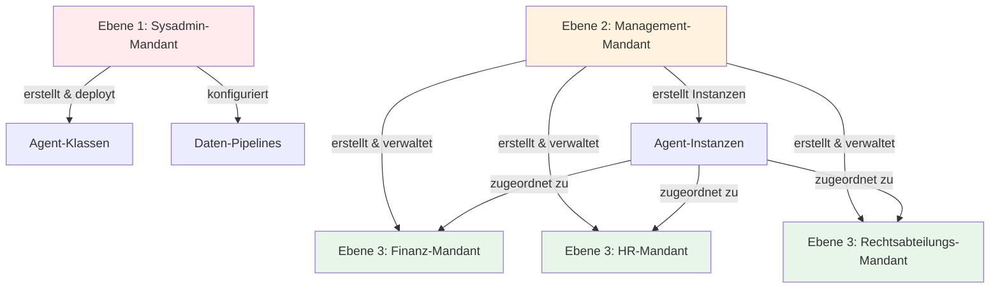

# Mandanten einrichten

Das Erstellen von Mandanten erfordert die Planung Ihrer Organisationsstruktur und das Verständnis dessen, was jede
Benutzergruppe tun können soll. Dieses Kapitel behandelt praktische Ansätze für das Mandanten-Design.

## Planung Ihrer Mandantenstruktur

Beginnen Sie damit, die Gruppen zu identifizieren, die getrennte Arbeitsbereiche benötigen. Häufige Muster:

- **Organisationshierarchie**: Systemadministratoren, Manager und Abteilungen erhalten jeweils einen eigenen Mandanten.
  Dies trennt technische Operationen von der Geschäftsverwaltung und der täglichen Arbeit.
- **Geschäftsbereiche**: Marketing, Vertrieb, Engineering und Operations erhalten jeweils einen Mandanten. Sie teilen
  einige Ressourcen (unternehmensweite Agents), haben aber bereichsspezifische Agents.
- **Kundenisolation**: Jeder Kunde erhält einen eigenen Mandanten. Dies ist nützlich für Service Provider oder
  SaaS-Deployments, bei denen Kunden niemals die Daten oder Agents anderer Kunden sehen dürfen.
- **Umgebungstrennung**: Entwicklung, Staging und Produktion laufen als separate Mandanten. Entwickler können im
  Entwicklungs-Mandanten experimentieren, ohne die Produktivnutzer zu beeinträchtigen.
- **Compliance-Grenzen**: Gesetzliche Anforderungen können eine Trennung zwischen Entitäten, geografischen Regionen oder
  Datenklassifikationen vorschreiben. Jede regulierte Grenze wird zu einem Mandanten.

## Das Drei-Ebenen-Muster

Die meisten Deployments profitieren von drei Mandanten-Ebenen:



### Ebene 1: Systemadministration

Erstellen Sie einen Mandanten für Personen, die die Plattforminfrastruktur warten. Diese Benutzer:

- Deployen Agent- und Prozesscode auf der Plattform
- Konfigurieren Daten-Pipelines für die Aufnahme von Dokumenten
- Verwalten Plattform-Services und Monitoring
- Haben vollen Zugriff auf alle Plattformfunktionen

Dies sind typischerweise 2-5 Personen: Ihr DevOps-Team, leitende Entwickler oder IT-Mitarbeiter, die für die Plattform
verantwortlich sind.

### Ebene 2: Geschäftsadministration

Erstellen Sie einen Mandanten für Personen, die die Plattform für Geschäftsanwender administrieren. Diese Benutzer:

- Erstellen und konfigurieren neue Mandanten
- Fügen Benutzer zu Mandanten hinzu und weisen Rollen zu
- Erstellen Agent-Instanzen aus bereitgestellten Klassen
- Überwachen die Agent-Performance und führen Evaluierungen durch
- Verwalten Wissensdatenbanken (Ingestionsstatus anzeigen, Probleme beheben)

Dies sind Business-Analysten, Projektmanager oder Abteilungsleiter, die die Bedürfnisse der Organisation verstehen, aber
keinen Code schreiben.

### Ebene 3: Endbenutzer

Erstellen Sie Mandanten für Personen, die Agents nutzen, um Aufgaben zu erledigen. Diese Benutzer:

- Chatten mit Agents, die für ihre Rolle relevant sind
- Nehmen an Prozessen teil, die ihre Abteilung betreffen
- Können administrative Schnittstellen nicht sehen oder Agent-Instanzen erstellen

Das sind alle anderen in Ihrer Organisation.

## Einen Mandanten erstellen

Navigieren Sie in der Admin-Oberfläche zu **Service** → **Mandanten**. Sie müssen sich in einem Mandanten befinden, der
administrative Zugriffsrechte auf den Mandantenservice hat.

Klicken Sie auf **Mandanten erstellen**. Sie benötigen drei Informationen:

- **Name**: Wählen Sie einen klaren und beschreibenden Namen. "Finanzabteilung", "Kunde - Acme Corp",
  "Produktionsumgebung". Benutzer sehen diesen Namen, wenn sie auswählen, in welchem Mandanten sie arbeiten möchten.
- **Beschreibung**: Erklären Sie, wofür dieser Mandant vorgesehen ist. "Benutzer der Finanzabteilung - Zugriff auf
  Finanzberichts-Agents und Abteilungsrichtlinien." Dies hilft sowohl aktuellen als auch zukünftigen Administratoren,
  den Zweck des Mandanten zu verstehen.
- **Geltungsbereich (Scope)**: Definieren Sie, auf welche Ressourcen dieser Mandant zugreifen kann. Für das
  Drei-Ebenen-Muster:
  - Sysadmin-Ebene: Voller Plattformzugriff
  - Management-Ebene: Administrative Services, aber keine Deployment-Fähigkeiten
  - Endbenutzer-Ebene: Spezifische Agents und Prozesse, keine Services

## Mandanten-Geltungsbereich definieren (Scoping)

Der Geltungsbereich eines Mandanten bestimmt den maximalen Zugriff, den jeder in diesem Mandanten haben kann. Stellen
Sie es sich wie das Ziehen einer Grenze um Ressourcen vor.

Für einen Mandanten der Finanzabteilung könnten Sie den Geltungsbereich wie folgt festlegen:

- Finanzbezogene Agents (Berichts-Agents, Richtlinien-Agents, Genehmigungs-Workflows)
- Finanz-Wissensdatenbanken (für Manager, die Ingestionsprobleme beheben)
- Spezifische Prozesse (Budgetgenehmigungs-Workflow, Spesenabrechnung)

Ein Benutzer im Finanz-Mandanten kann nicht auf HR-Agents zugreifen, selbst wenn Sie ihm eine Administratorrolle
innerhalb des Finanz-Mandanten zuweisen. Die Mandantengrenze verhindert dies.

### Breit anfangen vs. eng anfangen

Sie haben zwei Ansätze:

- **Breiter Geltungsbereich**: Geben Sie dem Mandanten anfänglich Zugriff auf alles. Benutzer können alle Agents, alle
  Services, alle Prozesse sehen. Wenn Sie erfahren, was sie tatsächlich benötigen, schränken Sie den Geltungsbereich
  ein, indem Sie den Zugriff auf ungenutzte Ressourcen entfernen.
- **Enger Geltungsbereich**: Geben Sie dem Mandanten nur Zugriff auf spezifische Ressourcen. Wenn Benutzer weitere
  Funktionen anfordern, erweitern Sie den Geltungsbereich schrittweise.

Ein breiter Geltungsbereich ist anfänglich einfacher, erfordert aber später mehr Bereinigung. Ein enger Geltungsbereich
ist sicherer, aber Benutzer werden den Zugriff anfordern, wenn sie Bedürfnisse entdecken.

Für Endbenutzer-Mandanten (Abteilungen, Kunden) beginnen Sie eng. Diese Benutzer benötigen keine breite Sichtbarkeit –
sie benötigen spezifische Tools. Für Management-Mandanten beginnen Sie breit, da diese Benutzer Flexibilität benötigen,
um die Plattform zu administrieren.

## Rollen innerhalb von Mandanten konfigurieren

Nachdem Sie den Mandanten erstellt haben, konfigurieren Sie Rollen, die Benutzer in diesem Mandanten haben können.
Rollen definieren, was Benutzer innerhalb der Grenzen des Mandanten tun können.

Für einen Abteilungs-Mandanten könnten Sie erstellen:

- **Standardbenutzer**: Kann mit Abteilungs-Agents chatten, an Prozessen teilnehmen, aber nichts erstellen oder ändern.
- **Teamleiter**: Kann Agent-Instanzen erstellen, Agents für sein Team konfigurieren, Evaluationsergebnisse anzeigen,
  aber keine Benutzer verwalten oder Mandanteneinstellungen ändern.
- **Abteilungsadministrator**: Volle Kontrolle innerhalb des Abteilungs-Mandanten – kann Benutzer hinzufügen, Rollen
  zuweisen, Agents erstellen und alle Abteilungsressourcen verwalten.

Diese Rollen gelten nur innerhalb dieses Mandanten. Ein Benutzer, der "Abteilungsadministrator" in der Finanzabteilung
ist, hat keine Privilegien im HR-Mandanten, es sei denn, diese wurden explizit gewährt.

## Benutzer zu Mandanten hinzufügen

Nachdem Sie Rollen erstellt haben, fügen Sie Benutzer dem Mandanten hinzu und weisen ihnen Rollen zu.

Suchen Sie Benutzer nach E-Mail oder Namen. Wenn ein Benutzer noch nicht existiert (er hat sich noch nicht angemeldet),
können Sie ihn trotzdem hinzufügen. Sein Profil wird erstellt, wenn er sich zum ersten Mal über Ihren Identitätsprovider
authentifiziert.

Benutzer können mehreren Mandanten angehören. Jemand könnte sein:

- Standardbenutzer in ihrem Abteilungs-Mandanten
- Teamleiter in einem funktionsübergreifenden Projekt-Mandanten
- Administrator in einem Test-Mandanten zum Ausprobieren neuer Funktionen

## Startverhalten des Mandanten

Wenn sich jemand zum ersten Mal anmeldet, tritt er automatisch dem Start-Mandanten bei (dem, den die Plattform beim
ersten Start initialisiert hat – siehe `AIHUB_STARTUP_TENANT_*`) mit Standard-Benutzerrollen. Konfigurieren Sie dieses
Verhalten mit Umgebungsvariablen:

```bash
AIHUB_USER_SIGNUP_DEFAULT_TENANT="default"
AIHUB_USER_SIGNUP_DEFAULT_ROLES="AIHubUser"
FIRST_AIHUB_USER_SIGNUP_DEFAULT_ROLES="AIHubAdmin"
```

Die erste Person, die sich anmeldet, erhält Administratorrollen, um sicherzustellen, dass jemand die Plattform sofort
administrieren kann. Nachfolgende Benutzer erhalten Standardrollen.

Diese automatische Zuweisung erfolgt nur einmal pro Benutzer. Danach müssen Sie sie bei Bedarf explizit zu anderen
Mandanten hinzufügen.

## Gängige Konfigurationen

### Einzelnes Unternehmen mit Abteilungen

Sysadmin-Mandant → Management-Mandant → Ein Mandant pro Abteilung

Manager erstellen Abteilungs-Mandanten und konfigurieren, auf welche Agents jede Abteilung zugreifen kann.
Abteilungsbenutzer sehen nur die Ressourcen ihrer Abteilung.

### Multi-Kunden SaaS

Sysadmin-Mandant → Management-Mandant → Ein Mandant pro Kunde

Jeder Kunden-Mandant ist isoliert. Kunden können die Agents oder Daten anderer Kunden nicht sehen. Manager onboarden
neue Kunden, indem sie einen Mandanten erstellen, relevante Agents konfigurieren und die Benutzer dieses Kunden
hinzufügen.

### Beratungsunternehmen

Sysadmin-Mandant → Management-Mandant → Ein Mandant pro Kundenprojekt

Projekt-Mandanten geben Beratern Zugang zu kundenspezifischen Agents und Wissen. Wenn ein Projekt endet, archivieren Sie
den Mandanten. Wenn ein Berater einem neuen Projekt beitritt, fügen Sie ihn dem Mandanten dieses Projekts hinzu.

### Entwicklungs-Workflow

Sysadmin-Mandant → Dev-Mandant → Staging-Mandant → Produktions-Mandant

Entwickler arbeiten im Dev-Mandanten mit gelockerten Kontrollen. Der Staging-Mandant spiegelt die Produktion für Tests
wider. Der Produktions-Mandant hat strenge Zugriffskontrollen. Dieselben Agents, derselbe Code, unterschiedliche
Mandanten für unterschiedliche Zwecke.

## Mandanten-Zustände

Da Mandanten in zwei Speichern leben – Keycloak (Gruppe unter `/tenants/<id>`, die Quelle der Wahrheit für die Existenz)
und dem Metadatenspeicher der Plattform (Anzeigename, Beschreibung, Zugriffsregeln) – können sie in drei Zuständen
beobachtet werden:

- **Aktiv**: Sowohl die Keycloak-Gruppe als auch die Metadaten sind vorhanden. Endbenutzer können den Mandanten
  erreichen.
- **Verwaist (Orphaned)**: Metadaten sind vorhanden, aber die Keycloak-Gruppe ist nicht mehr vorhanden (z. B. hat ein
  Operator die Gruppe außerband entfernt). Endbenutzer können den Mandanten nicht erreichen. Systemadministratoren sehen
  ihn als schreibgeschützt mit einer reinen Metadaten-Löschaktion.
- **Unkonfiguriert**: Die Keycloak-Gruppe existiert, aber es wurden keine Metadaten angehängt. Endbenutzer können den
  Mandanten noch nicht erreichen. Systemadministratoren sehen ihn im "Mandanten konfigurieren"-Workflow, wo das Anhängen
  von Metadaten ihn in den Status "Aktiv" versetzt.

Die Sysadmin-Mandantenadministrations-UI unter `/sysadmin/tenants/` zeigt alle drei Zustände an. Die Aktion "Mandanten
konfigurieren" hängt Metadaten an eine unkonfigurierte Gruppe an und ist der primäre Pfad, über den eine von einem
Operator erstellte Keycloak-Gruppe (z. B. für eine IDP-zu-Mandanten-Zuordnung) zu einem nutzbaren Mandanten wird.

## Mandanten-Lebenszyklus

Mandanten bleiben bestehen, bis sie explizit gelöscht werden. Sie können:

- **Einen Mandanten archivieren**: Entfernen Sie alle Benutzer, aber behalten Sie den Mandanten und seine Rollen bei.
  Nützlich für abgeschlossene Projekte oder inaktive Kunden. Niemand kann darauf zugreifen, aber die Konfiguration
  bleibt erhalten, falls Sie ihn reaktivieren müssen.
- **Einen Mandanten löschen**: Entfernen Sie die Metadaten des Mandanten von der Plattform. Die Keycloak-Gruppe selbst
  bleibt unberührt – die Bereinigung der Gruppe ist ein separater Schritt in der Keycloak-Admin-Konsole. Die Löschung
  ist auf der Metadaten-Seite dauerhaft.

::: warning Schutz des letzten Mandanten
Die Plattform erfordert, dass mindestens ein Mandant erhalten bleibt. Die Löschung wird blockiert, wenn dadurch das
System ohne verbleibende Mandanten wäre. Jeder Mandant – einschließlich desjenigen, den die Plattform beim ersten Start
initialisiert hat – kann gelöscht werden, solange mindestens ein anderer Mandant existiert. Der Start-Mandant trägt
keine Datenbank-Marker, die ihn von später konfigurierten Mandanten unterscheiden.
:::

## Praktische Tipps

::: tip Best Practices **Dokumentieren Sie Ihre Entscheidungen**: Halten Sie schriftlich fest, warum Sie jeden Mandanten erstellt haben und wie dessen Geltungsbereich sein soll.
Sechs Monate später, wenn sich Rollen geändert haben, verhindert diese Dokumentation Verwirrung.

**Beginnen Sie einfach**: Ein Management-Mandant und ein Endbenutzer-Mandant funktionieren für viele Organisationen.
Fügen Sie Komplexität nur hinzu, wenn Sie sie benötigen.

**Testen Sie mit eingeschränkten Benutzern**: Erstellen Sie ein Testkonto, fügen Sie es einem neuen Mandanten hinzu und
überprüfen Sie, was dieser Benutzer sehen kann. Nicht annehmen – verifizieren.

**Vierteljährliche Überprüfung**: Rollen ändern sich. Projekte enden. Neue Abteilungen entstehen. Ihre Mandantenstruktur
sollte sich mit Ihrer Organisation weiterentwickeln.

**Planen Sie für Wachstum**: "Kunde 1" funktioniert, wenn Sie drei Kunden haben. "Kunde - Acme Corp" funktioniert, wenn
Sie dreihundert haben.
:::
