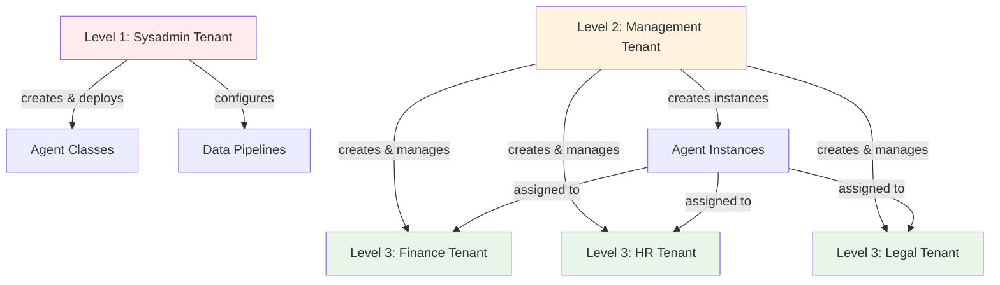

# Setting up tenants

Creating tenants requires planning your organizational structure and understanding what each group of users should be
able to do. This chapter walks through practical approaches to tenant design.

## Planning your tenant structure

Start by identifying the groups that need separated workspaces. Common patterns:

**Organizational hierarchy**: Sysadmins, managers, and departments each get their own tenant. This separates technical
operations from business administration from daily work.

**Business units**: Marketing, Sales, Engineering, Operations each get a tenant. They share some resources (company-wide
agents) but have unit-specific agents.

**Customer isolation**: Each customer gets their own tenant. Useful for service providers or SaaS deployments where
customers must never see each other's data or agents.

**Environment separation**: Development, staging, and production run as separate tenants. Developers can experiment in
the dev tenant without affecting production users.

**Compliance boundaries**: Legal requirements might mandate separation between entities, geographic regions, or data
classifications. Each regulated boundary becomes a tenant.

## The three-level pattern

Most deployments benefit from three levels of tenants:



### Level 1: System administration

Create a tenant for people who maintain the platform infrastructure. These users:

- Deploy agent and process code to the platform
- Configure data pipelines for ingesting documents
- Manage platform services and monitoring
- Have full access to all platform capabilities

This is typically 2-5 people: your DevOps team, lead developers, or IT staff responsible for the platform.

### Level 2: Business administration

Create a tenant for people who administer the platform for business users. These users:

- Create and configure new tenants
- Add users to tenants and assign roles
- Create agent instances from deployed classes
- Monitor agent performance and run evaluations
- Manage knowledge databases (view ingestion status, troubleshoot issues)

These are business analysts, project managers, or department heads who understand the organization's needs but don't
write code.

### Level 3: End users

Create tenants for people who use agents to accomplish work. These users:

- Chat with agents relevant to their role
- Participate in processes that involve their department
- Cannot see administrative interfaces or create agent instances

This is everyone else in your organization.

## Creating a tenant

Navigate to **Service** → **Tenants** in the admin interface. You must be in a tenant that has administrative access to
the tenant service.

Click **Create Tenant**. You need three pieces of information:

**Name**: Choose something clear and descriptive. "Finance Department", "Customer - Acme Corp", "Production
Environment". Users see this name when selecting which tenant to work in.

**Description**: Explain what this tenant is for. "Finance department users - access to financial reporting agents and
department guidelines." This helps both current and future administrators understand the tenant's purpose.

**Scope**: Define what resources this tenant can access. For the three-level pattern:

- Sysadmin level: Full platform access
- Management level: Administrative services but not deployment capabilities
- End user level: Specific agents and processes, no services

## Scoping tenants

The tenant's scope determines the maximum access anyone in that tenant can have. Think of it as drawing a boundary
around resources.

For a Finance department tenant, you might scope it to:

- Finance-related agents (reporting agents, guideline agents, approval workflows)
- Finance knowledge databases (for managers who troubleshoot ingestion issues)
- Specific processes (budget approval workflow, expense reporting)

A user in the Finance tenant cannot access HR agents even if you give them an admin role within Finance tenant. The
tenant boundary prevents it.

### Starting broad vs starting narrow

You have two approaches:

**Broad scope**: Give the tenant access to everything initially. Users can see all agents, all services, all processes.
As you learn what they actually need, narrow the scope by removing access to unused resources.

**Narrow scope**: Give the tenant access only to specific resources. As users request more capabilities, expand the
scope gradually.

Broad scope is easier initially but requires more cleanup later. Narrow scope is more secure but users will request
access as they discover needs.

For end-user tenants (departments, customers), start narrow. These users don't need wide visibility - they need specific
tools. For management tenants, start broad since these users need flexibility to administer the platform.

## Configuring roles within tenants

After creating the tenant, configure roles that users in that tenant can have. Roles define what users can do within the
tenant's boundaries.

For a department tenant, you might create:

**Standard User**: Can chat with department agents, participate in processes, but cannot create or modify anything.

**Team Lead**: Can create agent instances, configure agents for their team, view evaluation results, but cannot manage
users or change tenant settings.

**Department Admin**: Full control within the department tenant - can add users, assign roles, create agents, and manage
all department resources.

These roles only apply within this tenant. A user who is "Department Admin" in Finance has no privileges in the HR
tenant unless explicitly granted.

## Adding users to tenants

After creating roles, add users to the tenant and assign them roles.

Search for users by email or name. If a user doesn't exist yet (they haven't logged in), you can still add them. Their
profile will be created when they first authenticate through your identity provider.

Users can belong to multiple tenants. Someone might be:

- Standard user in their department tenant
- Team lead in a cross-functional project tenant
- Admin in a test tenant for trying out new features

## Startup tenant behavior

When someone logs in for the first time, they automatically join the startup tenant (the one the platform seeded on
first boot — see `AIHUB_STARTUP_TENANT_*`) with standard user roles. Configure this behavior with environment variables:

```bash
AIHUB_USER_SIGNUP_DEFAULT_TENANT="default"
AIHUB_USER_SIGNUP_DEFAULT_ROLES="AIHubUser"
FIRST_AIHUB_USER_SIGNUP_DEFAULT_ROLES="AIHubAdmin"
```

The first person to sign in receives admin roles, ensuring someone can administer the platform immediately. Subsequent
users receive standard roles.

This automatic assignment only happens once per user. After that, explicitly add them to other tenants as needed.

## Common configurations

### Single company with departments

Sysadmin tenant → Management tenant → One tenant per department

Managers create department tenants and configure which agents each department can access. Department users only see
their department's resources.

### Multi-customer SaaS

Sysadmin tenant → Management tenant → One tenant per customer

Each customer tenant is isolated. Customers cannot see other customers' agents or data. Managers onboard new customers
by creating a tenant, configuring relevant agents, and adding that customer's users.

### Consulting organization

Sysadmin tenant → Management tenant → One tenant per client project

Project tenants give consultants access to client-specific agents and knowledge. When a project ends, archive the
tenant. When a consultant joins a new project, add them to that project's tenant.

### Development workflow

Sysadmin tenant → Dev tenant → Staging tenant → Production tenant

Developers work in dev tenant with relaxed controls. Staging tenant mirrors production for testing. Production tenant
has strict access controls. Same agents, same code, different tenants for different purposes.

## Tenant states

Because tenants live in two stores — Keycloak (group under `/tenants/<id>`, the source of truth for existence) and the
platform's own metadata store (display name, description, access rules) — they can be observed in three states:

- **Active**: both the Keycloak group and the metadata are present. End users can reach the tenant.
- **Orphaned**: metadata is present but the Keycloak group is gone (e.g. an operator removed the group out of band). End
  users cannot reach the tenant. Sysadmins see it as read-only with a delete-metadata action only.
- **Unconfigured**: the Keycloak group exists but no metadata has been attached. End users cannot reach the tenant yet.
  Sysadmins see it in the "configure tenant" flow, where attaching metadata promotes it to Active.

The sysadmin tenant administration UI at `/sysadmin/tenants/` surfaces all three states. The configure-tenant action
attaches metadata to an Unconfigured group and is the primary path through which an operator-created Keycloak group
(e.g. for an IDP-to-tenant mapping) becomes a usable tenant.

## Tenant lifecycle

Tenants persist until explicitly deleted. You can:

**Archive a tenant**: Remove all users but keep the tenant and its roles. Useful for completed projects or inactive
customers. No one can access it but the configuration remains if you need to reactivate it.

**Delete a tenant**: Remove the platform's metadata for the tenant. The Keycloak group itself is left untouched —
cleanup of the group is a separate step in the Keycloak admin console. Deletion is permanent on the metadata side.

::: warning Last-Tenant Protection
The platform requires at least one tenant to remain. Deletion is blocked when it would leave the system with no
remaining tenants. Any tenant — including the one the platform seeded on first boot — can be deleted as long as at least
one other tenant exists. The startup tenant carries no database-level marker that distinguishes it from tenants
configured later.
:::

## Practical tips

::: tip Best Practices **Document your decisions**: Write down why you created each tenant and what its scope should be.
Six months later when roles have changed, this documentation prevents confusion.

**Start simple**: One management tenant and one end-user tenant works for many organizations. Add complexity only when
you need it.

**Test with restricted users**: Create a test account, add it to a new tenant, and verify what that user can see. Don't
assume - verify.

**Review quarterly**: People change roles. Projects end. New departments form. Your tenant structure should evolve with
your organization.

**Plan for growth**: "Customer 1" works when you have three customers. "Customer - Acme Corp" works when you have three
hundred.
:::
