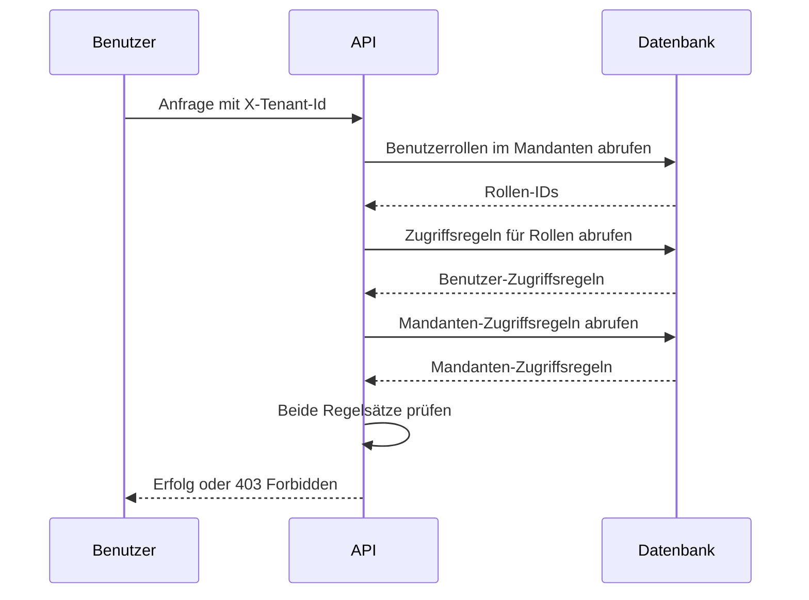

# Technische Referenz: Zugriffssteuerung

Dieses Kapitel dokumentiert die technischen Details, wie die Plattform die Zugriffssteuerung durchsetzt. Diese Informationen sind nützlich für Systemadministratoren, die Mandanten und Rollen konfigurieren, sowie für Entwickler, die die Plattform erweitern.

## Format der Zugriffsregeln

Zugriffsregeln verwenden ein hierarchisches Muster: `aihub.[user|admin].<service>.<resource>.<identifier>`

Beispiele:

```
aihub.user.agent.>                      # All agents (user access)
aihub.admin.agent.research.*            # All research agents (admin access)
aihub.user.knowledge.hr-docs.policies   # Specific knowledge namespace
aihub.admin.service.tenant              # Tenant management service
```

### Wildcards

**Einzelner Wildcard** (`*`) passt genau ein Segment:

- `agent.research.*` passt auf `agent.research.instance-1`, aber nicht auf `agent.research.team.instance-1`

**Mehrstufiger Wildcard** (`>`) passt auf ein oder mehrere Segmente am Ende:

- `agent.>` passt auf `agent.research.instance-1`, `agent.analysis.team.special` und jeden anderen Agent-Pfad
- Muss das letzte Token in der Regel sein

### Admin- vs. Benutzerregeln

Regeln, die mit `aihub.admin.*` beginnen, gewähren administrativen Zugriff. Benutzer mit Admin-Zugriff haben automatisch äquivalenten Benutzerzugriff.

Ein Benutzer mit `aihub.admin.agent.>` kann auf Ressourcen zugreifen, die entweder `aihub.admin.agent.*` oder `aihub.user.agent.*` erfordern.

## Berechtigungsauflösung

Wenn eine Anfrage eingeht, führt die Plattform Folgendes aus:

1. Extrahiert die Identität des Benutzers aus dem Authentifizierungs-Token
2. Liest den `X-Tenant-Id`-Header, um den Mandanten-Kontext zu bestimmen
3. Fragt die Rollen des Benutzers innerhalb dieses spezifischen Mandanten ab
4. Sammelt alle Zugriffsregeln aus diesen Rollen
5. Ruft die Zugriffsregeln des Mandanten ab
6. Prüft, ob sowohl der Mandant als auch der Benutzer die angeforderte Aktion erlauben



### Zweistufige Prüfung

Der Zugriff erfordert das Bestehen beider Schichten:

**Schicht 1: Mandantengrenze** – Erlaubt der Mandant diese Ressource überhaupt?

Wenn die Zugriffsregeln des Mandanten die angeforderte Ressource nicht enthalten, wird der Zugriff sofort verweigert, ohne die Benutzerrollen zu prüfen.

**Schicht 2: Benutzerberechtigungen** – Erlaubt die Rolle des Benutzers diese Aktion?

Nachdem bestätigt wurde, dass der Mandant die Ressource erlaubt, prüft das System, ob die Rollen des Benutzers die erforderliche Berechtigung gewähren.

Beide müssen bestanden werden, damit der Zugriff gewährt wird.

### Beispiel

Mandant hat: `aihub.user.agent.research.*`

Benutzer hat: `aihub.user.agent.>` (aus ihrer Rolle)

Benutzer fragt an: `aihub.user.agent.research.instance-1`

- Mandantenprüfung: ✓ (Mandant erlaubt Forschungs-Agents)
- Benutzerprüfung: ✓ (Benutzerrolle erlaubt alle Agents)
- Ergebnis: Zugriff gewährt

Benutzer fragt an: `aihub.user.agent.finance.instance-1`

- Mandantenprüfung: ✗ (Mandant erlaubt nur Forschungs-Agents)
- Ergebnis: Zugriff verweigert (Benutzerprüfung nicht evaluiert)

## Service-Level-Berechtigungen

Jeder Service erfordert eine Basisberechtigung: `aihub.user.service.<service-name>`

Bevor ressourcenspezifische Berechtigungen geprüft werden, verifiziert das System, ob der Benutzer Zugriff auf den Service selbst hat.

Um auf einen Agent zuzugreifen, benötigen Sie:

- Service-Zugriff: `aihub.user.service.agent`
- Ressourcen-Zugriff: `aihub.user.agent.<agent-class>.<agent-id>`

Wenn der Mandant keinen Service-Zugriff gewährt, sind keine Ressourcen in diesem Service zugänglich, unabhängig von anderen Regeln.

## Pfadparameter-Substitution

Berechtigungs-Templates verwenden Platzhalter, die aus der Anfrage aufgelöst werden:

Template: `aihub.user.agent.{agent_class}.{agent_id}`

Anfrage: `GET /api/v1/agents/research/instance-alpha`

Aufgelöste Berechtigung: `aihub.user.agent.research.instance-alpha`

Das System prüft diese konkrete Berechtigung gegen die Benutzer- und Mandanten-Zugriffsregeln.

## Zugriffsstufen

Das System gibt drei Stufen zurück:

**ACCESS_DENIED**: Keine Berechtigung. Gibt HTTP 403 zurück.

**ACCESS_USER**: Zugriff auf Benutzerebene zum Anzeigen und Interagieren mit der Ressource.

**ACCESS_ADMIN**: Zugriff auf Administratorebene zum Ändern, Konfigurieren oder Löschen der Ressource.

Controller können zwischen Benutzer- und Admin-Zugriff für Audit-Zwecke unterscheiden, obwohl viele Operationen nur prüfen, ob der Zugriff gewährt (nicht verweigert) wird.

## Konfiguration über Umgebungsvariablen

Konfigurieren Sie das Standardverhalten über Umgebungsvariablen:

```bash
# Default tenant created on first startup
AIHUB_DEFAULT_TENANT_NAME="Default Organization"
AIHUB_DEFAULT_TENANT_ACCESS_RULES="aihub.admin.>"

# Automatic user signup
AIHUB_USER_SIGNUP_DEFAULT_TENANT="default"
AIHUB_USER_SIGNUP_DEFAULT_ROLES="AIHubUser,AIHubAgentUser"
FIRST_AIHUB_USER_SIGNUP_DEFAULT_ROLES="AIHubAdmin"
```

## Sysadmin-Zugriff

Benutzer mit der Keycloak Realm-Rolle `AIHubSysAdmin` erhalten impliziten Admin-Zugriff auf jeden Mandanten und jede Ressource. Die oben beschriebene zweistufige Mandanten-/Benutzerprüfung wird umgangen – ein Sysadmin wird überall als Admin behandelt.

Sysadmins können auch ohne Mandanten-Kontext agieren, was Cross-Tenant-Endpunkte wie die Mandantenverwaltungs-UI ermöglicht. Jeder Sysadmin ist ein echter Keycloak-Benutzer mit einer echten Benutzer-ID, sodass ihre Aktionen in Langfuse nachvollziehbar bleiben und sie in Mandanten-Mitgliederlisten wie jeder andere Benutzer erscheinen.

Weisen Sie die `AIHubSysAdmin` Realm-Rolle in Keycloak direkt oder über Identity Provider Mapper zu. Die Plattform erstellt auch ein dediziertes Superuser-Konto aus `SUPERUSER_USERNAME` / `SUPERUSER_EMAIL` / `SUPERUSER_PASSWORD` und materialisiert `SUPERUSER_TOKEN` als Bearer-Token für diesen Benutzer, sodass interne Services die API ohne Browser-Session aufrufen können.

Sparsam verwenden – Sysadmin-Zugriff dient der Plattformadministration, nicht dem täglichen Betrieb.

## Validierungsregeln

::: warning Anforderungen an das Zugriffsregelformat
Beim Erstellen von Zugriffsregeln:

**Erforderliches Format**:

- Muss mit `aihub.user.` oder `aihub.admin.` beginnen
- Nur Kleinbuchstaben, Zahlen, Punkte, Bindestriche, Unterstriche, `*`, `>`
- Mehrstufiger Wildcard `>` nur am Ende

**Verboten**:

- Großbuchstaben
- Sonderzeichen außer `.`, `-`, `_`, `*`, `>`
- `>` in der Mitte einer Regel

Das System validiert Regeln beim Erstellen oder Bearbeiten von Mandanten und Rollen. Ungültige Regeln lösen einen Fehler mit dem spezifischen Problem aus.
:::

## Häufige Muster

### Umfassender Plattformzugriff

```
aihub.admin.>
```

Voller Admin-Zugriff auf alles. Für Sysadmin-Mandanten verwenden.

### Service-Administratoren

```
aihub.admin.service.user
aihub.admin.service.role
aihub.admin.service.tenant
```

Können Benutzer, Rollen und Mandanten verwalten, aber keine anderen Services.

### Abteilungszugriff

```
aihub.user.agent.department-finance.*
aihub.user.knowledge.finance-docs.>
aihub.user.process.finance-workflows.*
```

Zugriff nur auf finanzspezifische Ressourcen.

### Lesezugriff

```
aihub.user.agent.>
aihub.user.knowledge.>
```

Kann Agents und Knowledge anzeigen und verwenden, aber nicht erstellen oder ändern.

### Power-User

```
aihub.user.>
aihub.admin.agent.<department>.*
aihub.admin.knowledge.<department>-docs.>
```

Benutzerzugriff überall, Admin-Zugriff nur auf Abteilungsressourcen.

## Fehlerbehebung bei Zugriffsproblemen

::: details Checkliste zur Fehlerbehebung
Bei der Fehlerbehebung prüfen Sie diese Punkte der Reihe nach:

1. **Mandantenauswahl**: Überprüfen Sie, ob der Benutzer den beabsichtigten Mandanten ausgewählt hat
2. **Mandantengrenze**: Bestätigen Sie, dass die Zugriffsregeln des Mandanten die Ressource enthalten
3. **Benutzermitgliedschaft**: Überprüfen Sie, ob der Benutzer zum Mandanten gehört
4. **Rollenzuweisung**: Überprüfen Sie, ob der Benutzer Rollen in diesem Mandanten hat
5. **Rollenregeln**: Überprüfen Sie, was diese Rollen erlauben
6. **Service-Zugriff**: Überprüfen Sie, ob eine Service-Level-Berechtigung existiert

Die Plattform gibt detaillierte Fehlermeldungen zurück, die angeben, welche Berechtigung fehlgeschlagen ist. Verwenden Sie diese, um die fehlende Regel zu identifizieren.
:::

## Performance-Hinweise

Die Zugriffsprüfung ist optimiert:

- Regeln werden einmal pro Anfrage kompiliert
- Mehrere Berechtigungsprüfungen für denselben Benutzer verwenden die kompilierten Regeln wieder
- Komplexe Wildcard-Muster haben minimale Auswirkungen auf die Performance
- Rollenänderungen treten sofort ohne Cache-Verzögerungen in Kraft

Das Wechseln von Mandanten löst eine vollständige Cache-Invalidierung im Frontend aus, wodurch Daten neu abgerufen werden.
