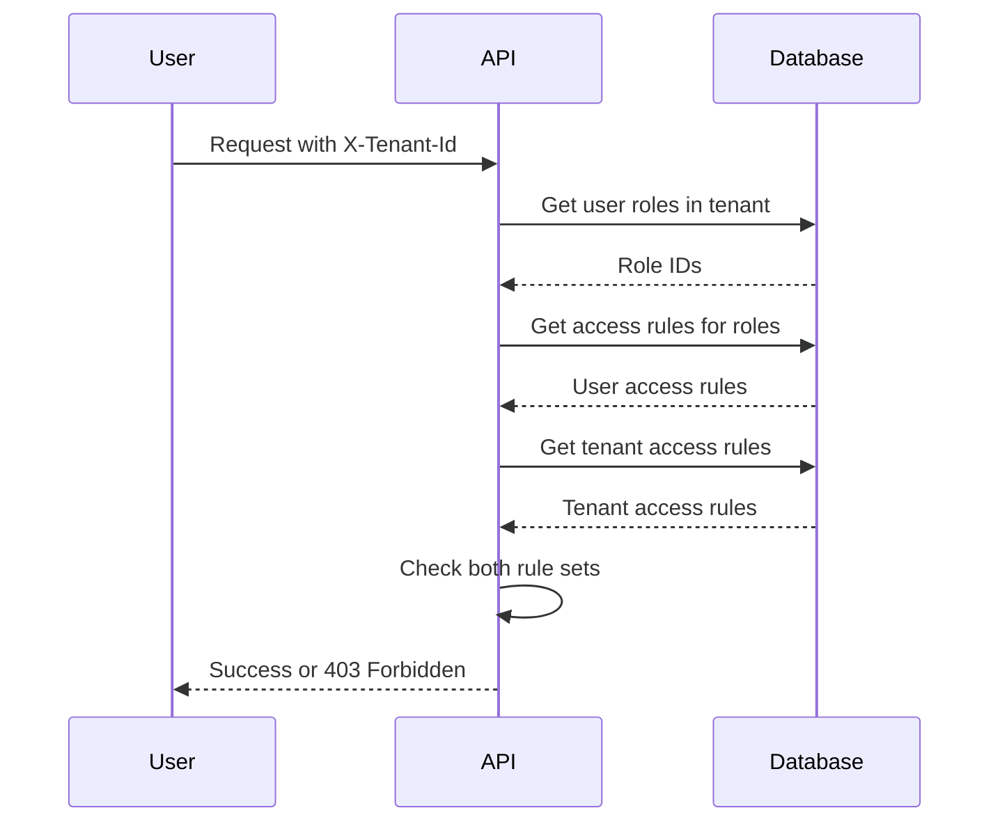

# Technische Referenz: Zugriffssteuerung

Dieses Kapitel dokumentiert die technischen Details, wie die Plattform die Zugriffssteuerung durchsetzt. Diese
Informationen sind nützlich für Systemadministratoren, die Mandanten und Rollen konfigurieren, sowie für Entwickler, die
die Plattform erweitern.

## Format der Zugriffsregeln

Zugriffsregeln verwenden ein hierarchisches Muster: `aihub.[user|admin].<service>.<resource>.<identifier>`

Beispiele:

```
aihub.user.agent.>                      # All agents (user access)
aihub.admin.agent.research.*            # All research agents (admin access)
aihub.user.knowledge.hr-docs.policies   # Specific knowledge namespace
aihub.admin.service.tenant              # Tenant management service
```

### Platzhalter

**Ein-Ebenen-Platzhalter** (`*`) stimmt mit genau einem Segment überein:

- `agent.research.*` stimmt mit `agent.research.instance-1` überein, aber nicht mit `agent.research.team.instance-1`

**Mehr-Ebenen-Platzhalter** (`>`) stimmt mit einem oder mehreren Segmenten am Ende überein:

- `agent.>` stimmt mit `agent.research.instance-1`, `agent.analysis.team.special` und jedem anderen Agent-Pfad überein
- Muss das letzte Token in der Regel sein

### Admin- vs. Benutzerregeln

Regeln, die mit `aihub.admin.*` beginnen, gewähren administrativen Zugriff. Benutzer mit Admin-Zugriff haben automatisch
gleichwertigen Benutzerzugriff.

Ein Benutzer mit `aihub.admin.agent.>` kann auf Ressourcen zugreifen, die entweder `aihub.admin.agent.*` oder
`aihub.user.agent.*` erfordern.

### Die Chat-Oberfläche ist eine separate Achse

Die oben genannten Regeln steuern die Plattform-API. Die Chat-Oberfläche hat ihre eigene Administratorrolle, die durch
die Keycloak-Realm-Rolle `AIHubSysAdmin` gewährt wird, und nicht durch eine Mandantenrolle oder Zugriffsregel. Das
Halten von `aihub.admin.*` in einem Mandanten macht Sie nicht zu einem Chat-Administrator, und ein Chat-Administrator zu
sein, gewährt keine Einsicht in die Uploads oder Konversationen anderer Benutzer – diese sind standardmäßig auf ihren
Eigentümer beschränkt. Siehe
[ADR: OpenWebUI-Administratoren auf eigene Dateien und Chats beschränken](/arc42/decisions/2026_09_07_openwebui_admin_scoped_to_own_data.md).

## Berechtigungsauflösung

Wenn eine Anfrage eingeht, führt die Plattform Folgendes aus:

1. Extrahiert die Identität des Benutzers aus dem Authentifizierungstoken
2. Liest den `X-Tenant-Id`-Header, um den Mandantenkontext zu bestimmen
3. Fragt die Rollen des Benutzers innerhalb dieses spezifischen Mandanten ab
4. Sammelt alle Zugriffsregeln aus diesen Rollen
5. Ruft die Zugriffsregeln des Mandanten ab
6. Überprüft, ob sowohl der Mandant als auch der Benutzer die angeforderte Aktion zulassen



### Zweischichtige Überprüfung

Der Zugriff erfordert das Bestehen beider Schichten:

**Schicht 1: Mandantengrenze** – Erlaubt der Mandant diese Ressource überhaupt?

Wenn die Zugriffsregeln des Mandanten die angeforderte Ressource nicht enthalten, wird der Zugriff sofort verweigert,
ohne die Benutzerrollen zu überprüfen.

**Schicht 2: Benutzerberechtigungen** – Erlaubt die Rolle des Benutzers diese Aktion?

Nachdem bestätigt wurde, dass der Mandant die Ressource zulässt, überprüft das System, ob die Rollen des Benutzers die
erforderliche Berechtigung gewähren.

Beide müssen bestanden werden, damit der Zugriff gewährt wird.

### Beispiel

Mandant hat: `aihub.user.agent.research.*`

Benutzer hat: `aihub.user.agent.>` (aus seiner Rolle)

Benutzeranfrage: `aihub.user.agent.research.instance-1`

- Mandantenprüfung: ✓ (Mandant erlaubt Forschungs-Agents)
- Benutzerprüfung: ✓ (Benutzerrolle erlaubt alle Agents)
- Ergebnis: Zugriff gewährt

Benutzeranfrage: `aihub.user.agent.finance.instance-1`

- Mandantenprüfung: ✗ (Mandant erlaubt nur Forschungs-Agents)
- Ergebnis: Zugriff verweigert (Benutzerprüfung nicht ausgewertet)

## Berechtigungen auf Service-Ebene

Jeder Service erfordert eine Basisberechtigung: `aihub.user.service.<service-name>`

Bevor ressourcenspezifische Berechtigungen überprüft werden, verifiziert das System, ob der Benutzer Zugriff auf den
Service selbst hat.

Um auf einen Agent zuzugreifen, benötigen Sie:

- Service-Zugriff: `aihub.user.service.agent`
- Ressourcenzugriff: `aihub.user.agent.<agent-class>.<agent-id>`

Wenn der Mandant keinen Service-Zugriff gewährt, sind keine Ressourcen in diesem Service zugänglich, unabhängig von
anderen Regeln.

## Pfadparameter-Substitution

Berechtigungsvorlagen verwenden Platzhalter, die aus der Anfrage aufgelöst werden:

Template: `aihub.user.agent.{agent_class}.{agent_id}`

Request: `GET /api/v1/agents/research/instance-alpha`

Resolved permission: `aihub.user.agent.research.instance-alpha`

Das System überprüft diese konkrete Berechtigung anhand der Benutzer- und Mandanten-Zugriffsregeln.

## Zugriffsstufen

Das System gibt drei Stufen zurück:

**ACCESS_DENIED**: Keine Berechtigung. Gibt HTTP 403 zurück.

**ACCESS_USER**: Benutzerzugriff zum Anzeigen und Interagieren mit der Ressource.

**ACCESS_ADMIN**: Admin-Zugriff zum Ändern, Konfigurieren oder Löschen der Ressource.

Controller können zwischen Benutzer- und Admin-Zugriff für Audit-Zwecke unterscheiden, obwohl viele Operationen nur
prüfen, ob der Zugriff gewährt wird (nicht verweigert).

## Konfiguration über Umgebungsvariablen

Konfigurieren Sie das Standardverhalten über Umgebungsvariablen:

```bash
# Start-Mandant (wird beim ersten Start eingerichtet; danach ein gewöhnlicher Mandant)
# ACCESS_RULES leer lassen, um die Obergrenze aus den Modellen dieser Instanz abzuleiten,
# abzüglich AIHUB_TENANT_DEFAULT_ACCESS_EXCLUDED_MODELS. "aihub.admin.>" setzen für
# uneingeschränkten Zugriff; das überspringt zugleich die Modell-Gateway-Abfrage beim ersten Start.
AIHUB_STARTUP_TENANT_NAME="Swiss AI Hub"
AIHUB_STARTUP_TENANT_ACCESS_RULES=""
AIHUB_TENANT_DEFAULT_ACCESS_EXCLUDED_MODELS="text-generation/Apertus-70B-Instruct-2509"

# Automatische Benutzerregistrierung
AIHUB_USER_SIGNUP_DEFAULT_TENANT="default"
AIHUB_USER_SIGNUP_DEFAULT_ROLES="AIHubUser,AIHubAgentUser"
FIRST_AIHUB_USER_SIGNUP_DEFAULT_ROLES="AIHubAdmin"
```

## Sysadmin-Zugriff

Benutzer mit der Keycloak-Realm-Rolle `AIHubSysAdmin` erhalten impliziten Admin-Zugriff auf jeden Mandanten und jede
Ressource. Die oben beschriebene zweistufige Mandanten-/Benutzerprüfung wird umgangen – ein Sysadmin wird überall als
Admin behandelt.

Sysadmins können auch ohne Mandantenkontext agieren, was mandantenübergreifende Endpunkte wie die
Mandantenverwaltungs-UI ermöglicht. Jeder Sysadmin ist ein echter Keycloak-Benutzer mit einer echten Benutzer-ID, sodass
seine Aktionen in Langfuse nachvollziehbar bleiben und sie in Mandantenmitgliederlisten wie jeder andere Benutzer
erscheinen.

Weisen Sie die `AIHubSysAdmin`-Realm-Rolle in Keycloak direkt oder über Identitätsanbieter-Mapper zu. Die Plattform
richtet auch ein dediziertes Superuser-Konto aus `SUPERUSER_EMAIL` / `SUPERUSER_PASSWORD` ein (der Benutzername wird
gleich `SUPERUSER_EMAIL` gesetzt, sodass sich dieses Konto mit seiner E-Mail-Adresse anmeldet) und materialisiert
`SUPERUSER_TOKEN` als Bearer-Token für diesen Benutzer, damit interne Services die API ohne Browsersitzung aufrufen
können.

Sparsam verwenden — Sysadmin-Zugriff ist für die Plattformadministration gedacht, nicht für den täglichen Betrieb.

## Validierungsregeln

::: warning Anforderungen an das Format der Zugriffsregeln
Beim Erstellen von Zugriffsregeln:

**Erforderliches Format**:

- Muss mit `aihub.user.` oder `aihub.admin.` beginnen.
- Nur Kleinbuchstaben, Zahlen, Punkte, Bindestriche, Unterstriche, `*`, `>` sind erlaubt.
- Mehr-Ebenen-Platzhalter `>` nur am Ende.

**`>` erfasst die eigene Wurzel nicht**:

`aihub.admin.knowledge.>` erfasst `aihub.admin.knowledge.hr-docs`, aber **nicht** das blosse `aihub.admin.knowledge` —
`>` verlangt mindestens ein weiteres Segment. Einige Berechtigungen sind genau deshalb auf einer blossen Wurzel
abgesichert, weil die Ressource noch nicht existiert: das Erstellen einer Wissensdatenbank wird gegen
`aihub.admin.knowledge` geprüft, denn eine noch nicht erstellte Datenbank kann von keiner Regel benannt werden. Ein
Regelsatz, der beides abdecken soll, muss beide Formen führen — deshalb wird `AIHubKnowledgeAdmin` mit
`aihub.admin.knowledge` *und* `aihub.admin.knowledge.>` angelegt. Das gilt für Mandanten-Obergrenzen ebenso wie für
Rollen: eine Obergrenze, die nur die `.>`-Form enthält, kappt die Wurzel-Berechtigung für jede Rolle im Mandanten.

**Verboten**:

- Großbuchstaben
- Sonderzeichen außer `.`, `-`, `_`, `*`, `>`
- `>` mitten in einer Regel

Das System validiert Regeln beim Erstellen oder Bearbeiten von Mandanten und Rollen. Ungültige Regeln lösen einen Fehler
mit dem spezifischen Problem aus.
:::

## Gängige Muster

### Breiter Plattformzugriff

```
aihub.admin.>
```

Voller Admin-Zugriff auf alles. Verwenden Sie dies für Sysadmin-Mandanten.

### Service-Administratoren

```
aihub.admin.service.user
aihub.admin.service.role
aihub.admin.service.tenant
```

Können Benutzer, Rollen und Mandanten verwalten, aber keine anderen Services.

### Abteilungszugriff

```
aihub.user.agent.department-finance.*
aihub.user.knowledge.finance-docs.>
aihub.user.process.finance-workflows.*
```

Zugriff nur auf finanzspezifische Ressourcen.

### Lesezugriff

```
aihub.user.agent.>
aihub.user.knowledge.>
```

Kann Agents und Wissen anzeigen und nutzen, aber nicht erstellen oder ändern.

### Power-Benutzer

```
aihub.user.>
aihub.admin.agent.<department>.*
aihub.admin.knowledge.<department>-docs.>
```

Benutzerzugriff überall, Admin-Zugriff nur auf Abteilungsressourcen.

## Fehlerbehebung bei Zugriffsproblemen

::: details Checkliste zur Fehlerbehebung
Bei der Fehlerbehebung überprüfen Sie diese Punkte der Reihe nach:

1. **Mandantenauswahl**: Verifizieren Sie, dass der Benutzer den beabsichtigten Mandanten ausgewählt hat
2. **Mandantengrenze**: Bestätigen Sie, dass die Zugriffsregeln des Mandanten die Ressource enthalten
3. **Benutzerzugehörigkeit**: Verifizieren Sie, dass der Benutzer dem Mandanten angehört
4. **Rollenzuweisung**: Prüfen Sie, ob der Benutzer Rollen in diesem Mandanten hat
5. **Rollenregeln**: Überprüfen Sie, was diese Rollen erlauben
6. **Service-Zugriff**: Verifizieren Sie, dass eine Berechtigung auf Service-Ebene existiert

Die Plattform gibt detaillierte Fehlermeldungen zurück, die angeben, welche Berechtigung fehlgeschlagen ist. Verwenden
Sie dies, um die fehlende Regel zu identifizieren.
:::

## Leistungshinweise

Die Zugriffsprüfung ist optimiert:

- Regeln werden einmal pro Anfrage kompiliert
- Mehrere Berechtigungsprüfungen für denselben Benutzer verwenden die kompilierten Regeln wieder
- Komplexe Platzhalter-Muster haben minimale Auswirkungen auf die Leistung
- Rollenänderungen treten sofort ohne Cache-Verzögerungen in Kraft

Das Wechseln von Mandanten löst eine vollständige Cache-Invalidierung im Frontend aus, wodurch Daten neu abgerufen
werden.
