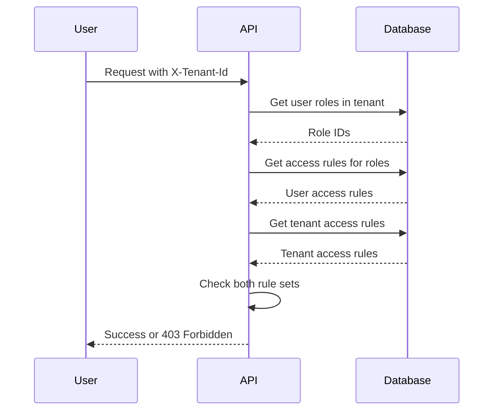

# Technical reference: Access control

This chapter documents the technical details of how the platform enforces access control. This information is useful for
system administrators configuring tenants and roles, and for developers extending the platform.

## Access rule format

Access rules use a hierarchical pattern: `aihub.[user|admin].<service>.<resource>.<identifier>`

Examples:

```
aihub.user.agent.>                      # All agents (user access)
aihub.admin.agent.research.*            # All research agents (admin access)
aihub.user.knowledge.hr-docs.policies   # Specific knowledge namespace
aihub.admin.service.tenant              # Tenant management service
```

### Wildcards

**Single-level** (`*`) matches exactly one segment:

- `agent.research.*` matches `agent.research.instance-1` but not `agent.research.team.instance-1`

**Multi-level** (`>`) matches one or more segments at the end:

- `agent.>` matches `agent.research.instance-1`, `agent.analysis.team.special`, and any other agent path
- Must be the last token in the rule

### Admin vs user rules

Rules starting with `aihub.admin.*` grant administrative access. Users with admin access automatically have equivalent
user access.

A user with `aihub.admin.agent.>` can access resources requiring either `aihub.admin.agent.*` or `aihub.user.agent.*`.

## Permission resolution

When a request arrives, the platform:

1. Extracts the user's identity from the authentication token
2. Reads the `X-Tenant-Id` header to determine the tenant context
3. Queries the user's roles within that specific tenant
4. Collects all access rules from those roles
5. Retrieves the tenant's access rules
6. Checks if both the tenant and the user permit the requested action



### Two-layer checking

Access requires passing both layers:

**Layer 1: Tenant boundary** - Does the tenant allow this resource at all?

If the tenant's access rules don't include the requested resource, access is denied immediately without checking user
roles.

**Layer 2: User permissions** - Does the user's role permit this action?

After confirming the tenant allows the resource, the system checks if the user's roles grant the required permission.

Both must pass for access to be granted.

### Example

Tenant has: `aihub.user.agent.research.*`

User has: `aihub.user.agent.>` (from their role)

User requests: `aihub.user.agent.research.instance-1`

- Tenant check: ✓ (tenant allows research agents)
- User check: ✓ (user role allows all agents)
- Result: Access granted

User requests: `aihub.user.agent.finance.instance-1`

- Tenant check: ✗ (tenant only allows research agents)
- Result: Access denied (user check not evaluated)

## Service-level permissions

Each service requires a base permission: `aihub.user.service.<service-name>`

Before checking resource-specific permissions, the system verifies the user has access to the service itself.

To access an agent, you need:

- Service access: `aihub.user.service.agent`
- Resource access: `aihub.user.agent.<agent-class>.<agent-id>`

If the tenant doesn't grant service access, no resources in that service are accessible regardless of other rules.

## Path parameter substitution

Permission templates use placeholders that resolve from the request:

Template: `aihub.user.agent.{agent_class}.{agent_id}`

Request: `GET /api/v1/agents/research/instance-alpha`

Resolved permission: `aihub.user.agent.research.instance-alpha`

The system checks this concrete permission against the user and tenant access rules.

## Access levels

The system returns three levels:

**ACCESS_DENIED**: No permission. Returns HTTP 403.

**ACCESS_USER**: User-level access to view and interact with the resource.

**ACCESS_ADMIN**: Admin-level access to modify, configure, or delete the resource.

Controllers can differentiate between user and admin access for audit purposes, though many operations only check
whether access is granted (not denied).

## Configuration through environment

Configure default behavior through environment variables:

```bash
# Default tenant created on first startup
AIHUB_DEFAULT_TENANT_NAME="Default Organization"
AIHUB_DEFAULT_TENANT_ACCESS_RULES="aihub.admin.>"

# Automatic user signup
AIHUB_USER_SIGNUP_DEFAULT_TENANT="default"
AIHUB_USER_SIGNUP_DEFAULT_ROLES="AIHubUser,AIHubAgentUser"
FIRST_AIHUB_USER_SIGNUP_DEFAULT_ROLES="AIHubAdmin"
```

## Sysadmin access

Users with the Keycloak realm role `AIHubSysAdmin` receive implicit admin access across every tenant and every resource.
This is implemented in `AccessChecker.access_level()` — when `UserIdentity.is_sys_admin=True` the method short-circuits
and returns `ACCESS_ADMIN` without evaluating tenant or user access rules. The two-stage check described above does not
apply to sysadmins.

Key behaviors:

- **No `UserTenantRoleEntity` rows required**: sysadmins bypass membership checks. The auth pipeline's
  `_resolve_tenant_by_id` and `_resolve_active_tenant` paths skip the membership lookup when the principal is a
  sysadmin.
- **May act with `acting_within_tenant=None`**: cross-tenant sysadmin endpoints (e.g. the tenant administration UI) do
  not require a tenant context.
- **Real Keycloak users only**: there is no synthetic "virtual tenant" or static OID anymore. Every authenticated
  request resolves to a real Keycloak user with a real id, traceable through Langfuse and visible in tenant member
  listings (per the tenant-scoped Superuser membership rule, see related ADR).
- **Sysadmin endpoints**: gated by `Security(self.sys_admin_user())` from the `Controller` base class, which checks
  `UserIdentity.is_sys_admin` and returns 403 otherwise. There is no separate sysadmin auth handler.

Assign the `AIHubSysAdmin` realm role in Keycloak directly or via identity provider mappers. The platform also seeds a
real Keycloak user from `SUPERUSER_USERNAME`/`SUPERUSER_EMAIL`/`SUPERUSER_PASSWORD` in the realm import and materializes
`SUPERUSER_TOKEN` as a regular bearer token bound to that user; both are operator-supplied conveniences, neither is a
synthetic identity.

Use sparingly — sysadmin access exists for platform administration, not regular operations.

## Validation rules

::: warning Access Rule Format Requirements
When creating access rules:

**Required format**:

- Must start with `aihub.user.` or `aihub.admin.`
- Only lowercase letters, numbers, dots, hyphens, underscores, `*`, `>`
- Multi-level wildcard `>` only at the end

**Prohibited**:

- Uppercase letters
- Special characters other than `.`, `-`, `_`, `*`, `>`
- `>` in the middle of a rule

The system validates rules when creating or editing tenants and roles. Invalid rules trigger an error with the specific
problem.
:::

## Common patterns

### Broad platform access

```
aihub.admin.>
```

Full admin access to everything. Use for sysadmin tenants.

### Service administrators

```
aihub.admin.service.user
aihub.admin.service.role
aihub.admin.service.tenant
```

Can manage users, roles, and tenants but not other services.

### Department access

```
aihub.user.agent.department-finance.*
aihub.user.knowledge.finance-docs.>
aihub.user.process.finance-workflows.*
```

Access to finance-specific resources only.

### Read-only access

```
aihub.user.agent.>
aihub.user.knowledge.>
```

Can view and use agents and knowledge but cannot create or modify.

### Power user

```
aihub.user.>
aihub.admin.agent.<department>.*
aihub.admin.knowledge.<department>-docs.>
```

User access everywhere, admin access only to department resources.

## Debugging access issues

::: details Troubleshooting Checklist
When troubleshooting, check these in order:

1. **Tenant selection**: Verify the user selected the intended tenant
2. **Tenant boundary**: Confirm the tenant's access rules include the resource
3. **User membership**: Verify the user belongs to the tenant
4. **Role assignment**: Check the user has roles in that tenant
5. **Role rules**: Review what those roles permit
6. **Service access**: Verify service-level permission exists

The platform returns detailed error messages indicating which permission failed. Use this to identify the missing rule.
:::

## Performance notes

Access checking is optimized:

- Rules are compiled once per request
- Multiple permission checks for the same user reuse the compiled rules
- Complex wildcard patterns have minimal performance impact
- Role changes take effect immediately without cache delays

Switching tenants triggers a full cache invalidation in the frontend, causing data to be refetched.
