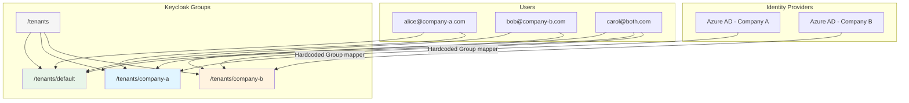

# IDP-basierte Mandantenzuweisung

Standardmässig werden alle Benutzer, die sich auf der Plattform anmelden, automatisch dem **Standard-Mandanten**
zugewiesen. Administratoren fügen dann Benutzer manuell über die Keycloak-Admin-Konsole zu zusätzlichen Mandanten hinzu.
Dies funktioniert gut für kleine Deployments, wird jedoch unpraktisch, wenn Sie mehrere Organisationen haben, von denen
jede über einen eigenen Identity Provider authentifiziert.

Die IDP-basierte Mandantenzuweisung automatisiert diesen Prozess. Wenn sich ein Benutzer über einen bestimmten Identity
Provider authentifiziert, weist Keycloak ihn automatisch dem entsprechenden Mandanten zu. Ein Benutzer, der sich über
die Azure AD App-Registrierung von Firma A anmeldet, tritt dem Mandanten von Firma A bei. Derselbe Benutzer, der sich
über die App-Registrierung von Firma B anmeldet, tritt ebenfalls dem Mandanten von Firma B bei. Beide Mitgliedschaften
bleiben bestehen – sie kumulieren sich, anstatt sich gegenseitig zu ersetzen.

::: warning IDP-basierte Mandantenzuweisung muss speziell eingerichtet werden
Die IDP-zu-Mandant-Zuordnung ist standardmässig nicht aktiviert. Es ist eine Funktion, die das Installationsteam pro
Deployment konfiguriert. Das Standardverhalten ist die manuelle Mandantenzuweisung über die Keycloak-Admin-Konsole.
:::

## Funktionsweise

Mandantenmitgliedschaften in Keycloak werden als **Gruppenmitgliedschaften** gespeichert. Jeder Mandant hat eine
entsprechende Gruppe unter der übergeordneten Gruppe `/tenants/` in Keycloak. Wenn ein Benutzer zu `/tenants/company-a`
gehört, weiss die Plattform, dass er Mitglied der Firma A ist.



Ein **Group Membership-Protokollmapper** im `tenants`-Client-Scope fügt diese Gruppenmitgliedschaften als einen
`tenants`-Claim in das OIDC-Token ein:

```json
{
  "tenants": ["/tenants/default", "/tenants/company-a"]
}
```

Die Anwendung liest diesen Claim, um festzustellen, zu welchen Mandanten der Benutzer gehört.

## Standard-Mandantenzuweisung

::: info Jeder Benutzer erhält den Standard-Mandanten
Die Gruppe `/tenants/default` ist als **Keycloak-Standardgruppe** konfiguriert. Jeder neue Benutzer – unabhängig davon,
wie er sich authentifiziert – wird beim ersten Login automatisch dieser Gruppe hinzugefügt.

Das bedeutet, dass alle Benutzer zunächst Zugriff auf den Standard-Mandanten haben. Für die grundlegende Nutzung ist
keine manuelle Zuweisung erforderlich.
:::

Der Standard-Mandant bietet typischerweise Zugriff auf gemeinsam genutzte, unternehmensweite Agents und Ressourcen.
Benutzer, die Zugriff auf zusätzliche Mandanten benötigen, werden entweder manuell von Administratoren zugewiesen oder
automatisch durch IDP-basierte Zuordnung.

## Einrichtung der IDP-zu-Mandant-Zuordnung

Die IDP-zu-Mandant-Zuordnung ist standardmässig nicht aktiviert. Es ist eine Funktion, die das Installationsteam pro
Deployment konfiguriert. Das Standardverhalten ist die manuelle Mandantenzuweisung über die Keycloak-Admin-Konsole.

### Voraussetzungen

Bevor Sie die IDP-zu-Mandant-Zuordnung konfigurieren:

1. Erstellen Sie die Mandantengruppe in Keycloak unter `/tenants/` (z.B. `/tenants/company-a`)
2. Erstellen Sie den entsprechenden Mandanten in der Swiss AI Hub Anwendung
3. Konfigurieren Sie den Identity Provider in Keycloak mit den Anmeldeinformationen der Azure AD App-Registrierung des
   Kunden

### Option 1: Hardcoded Group Mapping (ein IDP = ein Mandant)

Dies ist der einfachste Ansatz. Jeder Benutzer, der sich über einen bestimmten Identity Provider authentifiziert, wird
automatisch einem bestimmten Mandanten zugewiesen. Verwenden Sie dies, wenn jede Azure AD App-Registrierung eine
separate Organisation oder einen separaten Kunden repräsentiert.

Fügen Sie einen **Hardcoded Group** IDP-Mapper zum Identity Provider hinzu:

```json
{
  "name": "tenant-mapper-company-a",
  "identityProviderAlias": "azure-ad-company-a",
  "identityProviderMapper": "oidc-hardcoded-group-idp-mapper",
  "config": {
    "syncMode": "INHERIT",
    "group": "/tenants/company-a"
  }
}
```

Dieser Mapper wird jedes Mal ausgeführt, wenn sich ein Benutzer über `azure-ad-company-a` authentifiziert. Er fügt den
Benutzer zu `/tenants/company-a` hinzu, ohne bestehende Gruppenmitgliedschaften zu entfernen.

::: tip Warum Gruppen statt Attribute?
Die Attribut-IDP-Mapper von Keycloak **überschreiben** Werte bei jedem Login. Wenn sich ein Benutzer über IDP-A anmeldet
und `tenant = company-a` erhält, und sich dann über IDP-B anmeldet, ändert sich das Attribut auf `tenant = company-b` –
die erste Zuweisung geht verloren.

Gruppenmitgliedschaften sind **additiv**. Der Hardcoded Group Mapper fügt den Benutzer einer Gruppe hinzu, ohne ihn aus
anderen Gruppen zu entfernen. Deshalb verwendet die Mandantenzuweisung Gruppen, nicht Benutzerattribute.
:::

::: warning Mapper Provider ID
Die Keycloak Provider ID für den Hardcoded Group IDP-Mapper ist `oidc-hardcoded-group-idp-mapper` (mit dem Präfix
`oidc-`). Die Verwendung von `hardcoded-group-idp-mapper` (ohne Präfix) führt zu einer `NullPointerException` während
des IDP-Logins.
:::

#### Mehrere IDPs, mehrere Mandanten

Wenn Sie drei Azure AD App-Registrierungen haben (eine pro Kunde), konfigurieren Sie jede mit ihrem eigenen Hardcoded
Group Mapper:

| Identity Provider    | Hardcoded Group Mapper    | Mandantengruppe      |
| -------------------- | ------------------------- | -------------------- |
| `azure-ad-company-a` | `tenant-mapper-company-a` | `/tenants/company-a` |
| `azure-ad-company-b` | `tenant-mapper-company-b` | `/tenants/company-b` |
| `azure-ad-company-c` | `tenant-mapper-company-c` | `/tenants/company-c` |

Ein Benutzer mit derselben E-Mail-Adresse über alle drei App-Registrierungen hinweg wird (über den ersten
Broker-Login-Flow) zu einem einzigen Keycloak-Konto zusammengeführt und akkumuliert alle drei Mandantenmitgliedschaften
plus den Standard-Mandanten.

### Option 2: Claim-basierte Gruppen-Zuordnung (Gruppen vom IDP bestimmen den Mandanten)

Manchmal möchten Sie keine pauschale Zuordnung von „jeder von diesem IDP tritt diesem Mandanten bei“. Stattdessen
möchten Sie basierend auf einem Claim vom Identity Provider zuordnen – zum Beispiel Azure AD Gruppenmitgliedschaften.

Verwenden Sie einen **Advanced Claim to Group** IDP-Mapper, um einen spezifischen Claim-Wert einer Mandantengruppe
zuzuordnen:

```json
{
  "name": "tenant-mapper-finance-group",
  "identityProviderAlias": "azure-ad",
  "identityProviderMapper": "oidc-advanced-group-idp-mapper",
  "config": {
    "syncMode": "INHERIT",
    "claims": "[{\"key\": \"groups\", \"value\": \"finance-department-group-id\"}]",
    "group": "/tenants/finance"
  }
}
```

Dieser Mapper prüft, ob der `groups`-Claim von Azure AD `finance-department-group-id` enthält. Wenn ja, wird der
Benutzer zu `/tenants/finance` zugewiesen.

::: warning Azure AD Gruppen-Claims erfordern Konfiguration
Standardmässig enthält Azure AD keine Gruppenmitgliedschaften im ID-Token. Sie müssen dies in der Azure AD
App-Registrierung konfigurieren:

1. Gehen Sie zu **Tokenkonfiguration** im Azure-Portal
2. Klicken Sie auf **Gruppen-Claim hinzufügen**
3. Wählen Sie **Sicherheitsgruppen** (oder **Alle Gruppen**)
4. Stellen Sie unter **Token-Eigenschaften nach Typ anpassen** sicher, dass das **ID**-Token Gruppen enthält
5. Hinweis: Azure AD sendet Gruppen-**Objekt-IDs** (UUIDs), nicht Gruppennamen. Verwenden Sie die Objekt-ID als
   Claim-Wert im Mapper.
:::

#### Zuordnung mehrerer Azure AD Gruppen zu Mandanten

Sie können mehrere Advanced Claim to Group Mapper auf demselben Identity Provider hinzufügen, wobei jeder eine andere
Azure AD Gruppe einem anderen Mandanten zuordnet:

```json
[
  {
    "name": "tenant-mapper-finance",
    "identityProviderAlias": "azure-ad",
    "identityProviderMapper": "oidc-advanced-group-idp-mapper",
    "config": {
      "syncMode": "INHERIT",
      "claims": "[{\"key\": \"groups\", \"value\": \"aaaaaaaa-bbbb-cccc-dddd-eeeeeeeeeeee\"}]",
      "group": "/tenants/finance"
    }
  },
  {
    "name": "tenant-mapper-legal",
    "identityProviderAlias": "azure-ad",
    "identityProviderMapper": "oidc-advanced-group-idp-mapper",
    "config": {
      "syncMode": "INHERIT",
      "claims": "[{\"key\": \"groups\", \"value\": \"ffffffff-1111-2222-3333-444444444444\"}]",
      "group": "/tenants/legal"
    }
  }
]
```

Ein Benutzer, der Mitglied beider Azure AD Gruppen ist, wird sowohl `/tenants/finance` als auch `/tenants/legal`
zugewiesen.

### Option 3: Rollenbasierte Gruppen-Zuordnung (IDP-Rollen bestimmen den Mandanten)

Wenn Ihre Azure AD App-Registrierung App-Rollen anstelle von Gruppen verwendet, können Sie diese Rollen Mandantengruppen
zuordnen, indem Sie einen **Advanced Claim to Group** Mapper auf dem `roles`-Claim verwenden:

```json
{
  "name": "tenant-mapper-premium-tier",
  "identityProviderAlias": "azure-ad",
  "identityProviderMapper": "oidc-advanced-group-idp-mapper",
  "config": {
    "syncMode": "INHERIT",
    "claims": "[{\"key\": \"roles\", \"value\": \"PremiumTenant\"}]",
    "group": "/tenants/premium"
  }
}
```

Benutzer mit der `PremiumTenant`-App-Rolle in Azure AD werden zusätzlich zum Standard-Mandanten zu `/tenants/premium`
zugewiesen.

## Benutzerzusammenführung über Identity Provider hinweg

Wenn dieselbe Person sich über mehrere Identity Provider authentifiziert (z.B. dieselbe E-Mail-Adresse über verschiedene
Azure AD App-Registrierungen hinweg), führt Keycloak diese über den **first broker login flow** zu einem einzigen
Benutzerkonto zusammen.

Beim ersten Login über einen neuen IDP erkennt Keycloak, dass ein Benutzer mit derselben E-Mail-Adresse bereits
existiert, und verknüpft die neue Identität mit dem bestehenden Konto. Der Benutzer hat nun mehrere verknüpfte
Identitäten, aber ein einziges Keycloak-Konto.

Die Mapper jedes IDP werden unabhängig voneinander ausgeführt, wenn sich der Benutzer über diesen IDP authentifiziert.
Da Gruppenmitgliedschaften additiv sind, erhält ein Benutzer, der sich über den IDP von Firma A anmeldet,
`/tenants/company-a`, und ein späteres Anmelden über den IDP von Firma B fügt `/tenants/company-b` hinzu – ohne die
erste Zuweisung zu entfernen.

::: warning Vertrauen Sie Ihren Identity Providern
Die automatische Kontoverknüpfung setzt voraus, dass externe Identity Provider die E-Mail-Adresse des Benutzers
verifiziert haben. Aktivieren Sie dies nur für vertrauenswürdige IDPs. Ein Angreifer, der einen IDP kontrolliert, der
E-Mails nicht verifiziert, könnte sich mit einem beliebigen bestehenden Konto verknüpfen, indem er eine passende
E-Mail-Adresse beansprucht.
:::

## Den richtigen Ansatz wählen

| Szenario                                                             | Empfohlener Ansatz                                   |
| -------------------------------------------------------------------- | ---------------------------------------------------- |
| Jeder Kunde/Mandant hat seine eigene Azure AD App-Registrierung      | **Hardcoded Group** pro IDP                          |
| Einzelnes Azure AD, Mandanten basierend auf AD Gruppenmitgliedschaft | **Advanced Claim to Group** auf dem `groups`-Claim   |
| Einzelnes Azure AD, Mandanten basierend auf App-Rollen               | **Advanced Claim to Group** auf dem `roles`-Claim    |
| Kleines Deployment, wenige Mandanten                                 | **Manuelle Zuweisung** in der Keycloak-Admin-Konsole |

Sie können Ansätze kombinieren. Verwenden Sie Hardcoded Group Mapper für einige IDPs und Advanced Claim to Group Mapper
für andere. Die Standard-Mandantenzuweisung gilt immer, unabhängig davon, welche zusätzlichen Zuordnungen konfiguriert
sind.

## Was die Plattform nicht leistet

::: details Verantwortlichkeiten und Grenzen
**Keycloak speichert Mandantenzuweisungen** — welcher Benutzer zu welchem Mandanten gehört, dargestellt als
Gruppenmitgliedschaften.

**Keycloak verwaltet keine Mandanten** — welche Mandanten existieren, deren Konfiguration, Einstellungen und aktiver
Status liegen in der Verantwortung der Swiss AI Hub Anwendung.

**Die IDP-zu-Mandant-Zuordnung ist keine Standardfunktion** — die Plattform bietet den Mechanismus (Gruppen,
Protokollmapper, Dokumentation), aber das Installationsteam muss sie pro Deployment konfigurieren. Standardmässig ist
die Mandantenzuweisung manuell.

**Die Plattform synchronisiert nicht rückwärts** — wenn Sie einen Benutzer aus einer Mandantengruppe in Keycloak
entfernen, werden die lokalen Rollenzuweisungen (`UserTenantRoleEntity`) der Swiss AI Hub Anwendung für diesen Benutzer
in diesem Mandanten nicht automatisch bereinigt. Beide Systeme sollten von Administratoren synchron gehalten werden.
:::
