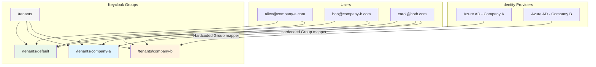

# IDP-based tenant assignment

By default, all users who log in to the platform are automatically assigned to the **default tenant**. Administrators
then manually add users to additional tenants through the Keycloak admin console. This works well for small deployments,
but becomes impractical when you have multiple organizations, each authenticating through their own identity provider.

IDP-based tenant assignment automates this. When a user authenticates through a specific identity provider, Keycloak
automatically assigns them to the corresponding tenant. A user who logs in through Company A's Azure AD app registration
joins Company A's tenant. The same user logging in through Company B's app registration also joins Company B's tenant.
Both memberships persist — they accumulate rather than replace each other.

::: warning IDP-based tenant assignment must be set up specifically
IDP-to-tenant mapping is not enabled by default. It's a capability the installation team configures per deployment. The
default behavior is manual tenant assignment through the Keycloak admin console.
:::

## How it works

Tenant memberships in Keycloak are stored as **group memberships**. Each tenant has a corresponding group under the
`/tenants/` parent group in Keycloak. When a user belongs to `/tenants/company-a`, the platform knows they're a member
of the Company A.



A **Group Membership protocol mapper** on the `tenants` client scope includes these group memberships in the OIDC token
as a `tenants` claim:

```json
{
  "tenants": ["/tenants/default", "/tenants/company-a"]
}
```

The application reads this claim to determine which tenants the user belongs to.

## Default tenant assignment

::: info Every User Gets the Default Tenant
The `/tenants/default` group is configured as a **Keycloak default group**. Every new user — regardless of how they
authenticate — is automatically added to this group on first login.

This means all users start with access to the default tenant. No manual assignment is needed for the baseline
experience.
:::

The default tenant typically provides access to shared, company-wide agents and resources. Users who need access to
additional tenants are either assigned manually by administrators or automatically through IDP-based mapping.

## Setting up IDP-to-tenant mapping

IDP-to-tenant mapping is not enabled by default. It's a capability the installation team configures per deployment. The
default behavior is manual tenant assignment through the Keycloak admin console.

### Prerequisites

Before configuring IDP-to-tenant mapping:

1. Create the tenant group in Keycloak under `/tenants/` (e.g., `/tenants/company-a`)
2. Create the corresponding tenant in the Swiss AI Hub application
3. Configure the identity provider in Keycloak with the customer's Azure AD app registration credentials

### Option 1: Hardcoded group mapping (one IDP = one tenant)

This is the simplest approach. Every user who authenticates through a specific identity provider is automatically
assigned to a specific tenant. Use this when each Azure AD app registration represents a distinct organization or
customer.

Add a **Hardcoded Group** IDP mapper to the identity provider:

```json
{
  "name": "tenant-mapper-company-a",
  "identityProviderAlias": "azure-ad-company-a",
  "identityProviderMapper": "oidc-hardcoded-group-idp-mapper",
  "config": {
    "syncMode": "INHERIT",
    "group": "/tenants/company-a"
  }
}
```

This mapper runs every time a user authenticates through `azure-ad-company-a`. It adds the user to `/tenants/company-a`
without removing any existing group memberships.

::: tip Why Groups Instead of Attributes?
Keycloak's attribute IDP mappers **overwrite** values on each login. If a user logs in via IDP-A and gets
`tenant = company-a`, then logs in via IDP-B, the attribute changes to `tenant = company-b` — the first assignment is
lost.

Group memberships are **additive**. The Hardcoded Group mapper adds the user to a group without removing them from other
groups. This is why tenant assignment uses groups, not user attributes.
:::

::: warning Mapper Provider ID
The Keycloak provider ID for the Hardcoded Group IDP mapper is `oidc-hardcoded-group-idp-mapper` (with the `oidc-`
prefix). Using `hardcoded-group-idp-mapper` (without prefix) will cause a `NullPointerException` during IDP login.
:::

#### Multiple IDPs, multiple tenants

When you have three Azure AD app registrations (one per customer), configure each with its own Hardcoded Group mapper:

| Identity Provider    | Hardcoded Group Mapper    | Tenant Group         |
| -------------------- | ------------------------- | -------------------- |
| `azure-ad-company-a` | `tenant-mapper-company-a` | `/tenants/company-a` |
| `azure-ad-company-b` | `tenant-mapper-company-b` | `/tenants/company-b` |
| `azure-ad-company-c` | `tenant-mapper-company-c` | `/tenants/company-c` |

A user with the same email across all three app registrations will be merged into a single Keycloak account (via the
first broker login flow) and accumulate all three tenant memberships plus the default tenant.

### Option 2: Claim-based group mapping (groups from the IDP determine the tenant)

Sometimes you don't want a blanket mapping of "everyone from this IDP joins this tenant." Instead, you want to map based
on a claim from the identity provider — for example, Azure AD group memberships.

Use an **Advanced Claim to Group** IDP mapper to map a specific claim value to a tenant group:

```json
{
  "name": "tenant-mapper-finance-group",
  "identityProviderAlias": "azure-ad",
  "identityProviderMapper": "oidc-advanced-group-idp-mapper",
  "config": {
    "syncMode": "INHERIT",
    "claims": "[{\"key\": \"groups\", \"value\": \"finance-department-group-id\"}]",
    "group": "/tenants/finance"
  }
}
```

This mapper checks if the `groups` claim from Azure AD contains `finance-department-group-id`. If it does, the user is
assigned to `/tenants/finance`.

::: warning Azure AD Group Claims Require Configuration
By default, Azure AD does not include group memberships in the ID token. You must configure this in the Azure AD app
registration:

1. Go to **Token configuration** in the Azure Portal
2. Click **Add groups claim**
3. Select **Security groups** (or **All groups**)
4. Under **Customize token properties by type**, ensure the **ID** token includes groups
5. Note: Azure AD sends group **Object IDs** (UUIDs), not group names. Use the Object ID as the claim value in the
   mapper.
:::

#### Mapping multiple Azure AD groups to tenants

You can add multiple Advanced Claim to Group mappers on the same identity provider, each mapping a different Azure AD
group to a different tenant:

```json
[
  {
    "name": "tenant-mapper-finance",
    "identityProviderAlias": "azure-ad",
    "identityProviderMapper": "oidc-advanced-group-idp-mapper",
    "config": {
      "syncMode": "INHERIT",
      "claims": "[{\"key\": \"groups\", \"value\": \"aaaaaaaa-bbbb-cccc-dddd-eeeeeeeeeeee\"}]",
      "group": "/tenants/finance"
    }
  },
  {
    "name": "tenant-mapper-legal",
    "identityProviderAlias": "azure-ad",
    "identityProviderMapper": "oidc-advanced-group-idp-mapper",
    "config": {
      "syncMode": "INHERIT",
      "claims": "[{\"key\": \"groups\", \"value\": \"ffffffff-1111-2222-3333-444444444444\"}]",
      "group": "/tenants/legal"
    }
  }
]
```

A user who is a member of both Azure AD groups will be assigned to both `/tenants/finance` and `/tenants/legal`.

### Option 3: Role-based group mapping (IDP roles determine the tenant)

If your Azure AD app registration uses app roles instead of groups, you can map those roles to tenant groups using an
**Advanced Claim to Group** mapper on the `roles` claim:

```json
{
  "name": "tenant-mapper-premium-tier",
  "identityProviderAlias": "azure-ad",
  "identityProviderMapper": "oidc-advanced-group-idp-mapper",
  "config": {
    "syncMode": "INHERIT",
    "claims": "[{\"key\": \"roles\", \"value\": \"PremiumTenant\"}]",
    "group": "/tenants/premium"
  }
}
```

Users with the `PremiumTenant` app role in Azure AD will be assigned to `/tenants/premium` in addition to the default
tenant.

## User merging across identity providers

When the same person authenticates through multiple identity providers (e.g., the same email across different Azure AD
app registrations), Keycloak merges them into a single user account through the **first broker login flow**.

On first login via a new IDP, Keycloak detects that a user with the same email already exists and links the new identity
to the existing account. The user now has multiple linked identities but a single Keycloak account.

Each IDP's mappers run independently when the user authenticates through that IDP. Because group membership is additive,
a user who logs in through Company A's IDP gets `/tenants/company-a`, and later logging in through Company B's IDP adds
`/tenants/company-b` — without removing the first assignment.

::: warning Trust Your Identity Providers
Automatic account linking trusts that external identity providers have verified the user's email. Only enable this for
trusted IDPs. An attacker controlling an IDP that doesn't verify emails could link to any existing account by claiming a
matching email address.
:::

## Choosing the right approach

| Scenario                                                     | Recommended Approach                            |
| ------------------------------------------------------------ | ----------------------------------------------- |
| Each customer/tenant has their own Azure AD app registration | **Hardcoded Group** per IDP                     |
| Single Azure AD, tenants based on AD group membership        | **Advanced Claim to Group** on `groups` claim   |
| Single Azure AD, tenants based on app roles                  | **Advanced Claim to Group** on `roles` claim    |
| Small deployment, few tenants                                | **Manual assignment** in Keycloak admin console |

You can combine approaches. Use Hardcoded Group mappers for some IDPs and Advanced Claim to Group mappers for others.
The default tenant assignment always applies regardless of which additional mappings are configured.

## What the platform does not do

::: details Responsibilities and Boundaries
**Keycloak stores tenant assignments** — which user belongs to which tenant, represented as group memberships.

**Keycloak does not manage tenants** — what tenants exist, their configuration, settings, and active status is the
responsibility of the Swiss AI Hub application.

**IDP-to-tenant mapping is not a default feature** — the platform provides the mechanism (groups, protocol mappers,
documentation), but the installation team must configure it per deployment. Out of the box, tenant assignment is manual.

**The platform does not synchronize backwards** — if you remove a user from a tenant group in Keycloak, the Swiss AI Hub
application's local role assignments (`UserTenantRoleEntity`) for that user in that tenant are not automatically cleaned
up. Both systems should be kept in sync by administrators.
:::
