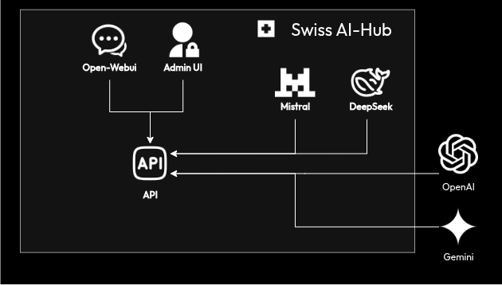
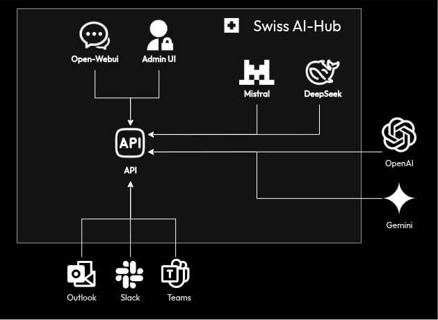
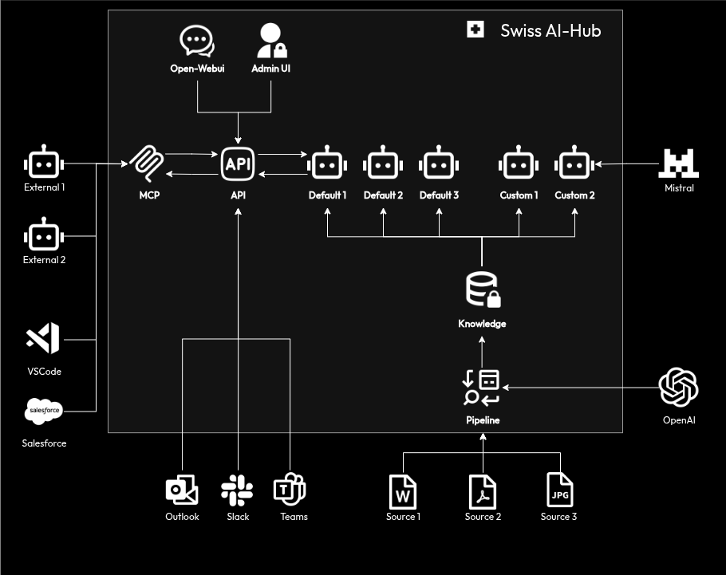
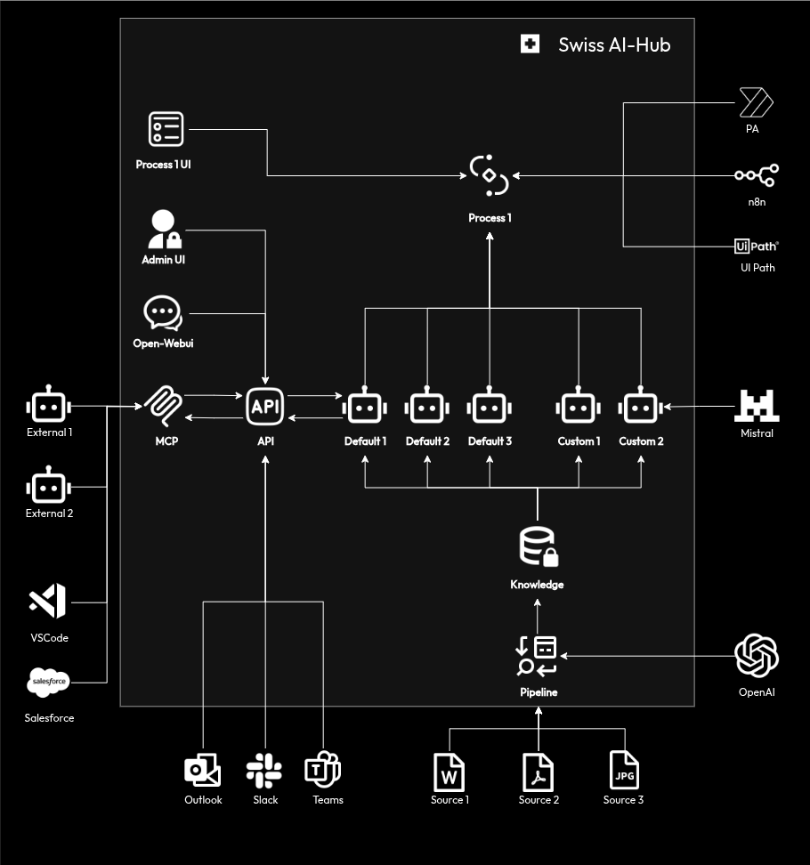

# Kernkomponenten

Die Swiss AI Hub ist eine vollständige Plattform, die Infrastruktur für Agenten, Pipelines und Prozessautomatisierung
umfasst. Das hier beschriebene Stufenmodell ist ein empfohlener Einführungspfad, keine Sammlung separater
Softwareversionen.

Organisationen tun sich oft schwer, wenn sie komplexe Automatisierungsprojekte versuchen, ohne zuvor eine grundlegende
KI-Kompetenz aufzubauen. Das Stufenmodell bietet einen strukturierten Ansatz, der sich an erfolgreichen
Einführungsmustern orientiert.

**Stufe 1** bietet jedem in der Organisation sicheren Zugang zu LLMs. Durch direkte Erfahrung lernen die Benutzer die
Fähigkeiten und Einschränkungen der Modelle kennen, verbessern ihre Fähigkeiten im Schreiben von Prompts und
identifizieren Aufgaben in ihrer täglichen Arbeit, bei denen KI von Vorteil sein könnte.

Nach einer Nutzungsperiode wird die Reibung beim Wechseln zwischen Arbeitsanwendungen und einer dedizierten
KI-Oberfläche zu einer häufigen Beschwerde. Dies führt zu **Stufe 1+**, die dieselben KI-Fähigkeiten direkt in Tools wie
Microsoft Teams, Slack und Outlook integriert. Dies reduziert Arbeitsflussunterbrechungen und fördert eine breitere
Akzeptanz.

Benutzer stellen möglicherweise fest, dass den generischen Modellen ein spezifischer Unternehmenskontext fehlt. Zum
Beispiel wäre ein Modell, das gebeten wird, eine Stellenbewerbung zu bewerten, sich der internen Einstellungspolitik
einer Organisation nicht bewusst. Dies signalisiert die Bereitschaft für **Stufe 2**.

**Stufe 2** führt spezialisierte Agenten ein, die Zugriff auf organisatorisches Wissen erhalten. Ein HR-Agent kann so
konfiguriert werden, dass er Einstellungskriterien aus Mitarbeiterhandbüchern versteht. Ein Finanzagent kann den
Kontenplan des Unternehmens lernen, um Finanzsysteme abzufragen. Diese Agenten verwenden die spezifischen Daten einer
Organisation, um relevante, kontextbezogene Antworten zu liefern.

Mit zunehmender Agenten-Nutzung treten repetitive Orchestrierungsmuster auf. Ein Mitarbeiter könnte ein Dokument manuell
an einen Agenten zur Analyse, dann an einen Manager zur Überprüfung und schließlich an einen weiteren Agenten für eine
Hintergrundprüfung weiterleiten. Diese Art der mehrstufigen, manuellen Weiterleitung deutet auf die Notwendigkeit von
**Stufe 3** hin.

**Stufe 3** automatisiert diese Muster als formale Prozesse. Das System kann so konfiguriert werden, dass es
Stellenbewerbungen aufnimmt, sie zur Vorauswahl an einen HR-Agenten weiterleitet, eine menschliche Überprüfung nur für
Grenzfälle anfordert, Hintergrundprüfungen über externe Systeme auslöst und die zuständigen Personalmanager
benachrichtigt. Dies ermöglicht es menschlichen Mitarbeitern, sich auf Entscheidungsfindung und Ausnahmebehandlung zu
konzentrieren.

Die Plattform beinhaltet all diese Fähigkeiten von Anfang an. Das Stufenmodell beantwortet die Frage, wann welche
Fähigkeit basierend auf der organisatorischen Bereitschaft eingeführt werden sollte. Der Fortschritt gibt den Menschen
Zeit, Arbeitsabläufe anzupassen, Fähigkeiten zu entwickeln und Vertrauen in das System aufzubauen.

## Stufe 1: Grundlage für sicheren KI-Zugang

Der primäre Einstiegspunkt für Benutzer ist die Weboberfläche Open-WebUI, die Text-, Dokument- und Spracheingaben
unterstützt.

Alle Anfragen werden über eine API-Schicht verarbeitet, die Authentifizierung handhabt, Berechtigungen für das
angefragte Modell überprüft und die Interaktion zur Überprüfung protokolliert. Die Anfrage wird dann, basierend auf der
Systemkonfiguration, an das entsprechende LLM weitergeleitet, wie z.B. ein OpenAI- oder Google Gemini-Modell.

Antworten des LLM werden mittels Server-Sent Events an den Browser zurückgestreamt, sodass der Benutzer den Text während
der Generierung sehen kann. Diese Architektur gewährleistet eine reaktionsschnelle Oberfläche, selbst bei Abfragen, die
längere Verarbeitungszeiten erfordern.

Eine separate Admin-UI, die mit Nuxt erstellt wurde, bietet Administratoren Einblick in die Systemnutzung,
Benutzerverwaltung und Modellkonfiguration. Sie ermöglicht es ihnen, die Modellnutzung zu überwachen, Kostenlimits
festzulegen und Audit-Logs zu überprüfen.

Alle Daten, einschließlich Benutzeranfragen, LLM-Antworten, Konversationsverlauf und Systemprotokolle, werden in der
internen Datenbank der Plattform gespeichert. Dies stellt sicher, dass die Daten innerhalb der kontrollierten
Infrastruktur der Organisation verbleiben, es sei denn, der externe Modellzugriff ist explizit konfiguriert.

## Stufe 1+: Benutzer dort abholen, wo sie arbeiten

Die Einschränkung einer eigenständigen Weboberfläche ist die Unterbrechung des Workflows, die durch Kontextwechsel
verursacht wird. Stufe 1+ löst dies, indem die Funktionen der Plattform auf die Anwendungen erweitert werden, die
Mitarbeiter täglich nutzen. Ein Benutzer in Microsoft Teams kann einen Konversationsverlauf direkt in der Anwendung
zusammenfassen, und die Antwort der KI erscheint im selben Kanal.

::: details Unterstützte Kanäle
Die Plattform verwendet das Azure Bot Framework für Integrationen. Unterstützte Kanäle umfassen:

- Alexa
- Email
- Facebook
- MS Teams
- Outlook
- Skype
- Slack
- Telegram
- WeChat
- Web
- ... und weitere
:::

Jede Integration passt sich den Interaktionsmustern des Host-Tools an. Zum Beispiel könnte eine KI-Antwort in Slack in
einem Thread gepostet werden, während sie in Outlook beim Verfassen von E-Mail-Antworten helfen könnte. Die zentrale
API-Schicht stellt sicher, dass alle Interaktionen, unabhängig von ihrem Ursprung, denselben Sicherheits-, Governance-
und Protokollierungsrichtlinien unterliegen.

## Stufe 2: Von Daten zu kontextueller Intelligenz

Stufe 2 führt Funktionen zur Aufnahme und Strukturierung von Organisationsdaten ein, um KI-Agenten Kontext zu bieten.
Der Prozess beginnt mit Informationsquellen wie SharePoint-Dokumentbibliotheken.

Eine Pipeline orchestriert den Datenverarbeitungs-Workflow. Sie überwacht verbundene Quellen auf neue oder aktualisierte
Dateien und löst eine Verarbeitungssequenz aus. Dokumente werden geparst, um nicht nur Text, sondern auch strukturelle
Elemente wie Überschriften und Tabellen zu extrahieren. Der Inhalt wird dann basierend auf Themenwechseln oder
Abschnittstrennungen in semantisch bedeutsame Blöcke unterteilt. Jeder Block wird unter Verwendung eines Modells wie
Mistral in ein Vektor-Embedding umgewandelt.

::: tip
Die hier beschriebene Pipeline ist eine Standardkonfiguration. Das SDK ermöglicht die Erstellung kundenspezifischer
Pipelines, um sich mit anderen Quellen (Datenbanken, APIs, FTP-Servern) zu verbinden, die Dokumentenverarbeitung
anzupassen und Daten anzureichern.
:::

Diese Embeddings werden in einer Vektordatenbank gespeichert und indiziert, die als Wissensbasis der Plattform dient.
Dies ermöglicht die semantische Suche, wodurch Agenten Informationen basierend auf ihrer Bedeutung statt auf exakten
Schlüsselwortübereinstimmungen abrufen können. Das System pflegt eine klare Herkunft jedes Embeddings zurück zu seinem
Quelldokument für Nachvollziehbarkeit und Verifizierung.

Mit einer vorhandenen Wissensbasis kann die Plattform mehrere Agenten unterstützen. Standardagenten könnten einen
Dokumentenanalysten oder einen Dateninterpreter umfassen. Benutzerdefinierte Agenten können mit dem SDK erstellt werden,
um organisationsspezifische Aufgaben zu bearbeiten, interne Terminologie zu verstehen oder domänenspezifisches Denken
anzuwenden.

Die Plattform ist auch über das Model Context Protocol (MCP) für die Außenwelt offen. Über MCP können Agenten aus
anderen Systemen sicher auf die Plattform und deren Agenten zugreifen.

## Stufe 3: Orchestrierung von Geschäftsprozessen

Stufe 3 führt eine Prozessorchestrierungs-Engine ein, um mehrstufige Workflows zu automatisieren, die KI-Agenten,
Menschen und externe Systeme umfassen.

Eine dedizierte Prozess-UI ermöglicht es Benutzern, diese Workflows zu visualisieren und mit ihnen zu interagieren. Sie
zeigt aktive Prozesse als Flussdiagramme an, die den aktuellen Schritt, die verantwortliche Entität (Mensch, Agent oder
externes System) und die nachfolgenden Schritte darstellen.

Wenn ein Prozess ausgelöst wird, bewertet die Orchestrierungs-Engine den ersten Schritt. Wenn der Schritt eine
Dokumentenanalyse erfordert, wird die Aufgabe an einen KI-Agenten delegiert. Die Ausgabe des Agenten wird an den
Orchestrator zurückgegeben, der dann mit dem nächsten Schritt fortfährt. Wenn ein Schritt menschliches Urteilsvermögen
erfordert, wird im Arbeitsbereich des relevanten Benutzers in der Prozess-UI eine Aufgabe erstellt. Die Oberfläche
bietet die Analyse der KI, das Quelldokument und den Kontext für die Entscheidung. Sobald der Mensch die Aufgabe
abgeschlossen hat, wird der Prozess fortgesetzt.

Externe Systeme können über Konnektoren integriert werden. Power Automate-Verbindungen können Flows auslösen, um
SharePoint-Listen zu aktualisieren oder E-Mails zu versenden. Eine n8n-Integration ermöglicht die Kommunikation mit
UiPath für Roboter Prozessautomatisierungsaufgaben, die Altsysteme betreffen.

::: tip
Der hier beschriebene Prozess ist ein Beispiel. Das SDK kann verwendet werden, um benutzerdefinierte Prozesse zu
erstellen, die sich mit verschiedenen externen und internen Systemen verbinden.
:::

Die Orchestrierungs-Engine verwaltet den Zustand jedes Prozesses, handhabt Timeouts und Fehler. Falls ein externes
System nicht reagiert, kann der Prozess so konfiguriert werden, dass die Aufgabe zur manuellen Intervention an einen
Menschen weitergeleitet wird. Die API-Schicht wird in dieser Stufe erweitert, um Konversationskontexte zu verwalten, die
mehrere Teilnehmer und lange Zeiträume umfassen.
