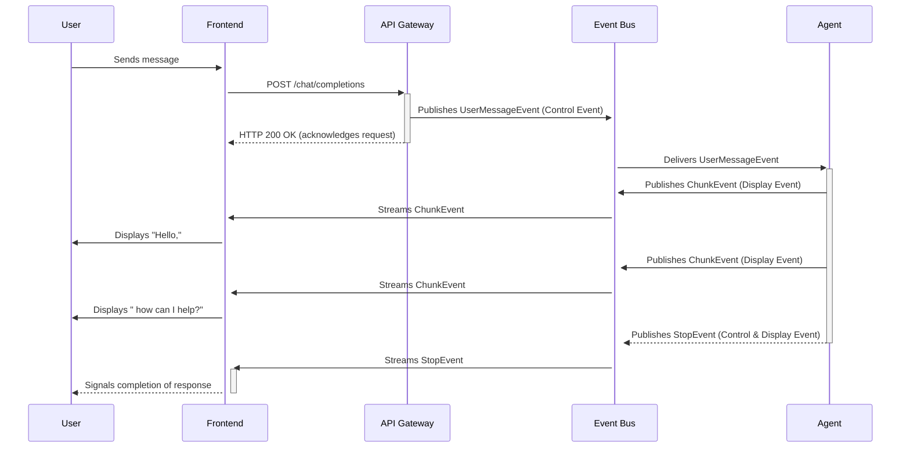
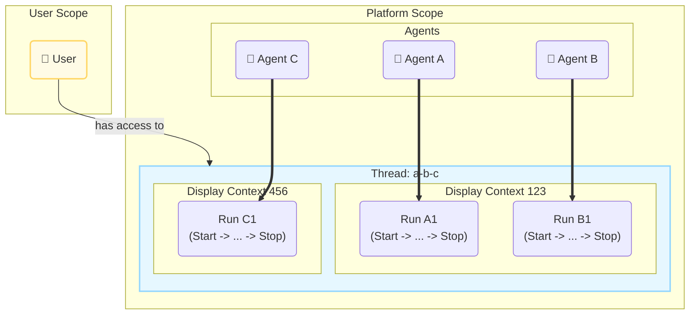
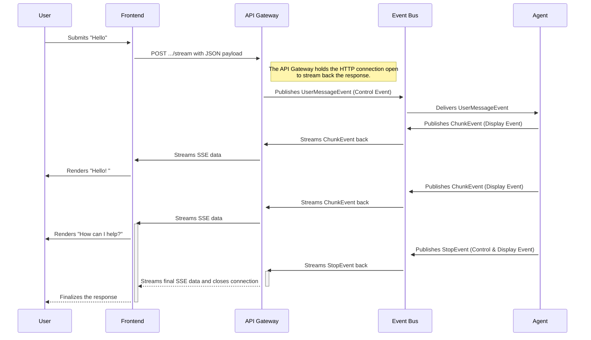
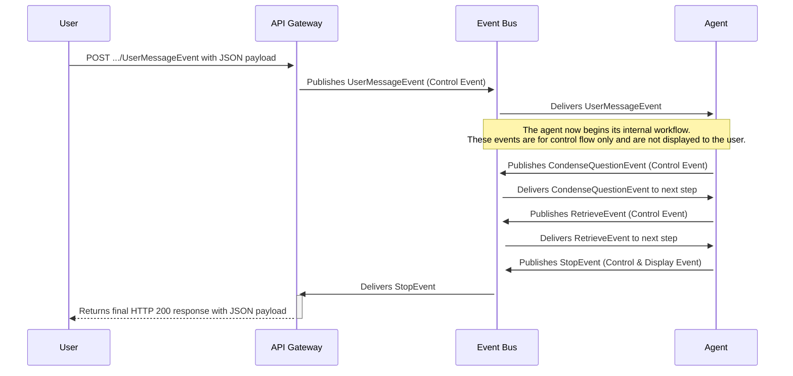
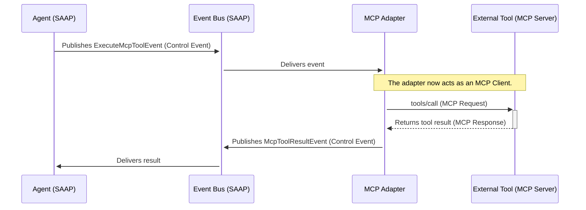
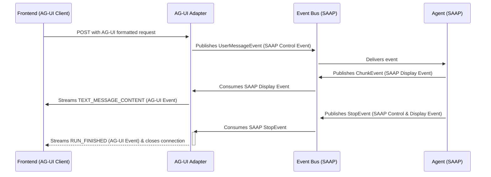

# Swiss AI Agent Protokoll

Die Infrastrukturschichten der Plattform stellen die Kernkomponenten bereit, wie den Message Bus und Datenbanken. Das
Swiss AI Agent Protokoll definiert die Regeln und Verträge, die ihr Zusammenspiel als kohärentes System ermöglichen. Es
ist ein internes, ereignisgesteuertes Modell, das festlegt, wie Agents agieren, ihren Zustand verwalten und mit der
Plattform kommunizieren. Jeder mit dem SDK erstellte Agent hält sich an dieses Protokoll, und jede Komponente, die mit
einem Agent interagiert, von der API bis zur Benutzeroberfläche, verlässt sich darauf.

Das Folgende beschreibt die abstrakten Regeln dieses Protokolls, nicht die spezifische Python-Implementierung. Diese
Prinzipien bilden die Grundlage für den Bau von Agents, die von Grund auf transparent, skalierbar und resilient sind.

## Warum ein Protokoll? Engineering für autonome KI

KI-Operationen sind oft mehrstufige, asynchrone Prozesse, die mehrere Modelle, langlaufende Aufgaben und menschliche
Interaktion umfassen können. Eine traditionelle Architektur, bei der interne Komponenten über synchrone APIs
kommunizieren, kann zu einer engen Kopplung führen. Dies erschwert die Skalierung, Beobachtung und Modifikation des
Systems, da eine Änderung in einer Komponente kaskadierende Effekte auf andere haben kann.

Das Swiss AI Agent Protokoll begegnet diesen Herausforderungen durch die Definition eines standardisierten,
ereignisgesteuerten Vertrags für die asynchrone Kommunikation. Es bietet eine gemeinsame Sprache für alle
Plattformteilnehmer und stellt sicher, dass Interaktionen vorhersehbar und entkoppelt sind.

### Jenseits von Chatbots: Eine Welt autonomer Agents

Agents innerhalb der Plattform sind nicht auf konversationelle Request-Response-Aufgaben beschränkt. Sie sind als
persistente, autonome Entitäten konzipiert, die unabhängig von direkten Benutzerinteraktionen agieren können. Ein Agent
könnte eine Datenquelle überwachen, einen Geschäftsprozess verwalten, dessen Abschluss Tage dauert, oder eine geplante
Analyse durchführen.

Da die Betriebszeit eines Agents nicht an eine einzelne Benutzeranfrage gebunden ist, kann er Minuten, Stunden oder
sogar Monate laufen. Diese persistente und autonome Natur führt zu einer Komplexität, die ein formelles
Kommunikationsprotokoll erfordert, um den Zustand zu verwalten, die Sicherheit zu gewährleisten und über lange Zeiträume
eine klare Observability zu bieten.

### Die Notwendigkeit eines granularen, interoperablen Vertrags

Das Protokoll ist ein granularer Vertrag, bei dem jede bedeutungsvolle Aktion, jeder Gedanke oder jede Zustandsänderung
als ein eindeutiges Ereignis definiert ist. Dieser Ansatz bietet eine hochauflösende Sicht auf die Operationen eines
Agents, was für detailliertes Tracing und Debugging notwendig ist.

Diese Granularität ermöglicht auch die Interoperabilität. Die Plattform kann ihren reichhaltigen internen Event Stream
übersetzen, um externe Protokolle wie die OpenAI API zu unterstützen. Ein Adapter kann auf spezifische Events wie
`ChunkEvent` oder `StopEvent` lauschen und diese als OpenAI-kompatible Server-Sent Events neu formatieren. Dieser
Prozess verwirft alle protokollspezifischen Informationen, die das externe System nicht versteht, wodurch Clients mit
der Plattform unter Verwendung vertrauter Standards interagieren können.

## Die Protokollteilnehmer und ihre Rollen

Das Protokoll definiert die Kommunikationsregeln für eine Reihe von Teilnehmern, nicht nur für die Agents. Jeder
Teilnehmer hat eine bestimmte Rolle und interagiert auf eine spezifische Weise mit dem Event Stream.

### Der Agent

Der Agent ist der autonome Worker des Ökosystems. Seine Rolle ist die Ausführung von Geschäftslogik und komplexen
Schlussfolgerungen. Er konsumiert `Control Events`, um seine Arbeit zu starten oder fortzusetzen. Er produziert neue
`Control Events`, um seinen internen Workflow voranzutreiben oder Aufgaben zu delegieren, sowie einen reichhaltigen
Stream von `Display Events`, um seinen Status, seine Schlussfolgerungen und Ergebnisse zu melden.

### Das API Gateway

Das API Gateway fungiert als sicherer Einstiegspunkt für alle externen Clients. Seine Rolle ist es, zwischen externen
Kommunikationsformaten wie HTTP und dem internen Protokoll zu übersetzen. Das API Gateway ist der exklusive Produzent
von initialen `Control Events`, die von außerhalb des Systems stammen. Es validiert die Benutzeridentität und
Berechtigungen, bevor es ein Event an den Message Bus sendet.

### Das Frontend

Die Benutzeroberfläche bietet eine Echtzeitansicht der Operationen eines Agents. Sie ist primär ein Consumer von
`Display Events`. Das Frontend nutzt diesen Event Stream, um die Aktivität des Agents darzustellen, wie z.B. das
Anzeigen von Streaming-Text oder internen Schlussfolgerungsschritten. Es produziert keine Events direkt, sondern
initiiert Aktionen durch das Senden von Anfragen an das API Gateway.

### Der Prozess-Orchestrator

Der Prozess-Orchestrator verwaltet hochrangige Geschäftsprozesse, die mehrere Agents, menschliche Aufgaben und externe
Systeme umfassen können. Er fungiert als spezialisierter Agent. Seine Protokollinteraktion besteht darin,
`Control Events` zu konsumieren, oft das `StopEvent` eines Worker-Agents, und dann ein neues `Control Event` zu
produzieren, um den nächsten Teilnehmer im Prozess auszulösen.

Das folgende Diagramm veranschaulicht einen typischen Interaktionsfluss zwischen diesen Teilnehmern.



## Scoping und Sicherheit: der hierarchische Kontext

Um langlaufende Interaktionen zu verwalten und die Sicherheit zu gewährleisten, wird jedes Event innerhalb des
Protokolls in eine dreistufige Hierarchie eingeordnet. Diese Struktur ist direkt in das Thema jedes auf dem Message Bus
veröffentlichten Events kodiert und ermöglicht so eine granulare Kontrolle über Sichtbarkeit und Zugriff.

### Die drei Scopes eines Events

- **`Run` Kontext**

  - **Definition:** Der granularste Scope. Ein „Run“ ist eine einzelne, nachverfolgbare Ausführung eines Workflows,
    definiert durch die Abfolge von Events zwischen einem `StartEvent` und einem entsprechenden `StopEvent` oder
    `ExceptionEvent`.
  - **Zweck:** Er bietet einen eindeutigen Identifier für eine einzelne, vollständige Agent-Operation. Dieser Scope ist
    unerlässlich für Tracing und Debugging, da er die Events einer spezifischen Aufgabe isoliert.

- **`Display` Kontext**

  - **Definition:** Ein Scope, der entwickelt wurde, um mehrere `Run`s für die Darstellung in einer Benutzeroberfläche
    zusammenzufassen. Er kann mehrere Agents umfassen.
  - **Zweck:** Er verwaltet, was ein Endbenutzer oder Beobachter sieht. Wenn ein Agent Arbeit an einen anderen Agent
    delegiert, kann er wählen, seinen `Display` Kontext weiterzugeben. Wenn dies geschieht, zeigt das Frontend, das
    diesen Kontext abonniert hat, die Events beider Agents als Teil einer einzigen, nahtlosen Interaktion an. Wenn der
    primäre Agent einen neuen `Display` Kontext für die delegierte Aufgabe erstellt, wird diese Arbeit aus dieser
    spezifischen UI-Ansicht „verborgen“.

- **`Thread` Kontext**

  - **Definition:** Der übergeordnete Scope, der mehrere `Display` Kontexte und `Run`s gruppiert, die zu einem einzigen,
    übergreifenden Ziel oder einer Konversation gehören.
  - **Zweck:** Er verwaltet die langfristige Historie und den Zustand eines Prozesses. Eine Chat-Konversation ist ein
    `Thread`. Ein autonomer Agent, der Rechnungen für einen ganzen Monat verarbeitet, könnte innerhalb eines einzigen
    `Thread` für die Arbeit dieses Monats agieren.

Das folgende Diagramm veranschaulicht diese hierarchische Struktur.



::: details Erläuterung
- Die gesamte Interaktion ist in einem einzigen `Thread` enthalten, auf den der `User` Zugriff hat.
- Innerhalb dieses Threads gibt es zwei separate `Display` Kontexte. Ein Benutzer, der `Display Kontext 123` beobachtet,
  würde einen nahtlosen Aktivitätsfluss sowohl von `Run A1` (ausgeführt von Agent A) als auch von `Run B1` (ausgeführt
  von Agent B) sehen. Dies ist typisch, wenn ein Agent eine Aufgabe an einen anderen Agent delegiert.
- Der Benutzer würde keine Events von `Run C1` sehen, da es zu einem anderen `Display` Kontext gehört, wodurch dieser
  Vorgang effektiv von dieser speziellen UI-Ansicht isoliert wird.
:::

### Sicherheit durch Scoping

Dieses hierarchische Scoping ist die Grundlage des Sicherheitsmodells der Plattform. Der Zugriff wird auf der
**`Thread`**-Ebene gewährt. Ein Benutzer kann nur Events von Threads beobachten, deren Mitglied er ist.

Agents können auch in Threads ohne menschliche Mitglieder agieren. In diesem Fall können nur Administratoren mit
ausreichenden Berechtigungen für die teilnehmenden Agents die Events innerhalb dieses Threads beobachten. Dies stellt
sicher, dass autonome Backend-Prozesse sicher und isoliert bleiben.

## Die Sprache: eine Bibliothek standardisierter Events

### Das Event: ein unveränderlicher Faktenbericht

Die fundamentale Kommunikationseinheit im Protokoll ist das **Event**. Ein Event ist ein strukturierter, typisierter und
unveränderlicher Datensatz, der einen eingetretenen Fakt darstellt. Jede Kommunikation besteht aus zwei
unterschiedlichen Teilen:

1. **Das Topic:** Die Adresse auf dem Message Bus, wo das Event veröffentlicht wird. Das Topic liefert den vollständigen
   Kontext des Events, einschließlich seines Scopes (Thread, Display, Run) und seines Ursprungs.
2. **Das Payload:** Ein eigenständiges JSON-Objekt, das die spezifischen Daten für dieses Event enthält.

Das System kombiniert dieses kontextuelle Topic und Daten-Payload, um eine vollständige, verständliche Kommunikation zu
bilden.

#### Die Topic-Struktur

Das Topic ist ein hierarchischer String, der Routing- und Scoping-Informationen liefert. Jedes Event wird an ein Topic
veröffentlicht, das dieser Struktur folgt.

::: details Beispiel
**Topic:**

`agent.RAGAgent.wiki_agent.t948a201-....d135bfc9-....r4fg68bb-....display_event.UserMessageEvent.r4fg68bb-...`

| Segment       | Beispielwert    | Beschreibung                                                      |
| :------------ | :-------------- | :---------------------------------------------------------------- |
| `agent_class` | `RAGAgent`      | Die Klasse des Agents, der veröffentlicht oder angesprochen wird. |
| `agent_id`    | `wiki_agent`    | Der eindeutige Identifier der spezifischen Agent-Instanz.         |
| `thread_id`   | `t948a201-...`  | Der Identifier für den übergeordneten Thread-Kontext.             |
| `display_id`  | `d135bfc9-...`  | Der Identifier für den UI-bezogenen Display-Kontext.              |
| `run_id`      | `r4fg68bb-...`  | Der Identifier für den spezifischen Run-Kontext.                  |
| `event_type`  | `display_event` | Die Hauptkategorie (`control_event` oder `display_event`).        |
| `event_name`  | `ChunkEvent`    | Der spezifische Name des Events.                                  |
| `event_id`    | `r4fg68bb-...`  | Ein eindeutiger Identifier für diese einzelne Event-Instanz.      |
:::

##### Das Event-Payload

Das Payload sind die Daten, die mit dem Event verknüpft sind. Seine Struktur wird durch den Event-Typ definiert. Alle
Events teilen jedoch eine gemeinsame Menge von Kernattributen.

::: details JSON
**Example `UserMessageEvent` Payload:**

```json
{
  "event_id": "e423",
  "created_at": 1755015355940833270,
  "_event_name": "UserMessageEvent",
  "_parent_event_names": [
    "UserMessageEvent",
    "StartEvent",
    "ControlAndDisplayEvent",
    "ControlEvent",
    "DisplayEvent"
  ],
  "display_name": { "en": "User Request", "de": "Benutzeranfrage", "...": "..." },
  "display_description": { "en": "The agent has received a message...", "...": "..." },
  "locale": "de",
  "user": {
    "id": "cc4af21b-981a-4a76-826d-e722715082e0",
    "name": "Joel Barmettler",
    "...": "..."
  },
  "messages": [
    { "role": "system", "...": "..." },
    { "role": "user", "...": "..." }
  ]
}
```
:::

| Kern-Payload-Attribut | Beschreibung                                                                                                                                         |
| :-------------------- | :--------------------------------------------------------------------------------------------------------------------------------------------------- |
| `event_id`            | Ein eindeutiger Identifier für das Event, der mit dem im Topic übereinstimmt.                                                                        |
| `created_at`          | Ein Zeitstempel mit Nanosekundenpräzision, der den Zeitpunkt der Erstellung des Events markiert.                                                     |
| `_event_name`         | Der spezifische Klassenname des Events. Dieser wird von Subscribern verwendet, um das Payload in das korrekte Datenobjekt zu deserialisieren.        |
| `_parent_event_names` | Eine Liste der übergeordneten Event-Typen in seiner Vererbungshierarchie, die das Filtern und Routing basierend auf breiteren Kategorien ermöglicht. |
| `display_name`        | Ein für Menschen lesbarer Name für das Event, mit Unterstützung für mehrere Locales.                                                                 |
| `display_description` | Eine für Menschen lesbare Beschreibung dessen, was das Event darstellt, mit Unterstützung für mehrere Locales.                                       |

Die verbleibenden Felder im Payload sind spezifisch für den Event-Typ. Für dieses `UserMessageEvent` enthält das Payload
`locale`, `user`-Identität und die `messages`-Historie. Andere Event-Typen haben unterschiedliche Datenfelder, die für
ihren Zweck relevant sind.

### Die Kernkategorien: Control vs. Display

Um sicherzustellen, dass Agent-Workflows vorhersehbar sind und die Beobachtung die Ausführung nicht stört, kategorisiert
das Protokoll jedes Event streng. Das Payload jedes Events enthält eine Liste `_parent_event_names`, die deklariert, ob
es zur Kategorie `ControlEvent` oder `DisplayEvent` gehört oder zu beiden.

#### Control Events (Anweisungen)

Control Events steuern den Workflow und verursachen Zustandsänderungen. Das Protokoll schreibt vor, dass **nur ein
`Control Event` die Ausführung eines Agent-Schritts auslösen kann.** Sie repräsentieren Befehle, abgeschlossene Aufgaben
oder Antworten, die den Agent dazu auffordern, mit der nächsten logischen Operation fortzufahren.

- **Beispiel:** Ein `UserMessageEvent` ist ein `Control Event`, weil es einen Agent anweist, einen neuen Run zu starten.
  Ein `HumanInTheLoopResponseEvent` ist ein `Control Event`, weil es die notwendige Eingabe für einen pausierten
  Workflow liefert, um fortzufahren.

#### Display Events (Kommentar)

Display Events sind rein informativ und dienen der Beobachtung durch Benutzer oder Überwachungssysteme. Das Protokoll
schreibt vor, dass **ein `Display Event` niemals den logischen Fluss des Workflows eines Agents beeinflussen darf.** Ihr
Zweck ist es, eine Echtzeit-Erzählung des internen Zustands des Agents, des Denkprozesses oder partieller Ergebnisse zu
liefern. Diese Trennung stellt sicher, dass ein Fehler in einer UI- oder Logging-Komponente die Kernlogik des Agents
nicht unterbrechen kann.

- **Beispiel:** Ein `ThoughtEvent` bietet einen Einblick in die Überlegungen des Agents. Ein `ChunkEvent` streamt einen
  Teil einer Textantwort an die Benutzeroberfläche.

Einige Events können beide Funktionen erfüllen. Zum Beispiel ist ein `StopEvent` ein `Control Event`, weil es den
Workflow-Run beendet, aber es ist auch ein `Display Event`, weil die Benutzeroberfläche darüber informiert werden muss,
dass der Prozess abgeschlossen ist. Solche Events halten sich an die Regeln beider Kategorien.

### Die Kern-Event-Bibliothek

Das Protokoll definiert eine Standardbibliothek von Event-Typen für gängige Operationen in KI- und Agenten-Systemen.
Während Entwickler benutzerdefinierte Events erstellen können, um domänenspezifische Logik zu handhaben, bietet diese
Kernbibliothek die wesentlichen Bausteine für die Verwaltung von Workflow-Lebenszyklen, die Interaktion mit Benutzern
und die Gewährleistung der Observability.

Die folgenden Tabellen dienen als Referenz für die gängigsten Events, kategorisiert nach ihrer Funktion.

#### Lifecycle Events

Diese Events verwalten den Zustand eines einzelnen Workflow `Run`.

| Event                | Kategorie         | Zweck                                                                                                              |
| :------------------- | :---------------- | :----------------------------------------------------------------------------------------------------------------- |
| **`StartEvent`**     | Control & Display | Signalisiert den Beginn eines neuen Workflow-Runs und trägt dessen initialen Kontext.                              |
| **`StopEvent`**      | Control & Display | Signalisiert den erfolgreichen Abschluss eines Workflow-Runs. Keine weiteren Schritte werden ausgeführt.           |
| **`ExceptionEvent`** | Control & Display | Signalisiert, dass während eines Runs ein nicht behebbarer Fehler aufgetreten ist, der zu dessen Beendigung führt. |

#### Benutzerinteraktions-Events

Diese Events verarbeiten direkte Eingaben von menschlichen Benutzern.

| Event                  | Kategorie         | Zweck                                                                                                                                                                     |
| :--------------------- | :---------------- | :------------------------------------------------------------------------------------------------------------------------------------------------------------------------ |
| **`UserMessageEvent`** | Control & Display | Ein spezialisiertes `StartEvent`, das durch das Senden einer Nachricht durch einen Benutzer ausgelöst wird. Es enthält die Nachrichtenhistorie und die Benutzeridentität. |

::: warning `UserMessageEvent` ist ein Chat-UI-Vertrag
`UserMessageEvent` ist der kanonische Einstiegspunkt für **Chat-Interfaces** (OpenWebUI, Teams, Slack, WebChat). Jede
Chat-UI, die einen Agent steuern möchte, muss wissen, wie sie es veröffentlichen und rendern kann, daher muss sein
Payload minimal bleiben — jedes Feld, das zu `UserMessageEvent` (oder zu einer davon abgeleiteten Unterklasse)
hinzugefügt wird, erhöht die Anforderungen für jeden Chat-Client im Ökosystem.

Wenn Ihr Agent ein reichhaltigeres Eingabe-Payload benötigt und der Publisher **keine** generische Chat-UI ist (zum
Beispiel ein benutzerdefiniertes Domain-Frontend, das seinen eigenen Auswahlfluss ausführt, oder ein anderer Agent, der
über `AgentInTheLoop` delegiert), leiten Sie `StartEvent` direkt ab, anstatt `UserMessageEvent`, und lassen Sie den
Agent `event: UserMessageEvent | YourStartEvent` auf den relevanten Schritten deklarieren. Der RAG-Agent folgt diesem
Muster mit `RAGStartEvent`, das ein `selected_namespaces`-Payload trägt, ohne RAG-Belange in den Chat-Vertrag
einzubringen.
:::

#### Streaming- und Reasoning-Events

Diese `Display Events` liefern Echtzeit-Updates an Benutzeroberflächen über die interne Verarbeitung eines Agents.

| Event              | Kategorie | Zweck                                                                                                                                       |
| :----------------- | :-------- | :------------------------------------------------------------------------------------------------------------------------------------------ |
| **`ChunkEvent`**   | Display   | Enthält einen kleinen Teil einer größeren Textantwort, was Token-für-Token-Streaming an die UI ermöglicht.                                  |
| **`ThoughtEvent`** | Display   | Bietet eine textliche Beschreibung der internen Schlussfolgerung oder aktuellen Aktion des Agents und bietet Transparenz in dessen Prozess. |

##### **Observability- und Tracing-Events**

Diese Events liefern detaillierte Telemetriedaten für Monitoring, Debugging und Kostenmanagement. Sie sind
typischerweise `Display Events`, können aber manchmal auch `Control Events` sein.

| Event                | Kategorie         | Zweck                                                                                                                         |
| :------------------- | :---------------- | :---------------------------------------------------------------------------------------------------------------------------- |
| **`LLMEvent`**       | Control & Display | Zeichnet die Details eines Aufrufs an ein Large Language Model auf, einschließlich Prompt, Response und Invocationsparameter. |
| **`RetrieverEvent`** | Control & Display | Zeichnet die Ergebnisse einer Retrieval-Operation aus einer Wissensbasis auf, einschließlich der abgerufenen Dokumente.       |
| **`LLMCostEvent`**   | Display           | Zeichnet die berechneten Kosten einer LLM-Interaktion auf, einschließlich Token-Anzahlen und der damit verbundenen Ausgaben.  |

#### Asynchrone Interaktionsmuster-Events

Diese Events verwalten komplexe, mehrstufige Interaktionen, die das Pausieren und Fortsetzen eines Workflows erfordern.

| Event                             | Kategorie         | Zweck                                                                                                               |
| :-------------------------------- | :---------------- | :------------------------------------------------------------------------------------------------------------------ |
| **`HumanInTheLoopRequestEvent`**  | Control & Display | Pausiert den Workflow und sendet eine Anfrage an einen menschlichen Benutzer für Eingabe oder Genehmigung.          |
| **`HumanInTheLoopResponseEvent`** | Control & Display | Trägt die Antwort eines menschlichen Benutzers und ermöglicht die Wiederaufnahme des pausierten Workflows.          |
| **`AgentInTheLoopRequestEvent`**  | Control & Display | Pausiert den Workflow und delegiert eine Aufgabe an einen anderen Agent.                                            |
| **`AgentInTheLoopResponseEvent`** | Control & Display | Trägt das finale `StopEvent` des delegierten Agents und ermöglicht die Wiederaufnahme des ursprünglichen Workflows. |

## Protokoll in Aktion: Sequenzdiagramme

Dieser Abschnitt bietet schrittweise Erläuterungen gängiger Interaktionen, um zu veranschaulichen, wie die
Protokollteilnehmer und Events in der Praxis zusammenarbeiten. Die folgenden Sequenzdiagramme visualisieren den
Event-Fluss zwischen den Teilnehmern während dieser Interaktionen.

::: warning
`ThreadId`, `DisplayId`, `RunId` und `EventId` sind ObjectIds. Für die Zwecke dieser Dokumentation werden sie jedoch als
Strings dargestellt, die mit dem Präfix `t` für Thread, `d` für Display, `r` für Run und `e` für Event beginnen.
:::

### Beispiel: Eine einfache Benutzeranfrage

Dieses Szenario verfolgt den Lebenszyklus einer einzelnen Benutzernachricht, von der initialen HTTP-Anfrage bis zur
finalen gestreamten Antwort. Es demonstriert, wie eine synchrone Anfrage vom asynchronen, ereignisgesteuerten Kern der
Plattform verarbeitet wird.



#### Schritt 1: Der Benutzer sendet eine Nachricht

Der Benutzer tippt „Hello“ in die Chat-Oberfläche ein. Das Frontend verpackt dies in eine HTTP-Anfrage an einen
dynamischen Endpunkt des API Gateways. Das Suffix `/stream` zeigt an, dass der Client eine Streaming-Antwort erwartet.

::: details Anfrage / Antwort Details
**HTTP-Anfrage:** `POST /agents/MyChatAgent/dev_agent/UserMessageEvent/stream`

**Anfragetext (Request Body):**

```json
{
  "messages": [
    { "role": "user", "blocks": [{ "block_type": "text", "text": "Hello" }] }
  ]
}
```
:::

#### Schritt 2: Das API Gateway initiiert den Workflow

Das API Gateway authentifiziert den Benutzer, erstellt einen neuen `Run`- und `Display`-Kontext und übersetzt die
HTTP-Anfrage in ein `UserMessageEvent`. Anschließend veröffentlicht es dieses `Control Event` auf einem präzise
strukturierten Topic an den Event Bus.

::: details NATS Topic & Event Payload
**NATS Topic:** `agent.MyChatAgent.dev_agent.t948.d135.r4fg.control_event.UserMessageEvent.e423`

**Event Payload:**

```json
{
  "event_id": "e423",
  "created_at": 1755015355940833270,
  "_event_name": "UserMessageEvent",
  "_parent_event_names": ["UserMessageEvent", "StartEvent", "ControlAndDisplayEvent", "ControlEvent", "DisplayEvent"],
  "locale": "en",
  "user": { "id": "cc4af21b-981a-4a76-826d-e722715082e0", "name": "Test User" },
  "messages": [
    { "role": "user", "blocks": [{ "block_type": "text", "text": "Hello" }] }
  ]
}
```
:::

Eine für dieses Topic abonnierte `Agent`-Instanz konsumiert das Event, was den Start ihres Workflows auslöst.

#### Schritt 3: Der Agent streamt die Antwort zurück

Während der Agent die Anfrage verarbeitet, generiert er Ergebnisse und veröffentlicht `Display Events`, sobald diese
verfügbar sind. Das API Gateway empfängt diese Events vom Bus und streamt nur deren Payload als Server-Sent Events (SSE)
zurück an das Frontend.

::: details NATS Topic & Event Payload (Erster Chunk)
**NATS Topic:**

`agent.MyChatAgent.dev_agent.t948.d135.r4fg.display_event.ChunkEvent.e453`

**SSE Stream an Frontend:**

```
data: {"event_id":"e453","created_at":1755015356940833271,"_event_name":"ChunkEvent","_parent_event_names":["ChunkEvent","DisplayEvent"],"display_name":{"en":"Chunk"},"display_description":{"en":"A chunk of a larger response."},"content":"Hello! "}\n\n
```
:::

::: details NATS Topic & Event Payload (Zweiter Chunk)
**NATS Topic:**

`agent.MyChatAgent.dev_agent.t948.d135.r4fg.display_event.ChunkEvent.e545`

**SSE Stream an Frontend:**

```
data: {"event_id":"e545","created_at":1755015357940833272,"_event_name":"ChunkEvent","_parent_event_names":["ChunkEvent","DisplayEvent"],"display_name":{"en":"Chunk"},"display_description":{"en":"A chunk of a larger response."},"content":"How can I help?"}\n\n
```
:::

#### Schritt 4: Der Agent beendet den Run

Sobald der Agent die Generierung seiner Antwort abgeschlossen hat, veröffentlicht er ein finales `StopEvent`.

::: details NATS Topic & Event Payload
**NATS Topic:**

`agent.MyChatAgent.dev_agent.t948.d135.r4fg.display_event.StopEvent.e598`

**SSE Stream an Frontend:**

```
data: {"event_id":"e598","created_at":1755015358940833273,"_event_name":"StopEvent","_parent_event_names":["StopEvent","ControlAndDisplayEvent","ControlEvent","DisplayEvent"],"display_name":{"en":"Stop"},"display_description":{"en":"Signals the end of a run."}}\n\n
```
:::

Nach dem Streaming dieses finalen Events schließt das API Gateway die HTTP-Verbindung. Das Frontend finalisiert die
Anzeige, und die Interaktion ist abgeschlossen.

### Beispiel: Ein Agent mit einem internen Workflow

Dieses Szenario demonstriert, wie ein Agent einen mehrstufigen internen Prozess ausführen kann, ohne seine
Zwischenschritte dem Endbenutzer preiszugeben. Der Benutzer sendet eine einzelne Anfrage und erhält eine einzige, finale
Antwort. Dies wird durch die Verwendung von `Control Events` für interne Zustandsübergänge und ein finales
`Display Event` für das Ergebnis erreicht.



#### Schritt 1: Der Benutzer sendet eine Anfrage

Der Benutzer stellt eine Frage, die vom Agent das Abrufen von Informationen erfordert. Der Client stellt eine
standardmäßige, nicht-streamende HTTP-Anfrage.

::: details Anfrage / Antwort Details
**HTTP-Anfrage:**

```
POST /agents/RAGAgent/prod_rag/UserMessageEvent
```

**Anfragetext (Request Body):**

```json
{
  "messages": [
    {
      "role": "user",
      "blocks": [{ "block_type": "text", "text": "What is the Swiss AI Hub?" }]
    }
  ]
}
```
:::

#### Schritt 2: Das API Gateway initiiert den Workflow

Das Gateway erstellt die notwendigen Kontexte und veröffentlicht das `UserMessageEvent`. Das API Gateway hält die
HTTP-Verbindung offen und wartet auf ein finales Event, um die Antwort zu bilden.

::: details NATS Topic & Event Payload
**NATS Topic:**

`agent.RAGAgent.prod_rag.t948.d135.r4fg.control_event.UserMessageEvent.e423`

**Event Payload:**

```json
{
  "event_id": "e423",
  "created_at": 1755015355940833270,
  "_event_name": "UserMessageEvent",
  "_parent_event_names": ["UserMessageEvent", "StartEvent", "ControlAndDisplayEvent", "ControlEvent", "DisplayEvent"],
  "messages": [
    {
      "role": "user",
      "blocks": [{ "block_type": "text", "text": "What is the Swiss AI Hub?" }]
    }
  ]
}
```
:::

#### Schritt 3: Der Agent führt seinen internen Workflow aus

Der Agent konsumiert das `UserMessageEvent` und beginnt eine Sequenz interner Schritte. Jeder Schritt kommuniziert mit
dem nächsten, indem er ein `Control Event` veröffentlicht.

::: details NATS Topic & Event Payload (Erster interner Schritt)
**Frage verdichten:** **NATS Topic:**

`agent.RAGAgent.prod_rag.t948.d135.r4fg.control_event.CondenseQuestionEvent.e453`

**Event Payload:**

```json
{
  "event_id": "e453",
  "created_at": 1755015356940833271,
  "_event_name": "CondenseQuestionEvent",
  "_parent_event_names": ["CondenseQuestionEvent", "ControlEvent"],
  "condensed_question": "Definition and purpose of the Swiss AI Hub"
}
```
:::

::: details NATS Topic & Event Payload (Zweiter interner Schritt)
**Dokumente abrufen:** **NATS Topic:**

`agent.RAGAgent.prod_rag.t948.d135.r4fg.control_event.RetrieveEvent.e545`

**Event Payload:**

```json
{
  "event_id": "e545",
  "created_at": 1755015357940833272,
  "_event_name": "RetrieveEvent",
  "_parent_event_names": ["RetrieveEvent", "ControlEvent"],
  "nodes": [ { "id": "doc-1", "content": "The Swiss AI Hub is an open..." } ]
}
```
:::

Da dies **nur `Control Events`** und keine `Display Events` sind, werden sie nicht an das API Gateway oder an einen
beobachtenden Client gestreamt. Sie existieren nur auf dem internen Event Bus, um die Logik des Agents zu orchestrieren.

#### Schritt 4: Der Agent liefert das Endergebnis

Nach dem finalen internen Schritt generiert der Agent eine vollständige Antwort und veröffentlicht sie innerhalb eines
`StopEvent`. Dieses Event ist sowohl ein `Control Event` (beendet den Run) als auch ein `Display Event`.

::: details NATS Topic & Event Payload
**NATS Topic:**

`agent.RAGAgent.prod_rag.t948.d135.r4fg.display_event.StopEvent.e598`

**Event Payload:**

```json
{
  "event_id": "e598",
  "created_at": 1755015358940833273,
  "_event_name": "StopEvent",
  "_parent_event_names": ["StopEvent", "ControlAndDisplayEvent", "ControlEvent", "DisplayEvent"],
  "content": "The Swiss AI Hub is an open AI platform that you own and control."
}
```
:::

Das API Gateway empfängt dieses einzelne `Display Event`, verwendet dessen Payload, um die finale HTTP-Antwort zu
konstruieren, und sendet sie an den Client zurück, wobei die Verbindung geschlossen wird.

::: details HTTP-Antworttext (Response Body)
**HTTP-Antworttext (Response Body):**

```json
{
  "event_id": "e598",
  "created_at": 1755015358940833273,
  "_event_name": "StopEvent",
  "_parent_event_names": ["StopEvent", "ControlAndDisplayEvent", "ControlEvent", "DisplayEvent"],
  "content": "The Swiss AI Hub is an open AI platform that you own and control."
}
```
:::

## Agent2Agent Protokoll

Um die Designentscheidungen hinter dem Swiss AI Agent Protokoll besser zu verstehen, ist es hilfreich, es mit anderen
Standards im Agenten-Ökosystem zu vergleichen. Das Agent2Agent (A2A) Protokoll, ein offener Standard für die
Kommunikation zwischen unabhängigen KI-Agents, dient als ausgezeichneter Referenzpunkt. Obwohl beide Protokolle
ereignisgesteuert und für asynchrone Operationen konzipiert sind, lösen sie unterschiedliche Probleme und agieren auf
verschiedenen Ebenen.

### Kernphilosophie und Geltungsbereich

Der grundlegendste Unterschied liegt in ihrem beabsichtigten Geltungsbereich.

- **Das A2A Protokoll** ist für **externe Interoperabilität** konzipiert. Sein primäres Ziel ist es, Agents, die von
  verschiedenen Anbietern auf verschiedenen Plattformen erstellt wurden, die Kommunikation untereinander über das
  öffentliche Internet oder innerhalb eines Unternehmensnetzwerks zu ermöglichen. Es behandelt jeden Agent als einen
  undurchsichtigen, unabhängigen Service.

- **Das Swiss AI Agent Protokoll** ist für **interne Kohäsion** konzipiert. Es ist die private, interne Sprache, die
  alle Komponenten *innerhalb* einer einzigen, kohärenten Swiss AI Hub Instanz orchestriert. Seine primären Ziele sind
  die extreme Entkopplung interner Komponenten, tiefe Observability und die Verwaltung langlaufender, autonomer Prozesse
  innerhalb der sicheren Grenzen der Plattform.

### Architekturmodell

Die beiden Protokolle basieren auf unterschiedlichen Architekturmustern.

- **A2A** verwendet ein **Client-Server-Modell** über Standard-Webtransporte (HTTP mit JSON-RPC, gRPC oder REST). Ein
  A2A Client stellt eine direkte Anfrage an einen A2A Server, der dann eine spezifische `Task` verwaltet. Dies ist ein
  Punkt-zu-Punkt-Interaktionsmodell.

- **Das Swiss AI Agent Protokoll** verwendet ein **Publish-Subscribe-Modell** über einen zentralen Message Bus (NATS).
  Teilnehmer veröffentlichen Events an den Bus, ohne Kenntnis der Subscriber. Beliebig viele andere Teilnehmer – seien
  es andere Agents, das API Gateway oder Logging-Services – können diese Events abonnieren. Dies ist ein
  Broadcast-basiertes, Viele-zu-Viele-Interaktionsmodell.

### Zustandsmanagement

Ihre Ansätze zur Verwaltung des Zustands einer Operation unterscheiden sich erheblich.

- **In A2A** ist der serverseitige Agent **zustandsbehaftet**. Er erstellt und verwaltet ein `Task`-Objekt, das einen
  definierten Lebenszyklus (`submitted`, `working`, `completed` usw.) durchläuft. Der Zustand der Interaktion wird vom
  Remote-Agent gehalten.

- **Im Swiss AI Agent Protokoll** ist der Code des Agents **zustandslos**. Der Zustand eines `Run` ist externalisiert
  und wird von der Infrastruktur der Plattform verwaltet. Die Event-Historie wird unveränderlich im Stream des Message
  Bus (JetStream) gespeichert, und der ephemere Kontext wird in einem verteilten Speicher (Redis) gehalten. Dies
  ermöglicht es jeder verfügbaren Agent-Instanz, jedes Event in einem Workflow zu verarbeiten, was hohe Skalierbarkeit
  und Resilienz ermöglicht.

### Datenmodell und Granularität

Die Struktur der Kommunikation selbst spiegelt ihre unterschiedlichen Ziele wider.

- **A2A** definiert eine Reihe von RPC-Methoden (`message/send`, `tasks/get`) und Datenobjekten (`Task`, `Message`,
  `Part`, `Artifact`). Diese Struktur eignet sich gut für ein Remote Procedure Call System, bei dem ein Client eine Task
  auf einem Server verwaltet.

- **Das Swiss AI Agent Protokoll** ist granularer und konzentriert sich auf die strikte Unterscheidung zwischen
  `Control Events` und `Display Events`. Dieser hochauflösende Event Stream ist für maximale interne Observability
  konzipiert. Jeder interne Schritt, Gedanke und jede Zustandsänderung kann ein individuelles Event sein und bietet eine
  vollständige Audit-Trail der Agent-Ausführung.

### Discovery-Mechanismus

Wie Teilnehmer voneinander erfahren, ist ein weiterer entscheidender Unterschied.

- **A2A** basiert auf einer statischen **`AgentCard`**. Dies ist ein JSON-Dokument, oft unter einer bekannten URI
  gehostet, das als digitale Visitenkarte dient und die Fähigkeiten, den Endpunkt und die
  Authentifizierungsanforderungen des Agents beschreibt.

- **Das Swiss AI Agent Protokoll** verwendet **dynamische Echtzeit-Discovery**. Das API Gateway sendet periodisch eine
  Discovery-Anfrage an den internen Message Bus. Alle laufenden Agents antworten, sodass das Gateway dynamisch seine
  eigenen sicheren, typsicheren REST-Endpunkte im laufenden Betrieb generieren und registrieren kann.

### Zusammenfassung der Unterschiede

| Aspekt            | Swiss AI Agent Protokoll                               | A2A Protokoll                                                  |
| :---------------- | :----------------------------------------------------- | :------------------------------------------------------------- |
| **Primäres Ziel** | Interne Kohäsion, Observability und Kontrolle          | Externe Interoperabilität zwischen unabhängigen Agents         |
| **Architektur**   | Publish-Subscribe (über Message Bus)                   | Client-Server (über HTTP/gRPC/REST)                            |
| **Zustand**       | Agent-Code ist zustandslos; Zustand ist externalisiert | Remote-Agent ist zustandsbehaftet; verwaltet ein `Task`-Objekt |
| **Dateneinheit**  | `Event` (Control vs. Display)                          | `Task`, `Message`, `Part`, `Artifact`                          |
| **Granularität**  | Sehr hoch; jeder interne Schritt kann ein Event sein   | Höhere Ebene; konzentriert auf Task-Zustand und Ergebnisse     |
| **Discovery**     | Dynamisch; API-Endpunkte werden zur Laufzeit generiert | Statisch; basierend auf einer veröffentlichtten `AgentCard`    |

### Interoperabilität und Koexistenz

Das Swiss AI Agent Protokoll und das A2A Protokoll schließen sich nicht gegenseitig aus; sie ergänzen sich und können
zusammenarbeiten. Das Swiss AI Agent Protokoll regelt die internen Abläufe der Plattform, während A2A für die
Kommunikation mit der Außenwelt verwendet werden kann.

Eine Swiss AI Hub Instanz könnte einen **A2A Adapter Agent** exponieren. Dieser spezialisierte Agent würde als Brücke
fungieren:

1. **Extern** würde er einen Standard-A2A-Endpunkt und eine `AgentCard` präsentieren und somit als konformer A2A-Agent
   nach außen erscheinen.
2. **Intern** wäre er ein Teilnehmer des Swiss AI Agent Protokolls.

Wenn dieser Adapter-Agent eine A2A `message/send`-Anfrage erhält, würde er diese Anfrage in ein internes `StartEvent`
übersetzen und an den Bus senden, um einen weiteren, internen Agent auszulösen. Er würde dann den resultierenden Stream
interner `Display Events` und `StopEvent`s abonnieren und diese zurück in A2A `Task`-Updates und `Artifacts` übersetzen,
um sie an den externen A2A-Client zurückzusenden.

Dieser Ansatz ermöglicht es dem Swiss AI Hub, von seiner hochgradig beobachtbaren und skalierbaren internen Architektur
zu profitieren, während er weiterhin offen an einem breiteren, interoperablen Ökosystem von KI-Agents teilnimmt.

## Model Context Protokoll (MCP)

Das Model Context Protokoll (MCP) ist ein Open-Source-Standard zum Verbinden von KI-Anwendungen mit externen Systemen,
wie Datenquellen, Tools und Workflows. Während sowohl das Swiss AI Agent Protokoll als auch MCP die Kommunikation in
KI-Systemen erleichtern, sind sie dazu konzipiert, unterschiedliche Probleme zu lösen und auf verschiedenen
Architekturschichten zu operieren. Sie sind komplementär, nicht konkurrierend.

### Kernphilosophie und Geltungsbereich

Der primäre Unterschied liegt in ihrem beabsichtigten Geltungsbereich und Zweck.

- **MCP** ist dazu konzipiert, **einen Agent mit seinen Tools zu verbinden**. Es standardisiert, wie eine KI-Anwendung
  (ein MCP Host) externe Fähigkeiten (die von MCP Servern exponiert werden) entdeckt und mit ihnen interagiert. Sein
  Fokus liegt darauf, Kontext bereitzustellen und Handlungen in der Außenwelt zu ermöglichen.

- **Das Swiss AI Agent Protokoll** ist dazu konzipiert, **die internen Komponenten der Plattform zu orchestrieren**. Es
  ist die private Sprache, die regelt, wie autonome Agents, APIs und andere Services innerhalb einer Swiss AI Hub
  Instanz zusammenarbeiten. Sein Fokus liegt auf dem Lebenszyklus, dem Zustandsmanagement und der Observability interner
  Prozesse.

### Architekturmodell

Die Protokolle basieren auf unterschiedlichen Interaktionsmustern.

- **MCP** verwendet ein **Client-Server-Modell**. Ein MCP Host (die KI-Anwendung) erstellt für jeden MCP Server, mit dem
  er kommunizieren muss, einen dedizierten MCP Client. Die Interaktion ist eine direkte Punkt-zu-Punkt-Verbindung, bei
  der der Client Fähigkeiten vom Server anfordert.

- **Das Swiss AI Agent Protokoll** verwendet ein **Publish-Subscribe-Modell** über einen zentralen Message Bus.
  Teilnehmer veröffentlichen Events, ohne zu wissen, wer zuhört. Dies ermöglicht ein entkoppeltes
  Many-to-Many-Kommunikationsmuster, bei dem mehrere Komponenten auf ein einzelnes Event reagieren können.

### Datenmodell und Primitive

Ihre Datenmodelle sind auf ihre jeweiligen Funktionen zugeschnitten.

- **MCP** definiert eine Reihe von Primitiven, die ein Server exponieren kann: `Tools` (ausführbare Funktionen),
  `Resources` (schreibgeschützte Daten) und `Prompts` (wiederverwendbare Vorlagen). Das Protokoll konzentriert sich
  darauf, dass die KI-Anwendung diese Fähigkeiten entdeckt und dann nutzt.

- Das Kern-Primitiv des **Swiss AI Agent Protokolls** ist das `Event`, streng kategorisiert in `Control Events` (die
  Logik steuern) und `Display Events` (die Observability bieten). Das Protokoll konzentriert sich auf den Fluss dieser
  Events, um Zustandsübergänge zu verwalten und Aktivitäten innerhalb eines verteilten Systems zu melden.

### Zusammenfassung der Unterschiede

| Aspekt            | Swiss AI Agent Protokoll                                            | Model Context Protokoll (MCP)                                    |
| :---------------- | :------------------------------------------------------------------ | :--------------------------------------------------------------- |
| **Primäres Ziel** | Interne Orchestrierung und Observability                            | Verbindung eines Agents mit externen Tools und Daten             |
| **Architektur**   | Publish-Subscribe (über Message Bus)                                | Client-Server (direkte Verbindungen)                             |
| **Interaktion**   | Many-to-many, broadcast-basiert                                     | One-to-one, Request-Response                                     |
| **Kern-Primitiv** | Das `Event` (Control vs. Display)                                   | `Tool`, `Resource`, `Prompt`                                     |
| **Zweck**         | Verwaltung des internen Zustands und des Flusses autonomer Prozesse | Bereitstellung von Fähigkeiten und Kontext für eine KI-Anwendung |

### Interoperabilität und Koexistenz

Die beiden Protokolle können effektiv koexistieren und sich gegenseitig ergänzen. Ein Swiss AI Hub Agent kann als MCP
Host fungieren, um mit externen Tools zu interagieren.

Dies wird durch die Erstellung eines **MCP Adapters** innerhalb des Workflows des Agents erreicht. Der Adapter ist eine
Komponente, die zwischen den beiden Protokollen übersetzt.



In diesem Fluss:

1. Ein interner Agent, der mit dem Swiss AI Agent Protokoll arbeitet, entscheidet, dass er ein externes Tool verwenden
   muss. Er veröffentlicht ein `Control Event` (z.B. `ExecuteMcpToolEvent`), das den Toolnamen und die Argumente
   enthält.
2. Der `McpAdapter`, der solche Events abonniert hat, konsumiert es.
3. Der Adapter fungiert dann als MCP Client und sendet eine standardmäßige `tools/call` JSON-RPC-Anfrage an den externen
   MCP Server.
4. Wenn der MCP Server antwortet, verpackt der Adapter das Ergebnis in ein neues internes `Control Event` (z.B.
   `McpToolResultEvent`) und veröffentlicht es zurück an den Event Bus.
5. Der ursprüngliche Agent oder ein anderer abonnierter Agent konsumiert das Ergebnis und setzt seinen Workflow fort.

Dieses Muster ermöglicht es Agents innerhalb des Swiss AI Hub, das reichhaltige Ökosystem externer Tools und
Datenquellen, die über MCP verfügbar sind, zu nutzen, während sie gleichzeitig von der robusten internen Orchestrierung,
Sicherheit und Observability profitieren, die das Swiss AI Agent Protokoll bietet.

## Agent User Interaction Protokoll (AG-UI)

Das Agent User Interaction Protokoll (AG-UI) ist ein offener Standard, der speziell dazu entwickelt wurde, die
Kommunikation zwischen Frontend-Anwendungen und KI-Agents zu standardisieren. Es konzentriert sich auf die
Interaktivitätsschicht zwischen Agent und Benutzer. Wie die anderen besprochenen Protokolle ist auch AG-UI komplementär
zum Swiss AI Agent Protokoll und adressiert einen anderen Teil der gesamten Systemarchitektur.

### Kernphilosophie und Geltungsbereich

Die Protokolle sind mit unterschiedlichen Scopes und Zielen konzipiert.

- **AG-UI** ist ein **Präsentationsschicht-Protokoll**. Sein ausschließlicher Fokus liegt darauf, einen standardisierten
  Echtzeit-Kommunikationskanal zwischen einem KI-Agent und einer Client-Anwendung (der Benutzeroberfläche) zu schaffen.
  Es definiert ein Vokabular für das Streaming von UI-Updates, die Verwaltung des gemeinsamen Zustands für die UI und
  die Handhabung von Human-in-the-Loop-Interaktionen.

- **Das Swiss AI Agent Protokoll** ist ein **Full-Stack, internes Orchestrierungsprotokoll**. Es regelt die
  Kommunikation zwischen *allen* internen Komponenten der Plattform, nicht nur die Verbindung zur UI. Sein
  Geltungsbereich umfasst die Agent-zu-Agent-Delegation, die Prozessorchestrierung und die Verwaltung von langlaufenden,
  autonomen Aufgaben, die möglicherweise überhaupt keine UI haben.

### Architekturmodell

Ihre Architekturmodelle spiegeln ihre unterschiedlichen Scopes wider.

- **AG-UI** definiert ein **Client-Server-Modell für den UI-Kanal**. Ein AG-UI Client (im Frontend) verbindet sich mit
  einem AG-UI-kompatiblen Agent oder Server. Das Protokoll standardisiert die Events, die über diese spezifische
  Verbindung fließen.

- **Das Swiss AI Agent Protokoll** verwendet ein **plattformweites Publish-Subscribe-Modell**. Events werden auf einem
  zentralen Message Bus gesendet und können von jedem autorisierten Teilnehmer konsumiert werden. Das API Gateway
  fungiert als Brücke zum Frontend, aber das Protokoll selbst regelt das gesamte interne Ökosystem.

### Tool- und Zustandsmanagement

Die beiden Protokolle haben grundsätzlich unterschiedliche Philosophien bezüglich Tools und Zustand.

- **In AG-UI** sind Tools **Frontend-definiert**. Die Client-Anwendung deklariert, welche Tools verfügbar sind und
  übergibt sie dem Agent während eines Runs. Der Agent kann dann anfordern, diese Tools aufzurufen, aber die
  Implementierung und Ausführung erfolgen auf Client-Seite. Das Zustandsmanagement ist ebenfalls UI-zentriert, mit
  `STATE_SNAPSHOT`- und `STATE_DELTA`-Events, die speziell entwickelt wurden, um die UI eines Clients mit dem Agent
  synchron zu halten.

- **Im Swiss AI Agent Protokoll** sind die Fähigkeiten eines Agents **Backend-definiert** und seiner Implementierung
  inhärent. Die Tools und Logik des Agents sind Teil seines eigenen sicheren Backend-Services. Das Zustandsmanagement
  ist allgemeiner gehalten, wobei `RunContext` und `ThreadContext` dazu konzipiert sind, den persistenten Zustand
  langlaufender Backend-Prozesse zu verwalten, nicht nur die UI-Synchronisation.

### Event-Modell

Obwohl beide ereignisgesteuert sind, sind ihre Event-Vokabulare für unterschiedliche Zwecke zugeschnitten.

- **AG-UI** spezifiziert eine prägnante Menge von etwa 16 Event-Typen (z.B. `TEXT_MESSAGE_CHUNK`, `TOOL_CALL_START`,
  `STATE_DELTA`), die direkt auf gängige UI-Rendering- und Interaktivitätsbedürfnisse abgebildet sind.

- **Das Swiss AI Agent Protokoll** verfügt über eine umfangreiche und erweiterbare Event-Bibliothek. Seine
  Hauptunterscheidung ist die strikte Trennung von `Control Events` und `Display Events`, was komplexe interne Workflows
  ermöglicht, die von dem, was dem Benutzer angezeigt wird, entkoppelt sind.

### Zusammenfassung der Unterschiede

| Aspekt              | Swiss AI Agent Protokoll                                           | Agent User Interaction Protokoll (AG-UI)                  |
| :------------------ | :----------------------------------------------------------------- | :-------------------------------------------------------- |
| **Primäres Ziel**   | Full-Stack interne Orchestrierung und Kontrolle                    | Standardisierung der Agent-zu-UI-Kommunikationsverbindung |
| **Geltungsbereich** | Gesamte interne Plattform                                          | Die Präsentationsschicht                                  |
| **Architektur**     | Publish-Subscribe (Many-to-Many)                                   | Client-Server (für den UI-Kanal)                          |
| **Tools**           | Backend-definiert, dem Agent inhärent                              | Frontend-definiert, an den Agent übergeben                |
| **Zustand**         | Verwaltet den Backend-Prozesszustand (`Run`/`Thread` Kontext)      | Synchronisiert den UI-Zustand (`Snapshot`/`Delta` Events) |
| **Event-Modell**    | Erweiterbare Bibliothek; strikte `Control`- vs. `Display`-Trennung | Festgelegter Satz UI-zentrierter Events                   |

### Interoperabilität und Koexistenz

Die beiden Protokolle sind hochgradig komplementär. Das Swiss AI Agent Protokoll kann als Backend-Engine für einen
AG-UI-kompatiblen Server dienen, wodurch Frontends, die mit Tools wie CopilotKit erstellt wurden, nahtlos mit einer
Swiss AI Hub Instanz verbunden werden können.

Dies wird durch die Erstellung eines **AG-UI Adapters** erreicht. Dieser Adapter ist ein Service, der zwischen den
beiden Protokollen übersetzt.



In diesem Modell führt der `AG-UI Adapter` folgende Aufgaben aus:

1. Er exponiert einen HTTP-Endpunkt, der der AG-UI-Spezifikation entspricht.
2. Er empfängt AG-UI-Anfragen vom Frontend und übersetzt diese in interne Swiss AI Agent Protokoll `Control Events`.
3. Er abonniert den internen `Display Event` Stream für einen gegebenen `Display` Kontext.
4. Er übersetzt die granularen internen Events (wie `ChunkEvent` und `ThoughtEvent`) in die entsprechenden AG-UI Events
   und streamt sie zurück an das Frontend.

Dies ermöglicht Entwicklern, reichhaltige Benutzeroberflächen mit AG-UI-nativen Tools zu erstellen und gleichzeitig die
Sicherheit, Skalierbarkeit und Observability des Backend-Protokolls des Swiss AI Hub zu nutzen.
