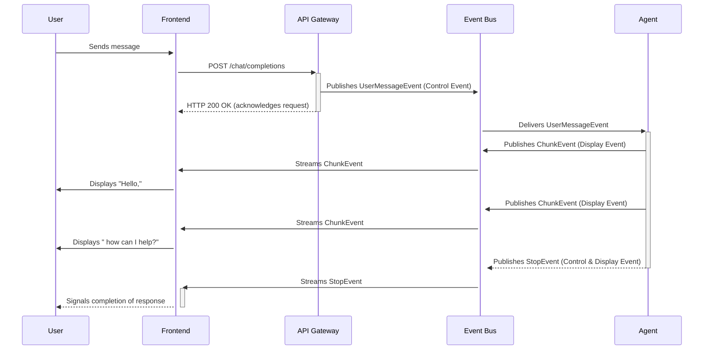
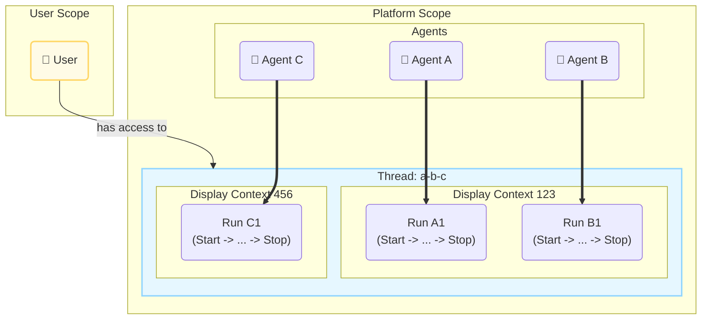
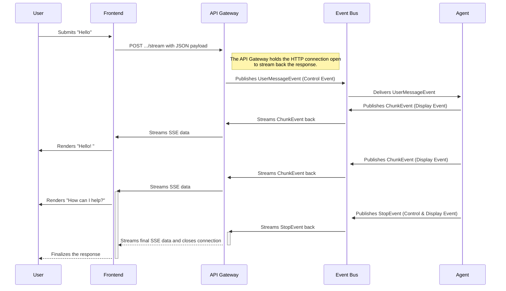
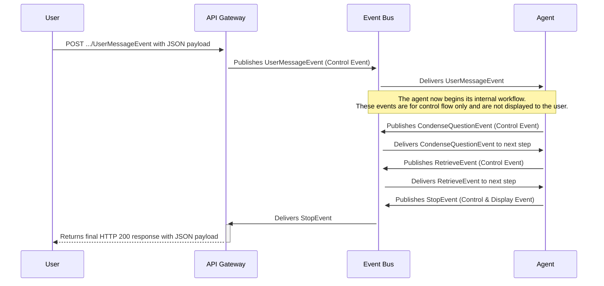
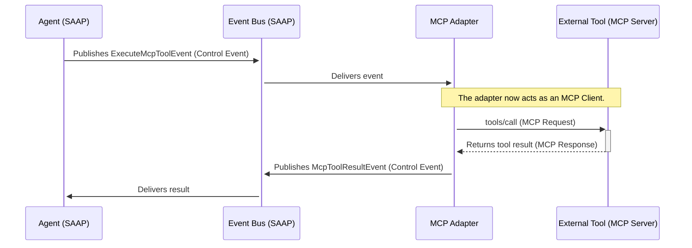
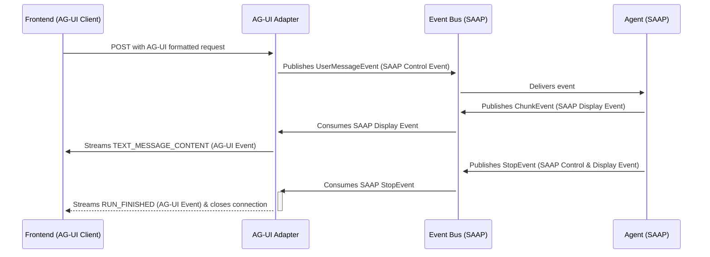

# Swiss AI Agent Protokoll

Die Infrastrukturschichten der Plattform stellen die Kernkomponenten bereit, wie den Message Bus und Datenbanken. Das
Swiss AI Agent Protokoll definiert die Regeln und Verträge, die diese Komponenten zu einem kohärenten System
zusammenarbeiten lassen. Es handelt sich um ein internes, ereignisgesteuertes Modell, das die Funktionsweise von Agents,
die Zustandsverwaltung und die Kommunikation mit der Plattform steuert. Jeder mit dem SDK erstellte Agent hält sich an
dieses Protokoll, und jede Komponente, die mit einem Agent interagiert, von der API bis zur Benutzeroberfläche, verlässt
sich darauf.

Das Folgende beschreibt die abstrakten Regeln dieses Protokolls, nicht die spezifische Python-Implementierung. Diese
Prinzipien bilden die Grundlage für den Bau von Agents, die von Design her transparent, skalierbar und resilient sind.

## Warum ein Protokoll? Engineering für autonome KI

KI-Operationen sind oft mehrstufige, asynchrone Prozesse, die mehrere Modelle, langlaufende Aufgaben und menschliche
Interaktion umfassen können. Eine traditionelle Architektur, bei der interne Komponenten über synchrone APIs
kommunizieren, kann zu einer engen Kopplung führen. Dies erschwert die Skalierung, Beobachtung und Modifikation des
Systems, da eine Änderung in einer Komponente kaskadierende Auswirkungen auf andere haben kann.

Das Swiss AI Agent Protokoll begegnet diesen Herausforderungen, indem es einen standardisierten, ereignisgesteuerten
Vertrag für asynchrone Kommunikation definiert. Es bietet eine gemeinsame Sprache für alle Plattformteilnehmer und
stellt sicher, dass Interaktionen vorhersehbar und entkoppelt sind.

### Jenseits von Chatbots: Eine Welt autonomer Agents

Agents innerhalb der Plattform sind nicht auf konversationelle Anforderungs-Antwort-Aufgaben beschränkt. Sie sind als
persistente, autonome Entitäten konzipiert, die unabhängig von jeder direkten Benutzerinteraktion agieren können. Ein
Agent könnte eine Datenquelle überwachen, einen Geschäftsprozess verwalten, dessen Abschluss Tage dauert, oder eine
geplante Analyse durchführen.

Da die operative Lebensdauer eines Agents nicht an eine einzelne Benutzeranfrage gebunden ist, kann er Minuten, Stunden
oder sogar Monate laufen. Diese persistente und autonome Natur führt zu einer Komplexität, die ein formelles
Kommunikationsprotokoll erfordert, um den Zustand zu verwalten, Sicherheit zu gewährleisten und über lange Zeiträume
eine klare Observability zu bieten.

### Die Notwendigkeit eines granularen, interoperablen Vertrags

Das Protokoll ist ein granularer Vertrag, bei dem jede bedeutsame Aktion, jeder Gedanke oder jede Zustandsänderung als
eigenständiges Ereignis definiert ist. Dieser Ansatz bietet eine hochauflösende Ansicht der Operationen eines Agents,
die für detailliertes Tracing und Debugging notwendig ist.

Diese Granularität ermöglicht auch Interoperabilität. Die Plattform kann ihren reichen internen Ereignisstrom
übersetzen, um externe Protokolle wie die OpenAI API zu unterstützen. Ein Adapter kann auf spezifische Ereignisse, wie
`ChunkEvent` oder `StopEvent`, lauschen und sie als OpenAI-kompatible Server-Sent Events neu formatieren. Dieser Prozess
verwirft alle protokollspezifischen Informationen, die das externe System nicht versteht, und ermöglicht es Clients, mit
der Plattform über vertraute Standards zu interagieren.

## Die Protokollteilnehmer und ihre Rollen

Das Protokoll definiert die Kommunikationsregeln für eine Reihe von Teilnehmern, nicht nur für die Agents. Jeder
Teilnehmer hat eine eigenständige Rolle und interagiert auf eine spezifische Weise mit dem Ereignisstrom.

### Der Agent

Der Agent ist der autonome Arbeiter des Ökosystems. Seine Rolle ist es, Geschäftslogik und komplexe Argumentation
auszuführen. Er konsumiert `Control Events`, um seine Arbeit zu starten oder fortzusetzen. Er erzeugt neue
`Control Events`, um seinen internen Workflow voranzutreiben oder Aufgaben zu delegieren, sowie einen reichhaltigen
Strom von `Display Events`, um seinen Status, seine Argumentation und seine Ergebnisse zu melden.

### Das API Gateway

Das API Gateway fungiert als sicherer Einstiegspunkt für alle externen Clients. Seine Rolle ist es, zwischen externen
Kommunikationsformaten, wie HTTP, und dem internen Protokoll zu übersetzen. Das API Gateway ist der exklusive Produzent
von initialen `Control Events`, die von außerhalb des Systems stammen. Es validiert die Benutzeridentität und
Berechtigungen, bevor es ein Ereignis an den Message Bus publiziert.

### Das Frontend

Die Benutzeroberfläche bietet eine Echtzeitansicht der Operationen eines Agents. Sie ist primär ein Konsument von
`Display Events`. Das Frontend nutzt diesen Ereignisstrom, um die Aktivität des Agents darzustellen, z.B. das Streamen
von Text oder interne Argumentationsschritte. Es erzeugt keine Ereignisse direkt, sondern initiiert Aktionen, indem es
Anfragen an das API Gateway sendet.

### Der Prozess-Orchestrator

Der Prozess-Orchestrator verwaltet hochrangige Geschäftsprozesse, die mehrere Agents, menschliche Aufgaben und externe
Systeme umfassen können. Er fungiert als spezialisierter Agent. Seine Protokollinteraktion besteht darin,
`Control Events` zu konsumieren, oft den `StopEvent` von einem Worker Agent, und dann einen neuen `Control Event` zu
erzeugen, um den nächsten Teilnehmer im Prozess auszulösen.

Das folgende Diagramm veranschaulicht einen typischen Interaktionsfluss zwischen diesen Teilnehmern.



## Scoping und Sicherheit: der hierarchische Kontext

Um langlaufende Interaktionen zu verwalten und Sicherheit zu gewährleisten, wird jedes Ereignis innerhalb des Protokolls
in einer dreistufigen Hierarchie eingeordnet. Diese Struktur ist direkt im Topic jedes auf dem Message Bus
veröffentlichten Ereignisses kodiert, was eine granulare Kontrolle über Sichtbarkeit und Zugriff ermöglicht.

### Die drei Scopes eines Ereignisses

- **`Run` Kontext**

  - **Definition:** Der granularste Scope. Ein "Run" ist eine einzelne, nachvollziehbare Ausführung eines Workflows,
    definiert durch die Abfolge von Ereignissen zwischen einem `StartEvent` und einem entsprechenden `StopEvent` oder
    `ExceptionEvent`.
  - **Zweck:** Er bietet einen eindeutigen Bezeichner für eine einzelne, vollständige Agent-Operation. Dieser Scope ist
    essenziell für Tracing und Debugging, da er die Ereignisse einer spezifischen Aufgabe isoliert.

- **`Display` Kontext**

  - **Definition:** Ein Scope, der dazu dient, mehrere `Run`s für die Präsentation in einer Benutzeroberfläche zu
    gruppieren. Er kann mehrere Agents umfassen.
  - **Zweck:** Er verwaltet, was ein Endbenutzer oder Beobachter sieht. Wenn ein Agent Arbeit an einen anderen Agent
    delegiert, kann er seinen `Display`-Kontext weitergeben. Wenn dies der Fall ist, zeigt das Frontend, das diesen
    Kontext abonniert hat, die Ereignisse beider Agents als Teil einer einzigen, nahtlosen Interaktion an. Wenn der
    primäre Agent einen neuen `Display`-Kontext für die delegierte Aufgabe erstellt, wird diese Arbeit von dieser
    spezifischen UI-Ansicht "verborgen".

- **`Thread` Kontext**

  - **Definition:** Der höchste Scope, der mehrere `Display`-Kontexte und `Run`s gruppiert, die zu einem einzigen,
    übergeordneten Ziel oder einer Konversation gehören.
  - **Zweck:** Er bewahrt die langfristige Historie und den Zustand eines Prozesses. Eine Chat-Konversation ist ein
    `Thread`. Ein autonomer Agent, der Rechnungen für einen ganzen Monat verarbeitet, könnte innerhalb eines einzigen
    `Thread`s für die Arbeit dieses Monats operieren.

Das folgende Diagramm veranschaulicht diese hierarchische Struktur.



::: details Explanation
- Die gesamte Interaktion ist in einem einzigen `Thread` enthalten, auf den der `User` Zugriff hat.
- Innerhalb dieses Threads gibt es zwei separate `Display`-Kontexte. Ein Benutzer, der `Display Context 123` beobachtet,
  würde einen nahtlosen Aktivitätsfluss sowohl von `Run A1` (ausgeführt von Agent A) als auch von `Run B1` (ausgeführt
  von Agent B) sehen. Dies ist typisch, wenn ein Agent eine Aufgabe an einen anderen delegiert.
- Der Benutzer würde keine Ereignisse von `Run C1` sehen, da es zu einem anderen `Display`-Kontext gehört, wodurch diese
  Operation von dieser spezifischen Ansicht effektiv isoliert wird.
:::

### Sicherheit durch Scoping

Dieses hierarchische Scoping ist die Grundlage des Sicherheitsmodells der Plattform. Der Zugriff wird auf der
**`Thread`**-Ebene gewährt. Ein Benutzer kann nur Ereignisse von Threads beobachten, deren Mitglied er ist.

Agents können auch in Threads ohne menschliche Mitglieder agieren. In diesem Fall können nur Administratoren mit
ausreichenden Berechtigungen für die teilnehmenden Agents die Ereignisse innerhalb dieses Threads beobachten. Dies
stellt sicher, dass autonome Backend-Prozesse sicher und isoliert bleiben.

## Die Sprache: Eine Bibliothek standardisierter Ereignisse

### Das Ereignis: Ein unveränderlicher Faktennachweis

Die fundamentale Kommunikationseinheit im Protokoll ist das **Ereignis**. Ein Ereignis ist ein strukturierter,
typisierter und unveränderlicher Datensatz, der einen eingetretenen Fakt repräsentiert. Jede Kommunikation besteht aus
zwei unterschiedlichen Teilen:

1. **Das Topic:** Die Adresse auf dem Message Bus, an die das Ereignis veröffentlicht wird. Das Topic liefert den
   vollständigen Kontext des Ereignisses, einschliesslich seines Scopes (Thread, Display, Run) und seiner Herkunft.
2. **Die Payload:** Ein eigenständiges JSON-Objekt, das die spezifischen Daten für dieses Ereignis enthält.

Das System kombiniert dieses kontextbezogene Topic und die Daten-Payload, um eine vollständige, verständliche
Kommunikation zu bilden.

#### Die Topic-Struktur

Das Topic ist eine hierarchische Zeichenkette, die Routing- und Scoping-Informationen bereitstellt. Jedes Ereignis wird
an ein Topic publiziert, das dieser Struktur folgt.

::: details Beispiel
**Topic:**

`agent.RAGAgent.wiki_agent.t948a201-....d135bfc9-....r4fg68bb-....display_event.UserMessageEvent.r4fg68bb-...`

| Segment       | Beispielwert    | Beschreibung                                                   |
| :------------ | :-------------- | :------------------------------------------------------------- |
| `agent_class` | `RAGAgent`      | Die Klasse des Agents, der publiziert oder angesprochen wird.  |
| `agent_id`    | `wiki_agent`    | Der eindeutige Bezeichner der spezifischen Agent-Instanz.      |
| `thread_id`   | `t948a201-...`  | Der Bezeichner für den übergeordneten Thread-Kontext.          |
| `display_id`  | `d135bfc9-...`  | Der Bezeichner für den UI-bezogenen Display-Kontext.           |
| `run_id`      | `r4fg68bb-...`  | Der Bezeichner für den spezifischen Run-Kontext.               |
| `event_type`  | `display_event` | Die primäre Kategorie (`control_event` oder `display_event`).  |
| `event_name`  | `ChunkEvent`    | Der spezifische Name des Ereignisses.                          |
| `event_id`    | `r4fg68bb-...`  | Ein eindeutiger Bezeichner für diese einzelne Ereignisinstanz. |
:::

##### Die Ereignis-Payload

Die Payload sind die mit dem Ereignis verbundenen Daten. Ihre Struktur wird durch den Ereignistyp definiert. Alle
Ereignisse teilen jedoch einen gemeinsamen Satz von Kernattributen.

::: details JSON
**Beispiel `UserMessageEvent` Payload:**

```json
{
  "event_id": "e423",
  "created_at": 1755015355940833270,
  "_event_name": "UserMessageEvent",
  "_parent_event_names": [
    "UserMessageEvent",
    "StartEvent",
    "ControlAndDisplayEvent",
    "ControlEvent",
    "DisplayEvent"
  ],
  "display_name": { "en": "User Request", "de": "Benutzeranfrage", "...": "..." },
  "display_description": { "en": "The agent has received a message...", "...": "..." },
  "locale": "de",
  "user": {
    "id": "cc4af21b-981a-4a76-826d-e722715082e0",
    "name": "Joel Barmettler",
    "...": "..."
  },
  "messages": [
    { "role": "system", "...": "..." },
    { "role": "user", "...": "..." }
  ]
}
```
:::

| Kern-Payload-Attribut | Beschreibung                                                                                                                                         |
| :-------------------- | :--------------------------------------------------------------------------------------------------------------------------------------------------- |
| `event_id`            | Ein eindeutiger Bezeichner für das Ereignis, passend zu dem im Topic.                                                                                |
| `created_at`          | Ein Zeitstempel mit Nanosekundenpräzision, der den Zeitpunkt der Erstellung des Ereignisses markiert.                                                |
| `_event_name`         | Der spezifische Klassenname des Ereignisses. Dieser wird von Abonnenten verwendet, um die Payload in das korrekte Datenobjekt zu deserialisieren.    |
| `_parent_event_names` | Eine Liste der Elterntypen des Ereignisses in seiner Vererbungshierarchie, die das Filtern und Routen basierend auf breiteren Kategorien ermöglicht. |
| `display_name`        | Ein menschenlesbarer Name für das Ereignis, mit Unterstützung für mehrere Locales.                                                                   |
| `display_description` | Eine menschenlesbare Beschreibung dessen, was das Ereignis darstellt, mit Unterstützung für mehrere Locales.                                         |

Die restlichen Felder in der Payload sind spezifisch für den Typ des Ereignisses. Für dieses `UserMessageEvent` umfasst
die Payload `locale`, die `user`-Identität und die `messages`-Historie. Andere Ereignistypen werden unterschiedliche
Datenfelder haben, die für ihren Zweck relevant sind.

### Die Kernkategorien: Control vs. Display

Um sicherzustellen, dass Agent-Workflows vorhersehbar sind und die Beobachtung die Ausführung nicht stört, kategorisiert
das Protokoll jedes Ereignis streng. Die Payload jedes Ereignisses enthält eine `_parent_event_names`-Liste, die
deklariert, ob es zur Kategorie `ControlEvent` oder `DisplayEvent` gehört, oder zu beiden.

#### Control Events (Anweisungen)

Control Events steuern den Workflow und verursachen Zustandsänderungen. Das Protokoll schreibt vor, dass **nur ein
`Control Event` die Ausführung eines Agent-Schritts auslösen kann.** Sie repräsentieren Befehle, abgeschlossene Aufgaben
oder Antworten, die den Agent dazu auffordern, mit der nächsten logischen Operation fortzufahren.

- **Beispiel:** Ein `UserMessageEvent` ist ein `Control Event`, weil es einen Agent anweist, einen neuen Run zu starten.
  Ein `HumanInTheLoopResponseEvent` ist ein `Control Event`, weil es die notwendige Eingabe für einen pausierten
  Workflow liefert, um fortzufahren.

#### Display Events (Kommentare)

Display Events sind rein informativ und für die Beobachtung durch Benutzer oder Überwachungssysteme gedacht. Das
Protokoll schreibt vor, dass **ein `Display Event` niemals den logischen Fluss des Workflows eines Agents beeinflussen
darf.** Ihr Zweck ist es, eine Echtzeit-Erzählung des internen Zustands, des Denkprozesses oder partieller Ergebnisse
des Agents zu liefern. Diese Trennung stellt sicher, dass ein Fehler in einer UI- oder Logging-Komponente die Kernlogik
des Agents nicht unterbrechen kann.

- **Beispiel:** Ein `ThoughtEvent` bietet einen Einblick in die Argumentation des Agents. Ein `ChunkEvent` streamt einen
  Teil einer Textantwort an die Benutzeroberfläche.

Einige Ereignisse können beide Funktionen erfüllen. Zum Beispiel ist ein `StopEvent` ein `Control Event`, weil es den
Workflow-Run beendet, aber es ist auch ein `Display Event`, weil die Benutzeroberfläche darüber informiert werden muss,
dass der Prozess abgeschlossen ist. Solche Ereignisse halten sich an die Regeln beider Kategorien.

### Die Kernereignisbibliothek

Das Protokoll definiert eine Standardbibliothek von Ereignistypen für gängige Operationen in KI- und Agenten-Systemen.
Während Entwickler benutzerdefinierte Ereignisse erstellen können, um domänenspezifische Logik zu behandeln, bietet
diese Kernbibliothek die wesentlichen Bausteine für die Verwaltung von Workflow-Lebenszyklen, die Interaktion mit
Benutzern und die Sicherstellung der Observability.

Die folgenden Tabellen dienen als Referenz für die gängigsten Ereignisse, kategorisiert nach ihrer Funktion.

#### Lebenszyklus-Ereignisse

Diese Ereignisse verwalten den Status eines einzelnen Workflow-`Run`s.

| Ereignis             | Kategorie         | Zweck                                                                                                              |
| :------------------- | :---------------- | :----------------------------------------------------------------------------------------------------------------- |
| **`StartEvent`**     | Control & Display | Signalisiert den Beginn eines neuen Workflow-Runs und trägt dessen initialen Kontext.                              |
| **`StopEvent`**      | Control & Display | Signalisiert den erfolgreichen Abschluss eines Workflow-Runs. Keine weiteren Schritte werden ausgeführt.           |
| **`ExceptionEvent`** | Control & Display | Signalisiert, dass während eines Runs ein nicht behebbarer Fehler aufgetreten ist, der zu dessen Beendigung führt. |

#### Benutzerinteraktions-Ereignisse

Diese Ereignisse verarbeiten direkte Eingaben von menschlichen Benutzern.

| Ereignis               | Kategorie         | Zweck                                                                                                                                        |
| :--------------------- | :---------------- | :------------------------------------------------------------------------------------------------------------------------------------------- |
| **`UserMessageEvent`** | Control & Display | Ein spezialisiertes `StartEvent`, das durch eine Benutzernachricht ausgelöst wird. Es enthält die Nachrichtenhistorie und Benutzeridentität. |

#### Streaming- und Reasoning-Ereignisse

Diese `Display Events` liefern Echtzeit-Updates an Benutzeroberflächen über die interne Verarbeitung eines Agents.

| Ereignis           | Kategorie | Zweck                                                                                                                                     |
| :----------------- | :-------- | :---------------------------------------------------------------------------------------------------------------------------------------- |
| **`ChunkEvent`**   | Display   | Enthält einen kleinen Teil einer größeren Textantwort, was token-weise Streaming an die UI ermöglicht.                                    |
| **`ThoughtEvent`** | Display   | Bietet eine textuelle Beschreibung der internen Argumentation oder aktuellen Aktion des Agents, was Transparenz in seinen Prozess bringt. |

##### **Observability- und Tracing-Ereignisse**

Diese Ereignisse liefern detaillierte Telemetriedaten für Überwachung, Debugging und Kostenmanagement. Sie sind
typischerweise `Display Events`, können aber manchmal auch `Control Events` sein.

| Ereignis             | Kategorie         | Zweck                                                                                                                                      |
| :------------------- | :---------------- | :----------------------------------------------------------------------------------------------------------------------------------------- |
| **`LLMEvent`**       | Control & Display | Erfasst die Details eines Aufrufs an ein grosses Sprachmodell (Large Language Model), einschliesslich Prompt, Antwort und Aufrufparameter. |
| **`RetrieverEvent`** | Control & Display | Erfasst die Ergebnisse einer Retrieval-Operation aus einer Wissensdatenbank, einschliesslich der abgerufenen Dokumente.                    |
| **`LLMCostEvent`**   | Display           | Erfasst die berechneten Kosten einer LLM-Interaktion, einschliesslich Token-Zählungen und zugehöriger Ausgaben.                            |

#### Asynchrone Interaktionsmuster-Ereignisse

Diese Ereignisse verwalten komplexe, mehrstufige Interaktionen, die das Pausieren und Fortsetzen eines Workflows
erfordern.

| Ereignis                          | Kategorie         | Zweck                                                                                                              |
| :-------------------------------- | :---------------- | :----------------------------------------------------------------------------------------------------------------- |
| **`HumanInTheLoopRequestEvent`**  | Control & Display | Pausiert den Workflow und sendet eine Anfrage an einen menschlichen Benutzer zur Eingabe oder Genehmigung.         |
| **`HumanInTheLoopResponseEvent`** | Control & Display | Enthält die Antwort eines menschlichen Benutzers, wodurch der pausierte Workflow fortgesetzt werden kann.          |
| **`AgentInTheLoopRequestEvent`**  | Control & Display | Pausiert den Workflow und delegiert eine Aufgabe an einen anderen Agent.                                           |
| **`AgentInTheLoopResponseEvent`** | Control & Display | Enthält das finale `StopEvent` des delegierten Agents, wodurch der ursprüngliche Workflow fortgesetzt werden kann. |

## Protokoll in Aktion: Sequenzdiagramme

Dieser Abschnitt bietet schrittweise Durchgänge gängiger Interaktionen, um zu veranschaulichen, wie die Teilnehmer und
Ereignisse des Protokolls in der Praxis zusammenwirken. Die folgenden Sequenzdiagramme visualisieren den Ereignisfluss
zwischen den Teilnehmern während dieser Interaktionen.

::: warning
`ThreadId`, `DisplayId`, `RunId` und `EventId` sind ObjectIds. Für die Zwecke dieser Dokumentation werden sie jedoch als
Zeichenketten dargestellt, die mit dem Präfix `t` für Thread, `d` für Display, `r` für Run und `e` für Event beginnen.
:::

### Beispiel: Eine einfache Benutzeranfrage

Dieses Szenario zeichnet den Lebenszyklus einer einzelnen Benutzernachricht nach, von der initialen HTTP-Anfrage bis zur
finalen gestreamten Antwort. Es demonstriert, wie eine synchrone Anfrage durch den asynchronen, ereignisgesteuerten Kern
der Plattform verarbeitet wird.



#### Schritt 1: Der Benutzer sendet eine Nachricht

Der Benutzer gibt "Hello" in die Chat-Oberfläche ein. Das Frontend packt dies in eine HTTP-Anfrage an einen dynamischen
Endpunkt auf dem API Gateway. Der `/stream`-Suffix zeigt an, dass der Client eine Streaming-Antwort erwartet.

::: details Request / Response Details
**HTTP-Anfrage:** `POST /agents/MyChatAgent/dev_agent/UserMessageEvent/stream`

**Anfrage-Body:**

```json
{
  "messages": [
    { "role": "user", "content": "Hello" }
  ]
}
```
:::

#### Schritt 2: Das API Gateway initiiert den Workflow

Das API Gateway authentifiziert den Benutzer, erstellt einen neuen `Run`- und `Display`-Kontext und übersetzt die
HTTP-Anfrage in ein `UserMessageEvent`. Es veröffentlicht dann dieses `Control Event` an den Event Bus auf einem präzise
strukturierten Topic.

::: details NATS Topic & Event Payload
**NATS Topic:** `agent.MyChatAgent.dev_agent.t948.d135.r4fg.control_event.UserMessageEvent.e423`

**Event Payload:**

```json
{
  "event_id": "e423",
  "created_at": 1755015355940833270,
  "_event_name": "UserMessageEvent",
  "_parent_event_names": ["UserMessageEvent", "StartEvent", "ControlAndDisplayEvent", "ControlEvent", "DisplayEvent"],
  "locale": "en",
  "user": { "id": "cc4af21b-981a-4a76-826d-e722715082e0", "name": "Test User" },
  "messages": [{ "role": "user", "content": "Hello" }]
}
```
:::

Eine `Agent`-Instanz, die dieses Topic abonniert hat, konsumiert das Ereignis, was den Start ihres Workflows auslöst.

#### Schritt 3: Der Agent streamt die Antwort zurück

Während der Agent die Anfrage verarbeitet, generiert er Ergebnisse und veröffentlicht `Display Events`, sobald diese
verfügbar sind. Das API Gateway empfängt diese Ereignisse vom Bus und streamt nur deren Payload als Server-Sent Events
(SSE) zurück an das Frontend.

::: details NATS Topic & Event Payload (Erster Chunk)
**NATS Topic:**

`agent.MyChatAgent.dev_agent.t948.d135.r4fg.display_event.ChunkEvent.e453`

**SSE Stream zum Frontend:**

```
data: {"event_id":"e453","created_at":1755015356940833271,"_event_name":"ChunkEvent","_parent_event_names":["ChunkEvent","DisplayEvent"],"display_name":{"en":"Chunk"},"display_description":{"en":"A chunk of a larger response."},"content":"Hello! "}\n\n
```
:::

::: details NATS Topic & Event Payload (Zweiter Chunk)
**NATS Topic:**

`agent.MyChatAgent.dev_agent.t948.d135.r4fg.display_event.ChunkEvent.e545`

**SSE Stream zum Frontend:**

```
data: {"event_id":"e545","created_at":1755015357940833272,"_event_name":"ChunkEvent","_parent_event_names":["ChunkEvent","DisplayEvent"],"display_name":{"en":"Chunk"},"display_description":{"en":"A chunk of a larger response."},"content":"How can I help?"}\n\n
```
:::

#### Schritt 4: Der Agent beendet den Run

Sobald der Agent die Generierung seiner Antwort abgeschlossen hat, veröffentlicht er ein finales `StopEvent`.

::: details NATS Topic & Event Payload
**NATS Topic:**

`agent.MyChatAgent.dev_agent.t948.d135.r4fg.display_event.StopEvent.e598`

**SSE Stream zum Frontend:**

```
data: {"event_id":"e598","created_at":1755015358940833273,"_event_name":"StopEvent","_parent_event_names":["StopEvent","ControlAndDisplayEvent","ControlEvent","DisplayEvent"],"display_name":{"en":"Stop"},"display_description":{"en":"Signals the end of a run."}}\n\n
```
:::

Nach dem Streamen dieses finalen Ereignisses schliesst das API Gateway die HTTP-Verbindung. Das Frontend finalisiert die
Anzeige, und die Interaktion ist abgeschlossen.

### Beispiel: Ein Agent mit internem Workflow

Dieses Szenario demonstriert, wie ein Agent einen mehrstufigen internen Prozess ausführen kann, ohne seine
Zwischenschritte dem Endbenutzer preiszugeben. Der Benutzer sendet eine einzige Anfrage und erhält eine einzige, finale
Antwort. Dies wird erreicht durch die Verwendung von `Control Events` für interne Zustandsübergänge und einem finalen
`Display Event` für das Ergebnis.



#### Schritt 1: Der Benutzer sendet eine Anfrage

Der Benutzer stellt eine Frage, die den Agent dazu auffordert, Informationen abzurufen. Der Client sendet eine
standardmässige, nicht-streamende HTTP-Anfrage.

::: details Request / Response Details
**HTTP-Anfrage:**

```
POST /agents/RAGAgent/prod_rag/UserMessageEvent
```

**Anfrage-Body:**

```json
{
  "messages": [
    { "role": "user", "content": "What is the Swiss AI Hub?" }
  ]
}
```
:::

#### Schritt 2: Das API Gateway initiiert den Workflow

Das Gateway erstellt die notwendigen Kontexte und veröffentlicht das `UserMessageEvent`. Das API Gateway hält die
HTTP-Verbindung offen und wartet auf ein finales Ereignis, um die Antwort zu bilden.

::: details NATS Topic & Event Payload
**NATS Topic:**

`agent.RAGAgent.prod_rag.t948.d135.r4fg.control_event.UserMessageEvent.e423`

**Event Payload:**

```json
{
  "event_id": "e423",
  "created_at": 1755015355940833270,
  "_event_name": "UserMessageEvent",
  "_parent_event_names": ["UserMessageEvent", "StartEvent", "ControlAndDisplayEvent", "ControlEvent", "DisplayEvent"],
  "messages": [{ "role": "user", "content": "What is the Swiss AI Hub?" }]
}
```
:::

#### Schritt 3: Der Agent führt seinen internen Workflow aus

Der Agent konsumiert das `UserMessageEvent` und beginnt eine Abfolge interner Schritte. Jeder Schritt kommuniziert mit
dem nächsten, indem er ein `Control Event` veröffentlicht.

::: details NATS Topic & Event Payload (Erster interner Schritt)
**Frage verdichten:** **NATS Topic:**

`agent.RAGAgent.prod_rag.t948.d135.r4fg.control_event.CondenseQuestionEvent.e453`

**Event Payload:**

```json
{
  "event_id": "e453",
  "created_at": 1755015356940833271,
  "_event_name": "CondenseQuestionEvent",
  "_parent_event_names": ["CondenseQuestionEvent", "ControlEvent"],
  "condensed_question": "Definition and purpose of the Swiss AI Hub"
}
```
:::

::: details NATS Topic & Event Payload (Zweiter interner Schritt)
**Dokumente abrufen:** **NATS Topic:**

`agent.RAGAgent.prod_rag.t948.d135.r4fg.control_event.RetrieveEvent.e545`

**Event Payload:**

```json
{
  "event_id": "e545",
  "created_at": 1755015357940833272,
  "_event_name": "RetrieveEvent",
  "_parent_event_names": ["RetrieveEvent", "ControlEvent"],
  "nodes": [ { "id": "doc-1", "content": "The Swiss AI Hub is an open..." } ]
}
```
:::

Da dies **nur `Control Events`** und keine `Display Events` sind, werden sie nicht an das API Gateway oder einen
beobachtenden Client gestreamt. Sie existieren nur auf dem internen Event Bus, um die Logik des Agents zu orchestrieren.

#### Schritt 4: Der Agent gibt das Endergebnis zurück

Nach dem letzten internen Schritt generiert der Agent eine vollständige Antwort und veröffentlicht sie innerhalb eines
`StopEvent`. Dieses Ereignis ist sowohl ein `Control Event` (beendet den Run) als auch ein `Display Event`.

::: details NATS Topic & Event Payload
**NATS Topic:**

`agent.RAGAgent.prod_rag.t948.d135.r4fg.display_event.StopEvent.e598`

**Event Payload:**

```json
{
  "event_id": "e598",
  "created_at": 1755015358940833273,
  "_event_name": "StopEvent",
  "_parent_event_names": ["StopEvent", "ControlAndDisplayEvent", "ControlEvent", "DisplayEvent"],
  "content": "The Swiss AI Hub is an open AI platform that you own and control."
}
```
:::

Das API Gateway empfängt dieses einzelne `Display Event`, verwendet dessen Payload, um die finale HTTP-Antwort zu
konstruieren, und sendet sie an den Client zurück, wodurch die Verbindung geschlossen wird.

::: details HTTP Response Body
**HTTP-Antwort-Body:**

```json
{
  "event_id": "e598",
  "created_at": 1755015358940833273,
  "_event_name": "StopEvent",
  "_parent_event_names": ["StopEvent", "ControlAndDisplayEvent", "ControlEvent", "DisplayEvent"],
  "content": "The Swiss AI Hub is an open AI platform that you own and control."
}
```
:::

## Agent2Agent Protokoll

Um die Designentscheidungen hinter dem Swiss AI Agent Protokoll besser zu verstehen, ist es nützlich, es mit anderen
Standards im Agenten-Ökosystem zu vergleichen. Das Agent2Agent (A2A) Protokoll, ein offener Standard für die
Kommunikation zwischen unabhängigen KI-Agents, dient als ausgezeichneter Referenzpunkt. Obwohl beide Protokolle
ereignisgesteuert und für asynchrone Operationen konzipiert sind, lösen sie unterschiedliche Probleme und operieren auf
unterschiedlichen Ebenen.

### Kernphilosophie und Scope

Der fundamentalste Unterschied liegt in ihrem beabsichtigten Scope.

- **Das A2A Protokoll** ist für **externe Interoperabilität** konzipiert. Sein primäres Ziel ist es, Agents, die von
  verschiedenen Anbietern auf verschiedenen Plattformen erstellt wurden, die Kommunikation untereinander über das
  öffentliche Internet oder innerhalb eines Unternehmensnetzwerks zu ermöglichen. Es behandelt jeden Agent als einen
  undurchsichtigen, unabhängigen Service.

- **Das Swiss AI Agent Protokoll** ist für **interne Kohäsion** konzipiert. Es ist die private, interne Sprache, die
  alle Komponenten *innerhalb* einer einzigen, kohärenten Swiss AI Hub Instanz orchestriert. Seine primären Ziele sind
  eine extreme Entkopplung interner Komponenten, tiefe Observability und die Verwaltung langlaufender, autonomer
  Prozesse innerhalb der sicheren Grenze der Plattform.

### Architekturmodell

Die beiden Protokolle basieren auf unterschiedlichen Architekturmustern.

- **A2A** verwendet ein **Client-Server-Modell** über Standard-Webtransporte (HTTP mit JSON-RPC, gRPC oder REST). Ein
  A2A Client stellt eine direkte Anfrage an einen A2A Server, der dann eine spezifische `Task` verwaltet. Dies ist ein
  Punkt-zu-Punkt-Interaktionsmodell.

- **Das Swiss AI Agent Protokoll** verwendet ein **Publish-Subscribe-Modell** über einen zentralen Message Bus (NATS).
  Teilnehmer veröffentlichen Ereignisse an den Bus, ohne Kenntnis der Abonnenten. Beliebig viele andere Teilnehmer –
  seien es andere Agents, das API Gateway oder Logging-Services – können diese Ereignisse abonnieren. Dies ist ein
  broadcast-basiertes, Viele-zu-Viele-Interaktionsmodell.

### Zustandsverwaltung

Ihre Ansätze zur Verwaltung des Operationszustands unterscheiden sich erheblich.

- **In A2A** ist der Server-seitige Agent **stateful**. Er erstellt und verwaltet ein `Task`-Objekt, das einen
  definierten Lebenszyklus durchläuft (`submitted`, `working`, `completed`, etc.). Der Zustand der Interaktion wird vom
  Remote Agent gehalten.

- **Im Swiss AI Agent Protokoll** ist der Code des Agents **stateless**. Der Zustand eines `Run`s ist externalisiert und
  wird von der Infrastruktur der Plattform verwaltet. Die Ereignishistorie wird unveränderlich im Stream des Message Bus
  (JetStream) gespeichert, und ephemerer Kontext wird in einem verteilten Speicher (Redis) gehalten. Dies ermöglicht es
  jeder verfügbaren Agent-Instanz, jedes Ereignis in einem Workflow zu verarbeiten, was hohe Skalierbarkeit und
  Resilienz ermöglicht.

### Datenmodell und Granularität

Die Struktur der Kommunikation selbst spiegelt ihre unterschiedlichen Ziele wider.

- **A2A** definiert eine Reihe von RPC-Methoden (`message/send`, `tasks/get`) und Datenobjekten (`Task`, `Message`,
  `Part`, `Artifact`). Diese Struktur ist gut geeignet für ein Remote Procedure Call-System, bei dem ein Client eine
  Aufgabe auf einem Server verwaltet.

- **Das Swiss AI Agent Protokoll** ist granularer und konzentriert sich auf die strikte Unterscheidung zwischen
  `Control Events` und `Display Events`. Dieser hochauflösende Ereignisstrom ist für maximale interne Observability
  konzipiert. Jeder interne Schritt, Gedanke und Zustandsübergang kann ein individuelles Ereignis sein, das einen
  vollständigen Audit Trail der Agent-Ausführung liefert.

### Discovery-Mechanismus

Wie Teilnehmer voneinander erfahren, ist ein weiterer wichtiger Unterschied.

- **A2A** basiert auf einer statischen **`AgentCard`**. Dies ist ein JSON-Dokument, das oft unter einem bekannten URI
  gehostet wird und als digitale Visitenkarte dient, die die Fähigkeiten, den Endpunkt und die
  Authentifizierungsanforderungen des Agents beschreibt.

- **Das Swiss AI Agent Protokoll** verwendet **dynamische Echtzeit-Discovery**. Das API Gateway sendet periodisch eine
  Discovery-Anfrage auf dem internen Message Bus. Alle laufenden Agents antworten, wodurch das Gateway seine eigenen
  sicheren, typensicheren REST-Endpunkte dynamisch und spontan generieren und registrieren kann.

### Zusammenfassung der Unterschiede

| Aspekt            | Swiss AI Agent Protokoll                                | A2A Protokoll                                                   |
| :---------------- | :------------------------------------------------------ | :-------------------------------------------------------------- |
| **Primäres Ziel** | Interne Kohäsion, Observability und Kontrolle           | Externe Interoperabilität zwischen unabhängigen Agents          |
| **Architektur**   | Publish-Subscribe (via Message Bus)                     | Client-Server (via HTTP/gRPC/REST)                              |
| **Zustand**       | Agent-Code ist stateless; Zustand externalisiert        | Remote Agent ist stateful; verwaltet ein `Task`-Objekt          |
| **Dateneinheit**  | `Event` (Control vs. Display)                           | `Task`, `Message`, `Part`, `Artifact`                           |
| **Granularität**  | Sehr hoch; jeder interne Schritt kann ein Ereignis sein | Höhere Ebene; konzentriert sich auf Task-Zustand und Ergebnisse |
| **Discovery**     | Dynamisch; API-Endpunkte werden zur Laufzeit generiert  | Statisch; basiert auf einer veröffentlichten `AgentCard`        |

### Interoperabilität und Koexistenz

Das Swiss AI Agent Protokoll und das A2A Protokoll schliessen sich nicht gegenseitig aus; sie ergänzen sich und können
zusammenarbeiten. Das Swiss AI Agent Protokoll regelt die internen Abläufe der Plattform, während A2A für die
Kommunikation mit der Aussenwelt verwendet werden kann.

Eine Swiss AI Hub Instanz könnte einen **A2A Adapter Agent** bereitstellen. Dieser spezialisierte Agent würde als Brücke
fungieren:

1. **Extern** würde er einen Standard-A2A-Endpunkt und eine `AgentCard` präsentieren und so der Aussenwelt als konformer
   A2A Agent erscheinen.
2. **Intern** wäre er ein Teilnehmer des Swiss AI Agent Protokolls.

Wenn dieser Adapter Agent eine A2A `message/send`-Anfrage empfängt, würde er diese Anfrage in ein internes `StartEvent`
übersetzen und an den Bus veröffentlichen, um einen anderen, internen Agent auszulösen. Er würde dann den resultierenden
Strom interner `Display Events` und `StopEvent`s abonnieren, diese zurück in A2A `Task`-Updates und `Artifacts`
übersetzen, um sie an den externen A2A Client zurückzusenden.

Dieser Ansatz ermöglicht es dem Swiss AI Hub, von seiner hochgradig beobachtbaren und skalierbaren internen Architektur
zu profitieren, während er gleichzeitig offen an einem breiteren, interoperablen Ökosystem von KI-Agents teilnimmt.

## Model Context Protokoll (MCP)

Das Model Context Protokoll (MCP) ist ein Open-Source-Standard zur Verbindung von KI-Anwendungen mit externen Systemen
wie Datenquellen, Tools und Workflows. Während sowohl das Swiss AI Agent Protokoll als auch MCP die Kommunikation in
KI-Systemen erleichtern, sind sie darauf ausgelegt, unterschiedliche Probleme zu lösen und auf unterschiedlichen
Architekturschichten zu operieren. Sie sind komplementär, nicht konkurrierend.

### Kernphilosophie und Scope

Der primäre Unterschied liegt in ihrem beabsichtigten Scope und Zweck.

- **MCP** ist darauf ausgelegt, **einen Agent mit seinen Tools zu verbinden**. Es standardisiert, wie eine KI-Anwendung
  (ein MCP Host) externe Funktionen (die von MCP Servern bereitgestellt werden) entdeckt und mit ihnen interagiert. Sein
  Fokus liegt darauf, Kontext bereitzustellen und die Ausführung von Aktionen in der Aussenwelt zu ermöglichen.

- **Das Swiss AI Agent Protokoll** ist darauf ausgelegt, **die internen Komponenten der Plattform zu orchestrieren**. Es
  ist die private Sprache, die regelt, wie autonome Agents, APIs und andere Services innerhalb einer Swiss AI Hub
  Instanz zusammenarbeiten. Sein Fokus liegt auf dem Lebenszyklus, der Zustandsverwaltung und der Observability interner
  Prozesse.

### Architekturmodell

Die Protokolle basieren auf unterschiedlichen Interaktionsmustern.

- **MCP** verwendet ein **Client-Server-Modell**. Ein MCP Host (die KI-Anwendung) erstellt für jeden MCP Server, mit dem
  er kommunizieren muss, einen dedizierten MCP Client. Die Interaktion ist eine direkte Punkt-zu-Punkt-Verbindung, bei
  der der Client Funktionen vom Server anfordert.

- **Das Swiss AI Agent Protokoll** verwendet ein **Publish-Subscribe-Modell** über einen zentralen Message Bus.
  Teilnehmer veröffentlichen Ereignisse, ohne zu wissen, wer zuhört. Dies ermöglicht ein entkoppeltes
  Viele-zu-Viele-Kommunikationsmuster, bei dem mehrere Komponenten auf ein einzelnes Ereignis reagieren können.

### Datenmodell und Primitive

Ihre Datenmodelle sind auf ihre jeweiligen Funktionen zugeschnitten.

- **MCP** definiert eine Reihe von Primitiven, die ein Server bereitstellen kann: `Tools` (ausführbare Funktionen),
  `Resources` (Nur-Lese-Daten) und `Prompts` (wiederverwendbare Vorlagen). Das Protokoll konzentriert sich darauf, dass
  die KI-Anwendung diese Funktionen entdeckt und dann nutzt.

- **Das Kern-Primitiv des Swiss AI Agent Protokolls** ist das `Event`, streng kategorisiert in `Control Events` (die die
  Logik steuern) und `Display Events` (die Observability bieten). Das Protokoll konzentriert sich auf den Fluss dieser
  Ereignisse, um Zustandsübergänge zu verwalten und über Aktivitäten innerhalb eines verteilten Systems zu berichten.

### Zusammenfassung der Unterschiede

| Aspekt            | Swiss AI Agent Protokoll                                        | Model Context Protokoll (MCP)                                   |
| :---------------- | :-------------------------------------------------------------- | :-------------------------------------------------------------- |
| **Primäres Ziel** | Interne Orchestrierung und Observability                        | Verbindung eines Agents mit externen Tools und Daten            |
| **Architektur**   | Publish-Subscribe (via Message Bus)                             | Client-Server (direkte Verbindungen)                            |
| **Interaktion**   | Viele-zu-Viele, Broadcast-basiert                               | Eins-zu-Eins, Anfrage-Antwort                                   |
| **Kern-Primitiv** | Das `Event` (Control vs. Display)                               | `Tool`, `Resource`, `Prompt`                                    |
| **Zweck**         | Verwaltung des internen Zustands und Flusses autonomer Prozesse | Bereitstellung von Funktionen und Kontext für eine KI-Anwendung |

### Interoperabilität und Koexistenz

Die beiden Protokolle können effektiv koexistieren und sich gegenseitig ergänzen. Ein Swiss AI Hub Agent kann als MCP
Host fungieren, um mit externen Tools zu interagieren.

Dies wird durch die Erstellung eines **MCP Adapters** innerhalb des Workflows des Agents erreicht. Der Adapter ist eine
Komponente, die zwischen den beiden Protokollen übersetzt.



In diesem Fluss:

1. Ein interner Agent, der auf dem Swiss AI Agent Protokoll operiert, entscheidet, dass er ein externes Tool verwenden
   muss. Er veröffentlicht ein `Control Event` (z.B. `ExecuteMcpToolEvent`), das den Tool-Namen und die Argumente
   enthält.
2. Der `McpAdapter`, der solche Ereignisse abonniert hat, konsumiert es.
3. Der Adapter fungiert dann als MCP Client und sendet eine Standard `tools/call` JSON-RPC Anfrage an den externen MCP
   Server.
4. Wenn der MCP Server antwortet, verpackt der Adapter das Ergebnis in ein neues internes `Control Event` (z.B.
   `McpToolResultEvent`) und veröffentlicht es zurück an den Event Bus.
5. Der ursprüngliche Agent oder ein anderer abonnierter Agent konsumiert das Ergebnis und setzt seinen Workflow fort.

Dieses Muster ermöglicht es Agents innerhalb des Swiss AI Hub, das reiche Ökosystem externer Tools und Datenquellen, die
über MCP verfügbar sind, zu nutzen und gleichzeitig von der robusten internen Orchestrierung, Sicherheit und
Observability zu profitieren, die das Swiss AI Agent Protokoll bietet.

## Agent User Interaction Protokoll (AG-UI)

Das Agent User Interaction Protokoll (AG-UI) ist ein offener Standard, der speziell entwickelt wurde, um die
Kommunikation zwischen Frontend-Anwendungen und KI-Agents zu standardisieren. Es konzentriert sich auf die
Interaktivitätsebene zwischen Agent und Benutzer. Wie die anderen besprochenen Protokolle ist AG-UI komplementär zum
Swiss AI Agent Protokoll und adressiert einen anderen Teil der gesamten Systemarchitektur.

### Kernphilosophie und Scope

Die Protokolle sind mit unterschiedlichen Scopes und Zielen konzipiert.

- **AG-UI** ist ein **Präsentationsschicht-Protokoll**. Sein ausschliesslicher Fokus liegt darauf, einen
  standardisierten Echtzeit-Kommunikationskanal zwischen einem KI-Agent und einer Client-Anwendung (der
  Benutzeroberfläche) zu schaffen. Es definiert ein Vokabular für das Streamen von UI-Updates, die Verwaltung des
  gemeinsamen UI-Zustands und die Abwicklung von Human-in-the-Loop-Interaktionen.

- **Das Swiss AI Agent Protokoll** ist ein **Full-Stack, internes Orchestrierungsprotokoll**. Es regelt die
  Kommunikation zwischen *allen* internen Komponenten der Plattform, nicht nur die Verbindung zur UI. Sein Scope umfasst
  Agent-zu-Agent-Delegation, Prozess-Orchestrierung und die Verwaltung langlaufender, autonomer Aufgaben, die
  möglicherweise überhaupt keine UI haben.

### Architekturmodell

Ihre Architekturmodelle spiegeln ihre unterschiedlichen Scopes wider.

- **AG-UI** definiert ein **Client-Server-Modell für den UI-Kanal**. Ein AG-UI Client (im Frontend) verbindet sich mit
  einem AG-UI-kompatiblen Agent oder Server. Das Protokoll standardisiert die Ereignisse, die über diese spezifische
  Verbindung fliessen.

- **Das Swiss AI Agent Protokoll** verwendet ein **plattformweites Publish-Subscribe-Modell**. Ereignisse werden an
  einen zentralen Message Bus gesendet und können von jedem autorisierten Teilnehmer konsumiert werden. Das API Gateway
  fungiert als Brücke zum Frontend, aber das Protokoll selbst regelt das gesamte interne Ökosystem.

### Tool- und Zustandsverwaltung

Die beiden Protokolle haben grundsätzlich unterschiedliche Philosophien bezüglich Tools und Zustand.

- **In AG-UI** sind Tools **Frontend-definiert**. Die Client-Anwendung deklariert, welche Tools verfügbar sind, und
  übergibt sie dem Agent während eines Runs. Der Agent kann dann diese Tools aufrufen, aber die Implementierung und
  Ausführung erfolgen auf Client-Seite. Die Zustandsverwaltung ist ebenfalls UI-zentrisch, mit `STATE_SNAPSHOT`- und
  `STATE_DELTA`-Ereignissen, die speziell darauf ausgelegt sind, die UI eines Clients mit dem Agent synchron zu halten.

- **Im Swiss AI Agent Protokoll** sind die Fähigkeiten eines Agents **Backend-definiert** und seiner Implementierung
  inhärent. Die Tools und die Logik des Agents sind Teil seines eigenen sicheren Backend-Services. Die
  Zustandsverwaltung ist allgemeiner gehalten, mit `RunContext` und `ThreadContext`, die darauf ausgelegt sind, den
  persistenten Zustand langlaufender Backend-Prozesse zu verwalten, nicht nur die UI-Synchronisation.

### Ereignismodell

Obwohl beide ereignisgesteuert sind, sind ihre Ereignisvokabulare für unterschiedliche Zwecke zugeschnitten.

- **AG-UI** spezifiziert einen prägnanten Satz von etwa 16 Ereignistypen (z.B. `TEXT_MESSAGE_CHUNK`, `TOOL_CALL_START`,
  `STATE_DELTA`), die direkt auf gängige UI-Rendering- und Interaktivitätsbedürfnisse abgebildet sind.

- **Das Swiss AI Agent Protokoll** verfügt über eine umfangreiche und erweiterbare Ereignisbibliothek. Sein wesentlicher
  Unterschied ist die strikte Trennung von `Control Events` und `Display Events`, die komplexe interne Workflows
  ermöglicht, die von dem, was dem Benutzer angezeigt wird, entkoppelt sind.

### Zusammenfassung der Unterschiede

| Aspekt             | Swiss AI Agent Protokoll                                           | Agent User Interaction Protokoll (AG-UI)                  |
| :----------------- | :----------------------------------------------------------------- | :-------------------------------------------------------- |
| **Primäres Ziel**  | Full-Stack interne Orchestrierung und Kontrolle                    | Standardisierung der Agent-zu-UI-Kommunikationsverbindung |
| **Scope**          | Gesamte interne Plattform                                          | Die Präsentationsschicht                                  |
| **Architektur**    | Publish-Subscribe (Viele-zu-Viele)                                 | Client-Server (für den UI-Kanal)                          |
| **Tools**          | Backend-definiert, dem Agent inhärent                              | Frontend-definiert, an den Agent übergeben                |
| **Zustand**        | Verwaltet den Backend-Prozesszustand (`Run`/`Thread` Kontext)      | Synchronisiert den UI-Zustand (`Snapshot`/`Delta` Events) |
| **Ereignismodell** | Erweiterbare Bibliothek; strikte `Control`- vs. `Display`-Trennung | Fester Satz von UI-zentrierten Ereignissen                |

### Interoperabilität und Koexistenz

Die beiden Protokolle sind hochgradig komplementär. Das Swiss AI Agent Protokoll kann als Backend-Engine für einen
AG-UI-kompatiblen Server dienen, wodurch Frontends, die mit Tools wie CopilotKit erstellt wurden, nahtlos mit einer
Swiss AI Hub Instanz verbunden werden können.

Dies wird durch die Erstellung eines **AG-UI Adapters** erreicht. Dieser Adapter ist ein Service, der zwischen den
beiden Protokollen übersetzt.



In diesem Modell fungiert der `AG-UI Adapter`:

1. Er stellt einen HTTP-Endpunkt bereit, der der AG-UI-Spezifikation entspricht.
2. Er empfängt AG-UI-Anfragen vom Frontend und übersetzt sie in interne Swiss AI Agent Protokoll `Control Events`.
3. Er abonniert den internen `Display Event`-Stream für einen gegebenen `Display`-Kontext.
4. Er übersetzt die granularen internen Ereignisse (wie `ChunkEvent` und `ThoughtEvent`) in die entsprechenden
   AG-UI-Ereignisse und streamt sie zurück an das Frontend.

Dies ermöglicht Entwicklern, reichhaltige Benutzeroberflächen mit AG-UI-nativen Tools zu erstellen, während sie
gleichzeitig die Sicherheit, Skalierbarkeit und Observability des Backend-Protokolls des Swiss AI Hub nutzen können.
