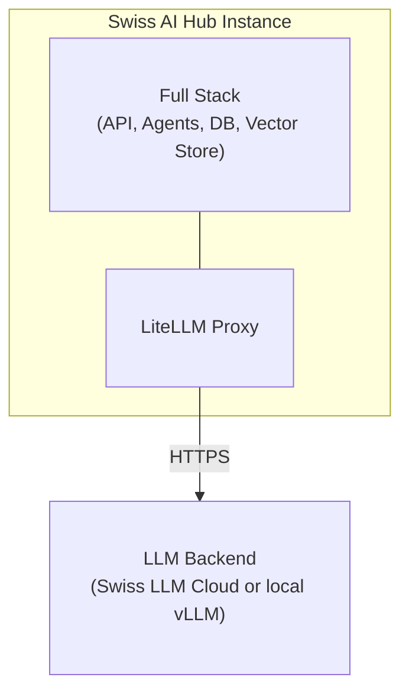
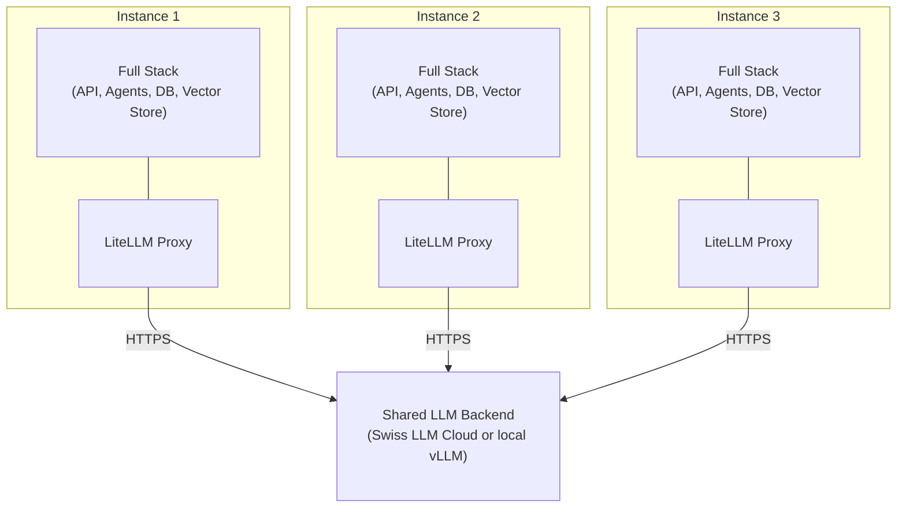

# Deployment-Optionen

## Übersicht

Der Swiss AI Hub kann als einzelne isolierte Instanz für eine Organisation oder als mehrere isolierte Instanzen deployed
werden, die optional Backend-LLM-Ressourcen gemeinsam nutzen.

::: info Multi-Tenancy vs. Multi-Instancing
Dieses Kapitel beschreibt **Multi-Instancing** (mehrere isolierte Swiss AI Hub-Instanzen). Für **Multi-Tenancy**
(mehrere organisatorische Grenzen innerhalb einer einzelnen Instanz), siehe [Multi-Tenancy](../../16_multi_tenancy/).

Beide Deployment-Modelle sind gültig und dienen unterschiedlichen Zwecken. Multi-Instancing bietet eine strikte
Isolation zwischen Organisationen, während Multi-Tenancy eine logische Trennung innerhalb einer gemeinsam genutzten
Plattforminstanz ermöglicht.
:::

## Einzelinstanz-Deployment

### Isolierte Instanz

Ein Einzelinstanz-Deployment betreibt eine vollständige, eigenständige Swiss AI Hub-Instanz. Die Organisation erhält
eine dedizierte Infrastruktur: separate Datenbanken, Vektorspeicher, Dateispeicher und Anwendungs-Services.

Die Instanz umfasst die API, Agents, Pipelines, Weboberfläche und Bot-Integrationen. Sie verfügt über eigene Datenbanken
(FerretDB/PostgreSQL), Vektorspeicher (Milvus) und Dateispeicher (SeaweedFS). Das Monitoring erfolgt über Langfuse und
OpenTelemetry. NATS übernimmt das Event-Streaming. Die Instanz verfügt über einen eigenen LiteLLM-Proxy für
Kostenverfolgung und Versionskontrolle.

### LLM-Backend

Die Instanz verbindet sich über ihren LiteLLM-Proxy mit LLM-Services. Nicht-GPU-Deployments werden über die Swiss LLM
Cloud (einen in der Schweiz gehosteten Anbieter) geleitet. GPU-Deployments führen alle Inferenzen lokal über vLLM auf
einer NVIDIA RTX 6000 Pro (96 GB VRAM) aus. Der Proxy verwaltet Modellauswahl, Budgets, Ratenbegrenzungen und Versionen.
Alle Prompts, Antworten und Benutzerdaten verbleiben innerhalb der Instanz.

______________________________________________________________________

## Hosting-Optionen

Der Swiss AI Hub kann je nach organisatorischen Anforderungen auf drei Arten gehostet werden.

### On-Premise (eigenen Server bereitstellen)

Sie betreiben den Swiss AI Hub auf Ihren eigenen Servern in Ihrem Rechenzentrum.

Sie benötigen x86_64-Server mit CPU, RAM und Speicherplatz. NVIDIA GPUs eignen sich für selbst gehostete LLM-Inferenz.
Für den Netzwerkzugriff entweder ausgehendes HTTPS für Cloud-basierte LLM-Services oder Air-Gapped mit lokalen Modellen.

Die Infrastruktur unterliegt Ihrer Kontrolle. Keine Cloud-Abhängigkeiten. Funktioniert in Air-Gapped-Umgebungen mit
selbst gehosteten LLMs.

______________________________________________________________________

### Private Cloud (eigene Cloud bereitstellen)

Sie betreiben den Swiss AI Hub in Ihrer eigenen Cloud-Umgebung (Schweizer Cloud-Anbieter, Azure, AWS, GCP).

Daten verbleiben in Ihrem Cloud-Konto unter Ihrer Kontrolle. Sie wählen die Region (z. B. Schweiz für Datenresidenz).
Sie verwalten die Cloud-Ressourcen und -Kosten.

Cloud-Anbieter verfügen typischerweise über Sicherheits- und Compliance-Zertifizierungen. Sie benötigen
Internetkonnektivität für den LLM-Proxy-Zugriff (HTTPS), optional VPN für den administrativen Zugriff und privates
Netzwerk zwischen Services (internes DNS).

______________________________________________________________________

### SaaS (Schweizer Cloud-Hosting)

bbv hostet und verwaltet den Swiss AI Hub für Sie auf einer Schweizer Cloud-Infrastruktur.

bbv kümmert sich um Infrastruktur-Bereitstellung, Updates, Backups, Monitoring und operative Aufgaben. Daten verbleiben
in der Schweiz unter Schweizer Rechtshoheit. Sicherheits- und Compliance-Zertifizierungen des Cloud-Anbieters.

Sie greifen auf den Swiss AI Hub über eine Weboberfläche und APIs zu. bbv bietet SLAs für Uptime und Support. Weniger
operativer Aufwand für Ihr Team.

______________________________________________________________________

## Multi-Instanz-Deployment

::: tip Wann Multi-Instancing verwenden
Verwenden Sie mehrere isolierte Instanzen, wenn Sie eine **striktte Trennung** zwischen Organisationen mit 0%
Datenlecks-Risiko benötigen. Zum Beispiel eine Krankenversicherung mit einer medizinischen Gutachterkommission, die
streng geheime Daten verarbeitet und eine absolute Isolation von der Hauptversicherungsabteilung erfordert.

Selbst eine Fehlkonfiguration des Swiss AI Hub kann keine Datenlecks zwischen Instanzen verursachen. Admins einer
Instanz können eine andere Instanz ohne separaten Login weder konfigurieren noch darauf zugreifen.

Für eine logische Trennung innerhalb einer gemeinsamen Plattform verwenden Sie stattdessen
[Multi-Tenancy](../../16_multi_tenancy/).
:::

### Gemeinsam genutztes LLM-Backend

Beim Deployment mehrerer Instanzen können diese Backend-LLM-Ressourcen gemeinsam nutzen. Mehrere Instanzen können
dieselben Swiss LLM Cloud-Zugangsdaten verwenden oder einen lokalen vLLM GPU-Server gemeinsam nutzen. Sie können auch
Authentifizierungs-Infrastrukturen wie Azure AD oder Keycloak gemeinsam nutzen.

Jede Instanz verfügt weiterhin über einen eigenen LiteLLM-Proxy. Der Proxy verwaltet Modellauswahl, Budgets,
Ratenbegrenzungen und Versionen pro Instanz. Die LLM-Nutzung wird pro Instanz verfolgt. Prompts, Antworten und
Benutzerdaten verbleiben innerhalb jeder Instanz.

Die gemeinsam genutzten LLM-Backends sind zustandslos. Sie persistieren weder Prompts noch Antworten.
Konversationskontext und -historie verbleiben in der eigenen Infrastruktur jeder Instanz.

## Eigenschaften

### Datenisolation

Die Daten jeder Instanz bleiben isoliert. Es gibt keine gemeinsame Datenbank oder Vektorspeicher. Daten können nicht
zwischen Organisationen austreten. Die Einrichtung erfüllt das Schweizer Datenschutzgesetz (revDSG), die
GDPR-Anforderungen an die Datenisolation und die Sicherheitsstandards des Schweizer öffentlichen Sektors.

::: info Multi-Tenancy innerhalb von Instanzen
Jede Instanz kann auch [Multi-Tenancy](../../16_multi_tenancy/) verwenden, um logische Grenzen für Abteilungen, Kunden
oder Projekte innerhalb dieser Instanz zu schaffen. Multi-Tenancy bietet eine flexible Zugriffskontrolle bei
gleichzeitiger strikter Isolation zwischen Instanzen.
:::

### Konfiguration

Jede Instanz kann unabhängig konfiguriert werden. Organisationen können benutzerdefinierte Agents, spezialisierte
Pipelines für ihre Datenquellen, eine eigene Zugriffskontrolle (RBAC, OIDC mit lokalem IdP), benutzerdefinierte
Wissensdatenbanken und dedizierte Authentifizierungs-Provider wie Azure AD oder Keycloak deployen.

### Skalierung und Updates

Die Ressourcenzuweisung erfolgt pro Instanz. Sie skalieren Rechenleistung, Speicher und Speicherkapazität basierend auf
der tatsächlichen Nutzung. Jede Instanz kann Updates nach eigenem Zeitplan anwenden. Das Testen neuer Funktionen in
einer Instanz hat keine Auswirkungen auf andere. SLAs variieren je nach Vertrag.

### Compliance und Auditing

Auditoren können die Infrastruktur einer einzelnen Instanz überprüfen. Logs und Traces verbleiben innerhalb der Instanz.
Backup-Aufbewahrungsrichtlinien können pro Instanz konfiguriert werden. Penetrationstests können auf einzelne Instanzen
zugeschnitten werden.

## Deployment-Modell

### Einzelinstanz-Infrastruktur

Ein Einzelinstanz-Deployment enthält:

```
Swiss AI Hub Instance
├── Application Layer
│   ├── API Service (FastAPI + WebSocket gateway)
│   ├── Web Interface (Nuxt.js frontend)
│   ├── OpenWebUI (LLM chat interface)
│   ├── Agent Services (RAG, specialized agents)
│   ├── Pipeline Services (Dagster + custom pipelines)
│   └── Bot Service (MS Teams, Slack integrations)
│
├── Data Layer
│   ├── Database (FerretDB + PostgreSQL)
│   ├── Vector Store (Milvus)
│   ├── Document Store (SeaweedFS)
│   └── Cache (Valkey)
│
├── LLM Layer
│   ├── LiteLLM Proxy
│   │   ├── Cost tracking and budgets
│   │   ├── Model routing configuration
│   │   ├── Rate limiting
│   │   └── Version control
│   └── Presidio (PII anonymization)
│
├── Observability Layer
│   ├── Langfuse (LLM tracing, cost tracking, and evaluation)
│   └── OpenTelemetry (distributed tracing)
│
└── Infrastructure Layer
    ├── NATS (message bus)
    ├── MinerU (document processing)
    └── Traefik (reverse proxy + SSL termination)
```

Der LiteLLM-Proxy verbindet sich mit LLM-Services (Swiss LLM Cloud für Nicht-GPU, lokales vLLM für GPU-Deployments).

### Multi-Instanz-Infrastruktur

Beim Deployment mehrerer Instanzen erhält jede Instanz die oben gezeigte Infrastruktur. Sie können
Backend-LLM-Ressourcen gemeinsam nutzen:

```
Shared LLM Backend Resources
├── Cloud LLM Provider
│   ├── Swiss LLM Cloud credentials (shared API keys)
│   └── Other cloud provider credentials (optional)
│
├── Self-Hosted Model Infrastructure (GPU)
│   └── vLLM deployment (NVIDIA RTX 6000 Pro, 96 GB VRAM)
│
└── Optional Shared Services
    ├── Central Authentication (Azure AD, Keycloak)
    └── Central Monitoring Dashboard (optional)
```

Netzwerkarchitektur:

- Jede Instanz verfügt über einen eigenen LiteLLM-Proxy
- Instanz-LiteLLM-Proxies verbinden sich mit gemeinsam genutzten LLM-Backends (Swiss LLM Cloud oder lokales vLLM)
- Gemeinsam genutzte LLM-Backends verwenden gemeinsame API-Zugangsdaten (konfiguriert pro Instanz-LiteLLM)
- Keine direkte Kommunikation zwischen Instanzen
- Optional: Gemeinsam genutzter Authentifizierungs-Provider (Azure AD, Keycloak)

Datenisolation und -souveränität. Unabhängige Skalierung und Ressourcenzuweisung. Benutzerdefinierte Konfigurationen pro
Instanz. Flexible Update-Zeitpläne. Klare Compliance-Grenzen.

______________________________________________________________________

## Architekturdiagramme

### Einzelinstanz-Deployment



Die Instanz verbindet sich über ihren LiteLLM-Proxy mit LLM-Services.

### Multi-Instanz-Deployment mit gemeinsam genutztem LLM-Backend



Jede Instanz verfügt über einen eigenen LiteLLM-Proxy (unabhängige Kostenverfolgung, Versionierung, Konfiguration). Alle
Instanz-LiteLLM-Proxies verbinden sich mit gemeinsam genutzten LLM-Backend-Ressourcen (Swiss LLM Cloud oder lokales
vLLM). Prompts, Antworten und Benutzerdaten verbleiben innerhalb der Instanzgrenzen.

______________________________________________________________________

## Sicherheitsaspekte

### Instanzisolation

Instanzen kommunizieren nicht miteinander. Jede Instanz verfügt über separate Datenbanken, Vektorspeicher und
Dateispeicher. Jede Instanz verbindet sich mit ihrem eigenen IdP (Azure AD, Keycloak) oder kann einen gemeinsamen IdP
mit separater Namespace-Isolation nutzen. LiteLLM erzwingt API-Keys und Quotas pro Instanz.

### LLM-Proxy-Sicherheit

LiteLLM persistiert Prompts oder Antworten nicht (zustandsloser Betrieb). Das API-Key-Management umfasst sichere
Schlüsselgenerierung, -rotation und -widerruf. Pro-Instanz-Anfrage-Limits verhindern Missbrauch. Alle LLM-Anfragen
werden mit Instanz-ID, aber ohne Prompt-Inhalt protokolliert. Die Presidio-Integration ist optional für die Erkennung
und Redaktion von PII (personenbezogene Informationen).

### Daten während der Übertragung

Alle Kommunikation ist mit TLS verschlüsselt (Instanz zu LLM-Proxy). Das Zertifikatsmanagement verwendet Let's Encrypt
für die Produktion und mkcert für die Entwicklung. Die API-Authentifizierung verwendet Bearer-Tokens (OAuth 2.0, JWT).

### Daten im Ruhezustand

PostgreSQL verwendet transparente Datenverschlüsselung (TDE). Persistente Volumes sind verschlüsselt (LUKS, Azure Disk
Encryption). Geheimnisse werden über Umgebungsvariablen, Azure Key Vault oder Docker Secrets verwaltet.

______________________________________________________________________

## Nächste Schritte

- [Multi-Tenancy](../../16_multi_tenancy/) – Logische Trennung innerhalb einer einzelnen Instanz
- [Produktionskonfiguration](../2_production_configuration/) – Konfigurationsleitfaden für Produktions-Deployments
- [Skalierungsaspekte](../3_scaling_considerations/) – Skalierung von Instanzen
- [Backup und Wiederherstellung](../4_backup_and_recovery/) – Backup-Strategien für die Pro-Instanz-Architektur
- [Updates und Wartung](../6_updates_and_maintenance/) – Verwaltung von Updates über mehrere Instanzen hinweg

______________________________________________________________________

## FAQ

::: details Können Instanzen Agents oder Pipelines gemeinsam nutzen?
Nein. Jede Instanz verfügt über einen eigenen, isolierten Satz von Agents und Pipelines. Jedoch können dieselben
Agent-Definitionen (Code) über mehrere Instanzen hinweg deployt werden. Anpassungen sind instanzspezifisch.

Für das Teilen von Agents innerhalb einer Organisation verwenden Sie [Multi-Tenancy](../../16_multi_tenancy/), um
logische Grenzen innerhalb einer einzelnen Instanz zu schaffen.
:::

::: details Was ist der Unterschied zwischen Multi-Instancing und Multi-Tenancy?
**Multi-Instancing** (dieses Kapitel) bedeutet den Betrieb mehrerer vollständig isolierter Swiss AI Hub-Installationen.
Jede verfügt über separate Datenbanken, Vektorspeicher und Anwendungsserver. Selbst eine Fehlkonfiguration kann keine
Datenlecks zwischen Instanzen verursachen. Verwenden Sie dies, wenn Sie absolute Isolation benötigen (z. B. verschiedene
juristische Einheiten, hochsensible Abteilungen).

**Multi-Tenancy** ([Kapitel 15](../../16_multi_tenancy/)) bedeutet das Schaffen organisatorischer Grenzen innerhalb
einer einzelnen Swiss AI Hub-Instanz. Mehrere Mandanten teilen sich die Infrastruktur, haben aber eine logische Trennung
durch Zugriffskontrolle. Verwenden Sie dies für Abteilungen, Projekte oder Kunden innerhalb derselben Organisation.

Sie können beides kombinieren: Betreiben Sie mehrere Instanzen (striktte Isolation), wobei jede Instanz Multi-Tenancy
(flexible Trennung innerhalb dieser Instanz) verwendet.
:::

::: details Welche Daten sieht das gemeinsam genutzte LLM-Backend?
Jede Instanz verfügt über einen eigenen LiteLLM-Proxy, sodass Prompts und Antworten innerhalb der Instanz verbleiben.
Die gemeinsam genutzten LLM-Backends (Swiss LLM Cloud oder lokales vLLM) sehen API-Anfragen von mehreren
Instanz-LiteLLM-Proxies (zustandslos, nicht persistent), Modell-Inferenzanfragen (Prompts und Completions nur während
der Übertragung), keine Instanzidentifikation oder Kontext und anonyme PII-Daten, falls aktiviert.

Sie sehen nicht, welche Instanz die Anfrage gestellt hat, die Konversationshistorie oder gespeicherte Daten. Der gesamte
Kontext verbleibt im LiteLLM-Proxy und in der Datenbank der Instanz.
:::

::: details Kann eine Instanz ausschliesslich selbst gehostete Modelle verwenden?
Ja. Für Air-Gapped- oder vollständig On-Premise-Deployments verwenden Sie die GPU-Variante der docker-compose-Datei.
Alle Inferenzen laufen lokal über vLLM auf einer NVIDIA RTX 6000 Pro (96 GB VRAM), ohne dass eine ausgehende
Internetverbindung erforderlich ist.
:::

::: details Wie werden Kosten pro Instanz verfolgt?
LiteLLM verfolgt die API-Nutzung pro Instanz und Benutzer: Token-Anzahlen (Input/Output), Modellnutzung (GPT-4, Gemini
usw.), Kostenberechnungen basierend auf Modellpreisen und monatliche Budgetdurchsetzung.

Daten sind in der LiteLLM Admin UI verfügbar und für die Abrechnung exportierbar.
:::

::: details Können Instanzen unterschiedlichen LLM-Zugriff haben?
Ja. Die LiteLLM-Konfiguration erlaubt den modellbasierten Zugriff pro Instanz. Zum Beispiel könnte Instanz A die Swiss
LLM Cloud mit einem bestimmten Satz von Modellen verwenden, Instanz B eine andere Modellauswahl für Flexibilität und
Instanz C nur lokales vLLM für ein Air-Gapped-Deployment.
:::

::: details Was passiert, wenn der LLM-Proxy nicht verfügbar ist?
Instanzen werden eine Verschlechterung LLM-abhängiger Funktionen erfahren. RAG-Agents können keine Antworten generieren.
Embeddings können für neue Dokumente nicht erstellt werden. Bestehende Daten und die Benutzeroberfläche bleiben jedoch
zugänglich, und nicht-LLM-Funktionen (Dokumentenupload, RBAC, Observability) funktionieren weiterhin.

Massnahme: Deployen Sie LiteLLM mit hoher Verfügbarkeit (mehrere Replikate, Load Balancing).
:::

::: details Wie verwalten Sie Updates über viele Instanzen hinweg?
Siehe [Updates und Wartung](../6_updates_and_maintenance/) für Strategien wie gestaffelte Rollouts (Pilot zu
Produktion), Blue-Green-Deployments, automatisierte Update-Orchestrierung (Ansible, Kubernetes-Operatoren) und
Update-Zeitpläne pro Instanz.
:::

## Verwandte Dokumentation

- [Multi-Tenancy](../../16_multi_tenancy/) – Schaffung organisatorischer Grenzen innerhalb einer Instanz
- [Kernkomponenten](../../../1_vision_and_positioning/3_core_components/) – Swiss AI Hub-Architektur
- [Authentifizierung & Autorisierung](../../11_access_management/1_authentication_setup/) –
  Authentifizierungskonfiguration
- [Monitoring und Alerting](../5_monitoring_and_alerting/) – Observability für Multi-Instanz-Deployments
- [Schweizer Datenschutz](../../21_compliance/3_dsg/) – revDSG-Compliance für den öffentlichen Sektor
