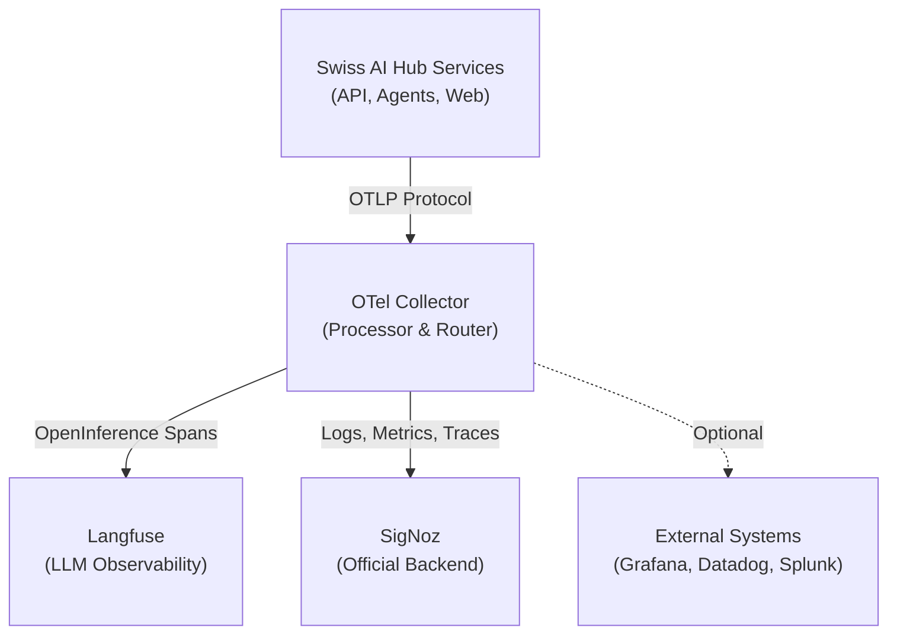
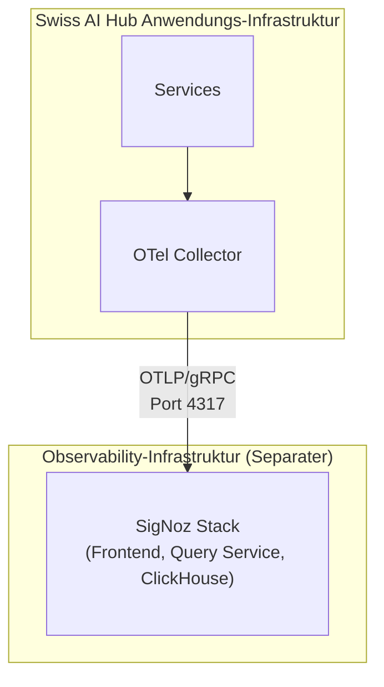

# Externe Log-Aggregation

Die Observability-Architektur des Swiss AI Hub basiert auf **OpenTelemetry** und ermöglicht Ihnen den Export von Logs,
Metriken und Traces an externe Systeme für zentrale Verwaltung, langfristige Speicherung und erweiterte Analysen. Obwohl
die Plattform vorkonfiguriert ist, um mit **SigNoz** als offiziell unterstütztem Backend zu arbeiten, stellt die
OpenTelemetry-Grundlage sicher, dass Sie nie an einen einzelnen Anbieter gebunden sind.

## Architekturübersicht

Die gesamte Telemetrie fliesst durch einen zentralen **OpenTelemetry Collector**, der als Verarbeitungs- und Routing-Hub
fungiert:



Der Collector empfängt Telemetriedaten über das **OpenTelemetry Protocol (OTLP)**, verarbeitet sie (Filtern, Batching,
Anreicherung) und exportiert sie an ein oder mehrere Backends. Diese Architektur bietet mehrere entscheidende Vorteile:

- **Zentrale Steuerung**: Ein einziger Punkt zur Konfiguration von Datenflüssen und Transformationen
- **Performance**: Batching und Kompression reduzieren den Netzwerk-Overhead
- **Flexibilität**: Verschiedene Datentypen können an verschiedene Backends geleitet werden
- **Resilienz**: Integrierte Wiederholungsversuche und Warteschlangen bewältigen temporäre Ausfälle

## SigNoz: Das offizielle Backend

**SigNoz** ist das offiziell unterstützte Observability-Backend für den Swiss AI Hub. Es ist eine quelloffene,
OpenTelemetry-native Plattform, die vereinheitlichte Logs, Metriken und Traces in einer einzigen Oberfläche
bereitstellt.

### Warum SigNoz?

- **OpenTelemetry-nativ**: Von Grund auf auf OTel-Standards aufgebaut
- **Vereinheitlichte Observability**: Logs, Metriken und Traces in einer Plattform
- **Kosteneffizient**: Open-Source mit vorhersehbaren Preisen
- **Volltextsuche**: Leistungsstarke Log-Abfragen und -Filterung
- **Verteiltes Tracing**: End-to-End-Visualisierung des Anfrageflusses
- **Benutzerdefinierte Dashboards**: Vorgefertigte und anpassbare Visualisierungen
- **Flexible Alarmierung**: Mehrkanalige Benachrichtigungen (E-Mail, Slack, Teams, PagerDuty)

### Deployment-Optionen

Die Plattform unterstützt zwei SigNoz-Deployment-Modelle:

#### SigNoz Cloud (Am einfachsten)

SigNoz bietet einen vollständig verwalteten Cloud-Service mit regionalen Endpunkten (EU, US, IN). Der Swiss AI Hub ist
vorkonfiguriert, um SigNoz Cloud zu nutzen – Sie müssen lediglich Ihren Ingestion Key und Ihren regionalen Endpunkt über
Umgebungsvariablen bereitstellen:

```bash
OTEL_CLOUD_ENDPOINT="ingest.eu.signoz.cloud:443"
OTEL_CLOUD_HEADERS="{'signoz-ingestion-key':<your_key>}"
```

#### Self-Hosted SigNoz (Für Produktion empfohlen)

Für Produktions-Deployments wird dringend empfohlen, **SigNoz auf einer dedizierten VM selbst zu hosten**, aus mehreren
Gründen:

- **Performance-Isolation**: Observability-Overhead beeinträchtigt die Anwendungs-Performance nicht
- **Hohe Verfügbarkeit**: Die Anwendung läuft weiter, auch wenn die Überwachung fehlschlägt
- **Datenhoheit**: Volle Kontrolle über Speicherort und Aufbewahrung von Telemetriedaten
- **Sicherheit**: Netzwerkisolation zwischen Anwendungs- und Observability-Schichten



SigNoz kann mittels Docker Compose auf einer separaten VM mit geeigneten Ressourcen (4+ CPU-Kerne, 8+ GB RAM, 100+ GB
Speicherplatz) deployed werden. Der OTel Collector des Swiss AI Hub wird dann so konfiguriert, dass er auf den selbst
gehosteten Endpunkt statt auf SigNoz Cloud verweist.

## Datenerfassung

Die Plattform sammelt und exportiert automatisch:

### Logs

- **Anwendungs-Logs**: Strukturierte JSON-Logs von allen Python-Services (INFO, WARNING, ERROR, CRITICAL)
- **Container-Logs**: Alle stdout/stderr-Ausgaben von Docker-Containern
- **Zugriffs-Logs**: HTTP-Anfragen und -Antworten vom API-Gateway
- **Sicherheits-Logs**: Authentifizierungsereignisse und Berechtigungsprüfungen

### Traces

- **Verteilte Traces**: End-to-End-Anfragenflüsse über Services hinweg (API → Agent → LLM → Datenbank)
- **OpenInference Traces**: LLM-spezifische Spans mit Prompt/Response-Inhalt, Token-Nutzung und Kosten

::: info Duale Tracing-Strategie
OpenInference Traces werden an **beide** gesendet: Langfuse (lokal, spezialisiertes LLM-Debugging) und SigNoz (Cloud,
Langzeitspeicherung und Korrelation). Dieser duale Ansatz bietet sofortige Debugging-Möglichkeiten und gewährleistet
gleichzeitig eine umfassende Observability.
:::

### Metriken

- **Infrastruktur-Metriken** (geplant): CPU, Arbeitsspeicher, Netzwerk, Disk-I/O pro Container
- **Anwendungsmetriken** (geplant): API-Latenz, Fehlerraten, Agent-Ausführungszeiten
- **Business-Metriken**: Aktive Sessions, Dokumentverarbeitungsdurchsatz, Kosten pro Operation

## Konfiguration

Der OTel Collector wird über `/configs/otel/otel-collector-config.dev.yaml` konfiguriert. Die Standardkonfiguration
umfasst:

- **Generischer Cloud-Exporter**: Konfiguriert über Umgebungsvariablen für Flexibilität
- **Filterung**: Entfernt rauschende Health-Check- und Datenbank-Spans
- **Batching**: Optimiert die Netzwerknutzung durch Batching von Telemetriedaten
- **Wiederholungslogik**: Behandelt temporäre Netzwerkausfälle
- **Kompression**: Reduziert die Bandbreite mit Gzip-Kompression

Alle Backends werden über Umgebungsvariablen konfiguriert, was den Wechsel zwischen SigNoz Cloud, selbst gehostetem
SigNoz oder alternativen Backends ohne Codeänderungen erleichtert.

## Alternative Backends

Obwohl **SigNoz das offiziell unterstützte Backend ist**, ermöglicht Ihnen die OpenTelemetry-Grundlage, Daten an jedes
OTel-kompatible System zu senden. Um ein alternatives Backend zu verwenden, aktualisieren Sie die Umgebungsvariablen, um
auf den OTLP-Endpunkt Ihres gewählten Systems zu verweisen. Einige Backends erfordern möglicherweise eine zusätzliche
Exporter-Konfiguration in der OTel Collector-Konfigurationsdatei.

______________________________________________________________________

## Nächste Schritte

- Erkunden Sie die [SigNoz-Dokumentation](https://signoz.io/docs/) für Abfrage-Builder und Alarmkonfiguration.
- Lesen Sie die [OpenTelemetry Collector-Dokumentation](https://opentelemetry.io/docs/collector/) für erweiterte
  Konfigurationen.
- Konfigurieren Sie die [Langfuse LLM Observability](/de/docs/10_chat_ui/10_observability/) für KI-spezifisches
  Debugging.
- Richten Sie die [Kostenverfolgung](/de/docs/14_cost_control/) für die Überwachung der LLM-Nutzung ein.
