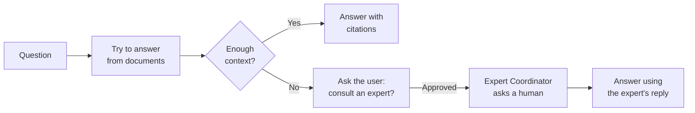

# Agent für Unternehmenswissen

Der **Agent für Unternehmenswissen** (der Experten-RAG-Agent) ist der
[Assistent für Dokumentenintelligenz](../5_document_intelligence_assistant/) mit einem menschlichen Sicherheitsnetz. Er beantwortet Fragen
aus Ihren Dokumenten genau wie der Assistent für Dokumentenintelligenz – und wenn er keine ausreichend gute Antwort findet,
gibt er nicht auf, sondern bietet an, **einen menschlichen Experten zu fragen**. Mit der Erlaubnis des Benutzers
übergibt er die Frage an einen
[Expertenkoordinator-Agenten](../9_expert_coordinator_agent/), der eine Person auf Slack oder Teams kontaktiert und dem Benutzer
dann mit der Antwort des Experten antwortet.

Er kombiniert zwei Stärken: die Geschwindigkeit und Skalierbarkeit dokumentenbasierter Antworten sowie die Zuverlässigkeit
eines Menschen für Fragen, die Ihre Dokumente noch nicht abdecken. Und da Expertenantworten im Organisationsgedächtnis
erfasst werden, benötigt der Agent den Menschen allmählich seltener.

::: tip Wann dieser Agent nützlich ist
Nutzen Sie ihn, wenn die Dokumentenabdeckung unvollständig ist und eine falsche oder fehlende Antwort wichtig ist – Sie würden
lieber einen Menschen einbeziehen, als dass der Agent rät oder sagt „Ich weiss es nicht“. Wenn Ihre Dokumente das Thema
vollständig abdecken, ist der einfache
[Assistent für Dokumentenintelligenz](../5_document_intelligence_assistant/) einfacher und ausreichend.
:::

## Was er tut

Er führt zuerst den vollständigen RAG-Workflow aus; der Expertenpfad öffnet sich nur, wenn der abgerufene Kontext
nicht ausreicht, um die Frage zu beantworten.

1. **Versuch, aus Dokumenten zu antworten.** Er führt denselben Workflow aus (retrieve → rerank → check-sufficiency) wie der
   [Assistent für Dokumentenintelligenz](../5_document_intelligence_assistant/). Wenn die Dokumente ausreichen, antwortet er
   mit Zitaten und stoppt – identisch mit einer normalen RAG-Antwort.
2. **Eine Lücke erkennen.** Wenn die Prüfung der Kontext-Ausreichendheit entscheidet, dass das abgerufene Material nicht
   ausreicht, beginnt der Expertenpfad.
3. **Die Erlaubnis des Benutzers einholen.** Der Agent teilt dem Benutzer mit, dass er die Antwort nicht hat, und fragt,
   ob er einen Experten konsultieren darf. Ohne Zustimmung wird nichts weitergeleitet. Lehnt der Benutzer ab,
   antwortet der Agent einfach mit dem, was er hat.
4. **Einen Experten konsultieren.** Bei Zustimmung delegiert er die Frage an den konfigurierten
   [Expertenkoordinator-Agenten](../9_expert_coordinator_agent/), der sie einem Menschen auf Slack oder Teams übermittelt. Dem Benutzer wird
   mitgeteilt, dass seine Frage weitergeleitet wurde.
5. **Mit der Antwort des Experten antworten.** Wenn der Experte antwortet, wird diese Antwort als Kontext wieder
   aufgenommen und der Agent erstellt die endgültige Antwort. (Der Expertenkoordinator speichert die Antwort auch im
   Organisationsgedächtnis, sodass der Agent sie beim nächsten Mal direkt beantworten kann.)

::: tip Zwei Arten menschlicher Beteiligung
Der Agent für Unternehmenswissen nutzt **Human-in-the-Loop** für die *Zustimmung* des Benutzers („Darf ich einen
Experten fragen?“) und der Expertenkoordinator, an den er delegiert, nutzt **Bot-in-the-Loop**, um den *Experten*
über einen Chat-Kanal zu erreichen. Zusammen halten sie die Eskalation transparent: Der Benutzer stimmt immer zu, bevor
ein Kollege kontaktiert wird.
:::

## Was er *nicht* tut

- **Er kontaktiert Experten nicht direkt.** Jeglicher menschlicher Kontakt erfolgt über den
  [Expertenkoordinator-Agenten](../9_expert_coordinator_agent/), an den er delegiert – dieser muss separat konfiguriert werden.
- **Er eskaliert nicht ohne Zustimmung.** Der Benutzer wird immer zuerst gefragt; eine Ablehnung hält die Konversation
  rein dokumentenbasiert.
- **Er ingestiert keine Dokumente.** Wie alle RAG-Agenten liest er das, was eine [Pipeline](../../6_pipelines/) indiziert hat.

## Bevor Sie beginnen: Voraussetzungen

Dieser Agent baut auf zwei anderen auf, daher müssen beide Konfigurationen zuerst eingerichtet sein:

1. **Alles, was der Assistent für Dokumentenintelligenz benötigt.** Eine gefüllte Wissensdatenbank, ein passendes
   Embedding-Modell und ein Chat-Modell – siehe die
   [Voraussetzungen](../5_document_intelligence_assistant/#before-you-start-prerequisites) dieses Agenten. Der Agent für
   Unternehmenswissen teilt sich dieselbe Retrieval-Konfiguration.
2. **Ein konfiguriertes Expertenkoordinator-Agentenprofil.** Das Eskalationsziel muss bereits existieren und funktionieren,
   einschliesslich des verbundenen Teams-/Slack-Bots. Richten Sie zuerst den
   [Expertenkoordinator-Agenten](../9_expert_coordinator_agent/) ein und testen Sie ihn – der
   Agent für Unternehmenswissen ist ohne einen zur Delegation nutzlos.

## Einrichtung

Der Agent wird als **Blueprint** geliefert, aus dem Sie konfigurierte **Profile** erstellen – siehe
[Blueprints & Profile](../2_blueprints_and_profiles/). Sind die Voraussetzungen erfüllt:

1. **Öffnen Sie den Blueprint** unter **Admin > Agents > Blueprints** und wählen Sie **Agent für Unternehmenswissen**.
2. **Erstellen Sie ein Profil** und konfigurieren Sie es genau wie einen
   [Assistenten für Dokumentenintelligenz](../5_document_intelligence_assistant/): Profilidentität, Chat-Modell,
   mindestens eine Wissensquelle und alle gewünschten Reranking, Guards, Prompts und Memory.
3. **Aktivieren Sie den Kontext-Ausreichendheits-Guard.** Die Experteneskalation wird durch die Ausreichendheitsprüfung
   ausgelöst, die entscheidet, dass der Kontext nicht ausreicht – daher sollte dieser Guard aktiviert sein, sonst wird
   der Agent nicht eskalieren.
4. **Wählen Sie den Experten-Agenten.** Wählen Sie das [Expertenkoordinator-Agentenprofil](../9_expert_coordinator_agent/)
   aus, an das eskaliert werden soll. Dies ist die einzige Einstellung, die für diesen Agenten einzigartig ist.
5. **Speichern und testen Sie** mit einer Frage, die Ihre Dokumente *beantworten können* (erwarten Sie eine normale
   zitierte Antwort) und einer, die sie *nicht beantworten können* (erwarten Sie die Zustimmungsaufforderung und Eskalation).

## Konfigurationsreferenz

Der Agent für Unternehmenswissen verfügt über **die gesamte Konfiguration des
[Assistenten für Dokumentenintelligenz](../5_document_intelligence_assistant/#configuration-reference)** –
Profilidentität, Sprachmodell, Wissensquellen, Reranking, Kontext-Ausreichendheits-Guard, Eignungs-Guard,
Benutzerspeicher, Organisationsspeicher, Prompts und Eingabebudget. Beziehen Sie sich auf diese Seite für all diese
Felder; sie verhalten sich hier identisch.

Darüber hinaus fügt er eine einzige neue Einstellung für die Eskalation hinzu:

### Experteneskalation

| Feld              | Typ             | Erforderlich | Beschreibung                                                                                                                                                                             |
| ----------------- | --------------- | ------------ | ---------------------------------------------------------------------------------------------------------------------------------------------------------------------------------------- |
| **Experten-Agent** | Agenten-Auswahl | Ja           | Das Profil des [Expertenkoordinator-Agenten](../9_expert_coordinator_agent/), das konsultiert werden soll, wenn die Dokumente keine ausreichende Antwort liefern. Die Auswahl listet Agenten auf, die Expertenfragen entgegennehmen können. |

::: warning Kontext-Ausreichendheits-Guard aktivieren
Eine Eskalation erfolgt nur, wenn der
[Kontext-Ausreichendheits-Guard](../5_document_intelligence_assistant/#context-sufficiency-guard-optional) entscheidet,
dass der abgerufene Kontext nicht ausreicht. Ist dieser Guard deaktiviert, wird der Agent fast immer nur aus Dokumenten
antworten und den Expertenpfad nie erreichen – was den Zweck dieses Blueprints zunichtemachen würde.
:::

## Bewährte Praktiken

**Stellen Sie sicher, dass beide zugrunde liegenden Agenten zuerst funktionieren.** Dies ist eine Komposition aus einem
RAG-Agenten und einem Experten-Agenten. Vergewissern Sie sich, dass Ihr Document Intelligence Setup gut antwortet und Ihr
Expertenkoordinator einen echten Menschen erreicht, bevor Sie sie hier kombinieren.

**Aktivieren und optimieren Sie den Ausreichendheits-Guard.** Er ist der Auslöser für die Eskalation. Zu nachsichtig,
und der Agent rät, anstatt zu fragen; zu streng, und er eskaliert triviale Fragen. Testen Sie mit echten Fragen und passen
Sie ihn an.

**Richten Sie Eskalation und Memory auf denselben Namespace aus.** Damit erfasste Expertenantworten später als
dokumentenfreie Antworten zurückkommen, muss der Expertenkoordinator in einen Namespace schreiben, aus dem das
Organisationsgedächtnis dieses Agenten liest. Halten Sie sie aufeinander abgestimmt, damit die Wissensbasis durch jede
Konsultation tatsächlich wächst.

**Erwartungen im System-Prompt festlegen.** Da einige Antworten erst nach der Antwort eines Menschen eintreffen, stellen
Sie sicher, dass die Formulierung des Assistenten (und die Erwartungen Ihrer Benutzer) den Pfad „Ich habe dies an einen
Experten weitergeleitet“ berücksichtigen.
