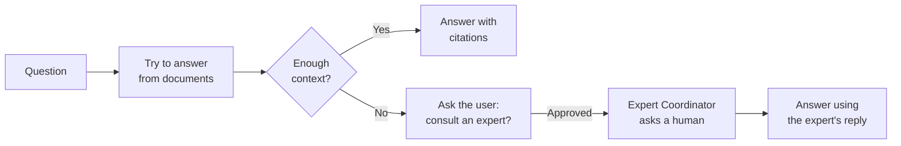

# Agent für Unternehmenswissen

Der **Agent für Unternehmenswissen** (der RAG-Agent mit Experten-Fallback) ist der [Document Intelligence Assistant](/de/docs/5_document_intelligence_assistant/) mit einem menschlichen Sicherheitsnetz. Er beantwortet Fragen aus Ihren Dokumenten genau wie der Document Intelligence Assistant – und wenn er keine ausreichend gute Antwort findet, bietet er statt aufzugeben an, **einen menschlichen Experten zu befragen**. Mit Zustimmung des Benutzers übergibt er die Frage an einen [Expert Coordinator Agent](/de/docs/9_expert_coordinator_agent/), der eine Person auf Slack oder Teams kontaktiert und dem Benutzer dann die Antwort des Experten mitteilt.

Er vereint zwei Stärken: die Geschwindigkeit und Skalierbarkeit dokumentenbasierter Antworten und die Zuverlässigkeit eines Menschen für Fragen, die Ihre Dokumente noch nicht abdecken. Und da Expertenantworten im Organisationsgedächtnis erfasst werden, benötigt der Agent den Menschen allmählich seltener.

::: tip Wann dieser Agent nützlich ist
Nutzen Sie ihn, wenn die Dokumentenabdeckung unvollständig ist und eine falsche oder fehlende Antwort von Bedeutung ist – Sie würden lieber einen Menschen hinzuziehen, als dass der Agent rät oder sagt „Ich weiß es nicht.“ Wenn Ihre Dokumente das Thema vollständig abdecken, ist der einfache [Document Intelligence Assistant](/de/docs/5_document_intelligence_assistant/) einfacher und ausreichend.
:::

## Was er tut

Er führt zuerst den vollständigen RAG-Workflow aus; der Expertenpfad öffnet sich nur, wenn der abgerufene Kontext nicht ausreicht, um zu antworten.

1.  **Versuch, aus Dokumenten zu antworten.** Er führt denselben Retrieve → Rerank → Sufficiency-Check-Workflow wie der [Document Intelligence Assistant](/de/docs/5_document_intelligence_assistant/) aus. Wenn die Dokumente ausreichen, antwortet er mit Zitaten und stoppt — identisch mit einer normalen RAG-Antwort.
2.  **Lücke erkennen.** Wenn die Kontext-Suffizienzprüfung entscheidet, dass das abgerufene Material nicht ausreicht, beginnt der Expertenpfad.
3.  **Einholung der Benutzererlaubnis.** Der Agent teilt dem Benutzer mit, dass er die Antwort nicht hat, und fragt, ob er einen Experten konsultieren darf. Ohne Zustimmung wird nichts weitergeleitet. Lehnt der Benutzer ab, antwortet der Agent einfach mit dem, was er hat.
4.  **Experten konsultieren.** Nach Zustimmung delegiert er die Frage an den konfigurierten [Expert Coordinator Agent](/de/docs/9_expert_coordinator_agent/), der sie einem Menschen auf Slack oder Teams postet. Dem Benutzer wird mitgeteilt, dass seine Frage weitergeleitet wurde.
5.  **Antwort mit der Expertenantwort.** Wenn der Experte antwortet, wird diese Antwort als Kontext wieder eingebunden und der Agent formuliert die endgültige Antwort. (Der Expert Coordinator speichert die Antwort auch im Organisationsgedächtnis, sodass der Agent sie beim nächsten Mal direkt beantworten kann.)

::: tip Zwei Arten menschlicher Beteiligung
Der Agent für Unternehmenswissen nutzt **Human-in-the-Loop** für die *Zustimmung* des Benutzers („Darf ich einen Experten fragen?“), und der Expert Coordinator, an den er delegiert, nutzt **Bot-in-the-Loop**, um den *Experten* auf einem Chat-Kanal zu erreichen. Zusammen sorgen sie für Transparenz bei der Eskalation: Der Benutzer stimmt immer zu, bevor ein Kollege kontaktiert wird.
:::

## Was er *nicht* tut

-   **Er kontaktiert Experten nicht direkt.** Jeglicher menschlicher Kontakt erfolgt über den [Expert Coordinator Agent](/de/docs/9_expert_coordinator_agent/), an den er delegiert – welcher separat konfiguriert werden muss.
-   **Er eskaliert nicht ohne Zustimmung.** Der Benutzer wird immer zuerst gefragt; eine Ablehnung hält die Konversation rein dokumentenbasiert.
-   **Er nimmt keine Dokumente auf.** Wie alle RAG-Agents liest er, was eine [Pipeline](/de/docs/6_pipelines/) indexiert hat.

## Bevor Sie beginnen: Voraussetzungen

Dieser Agent baut auf zwei anderen auf, daher müssen beide Konfigurationen zuerst vorhanden sein:

1.  **Alles, was der Document Intelligence Assistant benötigt.** Eine gefüllte Wissensdatenbank, ein passendes Embedding-Modell und ein Chat-Modell — siehe die [Voraussetzungen](/de/docs/5_document_intelligence_assistant/#bevor-sie-beginnen-voraussetzungen) dieses Agenten. Der Agent für Unternehmenswissen teilt dieselbe Retrieval-Konfiguration.
2.  **Ein konfiguriertes Expert Coordinator Agent-Profil.** Das Eskalationsziel muss bereits existieren und funktionieren, einschließlich seines verbundenen Teams/Slack-Bots. Richten und testen Sie zuerst den [Expert Coordinator Agent](/de/docs/9_expert_coordinator_agent/) — der Agent für Unternehmenswissen ist ohne einen zur Delegation nutzlos.

## Einrichtung

Der Agent wird als **Blueprint** geliefert, aus dem Sie konfigurierte **Profile** erstellen — siehe [Blueprints & Profile](/de/docs/2_blueprints_and_profiles/). Mit den erfüllten Voraussetzungen:

1.  **Öffnen Sie den Blueprint** unter **Admin > Agents > Blueprints** und wählen Sie **Agent für Unternehmenswissen**.
2.  **Erstellen Sie ein Profil** und konfigurieren Sie es genau wie einen [Document Intelligence Assistant](/de/docs/5_document_intelligence_assistant/): Profilidentität, Chat-Modell, mindestens eine Wissensquelle und alle gewünschten Reranking-, Guards, Prompts und Memory-Einstellungen.
3.  **Aktivieren Sie den Kontext-Suffizienz-Guard.** Die Experteneskalation wird durch die Suffizienzprüfung ausgelöst, die entscheidet, dass der Kontext nicht ausreicht — daher sollte dieser Guard aktiviert sein, da der Agent sonst selten eskaliert.
4.  **Wählen Sie den Expert Agent.** Wählen Sie das [Expert Coordinator Agent](/de/docs/9_expert_coordinator_agent/)-Profil aus, an das eskaliert werden soll. Dies ist die einzige Einstellung, die für diesen Agenten einzigartig ist.
5.  **Speichern und testen Sie** mit einer Frage, die Ihre Dokumente *beantworten können* (erwarten Sie eine normale zitierte Antwort) und einer, die sie *nicht beantworten können* (erwarten Sie die Zustimmungsaufforderung und Eskalation).

## Konfigurationsreferenz

Der Agent für Unternehmenswissen verfügt über **die gesamte Konfiguration des [Document Intelligence Assistant](/de/docs/5_document_intelligence_assistant/#konfigurationsreferenz)** — Profilidentität, Sprachmodell, Wissensquellen, Reranking, Kontext-Suffizienz-Guard, Eignungs-Guard, Benutzerspeicher, Organisationsspeicher, Prompts und Eingabebudget. Beziehen Sie sich auf diese Seite für alle diese Felder; sie verhalten sich hier identisch.

Darüber hinaus fügt er eine einzige neue Einstellung für die Eskalation hinzu:

### Experteneskalation

| Feld            | Typ            | Erforderlich | Beschreibung                                                                                                                                                                             |
| :-------------- | :------------- | :----------- | :----------------------------------------------------------------------------------------------------------------------------------------------------------------------- |
| **Expert Agent** | Agent-Auswahl | Ja           | Das [Expert Coordinator Agent](/de/docs/9_expert_coordinator_agent/)-Profil, das konsultiert werden soll, wenn die Dokumente keine ausreichende Antwort enthalten. Die Auswahl listet Agents auf, die Expertenfragen bearbeiten können. |

::: warning Kontext-Suffizienz-Guard aktivieren
Eine Eskalation findet nur statt, wenn der [Kontext-Suffizienz-Guard](/de/docs/5_document_intelligence_assistant/#kontext-suffizienz-guard-optional) entscheidet, dass der abgerufene Kontext nicht ausreicht. Bleibt dieser Guard deaktiviert, antwortet der Agent fast immer allein aus Dokumenten und erreicht niemals den Expertenpfad – was den Zweck dieses Blueprints zunichtemacht.
:::

## Best Practices

**Stellen Sie sicher, dass beide zugrunde liegenden Agents zuerst funktionieren.** Dies ist eine Komposition aus einem RAG-Agenten und einem Experten-Agenten. Bestätigen Sie, dass Ihr Document Intelligence Setup gut antwortet und Ihr Expert Coordinator einen echten Menschen erreicht, bevor Sie sie hier kombinieren.

**Aktivieren und optimieren Sie den Suffizienz-Guard.** Er ist der Auslöser für die Eskalation. Zu nachsichtig und der Agent rät, anstatt zu fragen; zu streng und er eskaliert triviale Fragen. Testen Sie mit echten Fragen und passen Sie ihn an.

**Richten Sie Eskalation und Memory auf denselben Namespace aus.** Damit erfasste Expertenantworten später als dokumentenfreie Antworten zurückkommen, muss der Expert Coordinator in einen Namespace schreiben, aus dem das Organisationsgedächtnis dieses Agenten liest. Halten Sie sie aufeinander abgestimmt, damit die Wissensbasis mit jeder Konsultation wirklich wächst.

**Setzen Sie Erwartungen im System-Prompt.** Da einige Antworten erst nach einer menschlichen Antwort eintreffen werden, stellen Sie sicher, dass die Formulierung des Assistenten (und die Erwartungen Ihrer Benutzer) den Pfad „Ich habe dies an einen Experten weitergeleitet“ berücksichtigt.
