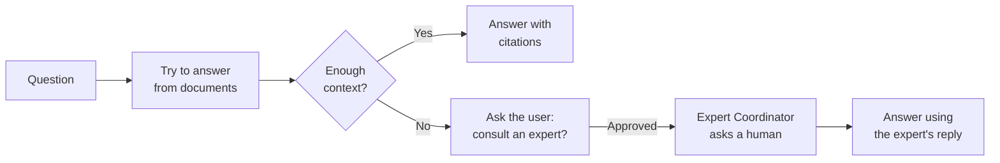

# Company Knowledge Agent

The **Company Knowledge Agent** (the expert-RAG agent) is the
[Document Intelligence Assistant](../5_document_intelligence_assistant/) with a human safety net. It answers questions
from your documents exactly like the Document Intelligence Assistant — and when it can't find a good enough answer,
instead of giving up it offers to **ask a human expert**. With the user's permission, it hands the question to an
[Expert Coordinator Agent](../9_expert_coordinator_agent/), which reaches a person on Slack or Teams, and then answers
the user using the expert's reply.

It combines two strengths: the speed and scale of document-based answers, and the reliability of a human for the
questions your documents don't cover yet. And because expert answers are captured into organization memory, the agent
gradually needs the human less often.

::: tip When to reach for this agent
Use it when document coverage is incomplete and a wrong or missing answer matters — you'd rather involve a human than
have the agent guess or say "I don't know." If your documents fully cover the topic, the plain
[Document Intelligence Assistant](../5_document_intelligence_assistant/) is simpler and sufficient.
:::

## What it does

It runs the full RAG workflow first; the expert path only opens when the retrieved context isn't enough to answer.

1. **Try to answer from documents.** It performs the same retrieve → rerank → check-sufficiency flow as the
   [Document Intelligence Assistant](../5_document_intelligence_assistant/). If the documents are sufficient, it answers
   with citations and stops — identical to a normal RAG answer.
2. **Detect a gap.** If the context-sufficiency check decides the retrieved material isn't enough, the expert path
   begins.
3. **Ask the user's permission.** The agent tells the user it doesn't have the answer and asks whether it may consult an
   expert. Nothing is forwarded without consent. If the user declines, the agent simply responds with what it has.
4. **Consult an expert.** On approval, it delegates the question to the configured
   [Expert Coordinator Agent](../9_expert_coordinator_agent/), which posts it to a human on Slack or Teams. The user is
   told their question has been forwarded.
5. **Answer with the expert's reply.** When the expert answers, that reply is folded back in as context and the agent
   composes the final answer. (The Expert Coordinator also stores the answer in organization memory, so next time the
   agent can answer it directly.)

::: tip Two kinds of human involvement
The Company Knowledge Agent uses **human-in-the-loop** for the user's *consent* ("may I ask an expert?"), and the Expert
Coordinator it delegates to uses **bot-in-the-loop** to reach the *expert* on a chat channel. Together they keep the
escalation transparent: the user always approves before a colleague is contacted.
:::

## What it does *not* do

- **It doesn't contact experts directly.** All human contact happens through the
  [Expert Coordinator Agent](../9_expert_coordinator_agent/) it delegates to — which must be configured separately.
- **It doesn't escalate without consent.** The user is always asked first; declining keeps the conversation purely
  document-based.
- **It doesn't ingest documents.** Like all RAG agents, it reads what a [pipeline](../../6_pipelines/) has indexed.

## Before you start: prerequisites

This agent sits on top of two others, so both of their setups must be in place first:

1. **Everything the Document Intelligence Assistant needs.** A populated knowledge base, a matching embedding model, and
   a chat model — see that agent's
   [prerequisites](../5_document_intelligence_assistant/#before-you-start-prerequisites). The Company Knowledge Agent
   shares all of the same retrieval configuration.
2. **A configured Expert Coordinator Agent profile.** The escalation target must already exist and work, including its
   connected Teams/Slack bot. Set up and test the [Expert Coordinator Agent](../9_expert_coordinator_agent/) first — the
   Company Knowledge Agent is useless without one to delegate to.

## Setting it up

The agent is delivered as a **blueprint** from which you create configured **profiles** — see
[Blueprints & Profiles](../2_blueprints_and_profiles/). With the prerequisites in place:

1. **Open the blueprint** under **Admin > Agents > Blueprints** and select **Company Knowledge Agent**.
2. **Create a profile** and configure it exactly like a
   [Document Intelligence Assistant](../5_document_intelligence_assistant/): profile identity, chat model, at least one
   knowledge source, and any reranking, guards, prompts, and memory you want.
3. **Turn on the context-sufficiency guard.** Expert escalation is triggered by the sufficiency check deciding the
   context isn't enough — so this guard should be enabled, or the agent will rarely escalate.
4. **Select the Expert Agent.** Choose the [Expert Coordinator Agent](../9_expert_coordinator_agent/) profile to
   escalate to. This is the one setting unique to this agent.
5. **Save and test** with a question your documents *can* answer (expect a normal cited answer) and one they *can't*
   (expect the consent prompt and escalation).

## Configuration reference

The Company Knowledge Agent has **the entire configuration of the
[Document Intelligence Assistant](../5_document_intelligence_assistant/#configuration-reference)** — profile identity,
language model, knowledge sources, reranking, context-sufficiency guard, suitability guard, user memory, organization
memory, prompts, and input budget. Refer to that page for all of those fields; they behave identically here.

On top of that, it adds a single new setting for escalation:

### Expert escalation

| Field            | Type         | Required | Description                                                                                                                                                                                  |
| ---------------- | ------------ | -------- | -------------------------------------------------------------------------------------------------------------------------------------------------------------------------------------------- |
| **Expert Agent** | Agent picker | Yes      | The [Expert Coordinator Agent](../9_expert_coordinator_agent/) profile to consult when the documents don't have a sufficient answer. The picker lists agents that can take expert questions. |

::: warning Enable the context-sufficiency guard
Escalation only happens when the
[context-sufficiency guard](../5_document_intelligence_assistant/#context-sufficiency-guard-optional) decides the
retrieved context isn't enough. If that guard is left off, the agent will almost always answer from documents alone and
never reach the expert path — defeating the purpose of this blueprint.
:::

## Best practices

**Get both underlying agents working first.** This is a composition of a RAG agent and an expert agent. Confirm your
Document Intelligence setup answers well, and your Expert Coordinator reaches a real human, before combining them here.

**Enable the sufficiency guard and tune it.** It's the trigger for escalation. Too lenient and the agent guesses instead
of asking; too strict and it escalates trivial questions. Test with real questions and adjust.

**Point escalation and memory at the same namespace.** For captured expert answers to come back as document-free answers
later, the Expert Coordinator must write to a namespace this agent's organization memory reads from. Keep them aligned
so the knowledge base genuinely grows from each consultation.

**Set expectations in the system prompt.** Since some answers will arrive only after a human replies, make sure the
assistant's wording (and your users' expectations) account for the "I've forwarded this to an expert" path.
