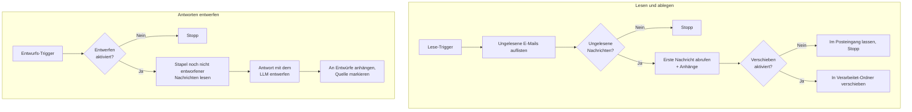

# E-Mail-Agent

Der **E-Mail-Agent** (der IMAP-Agent) verbindet sich über IMAP mit einem Postfach und arbeitet es für Sie ab. Er listet
die ungelesenen E-Mails eines Posteingangs auf, ruft eine Nachricht samt Anhängen ab, legt diese Nachricht optional in
einem anderen Ordner ab und entwirft — als separater, unabhängig geplanter Job — Antworten für einen Stapel von
Nachrichten und hinterlegt sie in Ihrem Entwürfe-Ordner.

Anders als die chatbasierten Assistenten hat dieser Agent **keine Chat-Oberfläche**. Sie sprechen nicht mit ihm. Er wird
einmalig im Admin UI konfiguriert und danach programmatisch ausgelöst — durch einen Scheduler, durch einen anderen
Workflow oder über die API. Darin verhält er sich wie der [Retrieval Agent](../6_retrieval_agent/): Er ist ein Baustein
für Automatisierung und kein Gesprächspartner.

::: tip Wann Sie zu diesem Agent greifen sollten
Setzen Sie den E-Mail-Agent ein, wenn Arbeit per E-Mail eintrifft und Sie den Routineanteil automatisch erledigt haben
möchten — die Triage eines gemeinsam genutzten Postfachs, das Ablegen verarbeiteter E-Mails aus dem Posteingang oder das
nächtliche Vorbereiten von Antwort-Entwürfen, sodass ein Mensch nur noch prüfen und senden muss. Wenn Sie einen
Assistenten zum Chatten möchten, verwenden Sie stattdessen den [Instructed Assistant](../3_instructed_assistant/) oder
den [Document Intelligence Assistant](../5_document_intelligence_assistant/).
:::

::: warning Er versendet niemals E-Mails
Der Agent spricht ausschliesslich IMAP — es gibt nirgends SMTP. Er kann lesen, verschieben und *einen Entwurf
speichern*, aber er kann niemals eine Nachricht tatsächlich versenden. Immer öffnet ein Mensch den Entwurf, prüft ihn
und sendet ihn. Das ist eine bewusste Design-Grenze und keine Voreinstellung, die Sie abschalten können.
:::

## Was er tut

Der Agent hat **zwei unabhängige Fähigkeiten**, jede mit einem eigenen Trigger. Sie hängen nicht voneinander ab, und Sie
können sie getrennt einplanen — zum Beispiel Lesen/Verschieben alle fünf Minuten und das Entwerfen einmal pro Stunde.

### Lesen und ablegen

1. **Ungelesene E-Mails auflisten.** Der Agent öffnet den konfigurierten Posteingang-Ordner und liefert eine
   Zusammenfassung jeder ungelesenen Nachricht, begrenzt durch **Max. ungelesene E-Mails**.
2. **Eine Nachricht abrufen.** Die erste ungelesene Nachricht wird vollständig abgerufen — Absender, Betreff, Datum,
   Text und Anhänge. Enthält der Posteingang keine ungelesene Post, endet der Lauf hier einfach. Die Anhangsdaten werden
   in den Dateispeicher der Plattform geschrieben, und das Nachrichten-Event trägt lediglich *Referenzen* darauf, damit
   Audit-Trail und Event-Stream klein bleiben.
3. **Ablegen.** Ist **Abgerufene E-Mail verschieben** aktiviert, wird die Nachricht in den Verarbeitet-Ordner
   verschoben. Ist die Option deaktiviert, bleibt die Nachricht, wo sie ist, und der Lauf endet.

Der gesamte Lesepfad ist **auf Protokollebene read-only**: Das Postfach wird mit einem read-only Select geöffnet und
Nachrichtentexte werden mit `BODY.PEEK` abgerufen, sodass die Nachricht nie unbemerkt als gelesen markiert wird.
Verschieben verlagert eine Nachricht; gelöscht wird nie.

### Antworten entwerfen

1. **Kandidaten finden.** Der Entwurfsdienst liest bis zu **Entwurfs-Stapelgröße** Nachrichten aus seinem eigenen
   Quellordner, für die noch kein Entwurf existiert. Bereits entworfene Nachrichten erkennt er an einem IMAP-Flag, das
   der Agent setzt — ein erneuter Lauf erzeugt daher keine doppelten Entwürfe.
2. **Jede Antwort entwerfen.** Für jede Nachricht erhält das konfigurierte Chat-Modell Ihren **Entwurfs-Prompt** und die
   Originalnachricht und schreibt einen Antworttext. Das Ergebnis wird in einen korrekt verketteten Antwort-Umschlag
   verpackt, sodass der Entwurf in Ihrem Mail-Client in der richtigen Konversation erscheint.
3. **Speichern und markieren.** Jeder Entwurf wird an den Entwürfe-Ordner angehängt, und erst danach wird die
   Quellnachricht als entworfen markiert. Die Quellnachricht bleibt **ungelesen** — ein Mensch sieht sie weiterhin als
   neue Post, die Aufmerksamkeit braucht.

::: details Warum die Quellnachricht ungelesen bleibt
Das Entwerfen ist ein Vorbereitungsschritt, keine Erledigung. Der Sinn ist, dass ein Mensch das Postfach öffnet, die
Nachricht als ungelesen und unbearbeitet sieht, einen bereits wartenden Antwort-Entwurf vorfindet und entscheidet, was
zu tun ist. Die Post als gelesen zu markieren würde Arbeit verbergen, die tatsächlich noch nicht getan ist.
:::

::: details Was passiert, wenn ein Lauf abbricht
Der Entwurf wird an den Entwürfe-Ordner angehängt, *bevor* die Quellnachricht markiert wird. Stirbt der Lauf zwischen
diesen beiden Operationen, ist der schlimmste Fall ein doppelter Entwurf beim nächsten Lauf — niemals eine Nachricht,
die stillschweigend als erledigt markiert ist, ohne dass ein Entwurf existiert. Arbeit zu verlieren gilt als schlimmer,
als ein wenig davon doppelt zu tun.
:::

## Was er *nicht* tut

- **Er versendet nie.** Kein SMTP, keine ausgehende Zustellung, kein „senden, wenn sicher genug"-Modus.
- **Er löscht nie.** Verschieben verlagert eine Nachricht; nichts wird dauerhaft aus dem Postfach entfernt.
- **Er hat keine Chat-Oberfläche.** Er erscheint nicht im Chat UI und kann nicht befragt werden.
- **Er hat keine Wissensbasis.** Entwürfe entstehen aus der Originalnachricht plus Ihrem Prompt — der Agent durchsucht
  Ihre Dokumente nicht. Für fundierte, mit Quellen belegte Antworten verwenden Sie den
  [Document Intelligence Assistant](../5_document_intelligence_assistant/).
- **Er liest eine Nachricht pro Lese-Lauf.** Die Lesen/Verschieben-Kette listet alle ungelesenen E-Mails auf, ruft und
  legt aber nur die erste Nachricht ab. Planen Sie sie häufiger ein, um einen Rückstand abzuarbeiten; die Entwurfs-Kette
  ist diejenige, die einen Stapel verarbeitet.

## Konfiguration

Erstellen Sie im Admin UI ein Profil aus dem Blueprint **IMAP Agent**. Das Formular hat zwei Abschnitte: die
Postfach-Verbindung und die Entwurfs-Einstellungen.

### Postfach-Verbindung

| Feld                              | Typ      | Standard    | Beschreibung                                                                                                                          |
| --------------------------------- | -------- | ----------- | ------------------------------------------------------------------------------------------------------------------------------------- |
| **IMAP-Host**                     | Text     | —           | Hostname des IMAP-Servers, z. B. `imap.example.com`. Erforderlich.                                                                    |
| **IMAP-Port**                     | Zahl     | `993`       | Port des Servers. `993` ist der Standard für implizites TLS. Bereich 1–65535.                                                         |
| **Benutzername**                  | Text     | —           | Postfach-Login, üblicherweise die vollständige E-Mail-Adresse. Erforderlich.                                                          |
| **Passwort**                      | Passwort | *(leer)*    | Postfach-Passwort oder besser ein anwendungsspezifisches Token. Wird beim Agent-Profil gespeichert.                                   |
| **TLS verwenden**                 | Schalter | An          | Verbindung über implizites TLS. Nur für einen Klartext-Testserver deaktivieren.                                                       |
| **Posteingang-Ordner**            | Text     | `INBOX`     | Der Ordner, aus dem eingehende E-Mails gelesen werden.                                                                                |
| **Max. ungelesene E-Mails**       | Zahl     | `50`        | Wie viele ungelesene Zusammenfassungen ein einzelner Lauf auflistet. Hält den Lauf klein, wenn der Posteingang überquillt. 1–500.     |
| **Abgerufene E-Mail verschieben** | Schalter | Aus         | Wenn aktiviert, wird die abgerufene Nachricht in den Verarbeitet-Ordner verschoben. Wenn deaktiviert, entfällt der Verschiebeschritt. |
| **Verarbeitet-Ordner**            | Text     | `Processed` | Wohin eine verarbeitete Nachricht abgelegt wird. Nur sichtbar — und erforderlich —, wenn **Abgerufene E-Mail verschieben** aktiv ist. |

### Entwurfs-Einstellungen

Alles in diesem Abschnitt bleibt verborgen, bis **Antwort entwerfen** eingeschaltet ist.

| Feld                        | Typ            | Standard                     | Beschreibung                                                                                                                                                                                         |
| --------------------------- | -------------- | ---------------------------- | ---------------------------------------------------------------------------------------------------------------------------------------------------------------------------------------------------- |
| **Antwort entwerfen**       | Schalter       | Aus                          | Hauptschalter für die Entwurfs-Fähigkeit. Wenn aus, endet ein Entwurfs-Lauf sofort, ohne etwas zu tun.                                                                                               |
| **Quellordner für Entwurf** | Text           | `INBOX`                      | Wo der Entwurfsdienst nach Kandidatennachrichten sucht. Verweisen Sie auf Ihren Verarbeitet-Ordner, um Antworten auf dort abgelegte E-Mails zu entwerfen.                                            |
| **Entwurfs-Stapelgröße**    | Zahl           | `5`                          | Wie viele Nachrichten pro Lauf entworfen werden. Mindestens 1.                                                                                                                                       |
| **Entwürfe-Ordner**         | Text           | `Drafts`                     | Wo Entwürfe gespeichert werden. Hat der Server keinen Ordner dieses Namens, wird sein Standard-Ordner `\Drafts` verwendet.                                                                           |
| **LLM-Modell**              | Modell-Auswahl | *(leer)*                     | Das Chat-Modell, das den Antworttext schreibt. Die Optionen stammen aus Ihrer LiteLLM-Konfiguration.                                                                                                 |
| **Entwurfs-Prompt**         | Langtext       | *(sinnvolle Voreinstellung)* | Anweisungen zu Ton, Sprache und Form der Antwort. Die Voreinstellung verlangt eine knappe, höfliche Antwort in der Sprache des Absenders, ohne erfundene Fakten und ohne Betreffzeile oder Signatur. |

::: details Deployment-fixe Limits, die Sie im Formular nicht sehen
Drei Grössenlimits werden vom Betreiber der Plattform festgelegt und sind nicht als Formularfelder verfügbar, weil sie
die Plattform schützen und nicht das Verhalten des Agents formen:

| Limit                  | Standard | Was es schützt                                                                                                                                                           |
| ---------------------- | -------- | ------------------------------------------------------------------------------------------------------------------------------------------------------------------------ |
| Max. Nachrichtengrösse | 50 MB    | Die Rohgrösse einer Nachricht wird geprüft, *bevor* der Text heruntergeladen wird, sodass übergrosse oder bösartige Post abgewiesen statt in den Speicher geladen wird.  |
| Max. Textgrösse        | 1 MB     | Begrenzt den Nachrichtentext in einem Event; längere Texte werden gekürzt, damit das gespeicherte und gestreamte Event innerhalb der Grössenlimits der Plattform bleibt. |
| Max. Anhangsgrösse     | 10 MB    | Begrenzt einen einzelnen gespeicherten Anhang; grössere Anhänge werden übersprungen, damit eine Nachricht den Anhangsspeicher nicht überlasten kann.                     |

Fragen Sie Ihre Plattform-Administration, falls eine legitime Arbeitslast an eines dieser Limits stösst.
:::

::: details Wie die Einstellungen zur Laufzeit zusammenspielen
Ein **Lese**-Trigger verbindet sich mit den Postfach-Einstellungen, listet bis zu **Max. ungelesene E-Mails** aus dem
**Posteingang-Ordner** auf, ruft die erste ab und verschiebt sie — wenn **Abgerufene E-Mail verschieben** aktiv ist — in
den **Verarbeitet-Ordner**.

Ein **Entwurfs**-Trigger ist davon unabhängig. Ist **Antwort entwerfen** aktiv, liest er bis zu **Entwurfs-Stapelgröße**
noch nicht entworfene Nachrichten aus dem **Quellordner für Entwurf**, ruft das gewählte **LLM-Modell** einmal pro
Nachricht mit Ihrem **Entwurfs-Prompt** auf, hängt jedes Ergebnis an den **Entwürfe-Ordner** an und markiert die Quelle.
Die Mail-Verbindung wird nur für die IMAP-Arbeit geöffnet und wieder geschlossen, während das Modell schreibt — so
bleibt keine untätige Verbindung offen, die der Server abbrechen könnte.
:::

## Beispiel-Workflows

**Triage eines gemeinsam genutzten Postfachs.** Aktivieren Sie **Abgerufene E-Mail verschieben** mit einem
`Processed`-Ordner und planen Sie den Lese-Trigger im Minutentakt ein. Jeder Lauf nimmt die älteste ungelesene Nachricht
aus dem Posteingang und legt sie ab, wobei die vollständige Nachricht samt Anhängen im Audit-Trail der Plattform
festgehalten wird. Der Posteingang wird zu einer Queue, die sich selbst leert.

**Antwort-Entwürfe über Nacht vorbereiten.** Lassen Sie das Verschieben aus, aktivieren Sie **Antwort entwerfen** mit
**Quellordner für Entwurf** = `INBOX` und planen Sie den Entwurfs-Trigger ausserhalb der Geschäftszeiten mit einer
Stapelgrösse, die zu Ihrem Tagesvolumen passt. Am Morgen öffnet das Team das Postfach und findet unter jeder neuen
Nachricht einen wartenden Entwurf — prüfen, anpassen, senden.

**Beides nacheinander.** Richten Sie den Lese-Trigger mit aktivem Verschieben auf `INBOX` und setzen Sie **Quellordner
für Entwurf** auf denselben `Processed`-Ordner. Post wird abgelegt, sobald sie eintrifft, und der Entwurfsdienst
arbeitet die abgelegten Nachrichten nach seinem eigenen Zeitplan ab. Die beiden Jobs konkurrieren nie um dieselbe
Nachricht.

## Best Practices

**Verwenden Sie ein anwendungsspezifisches Passwort.** Die meisten Anbieter (Gmail, Microsoft 365 und andere) stellen
Anmeldedaten pro Anwendung aus, die sich einzeln widerrufen lassen. Nutzen Sie eines davon statt des echten
Konto-Passworts, und geben Sie dem Agent ein Postfach, das nur enthält, was er sehen muss.

**Starten Sie mit deaktiviertem Verschieben und Entwerfen.** Beides ist aus gutem Grund standardmässig aus. Lassen Sie
den Agent zuerst nur lesend laufen, prüfen Sie in der Event-Timeline, dass er sich verbindet und die richtigen
Nachrichten aufgreift, und schalten Sie dann eine Fähigkeit nach der anderen ein.

**Setzen Sie den Verarbeitet-Ordner, bevor Sie das Verschieben aktivieren.** **Abgerufene E-Mail verschieben** mit einem
leeren **Verarbeitet-Ordner** lässt den Lauf fehlschlagen. Legen Sie den Ordner zuerst auf dem Mailserver an — der Agent
legt dort ab, er erstellt ihn nicht.

**Halten Sie die Stapelgrösse anfangs klein.** Jede Nachricht in einem Stapel kostet einen Modellaufruf. Beginnen Sie
mit drei bis fünf, beobachten Sie Kosten und Qualität in den Traces, und erhöhen Sie erst, wenn Sie dem Ergebnis
vertrauen.

**Schreiben Sie den Entwurfs-Prompt für eine prüfende Person, nicht für die Empfängerin oder den Empfänger.** Die besten
Entwürfe sind die, die ein Mensch in Sekunden freigeben kann. Verlangen Sie eine kurze Antwort, eine ausdrückliche
Aussage, wenn Informationen fehlen, und keine erfundenen Fakten — ein Entwurf, der höflich sagt „Ich muss X noch
prüfen", ist nützlicher als eine selbstbewusst falsche Antwort.

**Stimmen Sie Quellordner und Zeitplan aufeinander ab.** Wenn derselbe Ordner sowohl den Verschiebeschritt als auch den
Entwurfsdienst speist, achten Sie darauf, dass der Lese-Trigger oft genug läuft, um den Entwurfsdienst zu versorgen —
und dass dessen Stapelgrösse nicht so gross ist, dass er wiederholt nichts zu tun findet.

**Denken Sie daran, dass eingehende Post nicht vertrauenswürdig ist.** Jede und jeder kann Ihrem Postfach beliebige
Inhalte schicken, und der Text dieser Nachricht geht in den Prompt des Modells ein. Der PII-Guard der Plattform
anonymisiert personenbezogene Daten am LLM-Gateway, dennoch sollten Sie Entwürfe als Vorschläge aus einer nicht
vertrauenswürdigen Quelle behandeln — genau deshalb prüft ein Mensch jeden einzelnen, bevor er gesendet wird.
