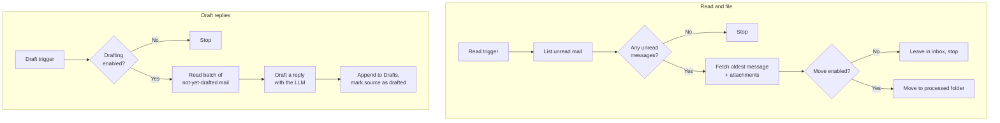

# Email Agent

The **Email Agent** (the IMAP agent) connects to a mailbox over IMAP and works through it on your behalf. It lists the
unread mail in an inbox, fetches a message with its attachments, optionally files that message into another folder, and
— as a separate, independently scheduled job — drafts replies to a batch of messages and leaves them in your Drafts
folder.

Unlike the chat-based assistants, this agent has **no chat interface**. You do not talk to it. It is configured once in
the Admin UI and then triggered programmatically — by a scheduler, by another workflow, or via the API. In this respect
it behaves like the [Retrieval Agent](../6_retrieval_agent/): it is a building block for automation rather than a
conversational partner.

::: tip When to reach for this agent
Use the Email Agent when work arrives by email and you want the routine part handled automatically — triaging a shared
mailbox, filing processed mail out of the inbox, or preparing reply drafts overnight so a person only has to review and
click send. If you want a colleague-style assistant to chat with, use the
[Instructed Assistant](../3_instructed_assistant/) or the
[Document Intelligence Assistant](../5_document_intelligence_assistant/) instead.
:::

::: warning It never sends email
The agent speaks IMAP only — there is no SMTP anywhere in it. It can read, move, and *save a draft*, but it can never
put a message on the wire. A human always opens the draft, reviews it, and sends it. This is a deliberate design
boundary, not a configuration default you can turn off.
:::

## What it does

The agent has **two independent capabilities**, each started by its own trigger. They do not depend on each other, and
you can schedule them separately — for example, read/move every five minutes and drafting once an hour.



### Reading and filing

1. **List unread mail.** The agent opens the configured inbox folder and returns a summary of every unread message,
   **oldest sent first**, up to the **Max Unread Messages** cap.
2. **Fetch a message.** The oldest unread message is fetched in full — sender, subject, date, body, and attachments. If
   the inbox has no unread mail, the run simply stops here. Attachment bytes are written to the platform's file storage
   and the message event carries only *references* to them, so the audit trail and the event stream stay small.
3. **File it away.** If **Move Fetched Mail** is enabled, the message is moved into the processed folder. If it is
   disabled, the message stays where it is and the run ends.

The whole read path is **read-only at the protocol level**: the mailbox is opened with a read-only select and bodies are
fetched with `BODY.PEEK`, so the message is never marked as read behind your back. Moving relocates a message; it never
deletes one.

### Drafting replies

1. **Find candidates.** The drafter reads up to **Draft Batch Size** messages from its own source folder that have not
   been drafted yet, **taking the oldest-sent ones first** — so a backlog drains in the order it arrived and the batch
   size never leaves the oldest mail waiting behind newer arrivals. Already-drafted messages are recognised by an IMAP
   flag the agent sets, so re-running the job does not produce duplicate drafts.
2. **Draft each reply.** For every message, the configured chat model is given your **Draft Prompt** and the original
   message, and writes a reply body. The result is wrapped in a properly threaded reply envelope, so the draft shows up
   in the right conversation in your mail client.
3. **Save and mark.** Each draft is appended to the drafts folder, and only then is the source message flagged as
   drafted. The source message stays **unread** — a person still sees it as new mail waiting for attention.

::: details Which flag marks a message as drafted
The agent prefers a private keyword (`$AiHubDrafted`) that only it understands, so a message with an unsent draft is not
made to look like something it is not. Not every mail server supports custom keywords, though. On a server that does
not, the agent falls back to the standard `\Answered` flag — and those messages will show up as **replied** in your mail
client even though nothing has been sent yet. If your mailbox shows unexpected "replied" markers, this is why.
:::

::: details Why the source message stays unread
Drafting is a preparation step, not a resolution. The point is that a human opens the mailbox, sees the message as
unread and unhandled, finds a draft reply already waiting, and decides what to do. Marking mail as read would hide work
that has not actually been done.
:::

::: details What happens if a run is interrupted
The draft is appended to the drafts folder *before* the source message is flagged. If the run dies between those two
operations, the worst case is a duplicate draft on the next run — never a message that is silently marked as handled
without a draft existing. Losing work is treated as worse than doing a little of it twice.
:::

## What it does *not* do

- **It never sends.** No SMTP, no outbound delivery, no "send if confident" mode.
- **It never deletes.** Moving a message relocates it; nothing is permanently removed from the mailbox.
- **It has no chat interface.** It does not appear in the chat UI and cannot be asked questions.
- **It has no knowledge base.** Drafts are written from the original message plus your prompt — the agent does not
  search your documents. For grounded, cited answers, use the
  [Document Intelligence Assistant](../5_document_intelligence_assistant/).
- **It reads one message per read run.** The read/move chain lists all unread mail but fetches and files the oldest
  message only. Schedule it more frequently to work through a backlog; the drafting chain is the one that processes a
  batch.

## Configuration

Create a profile from the **IMAP Agent** blueprint in the Admin UI. The form has two sections: the mailbox connection
and the drafting settings.

### Mailbox connection

| Field                   | Type     | Default               | Description                                                                                                                                                                             |
| ----------------------- | -------- | --------------------- | --------------------------------------------------------------------------------------------------------------------------------------------------------------------------------------- |
| **IMAP Host**           | Text     | —                     | Hostname of the IMAP server, e.g. `imap.example.com`. Required.                                                                                                                         |
| **IMAP Port**           | Number   | `993`                 | Server port. `993` is the standard for implicit TLS. Range 1–65535.                                                                                                                     |
| **Authentication**      | Choice   | Username and password | **Username and password**, or **Microsoft 365 (OAuth 2.0)** for Microsoft 365 mailboxes where basic authentication is disabled. Decides which of the credential fields below are shown. |
| **Username**            | Text     | —                     | Mailbox login, usually the full email address. With Microsoft 365 (OAuth 2.0), the address of the mailbox to process. Required.                                                         |
| **Password**            | Password | *(empty)*             | Mailbox password or, preferably, an app-specific token. Stored with the agent profile. Only shown for username and password.                                                            |
| **Tenant ID**           | Text     | *(empty)*             | Directory (tenant) ID of your Microsoft Entra ID tenant. Only shown — and required — for Microsoft 365 (OAuth 2.0).                                                                     |
| **Client ID**           | Text     | *(empty)*             | Application (client) ID of the Entra ID app registration. Only shown — and required — for Microsoft 365 (OAuth 2.0).                                                                    |
| **Client Secret**       | Password | *(empty)*             | Client secret of the Entra ID app registration. Stored with the agent profile. Only shown — and required — for Microsoft 365 (OAuth 2.0).                                               |
| **Use TLS**             | Toggle   | On                    | Connect over implicit TLS. Turn off only for a plaintext test server.                                                                                                                   |
| **Inbox Folder**        | Text     | `INBOX`               | The folder incoming mail is read from.                                                                                                                                                  |
| **Max Unread Messages** | Number   | `50`                  | How many unread summaries a single run lists. Keeps the run small when the inbox is overflowing. 1–500.                                                                                 |
| **Move Fetched Mail**   | Toggle   | Off                   | When on, the fetched message is moved to the processed folder. When off, the move step is skipped.                                                                                      |
| **Processed Folder**    | Text     | `Processed`           | Where a processed message is filed. Only shown — and required — when **Move Fetched Mail** is on.                                                                                       |

### Microsoft 365 with OAuth 2.0

Microsoft 365 tenants increasingly have basic authentication switched off, and then no username and password — not even
an app password — will log in over IMAP. For those mailboxes choose **Microsoft 365 (OAuth 2.0)**. The agent then
fetches an app-only access token from Microsoft Entra ID with the client credentials flow and logs in with it (SASL
`XOAUTH2`). No user has to sign in interactively, which is what a scheduled agent needs.

Set the connection to host `outlook.office365.com`, port `993`, TLS on, and **Username** to the address of the mailbox
the agent should process — a shared mailbox works.

An administrator has to prepare the tenant once, by hand. Every step is required; a missing one fails the login.

1. **Register an application** in the Microsoft Entra admin center (**App registrations → New registration**, accounts
   in this organizational directory only). Note the **Directory (tenant) ID** and **Application (client) ID** from its
   overview page, and create a client secret under **Certificates & secrets**. These are the three values the agent
   profile asks for.

2. **Add the IMAP permission.** Under **API permissions → Add a permission → APIs my organization uses**, pick **Office
   365 Exchange Online → Application permissions → `IMAP.AccessAsApp`**, then **Grant admin consent**.

3. **Register the service principal in Exchange Online** (Exchange Online PowerShell, `Connect-ExchangeOnline`):

   ```powershell
   New-ServicePrincipal -AppId <client-id> -ObjectId <enterprise-app-object-id>
   ```

   The object ID is the one on the **Enterprise applications** overview page of the app, **not** the one on its App
   registrations page. The wrong one is the most common cause of a failed login.

4. **Grant the service principal access to each mailbox** the agent processes:

   ```powershell
   Add-MailboxPermission -Identity "support@contoso.com" -User <service-principal-id> -AccessRights FullAccess
   ```

   `Get-ServicePrincipal | Format-List` shows the service principal's identity.

5. **Make sure IMAP is enabled on those mailboxes**:

   ```powershell
   Set-CASMailbox -Identity "support@contoso.com" -ImapEnabled $true
   ```

::: warning Step 4 is the access boundary
The app can open exactly the mailboxes granted in step 4 and no others. Grant only the mailboxes the agent is meant to
process, and treat anyone who can run `Add-MailboxPermission` — or edit the agent profile's **Username** — as able to
point the agent at any mailbox that has been granted. The client secret carries the same weight as a mailbox password:
anyone holding it can read every granted mailbox.
:::

::: tip Client secrets expire
Entra ID client secrets are issued for at most two years. Put the expiry date in your calendar and paste the renewed
secret into the agent profile before it runs out — an expired secret fails every run with `AADSTS7000222`.
:::

#### When the login fails

The error in the run's event timeline tells you which side refused:

| Error                             | Cause                                                                                                         |
| --------------------------------- | ------------------------------------------------------------------------------------------------------------- |
| `... these fields are empty: ...` | **Tenant ID**, **Client ID** or **Client Secret** is not filled in on the profile.                            |
| `AADSTS90002` / `AADSTS700016`    | The tenant ID is wrong, or the client ID does not belong to an app in that tenant.                            |
| `AADSTS7000215` / `AADSTS7000222` | The client secret is wrong, or it has expired.                                                                |
| `NO AUTHENTICATE failed`          | Entra issued a token but Exchange refused it — step 3, 4 or 5 is missing, or step 3 used the wrong object ID. |

Exchange answers `NO AUTHENTICATE failed` for all three of its causes alike, so check steps 3 to 5 in order.

### Draft email settings

Everything in this section is hidden until **Draft Reply** is switched on.

| Field                   | Type         | Default                | Description                                                                                                                                                                                    |
| ----------------------- | ------------ | ---------------------- | ---------------------------------------------------------------------------------------------------------------------------------------------------------------------------------------------- |
| **Draft Reply**         | Toggle       | Off                    | Master switch for the drafting capability. When off, a draft run stops immediately without doing anything.                                                                                     |
| **Draft Source Folder** | Text         | `INBOX`                | Where the drafter looks for candidate messages. Point it at your processed folder to draft replies to mail the move step filed.                                                                |
| **Draft Batch Size**    | Number       | `5`                    | How many messages are drafted per run. Must be at least 1.                                                                                                                                     |
| **Drafts Folder**       | Text         | `Drafts`               | Where drafts are saved. If the server does not have a folder by this name, its standard `\Drafts` folder is used instead.                                                                      |
| **LLM Model**           | Model picker | *(empty)*              | The chat model that writes the reply body. Options come from your LiteLLM configuration.                                                                                                       |
| **Draft Prompt**        | Long text    | *(a sensible default)* | Instructions steering tone, language, and format of the reply. The default asks for a concise, polite reply in the sender's language, with no invented facts and no subject line or signature. |

::: details Deployment-fixed limits you will not see in the form
Three size caps are fixed by whoever operates the platform and are not exposed as form fields, because they protect the
platform rather than shape the agent's behaviour:

| Limit               | Default | What it protects                                                                                                                                   |
| ------------------- | ------- | -------------------------------------------------------------------------------------------------------------------------------------------------- |
| Max message size    | 50 MB   | The raw size of a message is checked *before* the body is downloaded, so an oversized or hostile mail is refused rather than pulled into memory.   |
| Max body size       | 1 MB    | Caps the message body carried in an event; longer bodies are truncated so the stored and streamed event stays within platform message-size limits. |
| Max attachment size | 10 MB   | Caps a single stored attachment; larger attachments are skipped so one message cannot overload the attachment store.                               |

Ask your platform administrator if a legitimate workload runs into one of these.
:::

::: details How the settings combine at runtime
A **read** trigger connects with the mailbox settings, lists up to **Max Unread Messages** from **Inbox Folder**,
fetches the oldest one, and — if **Move Fetched Mail** is on — moves it to **Processed Folder**.

A **draft** trigger is independent. If **Draft Reply** is on, it reads up to **Draft Batch Size** not-yet-drafted
messages from **Draft Source Folder**, calls the selected **LLM Model** once per message with your **Draft Prompt**,
appends each result to **Drafts Folder**, and flags the source. The mail connection is opened only for the IMAP work and
closed again while the model is writing, so a slow model does not leave an idle connection for the server to drop.
:::

## Example workflows

**Triage a shared mailbox.** Enable **Move Fetched Mail** with a `Processed` folder and schedule the read trigger every
few minutes. Each run takes the oldest unread message out of the inbox and files it, with the full message and its
attachments recorded in the platform's audit trail. The inbox becomes a queue that drains itself.

**Prepare overnight reply drafts.** Leave moving off, enable **Draft Reply** with **Draft Source Folder** set to
`INBOX`, and schedule the draft trigger to run outside business hours with a batch size that matches your daily volume.
In the morning the team opens the mailbox and finds a draft waiting under each new message — review, adjust, send.

**Both, in sequence.** Point the read trigger at `INBOX` with moving on, and set **Draft Source Folder** to the same
`Processed` folder. Mail is filed as it arrives, and the drafter works through the filed messages on its own schedule.
The two jobs never contend for the same message.

## Best practices

**Use an app-specific password — or OAuth 2.0 on Microsoft 365.** Most providers (Gmail and others) issue
per-application credentials that can be revoked on their own. Use one instead of the account's real password, and give
the agent a mailbox that holds only what it needs to see. On Microsoft 365, use
[OAuth 2.0](#microsoft-365-with-oauth-2-0) instead: app passwords stop working once basic authentication is disabled.

**Start with moving and drafting off.** Both are off by default for a reason. Run the agent read-only first, confirm in
the event timeline that it connects and picks up the right messages, then switch on one capability at a time.

**Set the processed folder before enabling the move.** Turning on **Move Fetched Mail** with an empty **Processed
Folder** fails the run. Create the folder on the mail server first — the agent files into it, it does not create it.

**Keep the batch size small at first.** Every message in a batch costs one model call. Start at three to five, watch the
cost and quality in the traces, and raise it once you trust the output.

**Write the draft prompt for a reviewer, not for a recipient.** The best drafts are the ones a person can approve in
seconds. Ask for a short reply, an explicit statement when information is missing, and no invented facts — a draft that
politely says "I need to check X" is more useful than a confident wrong answer.

**Match the source folder to your schedule.** If the same folder feeds both the move step and the drafter, make sure the
read trigger runs often enough to keep the drafter supplied — and that the drafter's batch size is not so large it
repeatedly finds nothing to do.

**Remember that inbound mail is untrusted.** Anyone can send your mailbox anything, and the body of that message goes
into the model's prompt. The platform's PII guard anonymises personal data at the LLM gateway, but you should still
treat drafts as suggestions from an untrusted input — which is exactly why a human reviews every one before it is sent.
