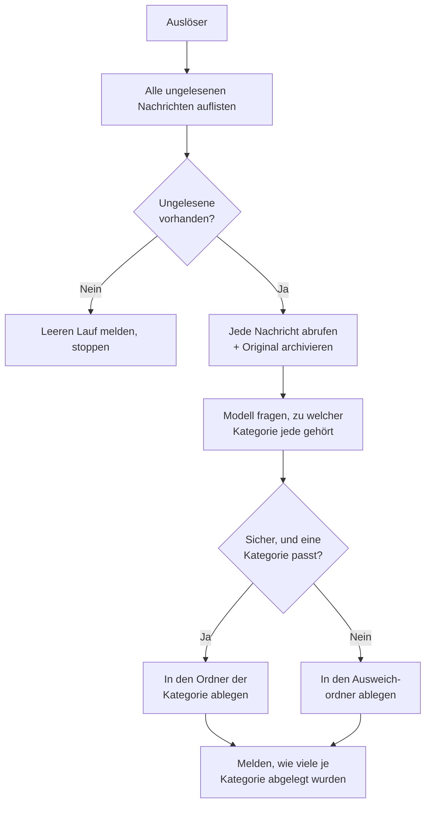

# E-Mail-Klassifizierungsagent

Der **E-Mail-Klassifizierungsagent** macht aus einem gemeinsamen Postfach eine Warteschlange, die sich selbst sortiert.
Bei jedem Lauf liest er jede ungelesene Nachricht im Posteingang, entscheidet, zu welcher Ihrer Kategorien sie gehört,
und verschiebt sie in den Ordner dieser Kategorie. Alles, bei dem er nicht sicher ist, landet in einem Ausweichordner,
statt in eine Kategorie geraten zu werden.

Wie der [E-Mail-Agent](../11_email_agent/) hat er **keine Chat-Oberfläche**. Sie konfigurieren ihn einmal in der
Admin-UI und lösen ihn programmatisch aus — durch einen Scheduler, einen anderen Workflow oder die API.

::: warning Er versendet niemals E-Mails
Der Agent spricht ausschliesslich IMAP — es gibt nirgends SMTP. Er liest, legt ab und erstellt Ordner. Er kann keine
Nachricht auf die Leitung geben. Das ist eine Design-Grenze, keine Einstellung.
:::

::: tip Die Kategorien gehören Ihnen, nicht uns
Es gibt keine eingebaute Taxonomie. Sie definieren die Kategorien und können jederzeit eine hinzufügen oder umbenennen —
ohne Deployment. Was die Klassifizierung überhaupt funktionieren lässt, ist die **Beschreibung**, die Sie zu jeder
schreiben (siehe unten).
:::

## Was er tut

1. **Auflisten.** Jede ungelesene Nachricht im Posteingang, älteste zuerst, bis zu **Max. ungelesene Nachrichten**.
2. **Abrufen und archivieren.** Jede Nachricht wird vollständig abgerufen. Ihre Anhänge und die Originalnachricht werden
   im Dateispeicher der Plattform abgelegt, sodass die vollständige E-Mail auch nach dem Verschieben erhalten bleibt.
3. **Klassifizieren.** Dem konfigurierten Modell werden Ihre Kategorienamen und -beschreibungen gezeigt; es wählt eine
   pro Nachricht — oder lehnt ab, wenn keine passt.
4. **Ablegen.** Jede Nachricht wird in den Ordner ihrer Kategorie verschoben. **Existiert der Ordner nicht, erstellt ihn
   der Agent** und abonniert ihn, damit er im Mail-Client sichtbar wird.
5. **Melden.** Der Lauf hält fest, wie viele Nachrichten abgelegt wurden und wie viele auf jede Kategorie entfielen.

::: details Warum ein erneuter Lauf unbedenklich ist
Das Ablegen selbst verhindert Doppelarbeit. Jede Nachricht — sicher eingeordnet oder nicht — verlässt den Posteingang,
sodass die Auflistung des nächsten Laufs sie schlicht nicht mehr sehen kann. Es gibt kein Flag, das aus dem Takt geraten
könnte, und nichts aufzuräumen. Bricht ein Lauf auf halbem Weg ab, bleiben die bereits abgelegten Nachrichten abgelegt,
und der Rest liegt weiterhin ungelesen bereit für den nächsten Lauf.
:::

::: details Die Nachricht bleibt ungelesen
E-Mails werden mit `BODY.PEEK` gelesen, der Agent markiert also nie etwas als gesehen. Wer den Ordner `Support` öffnet,
sieht weiterhin echte ungelesene Post — der Agent hat sie sortiert, nicht erledigt.
:::

## Konfiguration

Erstellen Sie in der Admin-UI ein Profil aus der Vorlage **E-Mail-Klassifizierungsagent**.

### Postfachverbindung

Dieselben Felder wie beim [E-Mail-Agenten](../11_email_agent/): Host, Port, Benutzername, Passwort, TLS,
Posteingangsordner und **Max. ungelesene Nachrichten**. Einen „Verarbeitet-Ordner" gibt es hier nicht — der
Klassifizierer entscheidet, wohin jede Nachricht geht.

### Kategorien

Eine wiederholbare Liste. Fügen Sie einen Eintrag pro Kategorie hinzu:

| Feld                   | Beschreibung                                                                                    |
| ---------------------- | ----------------------------------------------------------------------------------------------- |
| **Kategorie**          | Ein kurzer Name, z. B. `support_request`. Muss eindeutig sein.                                  |
| **Zielordner**         | Wohin E-Mails dieser Kategorie abgelegt werden. Wird bei Bedarf erstellt. Muss eindeutig sein.  |
| **Was gehört hierher** | Eine Beschreibung der Art von E-Mails, die in diese Kategorie gehört. **Das liest das Modell.** |

::: tip Schreiben Sie die Beschreibung für eine neue Kollegin, nicht für eine Suchmaschine
Dieses Feld leistet die eigentliche Arbeit. Ordnernamen allein können eine *Informationsanfrage* nicht von einer
*Supportanfrage* trennen — eine Beschreibung schon: „wir können das lösen, indem wir eine Auskunft geben" gegenüber „das
erfordert eine Handlung unseres Teams". Beschreiben Sie die **Absicht** der Absenderin und was die Bearbeitung bedeuten
würde. Stichwortlisten funktionieren deutlich schlechter als ein klarer Satz darüber, wozu die Kategorie da ist.
:::

### Klassifizierer

| Feld                        | Standard                | Beschreibung                                                                                    |
| --------------------------- | ----------------------- | ----------------------------------------------------------------------------------------------- |
| **Ausweichordner**          | `Uncategorised`         | Wohin unsichere E-Mails gehen. Nie in eine Kategorie geraten, nie im Posteingang belassen.      |
| **Konfidenzschwelle**       | `0.6`                   | Darunter geht eine Nachricht in den Ausweichordner, auch wenn das Modell eine Kategorie wählte. |
| **Klassifizierungsmodell**  | *(leer)*                | Das klassifizierende Modell. Leer lassen, um das Hauptmodell des Agenten zu verwenden.          |
| **Klassifizierungs-Prompt** | *(sinnvoller Standard)* | Anweisungen, wie das Modell auswählt.                                                           |

::: details Zwei Wege in den Ausweichordner
Das Modell kann ausdrücklich sagen, dass **keine der Kategorien passt**, und es kann eine wählen, dabei aber **geringe
Konfidenz** melden. Beides schickt die Nachricht in den Ausweichordner.

Beides existiert mit Absicht. Ein Modell, das falsch liegt, ist häufig auch überzeugt — eine Konfidenzschwelle allein
ist also kein verlässliches Sicherheitsnetz. Und ein Modell, das immer wählen muss, wählt immer irgendetwas. Ihm
ausdrücklich die Möglichkeit zur Ablehnung zu geben *und* eine Untergrenze für die Konfidenz zu setzen, fängt mehr von
der Post ab, die ein Mensch ansehen sollte.

Betrachten Sie `0.6` als Ausgangspunkt. Beobachten Sie, wo Ihre echte Post landet, und passen Sie an: erhöhen, wenn
falsche E-Mails selbstbewusst abgelegt werden; senken, wenn sich der Ausweichordner mit offensichtlich klassifizierbarer
Post füllt.
:::

## Erste Schritte

1. **Beginnen Sie mit zwei oder drei Kategorien**, nicht mit fünfzehn. Breite, klar unterscheidbare Töpfe werden weit
   zuverlässiger klassifiziert als eine lange Liste überlappender — aufteilen können Sie später.
2. **Lassen Sie ihn die Ordner erstellen.** Verweisen Sie auf noch nicht existierende Ordner und lassen Sie den ersten
   Lauf sie anlegen; so stimmen die Namen exakt überein.
3. **Verfolgen Sie die ersten Läufe in der Ereignis-Timeline.** Bei jeder Nachricht sind die gewählte Kategorie und die
   Begründung des Modells sichtbar. Diese Begründung ist der schnellste Weg zu einer Beschreibung, die eine
   Überarbeitung braucht.
4. **Justieren Sie die Beschreibungen vor der Schwelle.** Die meisten Fehlablagen sind eine vage Beschreibung, keine
   falsche Schwelle.
5. **Danach planen Sie ihn** alle paar Minuten ein — und der Posteingang leert sich von selbst.

## Was er *nicht* tut

- **Er versendet nie und löscht nie.** Verschieben verlagert eine Nachricht; nichts verlässt das Postfach.
- **Er entwirft keine Antworten.** Das ist eine eigene Fähigkeit — siehe [E-Mail-Agent](../11_email_agent/).
- **Er liest zum Klassifizieren keine Anhänge.** Die Klassifizierung nutzt Kopfzeilen und den Textkörper. Anhänge werden
  archiviert, beeinflussen die Kategorie aber nicht.
- **Er hat keine Chat-Oberfläche** und keine Wissensdatenbank.

::: warning Eingehende E-Mails sind nicht vertrauenswürdig
Jede und jeder kann Ihrem Postfach alles schicken, und der Textkörper geht in den Prompt des Modells. Der Agent ist so
gebaut, dass der schlimmste Fall begrenzt bleibt: Das Modell wählt aus **Ihrer** Kategorienliste und kann immer nur eine
Position in dieser Liste zurückgeben — eine Nachricht mit eingebetteten Anweisungen kann also keinen Zielordner erfinden
und den Agenten zu nichts anderem bringen als zum Ablegen von Post. Der PII-Schutz der Plattform anonymisiert
personenbezogene Daten am LLM-Gateway. Behandeln Sie den Ordner, in dem eine Nachricht gelandet ist, dennoch als
Vorschlag, nicht als Urteil.
:::
