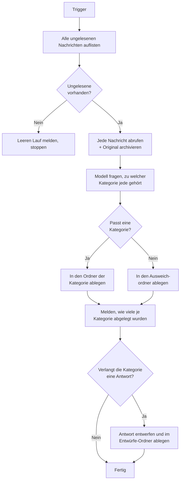

# E-Mail-Verarbeitungsagent

Der **E-Mail-Verarbeitungsagent** macht aus einem gemeinsamen Postfach eine Warteschlange, die sich selbst sortiert. Bei
jedem Lauf liest er jede ungelesene Nachricht im Posteingang, entscheidet, zu welcher Ihrer Kategorien sie gehört, und
verschiebt sie in den Ordner dieser Kategorie. Alles, wozu keine Kategorie passt, landet in einem Ausweichordner, statt
in eine Kategorie geraten zu werden.

Wie der [E-Mail-Agent](../11_email_agent/) hat er **keine Chat-Oberfläche**. Sie konfigurieren ihn einmal im Admin UI
und lösen ihn programmatisch aus — durch einen anderen Workflow oder über die API.

::: warning Noch kein eingebauter Zeitplan
Der Agent hat keinen wiederkehrenden Trigger, den Sie im Admin UI einstellen könnten. Jeder Lauf muss von aussen
gestartet werden — „sortiert sich selbst" heisst also „sortiert sich bei jedem Anstoss selbst". Bis die Planung
verfügbar ist, stossen Sie ihn aus dem an, was in Ihrer Umgebung ohnehin nach Zeitplan läuft.
:::

::: warning Er versendet niemals E-Mails
Der Agent spricht ausschliesslich IMAP — es gibt nirgends SMTP. Er liest, legt ab und erstellt Ordner. Er kann keine
Nachricht auf die Leitung geben. Das ist eine Design-Grenze, keine Einstellung.
:::

::: tip Die Kategorien gehören Ihnen, nicht uns
Es gibt keine eingebaute Taxonomie. Sie definieren die Kategorien und können jederzeit eine hinzufügen oder umbenennen —
ohne Deployment. Was die Klassifizierung funktionieren lässt, ist die **Beschreibung**, die Sie zu jeder schreiben —
siehe unten.
:::

## Was er tut



1. **Auflisten.** Jede ungelesene Nachricht im Posteingang, älteste zuerst nach Sendedatum, bis zu **Max. ungelesene
   E-Mails**.
2. **Abrufen und archivieren.** Jede Nachricht wird vollständig abgerufen. Ihre Anhänge und die Originalnachricht werden
   in den Dateispeicher der Plattform geschrieben, sodass die vollständige E-Mail auch nach dem Verschieben erhalten
   bleibt.
3. **Klassifizieren.** Dem konfigurierten Modell werden Ihre Kategorienamen und -beschreibungen gezeigt; es wählt eine
   pro Nachricht — oder lehnt ab, wenn keine passt.
4. **Ablegen.** Jede Nachricht wird in den Ordner ihrer Kategorie verschoben. **Existiert der Ordner nicht, erstellt ihn
   der Agent** und abonniert ihn, damit er in Ihrem Mail-Client sichtbar wird.
5. **Melden.** Der Lauf hält fest, wie viele Nachrichten abgelegt wurden und wie viele auf jede Kategorie entfielen.

::: details Warum ein erneuter Lauf unbedenklich ist
Das Ablegen selbst verhindert Doppelarbeit. Jede Nachricht — eingeordnet oder nicht — verlässt den Posteingang, sodass
die Auflistung des nächsten Laufs sie schlicht nicht mehr sehen kann. Es gibt kein Flag, das aus dem Takt geraten
könnte, und nichts aufzuräumen. Bricht ein Lauf auf halbem Weg ab, bleiben die bereits abgelegten Nachrichten abgelegt,
und der Rest liegt weiterhin ungelesen für den nächsten Lauf bereit.
:::

::: details Die Nachricht bleibt ungelesen
E-Mails werden mit `BODY.PEEK` gelesen, der Agent markiert also nie etwas als gesehen. Wer den Ordner `Support` öffnet,
sieht weiterhin echte ungelesene Post — der Agent hat sie sortiert, nicht erledigt.
:::

## Konfiguration

Erstellen Sie im Admin UI ein Profil aus dem Blueprint **E-Mail-Verarbeitungsagent**.

### Postfachverbindung

Dieselben Felder wie beim [E-Mail-Agent](../11_email_agent/#postfach-verbindung): Host, Port, Authentifizierung,
Benutzername und Passwort oder Entra-ID-Anmeldedaten, TLS, Posteingang-Ordner und **Max. ungelesene E-Mails**. Einen
„Verarbeitet-Ordner" gibt es hier nicht — der Klassifizierer entscheidet, wohin jede Nachricht geht.

Wählen Sie für ein Microsoft-365-Postfach mit deaktivierter Standardauthentifizierung unter **Authentifizierung** die
Option **Microsoft 365 (OAuth 2.0)**. Der Tenant braucht eine einmalige Einrichtung durch eine Administratorin oder
einen Administrator — eine App-Registrierung, die Berechtigung `IMAP.AccessAsApp` und einen pro Postfach gewährten
Zugriff —, Schritt für Schritt beschrieben unter
[Microsoft 365 mit OAuth 2.0](../11_email_agent/#microsoft-365-mit-oauth-2-0).

### Kategorien

Eine wiederholbare Liste. Fügen Sie einen Eintrag pro Kategorie hinzu:

| Feld                   | Beschreibung                                                                                                         |
| ---------------------- | -------------------------------------------------------------------------------------------------------------------- |
| **Kategorie**          | Ein kurzer Name, z. B. `support_request`. Muss eindeutig sein.                                                       |
| **Zielordner**         | Wohin E-Mails dieser Kategorie abgelegt werden. Wird automatisch erstellt, falls er fehlt. Muss eindeutig sein.      |
| **Was gehört hierher** | Eine Beschreibung der Art von E-Mails, die in diese Kategorie gehört. **Das liest das Modell.**                      |
| **Antwort entwerfen**  | Wenn aktiviert, erhält Post dieser Kategorie zusätzlich einen Antwortentwurf im Entwürfe-Ordner. Standardmässig aus. |

::: tip Schreiben Sie die Beschreibung für eine neue Kollegin, nicht für eine Suchmaschine
Dieses Feld leistet die eigentliche Arbeit. Ordnernamen allein können eine *Informationsanfrage* nicht von einer
*Supportanfrage* trennen — eine Beschreibung schon: *„wir können das lösen, indem wir eine Auskunft geben"* gegenüber
*„das erfordert eine Handlung unseres Teams"*. Beschreiben Sie die **Absicht** der Absenderin oder des Absenders und was
die Bearbeitung der E-Mail bedeuten würde. Stichwortlisten funktionieren deutlich schlechter als ein klarer Satz
darüber, wozu die Kategorie da ist.
:::

::: warning Verschachtelte Ordnernamen nutzen das Trennzeichen *Ihres* Servers
Ein Zielordner wie `Triage/Support` ergibt nur auf Servern eine echte Ordnerstruktur, deren Hierarchie-Trennzeichen `/`
ist — Gmail gehört dazu. Auf einem Server mit `.` entstünde ein einzelner flacher Ordner mit dem Namen `Triage/Support`;
schreiben Sie dort stattdessen `Triage.Support`. Abgelegt wird die Post in beiden Fällen korrekt, eine Baumstruktur
erhalten Sie aber nur mit dem passenden Trennzeichen. Im Zweifel verwenden Sie flache Namen wie `Support` und
`Invoices`.
:::

### Klassifizierer

| Feld                        | Standard                | Beschreibung                                                                                                        |
| --------------------------- | ----------------------- | ------------------------------------------------------------------------------------------------------------------- |
| **Ausweichordner**          | `Uncategorised`         | Wohin E-Mails gehen, bei denen das Modell unsicher ist. Nie in eine Kategorie geraten, nie im Posteingang belassen. |
| **Klassifizierungsmodell**  | *(leer)*                | Das klassifizierende Modell. Leer lassen, um das Hauptmodell des Agents zu verwenden.                               |
| **Klassifizierungs-Prompt** | *(sinnvoller Standard)* | Anweisungen, wie das Modell auswählt.                                                                               |

::: details Wie eine Nachricht im Ausweichordner landet
Das Modell hat genau einen Ausweg: Es kann ausdrücklich sagen, dass **keine der Kategorien passt**. Dann geht die
Nachricht in den Ausweichordner statt in einen Kategorieordner.

Eine frühere Fassung liess das Modell zusätzlich seine eigene Konfidenz bewerten und leitete alles unterhalb einer
Schwelle um. Diese Einstellung wurde entfernt. Ein selbst gemeldeter Wert entsteht im selben Zug wie die Antwort, statt
gemessen zu werden — er trägt also nichts bei, was in der Wahl nicht ohnehin steckt. Über die Chat-Modelle der Plattform
hinweg an einer bewusst mehrdeutigen Nachricht gemessen, fing die ausdrückliche Ablehnung sie in vier von fünf Fällen
ab, während die Schwelle kein einziges Mal griff; das eine Modell, das falsch ablegte, tat dies mit 0.95 Konfidenz.

Die praktische Folge: **Ihre Kategoriebeschreibungen sind das Sicherheitsnetz, nicht ein Regler.** Landet Post im
falschen Ordner, schärfen Sie die Beschreibungen der beiden verwechselten Kategorien.
:::

### Zeitplan

Der Agent kann sich selbst ausführen. Aktivieren Sie im Profil **Zeitplan** und geben Sie die fünf Cron-Positionen plus
eine Zeitzone an; bleibt er deaktiviert, läuft der Agent nur, wenn ihn etwas auslöst.

| Feld               | Beispiel        | Beschreibung                                    |
| ------------------ | --------------- | ----------------------------------------------- |
| **Minute**         | `0`             | `0-59`. `*/15` bedeutet alle fünfzehn Minuten.  |
| **Stunde**         | `*`             | `0-23`.                                         |
| **Tag des Monats** | `*`             | `1-31`.                                         |
| **Monat**          | `*`             | `1-12`.                                         |
| **Wochentag**      | `*`             | `0-6`, Sonntag ist `0`.                         |
| **Zeitzone**       | `Europe/Zurich` | Die Zone, in der die Positionen gelesen werden. |

Die Zeitzone sorgt dafür, dass „jeden Tag um 08:00" das ganze Jahr dasselbe bedeutet: Die Termine werden in dieser Zone
berechnet, sodass ein täglicher Zeitplan seine Uhrzeit über Sommerzeitwechsel hinweg behält.

Jede Position muss ausgefüllt sein. Eine leere oder fehlerhafte Position wird beim Speichern abgelehnt, statt
gespeichert zu werden und das Profil unbemerkt zu beschädigen.

::: tip Stündlich beginnen, dann verdichten
`0 * * * *` — zur vollen Stunde — ist ein guter erster Zeitplan. Er liefert Ihnen einen Lauf pro Stunde zur Prüfung,
bevor Sie entscheiden, ob das Postfach öfter geleert werden muss.
:::

::: details Was passiert, wenn ein Lauf den nächsten Termin überlappt
Ein grosses oder langsames Postfach kann noch beim Ablegen sein, wenn der nächste geplante Zeitpunkt kommt. Nur ein Lauf
auf einmal darf ein Postfach halten: Der zweite meldet, dass ein vorheriger Lauf noch ablegt, und stoppt, ohne eine
E-Mail anzufassen. Der Termin wird übersprungen statt eingereiht, und der nächste läuft normal.

Das ist wichtig, weil eine Nachricht bis zum Verschieben ungelesen bleibt. Ohne diesen Schutz würden zwei überlappende
Läufe dieselbe Post lesen, beide für ihre Klassifizierung bezahlen und beide versuchen, sie abzulegen.

Ein Lauf erneuert seinen Anspruch, solange er arbeitet, sodass die Dauer eines Stapels nie dazu führt, dass er das
Postfach verliert — der Ablauf von zehn Minuten beginnt erst zu zählen, wenn der Lauf tatsächlich gestoppt hat. Schlägt
ein Lauf komplett fehl, verfällt der Anspruch innerhalb von zehn Minuten von selbst und der nächste geplante Lauf fährt
fort; ein Absturz kostet Sie also höchstens einen Termin.

Im seltenen Fall, dass ein Lauf seinen Anspruch mitten im Betrieb verliert — ein Postfach oder ein Modell, das in einem
einzelnen Schritt länger als zehn Minuten hängt —, stoppt er, bevor er etwas ablegt, statt Post abzulegen, die ein
anderer Lauf womöglich bereits verschiebt. Das erscheint im Tracing als fehlgeschlagener Lauf und ist eine Untersuchung
wert: Es bedeutet, dass etwas weit länger gedauert hat, als es sollte.
:::

::: warning Drei Dinge, die Sie über geplante Läufe wissen sollten
- **Sie sind im Chat UI unsichtbar.** Ein geplanter Lauf gehört keinem Benutzer und erscheint daher in niemandes
  Konversationsliste. Verfolgen Sie ihn stattdessen im Tracing. Die Wahl, wer sie sieht, ist separat geplant.
- **Sie werden nicht gemessen.** Nutzungslimits werden bei Anfragen durchgesetzt, die über HTTP eintreffen, und ein
  geplanter Lauf stellt keine solche. Ein sehr häufiger Zeitplan gegen ein ausgelastetes Postfach kann unbemerkt viel
  Modellbudget verbrauchen — die Obergrenze **Max Messages** begrenzt einen einzelnen Lauf, und der Zeitplan begrenzt,
  wie oft das geschieht.
- **Der Agent muss laufen.** Ist der Agent offline, wenn ein geplanter Zeitpunkt verstreicht, wird dieser Termin
  übersprungen, nicht eingereiht. Nichts geht verloren: Die Post ist weiterhin ungelesen, und der nächste Lauf, der
  tatsächlich startet, greift sie auf.
:::

### Antwortentwürfe

Aktivieren Sie **Antwort entwerfen**, damit der Agent für die Kategorien, die es verdienen, eine Antwort schreibt und
sie in Ihrem Ordner **Entwürfe** hinterlegt — damit ein Mensch sie liest, anpasst und sendet. Der Agent versendet nie
etwas; die Plattform hat überhaupt keinen Mechanismus, E-Mails zu senden.

Entworfen wird **pro Kategorie**, über den Schalter **Antwort entwerfen** in der Kategorienliste. Genau darum geht es:
Eine *Beschwerde* verdient meist eine Antwort, ein *Dankeschön* selten, und eine *Rechnung* will bezahlt und nicht
beantwortet werden. Post, auf die keine Kategorie passte und die in den Ausweichordner ging, wird nie entworfen — wenn
das Modell nicht sagen konnte, worum es in einer Nachricht geht, kann es sie auch nicht beantworten.

| Feld                      | Beschreibung                                                                                                                                  |
| ------------------------- | --------------------------------------------------------------------------------------------------------------------------------------------- |
| **Antwort entwerfen**     | Hauptschalter dieses Abschnitts. Standardmässig aus.                                                                                          |
| **Entwürfe-Ordner**       | Wohin Entwürfe angehängt werden. Wird der Name nicht gefunden, wird der Entwürfe-Ordner des Servers verwendet, andernfalls der Name angelegt. |
| **LLM-Modell**            | Das Modell, das die Antwort schreibt. Leer lassen, um das Hauptmodell des Agents zu verwenden.                                                |
| **Entwurfs-Prompt**       | Anweisungen zu Ton und Stil. Der mitgelieferte Standard ist knapp, höflich und verbietet erfundene Fakten.                                    |
| **Eingabe-Token Entwurf** | Wie viel der Nachricht dem Modell gezeigt werden darf. Siehe *Lange E-Mails* unten.                                                           |

Jeder Entwurf wird mit der Nachricht verkettet, die er beantwortet — `Re:`-Betreff, korrekte `In-Reply-To`- und
`References`-Kopfzeilen —, sodass er in Ihrem Mail-Client innerhalb der ursprünglichen Konversation erscheint statt als
verirrte neue Nachricht.

::: warning Ein Entwurf ist ein erster Wurf, keine Antwort
Lesen Sie jeden Entwurf, bevor Sie ihn senden. Selbst ein in Ihren eigenen Dokumenten verankerter Entwurf (unten) ist
nur so gut wie die Dokumente dahinter, und ein nicht verankerter entsteht allein aus der Nachricht — er hat keinen
Zugriff auf Ihre Systeme, Ihre Preise oder Ihre Fallhistorie und weiss nicht, was er nicht weiss.
:::

#### Entwürfe in Ihren eigenen Dokumenten verankern

Eine allein aus der eingehenden Nachricht geschriebene Antwort kann diese bestätigen, aber nicht *beantworten*.
Verweisen Sie eine Kategorie auf eine **Wissenssammlung**, und ihre Antworten entstehen stattdessen aus den Dokumenten
dieser Sammlung — der Agent bittet einen Knowledge-Agent, die Nachricht aus dieser Sammlung zu beantworten, und
verwendet die Antwort als Entwurf.

Das Grounding wird pro Kategorie gewählt, in derselben Zeile wie Ordner und Beschreibung. Das hält das Retrieval
präzise: Eine als `support_request` klassifizierte Nachricht wird aus Ihrem Support-Material beantwortet und aus nichts
anderem, sodass das Kategorie-Urteil die Suche genau macht. Eine Kategorie ohne Sammlung schreibt weiterhin allein aus
der Nachricht — Sie können das also Kategorie für Kategorie einführen.

**Die Struktur der Wissensbasis, die das voraussetzt.** Eine Sammlung ist ein Ordner der obersten Ebene in Ihrer
Wissensdatenbank — die Ingestion erstellt automatisch eine Sammlung pro Ordner. Die Einrichtung ist also: ein Ordner pro
Kategorie, mit den Dokumenten, die diese Kategorie beantworten.

```text
support-kb/                 ← knowledge database
├── support/                ← collection, for the support_request category
│   ├── troubleshooting-guide.pdf
│   └── known-issues.md
└── information/            ← collection, for the information_request category
    ├── price-list.pdf
    └── opening-hours.md
```

Konfiguriert wird es an drei Stellen:

| Feld                   | Wo                     | Was es ist                                                                                                                       |
| ---------------------- | ---------------------- | -------------------------------------------------------------------------------------------------------------------------------- |
| **Knowledge-Agent**    | Wissensdelegation      | Der Agent, der eine Nachricht aus einer Sammlung beantwortet. Angeboten werden nur Agents, die sich auf eine beschränken lassen. |
| **Wissensdatenbanken** | E-Mail-Klassifizierung | Die Datenbanken, in denen Ihre Sammlungen liegen. Ein Sammlungsname allein identifiziert keine.                                  |
| **Wissenssammlung**    | In jeder Kategorie     | Die Sammlung, aus der die Antworten dieser Kategorie kommen. Leer lassen für kein Retrieval.                                     |

Eine Kategorie, die eine Sammlung nennt, die in keiner der konfigurierten Datenbanken vorkommt, lässt den Lauf **bevor**
irgendeine E-Mail klassifiziert wird fehlschlagen, statt stillschweigend aus nichts zu antworten. Dasselbe gilt für eine
verankerte Kategorie, deren Schalter **Antwort entwerfen** aus ist — sonst würden Sie nach Entwürfen suchen, die nie
fällig waren.

**Jede Nachricht erhält trotzdem einen Entwurf.** Findet die Suche nichts, was eine Nachricht beantwortet, bittet der
Agent das Modell nicht, um ein leeres Ergebnis herumzuschreiben — eine nicht verankerte Antwort, die sich wie eine
verankerte liest, ist schlimmer als eine ehrliche Leerstelle, weil eine prüfende Person sie überfliegt und sendet.
Stattdessen erhalten Sie einen Entwurf mit einem festen Text, den Sie konfigurieren:

| Feld                                    | Verwendet, wenn                                                                               |
| --------------------------------------- | --------------------------------------------------------------------------------------------- |
| **Entwurf, wenn nichts gefunden wurde** | Das Retrieval lief und nichts Relevantes fand. Eine wahre Aussage über Ihre Wissensbasis.     |
| **Entwurf, wenn die Suche fehlschlug**  | Die Suche selbst ist gescheitert oder hat nie geantwortet. Eine Aussage über Ihr Deployment.  |
| **Timeout der Wissenssuche**            | Wie lange gewartet wird, bevor eine Suche als fehlgeschlagen gilt. Standardmässig 10 Minuten. |

Die beiden werden bewusst getrennt gehalten: Einen Ausfall als fehlendes Wissen zu melden, ist genau der Weg, auf dem
ein kaputtes Deployment als funktionierendes gelesen wird. Und der Grund, warum es immer *irgendeinen* Entwurf gibt, ist
das Ablegen — eine Nachricht ohne Entwurf würde abgelegt, ohne Markierung, und nie wieder angesehen; sie stünde weder im
entworfenen noch im unberührten Zustand.

#### Anhänge

Aktivieren Sie **Anhänge lesen**, damit der Entwurfsdienst auch den *Inhalt* der angehängten Dateien nutzt und nicht nur
den Textkörper. PDFs und Bilder liest der Dokumentenparser der Plattform (mit OCR); Word-, PowerPoint- und Excel-Dateien
werden direkt konvertiert. Alles andere — Archive, Audio — wird übersprungen.

Jeder gelesene Anhang kostet einen Parser-Aufruf, daher begrenzen drei Limits den Aufwand:

| Feld                           | Beschreibung                                                                      |
| ------------------------------ | --------------------------------------------------------------------------------- |
| **Max. Anhänge pro Nachricht** | Wie viele Dateien pro Nachricht gelesen werden, grösste zuerst. Standard 3.       |
| **Minimale Anhangsgrösse**     | Kleinere Dateien werden ganz übersprungen. Standard 8 KB.                         |
| **Zeichenlimit pro Anhang**    | Wie viel Text aus einer einzelnen Datei übernommen wird. Standard 20 000 Zeichen. |

Die Mindestgrösse gibt es für einen bestimmten und sehr häufigen Fall: Das Logo in einer E-Mail-Signatur kommt genauso
als Anhang an wie ein echtes Dokument. Ohne diese Grenze würde jede gewöhnliche Geschäftsmail dafür bezahlen, ihr
Signaturbild für nichts auswerten zu lassen.

**Eine Datei, in der der Parser keinen Text findet, wird dem Modell dennoch genannt** — ein Foto oder ein Scan, den die
OCR nicht lesen konnte. Dem Modell wird gesagt, dass die Datei ankam und dass kein Text daraus gelesen werden konnte. So
kann der Entwurf *„danke für das Foto"* schreiben, ohne zu erfinden, was das Foto zeigte. Stillschweigend verworfen wird
sie nie: Wer „siehe Anhang" schreibt, verdient eine Antwort, die den Anhang wenigstens bemerkt.

::: tip Der Agent beschreibt keine Bilder
Das Lesen von Anhängen extrahiert **Text**. Ein Foto ohne Schrift liefert nur seinen Namen und Typ, sonst nichts — der
Agent versteht keine Bilder und sagt Ihnen nicht, was auf einem Bild zu sehen ist.
:::

#### Lange E-Mails

Ein langer weitergeleiteter Verlauf mit einem angehängten 200-seitigen PDF passt in das Eingabelimit keines Modells.
Statt zu scheitern, kürzt der Agent — in fester Reihenfolge, damit Sie vorhersagen können, was das Modell gesehen hat:

1. Die Kopfzeilen und die Liste der Anhänge bleiben immer erhalten.
2. Anhangstext wird zuerst verworfen, mit der kleinsten Datei beginnend.
3. Erst danach wird der Textkörper an einer Satzgrenze gekürzt und als gekürzt markiert.

Der Textkörper wird gegenüber den Anhängen geschützt, weil dort die eigentliche Frage der Absenderin oder des Absenders
steht. Erhöhen Sie **Eingabe-Token Entwurf**, wenn Ihr Modell mehr verarbeitet und Sie weniger Kürzung möchten.

## Erste Schritte

1. **Beginnen Sie mit zwei oder drei Kategorien**, nicht mit fünfzehn. Breite, klar unterscheidbare Töpfe werden weit
   zuverlässiger klassifiziert als eine lange Liste überlappender, und aufteilen können Sie sie später, sobald Sie den
   Verkehr sehen.
2. **Lassen Sie ihn die Ordner erstellen.** Verweisen Sie die Kategorien auf noch nicht existierende Ordner und lassen
   Sie den ersten Lauf sie anlegen — so stimmen die Namen immer exakt überein.
3. **Verfolgen Sie die ersten Läufe in der Event-Timeline.** Bei jeder Nachricht sind die gewählte Kategorie und die
   Begründung des Modells sichtbar. Diese Begründung ist der schnellste Weg zu einer Beschreibung, die überarbeitet
   werden muss.
4. **Beheben Sie Fehlablagen in den Beschreibungen.** Sie sind der einzige Hebel, den es gibt, und der richtige — fast
   jede Fehlablage geht auf zwei Kategorien mit überlappenden Beschreibungen zurück.
5. **Setzen Sie ihn danach auf einen Zeitplan** (oben), und der Posteingang leert sich von selbst.
6. **Aktivieren Sie das Entwerfen zuletzt**, und nur für die Kategorien, die es brauchen. Lesen Sie die ersten Entwürfe,
   bevor Sie dem Rest vertrauen.
7. **Verankern Sie dann die Kategorien, bei denen es sich lohnt.** Laden Sie die Dokumente, die eine Kategorie
   beantworten, in eine eigene Sammlung und verweisen Sie die Kategorie darauf. Ein nicht verankerter Entwurf kann eine
   Nachricht nur bestätigen; ein verankerter kann sie beantworten.

## Was er *nicht* tut

- **Er versendet nie und löscht nie.** Verschieben verlagert eine Nachricht; das Entwerfen schreibt in Ihren
  Entwürfe-Ordner. Nichts verlässt das Postfach, und die Plattform kann überhaupt keine E-Mails senden.
- **Er liest zum Klassifizieren keine Anhänge.** Die Klassifizierung nutzt nur die Kopfzeilen und den reinen Textkörper.
  Anhänge können in einen *Antwortentwurf* einfliessen (oben), nie aber in die Wahl der Kategorie.
- **Er antwortet nicht aus einer Sammlung, auf die Sie ihn nicht verwiesen haben.** Grounding ist pro Kategorie und
  opt-in; eine Kategorie ohne Sammlung wird allein aus der Nachricht und ihren Anhängen entworfen.
- **Er hat keine Chat-Oberfläche.**
- **Er überspringt keine Nachricht, die er nicht verarbeiten kann.** Ein Lauf ist ganz oder gar nicht: Scheitert die
  Klassifizierung einer Nachricht, wird nichts aus diesem Stapel abgelegt und der ganze Stapel im nächsten Lauf erneut
  versucht. Das verhindert, dass eine vorübergehende Störung Post in den Ausweichordner streut, bedeutet aber, dass eine
  dauerhaft unverarbeitbare Nachricht das Postfach blockiert, bis Sie sie von Hand herausnehmen. Achten Sie auf einen
  Lauf, der jedes Mal einen Fehler meldet und nichts ablegt.

::: warning Eingehende E-Mails sind nicht vertrauenswürdig
Jede und jeder kann Ihrem Postfach alles schicken, und der Textkörper geht in den Prompt des Modells. Der Agent ist so
gebaut, dass der schlimmste Fall begrenzt bleibt: Das Modell wählt aus **Ihrer** Kategorienliste und kann immer nur eine
Position in dieser Liste zurückgeben — eine Nachricht mit Anweisungen kann also keinen Zielordner erfinden und den Agent
zu nichts anderem bringen als zum Ablegen von Post. Der PII-Guard der Plattform anonymisiert personenbezogene Daten am
LLM-Gateway. Behandeln Sie den Ordner, in dem eine Nachricht gelandet ist, dennoch als Vorschlag, nicht als Urteil.
:::
