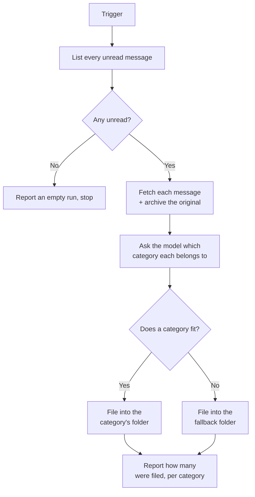

# Email Classification Agent

The **Email Classification Agent** turns a shared mailbox into a queue that sorts itself. On each run it reads every
unread message in the inbox, decides which of your categories it belongs to, and moves it into that category's folder.
Anything no category fits goes to a fallback folder rather than being guessed into a bucket.

Like the [Email Agent](../11_email_agent/), it has **no chat interface**. You configure it once in the Admin UI and
trigger it programmatically — by another workflow, or via the API.

::: warning There is no built-in schedule yet
The agent has no recurring trigger you can set in the Admin UI. Every run has to be started from outside, so "triages
itself" means "triages itself each time something asks it to". Until scheduling lands, drive it from whatever already
runs on a timer in your environment.
:::

::: warning It never sends email
The agent speaks IMAP only — there is no SMTP anywhere in it. It reads, it files, it creates folders. It cannot put a
message on the wire. This is a design boundary, not a setting.
:::

::: tip Categories are yours, not ours
There is no built-in taxonomy. You define the categories, and you can add or rename one at any time without a
deployment. What makes classification work is the **description** you write for each — see below.
:::

## What it does

1. **List.** Every unread message in the inbox, oldest sent first, up to **Max Unread Messages**.
2. **Fetch and archive.** Each message is fetched in full. Its attachments and the original message are written to the
   platform's file storage, so the complete mail is preserved even after it has been moved.
3. **Classify.** The configured model is shown your category names and descriptions and picks one per message — or
   declines, if none fits.
4. **File.** Each message is moved into the folder for its category. **If the folder does not exist, the agent creates
   it** and subscribes it, so it shows up in your mail client.
5. **Report.** The run records how many messages were filed and how many landed in each category.

::: details Why re-running is safe
Filing is what prevents double work. Every message — categorised or not — leaves the inbox, so the next run's unread
listing simply cannot see it again. There is no flag to get out of sync and nothing to clean up. If a run fails
half-way, the messages it already filed stay filed and the rest are still sitting unread, ready for the next run.
:::

::: details The message stays unread
Mail is read with `BODY.PEEK`, so the agent never marks anything as seen. A person opening the `Support` folder still
sees genuinely unread mail waiting for them — the agent sorted it, it did not handle it.
:::

## Configuration

Create a profile from the **Email Classification Agent** blueprint in the Admin UI.

### Mailbox connection

The same fields as the [Email Agent](../11_email_agent/#mailbox-connection): host, port, username, password, TLS, inbox
folder, and **Max Unread Messages**. There is no "processed folder" here — the classifier decides where each message
goes.

### Categories

A repeating list. Add one entry per category:

| Field                 | Description                                                                                        |
| --------------------- | -------------------------------------------------------------------------------------------------- |
| **Category**          | A short name, e.g. `support_request`. Must be unique.                                              |
| **Target Folder**     | Where mail in this category is filed. Created automatically if it does not exist. Must be unique.  |
| **What Belongs Here** | A description of the kind of mail that belongs in this category. **This is what the model reads.** |

::: tip Write the description for a new colleague, not for a search engine
This field does the real work. Folder names alone cannot separate an *information request* from a *support request* —
but a description can: *"we can resolve this by providing information"* versus *"this requires an action from our
team"*. Describe the sender's **intent** and what handling the mail would involve. Listing keywords works far worse than
one clear sentence about what the category is for.
:::

::: warning Nested folder names use *your server's* separator
A target folder like `Triage/Support` builds a real folder tree only on servers whose hierarchy separator is `/` — Gmail
among them. On a server that uses `.` you would get one flat folder literally named `Triage/Support`; write
`Triage.Support` there instead. Mail is filed correctly either way, but only the matching separator gives you a tree. If
you are unsure, use flat names like `Support` and `Invoices`.
:::

### Classifier

| Field                     | Default                | Description                                                                                        |
| ------------------------- | ---------------------- | -------------------------------------------------------------------------------------------------- |
| **Fallback Folder**       | `Uncategorised`        | Where mail the model is unsure about goes. Never guessed into a category, never left in the inbox. |
| **Classification Model**  | *(empty)*              | The model that classifies. Leave empty to use the agent's main model.                              |
| **Classification Prompt** | *(a sensible default)* | Instructions steering how the model chooses.                                                       |

::: details How a message ends up in the fallback folder
The model is given one way out: it can say outright that **none of the categories fit**. When it does, the message goes
to the fallback folder instead of a category folder.

An earlier version also asked the model to rate its own confidence and diverted anything below a threshold. That setting
was removed. A self-reported score is written in the same breath as the answer rather than measured, so it adds no
information the choice does not already carry — measured across the platform's chat models on a deliberately ambiguous
message, the explicit decline caught it four times out of five while the threshold never once fired, and the one model
that misfiled did so at 0.95 confidence.

The practical consequence: **your category descriptions are the safety net, not a dial.** If mail is landing in the
wrong folder, sharpen the descriptions of the two categories being confused.
:::

### Schedule

The agent can run itself. Enable **Schedule** on the profile and give it the five cron positions plus a timezone; leave
it disabled and the agent only runs when something triggers it.

| Field            | Example         | Description                                 |
| ---------------- | --------------- | ------------------------------------------- |
| **Minute**       | `0`             | `0-59`. `*/15` means every fifteen minutes. |
| **Hour**         | `*`             | `0-23`.                                     |
| **Day of month** | `*`             | `1-31`.                                     |
| **Month**        | `*`             | `1-12`.                                     |
| **Day of week**  | `*`             | `0-6`, Sunday is `0`.                       |
| **Timezone**     | `Europe/Zurich` | The zone the positions are read in.         |

The timezone is what makes "every day at 08:00" mean the same thing all year: occurrences are worked out in that zone,
so a daily schedule keeps its wall-clock time across daylight-saving changes.

::: tip Start hourly, then tighten
`0 * * * *` — on the hour — is a good first schedule. It gives you a run an hour to inspect before you decide whether
the mailbox needs draining more often.
:::

::: details What happens when a run overlaps the next occurrence
A large or slow mailbox can still be filing when the next scheduled time comes around. Only one run at a time may hold a
mailbox: the second one reports that a previous run is still filing and stops without touching any mail. The occurrence
is skipped rather than queued, and the next one runs normally.

This matters because a message is still unread right up until it moves. Without the guard, two overlapping runs would
both read the same mail, both pay to classify it, and both try to file it.

If a run fails outright, its claim on the mailbox lapses on its own within ten minutes and the next scheduled run
proceeds — so a crash costs you at most one occurrence.
:::

::: warning Three things to know about scheduled runs
- **They are invisible in the chat UI.** A scheduled run belongs to no user, so it does not appear in anyone's
  conversation list. Watch them in tracing instead. Choosing who sees them is planned separately.
- **They are not metered.** Usage limits are enforced on requests that arrive over HTTP, and a scheduled run does not
  make one. A very frequent schedule against a busy mailbox can consume a lot of model budget unnoticed — the **Max
  Messages** cap bounds a single run, and the schedule bounds how often that happens.
- **The agent has to be running.** If the agent is offline when a scheduled time passes, that occurrence is skipped, not
  queued. Nothing is lost: the mail is still unread and the next run that does fire picks it up.
:::

## Getting started

1. **Start with two or three categories**, not fifteen. Broad, clearly-distinct buckets classify far more reliably than
   a long list of overlapping ones, and you can split them later once you see the traffic.
2. **Let it create the folders.** Point the categories at folders that do not exist yet and let the first run create
   them — that way the names always match exactly.
3. **Watch the first runs in the event timeline.** Every message shows the category chosen and the model's reason. That
   reason is the fastest way to find a description that needs rewording.
4. **Fix misfiling in the descriptions.** They are the only lever there is, and they are the right one — nearly all
   misfiling traces back to two categories whose descriptions overlap.
5. **Then put it on a schedule** (above), and the inbox drains itself.

## What it does *not* do

- **It never sends, and never deletes.** Moving relocates a message; nothing leaves the mailbox.
- **It does not draft replies.** That is a separate capability — see the [Email Agent](../11_email_agent/).
- **It does not read attachments to classify.** Classification uses the headers and the plain-text body. Attachments are
  archived, but their contents do not influence the category.
- **It has no chat interface** and no knowledge base.
- **It does not skip a message it cannot handle.** A run is all-or-nothing: if one message fails to classify, nothing in
  that batch is filed and the whole batch is retried next run. That keeps a transient outage from scattering mail into
  the fallback folder, but it does mean one persistently unprocessable message blocks the mailbox until you move it out
  by hand. Watch for a run that reports an error every time with nothing filed.

::: warning Inbound mail is untrusted
Anyone can send your mailbox anything, and the body goes into the model's prompt. The agent is built so the worst case
is bounded: the model chooses from **your** list of categories and can only ever return a position in that list, so a
message containing instructions cannot invent a destination folder or make the agent do anything other than file mail.
The platform's PII guard anonymises personal data at the LLM gateway. Even so, treat the folder a message landed in as a
suggestion, not a verdict.
:::
