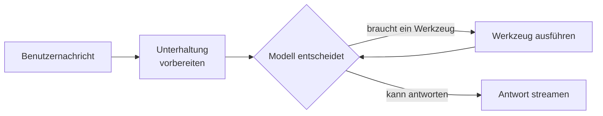

# Universal Agent

Der **Universal Agent** arbeitet so, wie man es von einem modernen Assistenten erwartet. Statt einer festen Abfolge von
Schritten zu folgen, betrachtet er jede Nachricht und entscheidet selbst, was er braucht: das Wissen Ihres Unternehmens
durchsuchen, eine vom Benutzer angehängte Datei lesen, sich an das erinnern, was er über den Benutzer weiss, oder direkt
antworten. Er macht weiter, ein Werkzeug nach dem anderen, bis er antworten kann.

Jeder andere Agent der Plattform folgt einem festen Ablauf. Ein Administrator wählt also pro Anwendungsfall den passenden
aus, und Benutzer müssen wissen, welchen Assistenten sie fragen sollen. Ein Universal-Agent-Profil wird einmal mit dem
Wissen konfiguriert, das es durchsuchen darf, und Benutzer fragen es alles.

::: tip Wann Sie diesen Agenten einsetzen
Setzen Sie den Universal Agent als allgemeinen Assistenten ein, der Ihr Wissen, die Anhänge des Benutzers und das
Gedächtnis in einer Unterhaltung verbindet. Wenn ein Anwendungsfall eine garantierte, nachvollziehbare Abfolge von
Schritten braucht — immer aus denselben Sammlungen abrufen, die Fundierung vor der Antwort prüfen, an einen Experten
eskalieren —, verwenden Sie die dafür vorgesehenen Blueprints wie den
[Document Intelligence Assistant](../5_document_intelligence_assistant/). Sie bleiben die vorhersehbare Option.
:::

## Was er tut

1. **Unterhaltung vorbereiten.** Die eingebauten Anweisungen des Agenten zum Einsatz seiner Werkzeuge und danach die
   eigenen Anweisungen Ihres Profils werden an den Anfang der Unterhaltung gestellt, und der Verlauf wird auf das
   Eingabebudget gekürzt.
2. **Entscheiden und Werkzeuge nutzen.** Das Modell wählt, welche Werkzeuge es aufruft, die Plattform führt sie aus und
   gibt die Ergebnisse zurück, und das Modell entscheidet erneut. Es kann in einer Runde mehrere unabhängige Werkzeuge
   aufrufen.
3. **Antworten.** Sobald das Modell hat, was es braucht, wird seine Antwort an den Benutzer gestreamt, mit Zitaten der
   verwendeten Dokumente.

Nichts wird vorab in den Prompt geladen: Eine Frage, die keine Suche braucht, wird direkt beantwortet, und eine, die drei
Suchen braucht, bekommt drei.

### Die Werkzeuge

| Werkzeug                         | Was es tut                                                                                                                                                                                                                                           | Angeboten, wenn                                                                                 |
| -------------------------------- | ---------------------------------------------------------------------------------------------------------------------------------------------------------------------------------------------------------------------------------------------------- | ----------------------------------------------------------------------------------------------- |
| **Unser Wissen durchsuchen**     | Durchsucht die Wissenssammlungen, die das Profil erlaubt, sortiert die Ergebnisse neu und liefert die besten Abschnitte mit zitierbaren IDs. Die eigenen `#`-Verweise des Benutzers werden ebenfalls angeboten. Durchsucht werden immer nur Sammlungen, die der fragende Benutzer lesen darf. | Das Profil listet Sammlungen auf oder erlaubt jede Sammlung, die der Benutzer lesen kann.       |
| **Angehängte Dateien lesen**     | Liest die an die Unterhaltung angehängten Dateien. Das Modell sieht, welche Dateien angehängt sind, und liest die, die es braucht; eine Datei, die zu lang ist, um sie ganz zu lesen, liefert die Abschnitte, die für das Gesuchte am relevantesten sind. | Der Benutzer hat ein Dokument angehängt (Bilder erreichen das Modell direkt).                   |
| **Gedächtnis abrufen**           | Durchsucht, was über den Benutzer und die Organisation gespeichert ist: Vorlieben, Fakten und Entscheidungen aus früheren Unterhaltungen.                                                                                                             | Benutzer- oder Organisationsgedächtnis ist im Profil aktiviert.                                 |

Weitere Werkzeuge folgen, sobald die Plattform sie hinzufügt: Websuche, Abruf von Webseiten, Codeausführung,
Bildgenerierung und der eigene Dateibereich des Benutzers fügen diesem Agenten jeweils ihr Werkzeug hinzu.

Jeder Werkzeugaufruf ist im Chat sichtbar: Die Wissenssuche und die Dateien erscheinen als Quellen, jeder Aufruf als
aufklappbarer Block mit dem, was das Werkzeug zurückgegeben hat, und der Agenten-Trace zeichnet jeden Schritt auf.

### Im Kontext des Modells bleiben

Lange Unterhaltungen mit vielen Werkzeugergebnissen können über das hinauswachsen, was das Modell lesen kann. Vor jeder
Entscheidung prüft der Agent die Grösse und verdichtet bei Bedarf zuerst das älteste Material: Frühere
Werkzeugergebnisse werden auf das für die Frage Wesentliche zusammengefasst, dann wird die Unterhaltung vor der Frage zu
einer Zusammenfassung. Der Chat zeigt dabei einen kurzen Status. Die aktuelle Frage wird nie verdichtet, und die
neuesten Ergebnisse werden nicht zusammengefasst; nur wenn sie allein das Budget übersteigen, werden sie als letztes
Mittel gekürzt.

### Grenzen und Freigaben

Ein Profil begrenzt, wie viele Entscheidungen und Werkzeugaufrufe eine Antwort umfassen darf. Am Limit antwortet der
Agent mit dem, was er gefunden hat, und sagt, dass er vorzeitig aufgehört hat. Jedes Werkzeug kann so eingestellt
werden, dass es vor der Ausführung die Freigabe des Benutzers braucht — jedes Mal, einmal pro Antwort oder einmal pro
Unterhaltung.

## Was er *nicht* tut

- **Er ist kein fester Ablauf.** Das Modell entscheidet, welche Werkzeuge es nutzt, daher können zwei ähnliche Fragen
  unterschiedliche Wege nehmen. Für eine garantierte Abfolge verwenden Sie die dafür vorgesehenen Blueprints.
- **Er ersetzt nicht den Abruf des Document Intelligence Assistant.** Seine Wissenssuche ist einfacher: Jede Datenbank
  wird mit dem Embedding-Modell durchsucht, mit dem sie indexiert wurde, und die Ergebnisse werden gemeinsam neu sortiert,
  ohne die Feinabstimmung pro Retriever und die Fundierungsprüfung des Document Intelligence Assistant.
- **Er liest nie, was der Benutzer nicht darf.** Sammlungen, die der fragende Benutzer nicht lesen kann, werden nicht
  angeboten, auch wenn das Profil sie auflistet oder "jede Sammlung" erlaubt.
- **Noch keine Werkzeuge aus externen Systemen.** MCP-Werkzeugserver und die Übergabe an andere Agenten sind geplante
  Folgeschritte; verwenden Sie dafür heute den MCP Tool Agent.

## Einrichtung

1. **Blueprint freigeben.** Der Universal Agent gehört nicht zum Standardumfang eines neuen Mandanten; ein Sysadmin gibt
   ihn frei (siehe [Zugriffskontrolle](../../16_multi_tenancy/4_access_control/)).
2. **Profil erstellen.** Wählen Sie unter **Admin > Agents > Blueprints** den **Universal Agent** und klicken Sie auf
   **Profil erstellen**. Vergeben Sie eine Agent-ID, einen Namen, eine Beschreibung und ein Symbol.
3. **Anweisungen schreiben.** Beschreiben Sie, wofür dieser Assistent da ist und wie er antworten soll. Die Anweisungen
   werden nach den eingebauten Anweisungen zum Werkzeugeinsatz hinzugefügt, Sie müssen die Werkzeuge also nicht
   erklären.
4. **Wissen wählen.** Listen Sie unter **Wissenswerkzeug** entweder die Datenbanken und Sammlungen auf, die durchsucht
   werden dürfen, oder aktivieren Sie **Jede Sammlung, die der Benutzer lesen kann**.
5. **Modell wählen.** Wählen Sie ein Chat-Modell, das Werkzeugaufrufe unterstützt. Das **Task-LLM** verdichtet lange
   Unterhaltungen und schreibt Titel und Folgefragen, dafür genügt ein kleineres Modell.
6. **Grenzen und Freigaben prüfen** unter **Werkzeuge**, dann speichern.

## Konfigurationsreferenz

### Verhalten

| Feld                          | Standard  | Beschreibung                                                                                          |
| ----------------------------- | --------- | ----------------------------------------------------------------------------------------------------- |
| **Anweisungen**               | *(leer)*  | Wofür dieser Assistent da ist und wie er antworten soll, nach den eingebauten Anweisungen hinzugefügt. |
| **Maximale Eingabe-Tokens**   | `128000`  | Das Eingabebudget. Die Unterhaltung wird darauf gekürzt und in der Werkzeugschleife darauf verdichtet. |

### Wissenswerkzeug

| Feld                                           | Standard | Beschreibung                                                                                    |
| ---------------------------------------------- | -------- | ----------------------------------------------------------------------------------------------- |
| **Jede Sammlung, die der Benutzer lesen kann** | Aus      | Jede Wissenssammlung anbieten, die der fragende Benutzer lesen darf, statt der aufgelisteten.   |
| **Sammlungen**                                 | —        | Datenbanken, die das Modell durchsuchen darf, jeweils ganz oder auf einige ihrer Sammlungen eingeschränkt. |

Unter **Wissenssuche** legen **Abschnitte pro Datenbank** und das **Reranking-Modell** fest, wie die Suche ihre Funde
ordnet.

### Werkzeuge

| Feld                              | Standard | Beschreibung                                                                                                    |
| --------------------------------- | -------- | --------------------------------------------------------------------------------------------------------------- |
| **Maximale Entscheidungen**       | `5`      | Wie oft das Modell Werkzeuge wählen darf, bevor es antworten muss.                                              |
| **Maximale Werkzeugaufrufe**      | `10`     | Wie viele Werkzeugaufrufe eine Antwort insgesamt machen darf.                                                   |
| **Deaktivierte Werkzeuge**        | —        | Werkzeuge, die dieses Profil nie anbietet.                                                                      |
| **Freigaben**                     | —        | Werkzeuge, deren Aufrufe der Benutzer zuerst freigeben muss: jeder Aufruf, einmal pro Antwort oder einmal pro Unterhaltung. |

Die Einstellungen für Gedächtnis und angehängte Dateien sind dieselben wie bei den anderen Chat-Agenten; siehe
[Gedächtnis](../../15_memory/).
