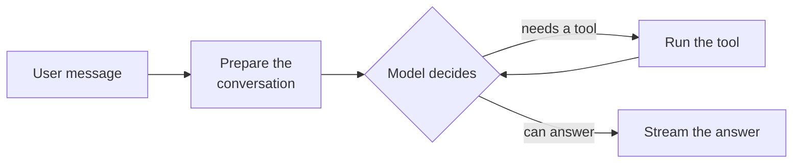

# Universal Agent

The **Universal Agent** works the way people expect a modern assistant to work. Instead of following a fixed sequence of
steps, it looks at each message and decides for itself what it needs: search your company's knowledge, read a file the
user attached, recall what it remembers about the user, or answer straight away. It keeps going, one tool after another,
until it can answer.

Every other agent on the platform follows a fixed workflow, so an admin picks the right one per use case and users have
to know which assistant to ask. A Universal Agent profile is configured once with the knowledge it may search, and users
ask it anything.

::: tip When to reach for this agent
Use the Universal Agent as a general assistant that combines your knowledge, the user's attachments and memory in one
conversation. When a use case needs a guaranteed, auditable sequence of steps — always retrieving from the same
collections, checking grounding before answering, escalating to an expert — use the dedicated blueprints such as the
[Document Intelligence Assistant](../5_document_intelligence_assistant/). They stay the predictable option.
:::

## What it does

1. **Prepare the conversation.** The agent's built-in instructions on using its tools, then your profile's own
   instructions, are put at the front of the conversation, and the history is trimmed to the input budget.
2. **Decide and use tools.** The model chooses which tools to call, the platform runs them and hands the results back,
   and the model decides again. It can call several independent tools in one round.
3. **Answer.** When the model has what it needs, its reply streams to the user with citations to the documents it used.

Nothing is loaded into the prompt in advance: a question that needs no lookup is answered directly, and one that needs
three lookups gets three.

### The tools

| Tool                     | What it does                                                                                                                                                                                                                                                             | Offered when                                                                 |
| ------------------------ | ------------------------------------------------------------------------------------------------------------------------------------------------------------------------------------------------------------------------------------------------------------------------ | ---------------------------------------------------------------------------- |
| **Search our knowledge** | Searches the knowledge collections the profile allows, reranks the results and returns the best sections with ids to cite. The user's own `#` references are offered too. Only collections the asking user may read are ever searched.                                   | The profile lists collections, or allows every collection the user can read. |
| **Read attached files**  | Reads the files attached to the conversation. The model sees which files are attached and reads the ones it needs; a file too long to read whole returns the sections most relevant to what the model is looking for.                                                    | The user attached a document (images reach the model directly).              |
| **Recall memory**        | Searches what is remembered about the user and the organisation: preferences, facts and decisions from earlier conversations.                                                                                                                                            | User or organisation memory is enabled on the profile.                       |
| **Code sandbox**         | Runs commands and reads and writes files in the user's own code sandbox, in a folder per conversation that holds the conversation's attached files. A file the agent shows the user, such as a chart or a spreadsheet, is attached to the answer and stays downloadable. | The user switched on **Code Interpreter** in the chat.                       |

More tools follow as the platform adds them: web search, web page fetch, image generation and the user's own file space
each add their tool to this agent.

Every tool call shows in the chat: the knowledge search and the files appear as sources, each call as a collapsible
block with what the tool returned, and the agent trace records each step.

### Staying within the model's context

Long conversations with many tool results can outgrow what the model can read. Before each decision, the agent checks
the size and, when needed, condenses the oldest material first: earlier tool results are summarised to what matters for
the question, then the conversation before the question becomes one summary. The chat shows a short status when this
happens. The current question and the latest results are never condensed.

### Limits and approvals

A profile bounds how many decisions and tool calls one answer may take. At the limit, the agent answers with what it has
found and says that it stopped early. Any tool can be set to need the user's approval before it runs — every time, once
per answer, or once per conversation.

## What it does *not* do

- **It is not a fixed workflow.** The model decides which tools to use, so two similar questions may take different
  paths. For a guaranteed sequence, use the dedicated blueprints.
- **It does not replace the Document Intelligence Assistant's retrieval.** Its knowledge search is simpler: each
  database is searched with the embedding model it was indexed with and the results are reranked together, without the
  Document Intelligence Assistant's per-retriever tuning or grounding check.
- **It never reads what the user may not.** Collections the asking user cannot read are not offered, even when the
  profile lists them or the profile allows "every collection".
- **Its code sandbox is shared hardware.** Each user's sandbox home is separate, but all users share one container, so
  it is not a hard boundary between users; see [Coding](../../10_chat_ui/6_coding/).
- **No tools from external systems yet.** MCP tool servers and handing off to other agents are planned follow-ups; use
  the MCP Tool Agent for those today.

## Setting it up

1. **Grant the blueprint.** The Universal Agent is not part of a new tenant's default set; a sysadmin grants it (see
   [Access control](../../16_multi_tenancy/4_access_control/)).
2. **Create a profile.** In **Admin > Agents > Blueprints**, select **Universal Agent** and click **Create Profile**.
   Give it an Agent ID, a name, a description and an icon.
3. **Write the instructions.** Describe what this assistant is for and how it should answer. They are added after the
   built-in instructions on using tools, so you do not need to explain the tools.
4. **Choose the knowledge.** Under **Knowledge Tool**, either list the databases and collections it may search, or turn
   on **Every Collection the User Can Read**.
5. **Choose the model.** Pick a chat model that supports tool calls. The **Task LLM** condenses long conversations and
   writes titles and follow-up questions, so a smaller model is fine there.
6. **Review the limits and approvals** under **Tools**, then save.

## Configuration reference

### Behaviour

| Field                    | Default   | Description                                                                                   |
| ------------------------ | --------- | --------------------------------------------------------------------------------------------- |
| **Instructions**         | *(empty)* | What this assistant is for and how it should answer, added after the built-in instructions.   |
| **Maximum Input Tokens** | `128000`  | The input budget. The conversation is trimmed and, inside the tool loop, condensed to fit it. |

### Knowledge Tool

| Field                                  | Default | Description                                                                            |
| -------------------------------------- | ------- | -------------------------------------------------------------------------------------- |
| **Every Collection the User Can Read** | Off     | Offer every knowledge collection the asking user may read, instead of the listed ones. |
| **Collections**                        | —       | Databases the model may search, each whole or narrowed to some of its collections.     |

Under **Knowledge Search**, **Sections per Database** and the **Reranking Model** set how the search ranks what it
finds.

### Tools

| Field                  | Default | Description                                                                                           |
| ---------------------- | ------- | ----------------------------------------------------------------------------------------------------- |
| **Maximum Decisions**  | `10`    | How often the model may choose tools before it must answer.                                           |
| **Maximum Tool Calls** | `20`    | How many tool calls one answer may make in total.                                                     |
| **Disabled Tools**     | —       | Tools this profile never offers.                                                                      |
| **Approvals**          | —       | Tools whose calls the user must approve first: every call, once per answer, or once per conversation. |

Memory and attached-file settings are the same as on the other chat agents; see [Memory](../../15_memory/).
