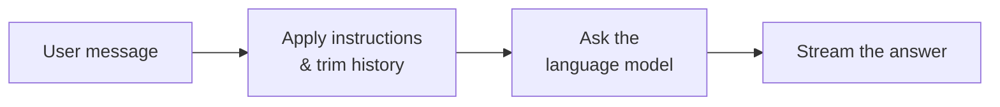

# Anweisungsbasierter Assistent

Der **Anweisungsbasierte Assistent** ist das einfachste Agent-Blueprint auf der Plattform. Er umschliesst direkt ein Sprachmodell: Sie geben ihm eine Reihe von Klartextanweisungen (einen System-Prompt), und er antwortet den Nachrichten des Benutzers entsprechend. Es gibt keinen Dokumentenabruf, keine Wissensdatenbank und keine menschliche Eskalation — nur ein konfiguriertes Modell, das sich so verhält, wie Ihre Anweisungen es beschreiben.

Stellen Sie sich ihn als eine fokussierte, gebrandete Version eines allgemeinen Chatbots vor. Während ein Rohmodell keine Persönlichkeit und keine Regeln hat, kann einem Profil eines Anweisungsbasierten Assistenten mitgeteilt werden, *wer er ist*, *welchen Tonfall er verwenden soll*, *was er tun und lassen soll* und *welches Modell er verwenden soll* — alles ohne eine einzige Zeile Code zu schreiben.

::: tip Wann dieser Agent nützlich ist
Nutzen Sie den Anweisungsbasierten Assistenten, wenn die Aufgabe nur die eigenen Denk- und Sprachfähigkeiten des Modells erfordert — Entwerfen, Umschreiben, Zusammenfassen von eingefügtem Text, Brainstorming, Übersetzung oder die Beantwortung allgemeiner Fragen. Wenn der Assistent Informationen in den Dokumenten Ihres Unternehmens nachschlagen muss, verwenden Sie stattdessen den [Dokumenten-Intelligenz-Assistenten](../5_document_intelligence_assistant/).
:::

## Was er tut

Der Anweisungsbasierte Assistent führt jedes Mal, wenn ein Benutzer eine Nachricht sendet, einen minimalen zweistufigen Workflow aus:

1. **Bereiten Sie die Konversation vor.** Ihr konfigurierter System-Prompt wird an den Anfang der Konversation eingefügt, und der Chat-Verlauf wird gekürzt, damit er in das Eingabebudget des Modells passt. Dies hält lange Konversationen erschwinglich und verhindert, dass das Modell durch alten Kontext überfordert wird.
2. **Antworten.** Die vorbereitete Konversation wird an das Sprachmodell gesendet, und die Antwort wird Token für Token an den Benutzer zurückgestreamt.

Das ist der gesamte Workflow. Da er so wenig tut, ist er schnell, günstig und vorhersehbar — was ihn zu einer guten Standardoption für Assistenten macht, die Ihre Daten nicht konsultieren müssen.

## Was er *nicht* tut

Es ist hilfreich, die Grenzen explizit zu machen, da der Name „Assistent“ mehr suggerieren kann, als dieses Blueprint bietet:

- **Keine Wissensdatenbank.** Er durchsucht niemals Ihre Dokumente. Wenn Sie ihn nach einer internen Richtlinie fragen, wird er auf der Grundlage des allgemeinen Trainings des Modells antworten, nicht auf der Grundlage Ihrer Dateien. Für fundierte, zitierte Antworten verwenden Sie den [Dokumenten-Intelligenz-Assistenten](../5_document_intelligence_assistant/).
- **Keine Tools oder Aktionen.** Er kann keine Tickets erstellen, Nachrichten senden oder externe Systeme aufrufen. Dafür verwenden Sie den MCP Tool Agent.
- **Keine menschliche Eskalation.** Er wird eine Frage nicht an einen Kollegen weitergeben. Dafür siehe den [Experten-Koordinator-Agenten](../9_expert_coordinator_agent/).
- **Kein „Training“ mit Ihren Daten.** Wie jeder Agent auf der Plattform wird er nicht auf Ihren Inhalten feingetunt. Sein Verhalten ergibt sich vollständig aus dem System-Prompt und dem gewählten Modell. Sehen Sie sich die [Agenten-Übersicht](../) an, um zu erfahren, warum die Plattform Konfiguration und Retrieval anstelle von Training verwendet.

## Typische Szenarien

- **Ein Schreibhelfer.** „Sie sind ein hilfreicher Assistent, der Texte umschreibt, um sie klar und prägnant zu machen. Behalten Sie stets die ursprüngliche Bedeutung bei.“ Mitarbeiter fügen einen Absatz ein und erhalten eine bereinigte Version.
- **Ein Tonfall-Assistent.** Ein Marketingteam konfiguriert den System-Prompt mit ihrer Markenstimme und ihren Stilregeln, was jedem einen konsistenten Entwurfhelfer bietet.
- **Ein Übersetzungsassistent.** „Übersetzen Sie alles, was der Benutzer sendet, in formelles Deutsch. Geben Sie nur die Übersetzung aus.“
- **Ein eingeschränkter Q&A-Bot.** Ein Helfer für allgemeines Wissen, der angewiesen wird, bei einem bestimmten Thema zu bleiben und alles andere höflich abzulehnen.

## Einrichtung

Wie jeder Agent wird der Anweisungsbasierte Assistent als **Blueprint** (die schreibgeschützte Vorlage) geliefert, aus dem Sie ein oder mehrere **Profile** (Ihre konfigurierten, benannten Instanzen) erstellen. Wenn Sie mit dieser Unterscheidung noch nicht vertraut sind, lesen Sie zuerst [Blueprints & Profile](../2_blueprints_and_profiles/). Um einen funktionierenden Assistenten zu erstellen:

1. **Öffnen Sie das Blueprint.** Gehen Sie zu **Admin > Agents > Blueprints** und wählen Sie **Anweisungsbasierter Assistent**. Wenn es als offline angezeigt wird, können Sie Profile trotzdem konfigurieren — sie werden aktiviert, sobald der Agent-Service läuft.
2. **Erstellen Sie ein Profil.** Klicken Sie auf **Profil erstellen** und geben Sie eine **Agent ID** (einen kurzen, URL-sicheren Slug wie `writing-helper`), einen **Namen**, eine **Beschreibung** und ein **Icon** an. Dies sind die Informationen, die Benutzer sehen, wenn sie einen Assistenten zum Sprechen auswählen.
3. **Schreiben Sie den System-Prompt.** Dies ist das Herzstück des Assistenten. Beschreiben Sie seine Rolle, seinen Tonfall, was er tun soll und was er ablehnen muss. Seien Sie konkret — siehe die Best Practices unten.
4. **Wählen Sie das Modell.** Wählen Sie ein Chat-Modell aus dem Dropdown-Menü. Die verfügbaren Optionen stammen aus der LiteLLM-Konfiguration Ihrer Plattform. Passen Sie das Modell der Aufgabe an: Ein kleineres, günstigeres Modell ist für das Umschreiben und Übersetzen geeignet; ein größeres hilft bei nuancierterem Denken.
5. **Passen Sie die Parameter an (optional).** Passen Sie die Temperatur, das Eingabe-Token-Budget und das Timeout an, falls die Standardwerte nicht zu Ihrem Anwendungsfall passen. Die Standardwerte sind für die meisten Assistenten sinnvoll.
6. **Speichern.** Das Profil steht jedem Benutzer mit entsprechender Berechtigung sofort zur Verfügung.

::: tip Es gibt nichts Weiteres einzurichten
Im Gegensatz zu dokumenten- oder expertenorientierten Agents hat der Anweisungsbasierte Assistent keine externen Abhängigkeiten. Sie müssen **keine** Wissensdatenbank erstellen, keine Datenpipeline ausführen oder einen Chat-Kanal verbinden. Ein Modell und ein System-Prompt sind alles, was er benötigt.
:::

## Konfigurationsreferenz

Das Konfigurationsformular ist in drei Teile gegliedert: die Profilidentität (die von jedem Agent geteilt wird), das Verhalten des Assistenten und die Einstellungen des Sprachmodells.

### Profilidentität

Diese Felder existieren auf jedem Agent-Blueprint und definieren, wie das Profil in der UI erscheint.

| Feld           | Typ            | Erforderlich | Beschreibung                                                                                          |
| --------------- | --------------- | -------- | ---------------------------------------------------------------------------------------------------- |
| **Agent ID**    | Text            | Ja      | Eindeutiger, URL-sicherer Identifikator für dieses Profil. Nur Kleinbuchstaben, Ziffern, Unterstriche, Bindestriche.  |
| **Name**        | Text (pro Sprache) | Ja  | Anzeigename, der Benutzern gezeigt wird. Kann pro Sprache (de, en, fr, it) eingestellt werden.                               |
| **Beschreibung** | Text (pro Sprache) | Ja  | Kurze Erklärung, wofür dieses Profil ist. Wird in der Assistenten-Auswahl angezeigt.                        |
| **Icon**        | Icon-Auswahl     | Nein       | Visueller Identifikator. Standardmässig ein generisches Roboter-Icon.                                                 |

### Verhalten

Diese Felder steuern, wie der Assistent jede Konversation behandelt.

| Feld                    | Typ      | Standardwert | Beschreibung                                                                                                                                                                 |
| ------------------------ | --------- | ----------- | --------------------------------------------------------------------------------------------------------------------------------------------------------------------------- |
| **System-Prompt**        | Langer Text | *(leer)*   | Die Klartextanweisungen, die Rolle, Tonfall und Regeln des Assistenten definieren. Wird am Anfang jeder Konversation eingefügt. Dies ist die wichtigste Einstellung.      |
| **Maximum Input Tokens** | Zahl    | `100000`    | Die Größe des Eingabebudgets. Die Konversation (System-Prompt + Chat-Verlauf + neue Nachricht) wird gekürzt, um zu passen. Niedrigere Werte senken die Kosten und halten das Modell auf aktuelle Beiträge fokussiert; höhere Werte bewahren mehr Verlauf. Bereich: 1.000–200.000. |

::: warning Passen Sie das Eingabebudget an Ihr Modell an
**Maximum Input Tokens** muss innerhalb des tatsächlichen Kontextfensters des gewählten Modells bleiben. Eine höhere Einstellung als das Modell unterstützt, wird das Modell nicht erweitern — das Modell wird die Anfrage einfach ablehnen oder kürzen. Im Zweifelsfall lassen Sie es beim Standardwert.
:::

### Sprachmodell

Diese Einstellungen befinden sich unter dem Modellabschnitt des Formulars. Sie wählen das Modell aus und steuern, wie es Text generiert.

| Feld           | Typ       | Standardwert | Beschreibung                                                                                                                                            |
| --------------- | ---------- | ------- | ------------------------------------------------------------------------------------------------------------------------------------------------------ |
| **Modell**       | Modellauswahl | —     | Welches Chat-Modell der Assistent verwendet. Optionen stammen aus Ihrer LiteLLM-Konfiguration. Erforderlich.                                                         |
| **Temperatur** | Zahl     | `0.0`   | Steuert die Zufälligkeit. `0.0` liefert fokussierte, wiederholbare Antworten (am besten für Übersetzung, Extraktion, faktische Antworten). Höhere Werte (bis zu `2.0`) liefern vielfältigere, kreativere Ergebnisse. |
| **Log-Wahrscheinlichkeiten zurückgeben** | Umschalter | Aus | Ob das Modell Token-Level-Wahrscheinlichkeiten zurückgibt. Eine erweiterte/diagnostische Option; lassen Sie sie deaktiviert, es sei denn, Sie benötigen explizit Konfidenzwerte. |
| **Top-Log-Wahrscheinlichkeiten**    | Zahl | `0` | Wie viele der wahrscheinlichsten alternativen Tokens pro Position zurückgegeben werden sollen. Gilt nur, wenn Log-Wahrscheinlichkeiten aktiviert sind. Bereich: 0–20.            |
| **Timeout**     | Zahl (Sekunden) | `600` | Wie lange auf das Modell gewartet werden soll, bevor aufgegeben wird. Nur erhöhen, wenn Sie ein langsames Modell mit sehr langen Ausgaben verwenden.                                  |

::: details Wie die Einstellungen zur Laufzeit kombiniert werden
Wenn eine Nachricht ankommt, erstellt der Assistent die Konversation als `[ Systemnachrichten → Ihr System-Prompt → Chat-Verlauf → neue Benutzernachricht ]`, kürzt sie auf **Maximum Input Tokens** und ruft dann das ausgewählte **Modell** mit den konfigurierten Optionen **Temperatur**, **Timeout** und Log-Wahrscheinlichkeit auf. Die Antwort wird direkt an die Chat-UI zurückgestreamt.
:::

## Best Practices

**Schreiben Sie den System-Prompt wie eine Stellenbeschreibung.** Geben Sie die Rolle an („Sie sind ein IT-Support-Assistent für interne Mitarbeiter“), das Verhalten („Antworten Sie in kurzen, nummerierten Schritten“) und die Grenzen („Wenn eine Frage nicht IT-bezogen ist, sagen Sie, Sie können nur bei IT-Themen helfen“). Vage Prompts führen zu vagen Assistenten.

**Beginnen Sie mit einer niedrigen Temperatur.** `0.0`–`0.3` ist für die meisten Geschäftsassistenten geeignet — es macht Antworten konsistent und vorhersehbar. Erhöhen Sie sie nur für wirklich kreative Aufgaben wie Brainstorming oder Texten.

**Halten Sie ein Profil pro Zweck.** Anstatt eines „Alles-könner“-Assistenten erstellen Sie fokussierte Profile (z.B. „E-Mail-Entwurf“, „Deutsch-Übersetzer“, „IT-FAQ-Bot“). Jedes erhält einen präziseren System-Prompt und ist für Benutzer leichter auszuwählen.

**Wählen Sie das kleinste Modell, das die Aufgabe erfüllt.** Umschreiben, Übersetzen und Zusammenfassen benötigen selten Ihr größtes Modell. Reservieren Sie die teuren Modelle für Profile, die wirklich stärkere Denkfähigkeiten benötigen.

**Denken Sie daran, dass er Ihre Dokumente nicht sehen kann.** Wenn Benutzer ihn immer wieder nach internen Richtlinien oder Dateien fragen, ist das ein Signal, dass Sie stattdessen den [Dokumenten-Intelligenz-Assistenten](../5_document_intelligence_assistant/) benötigen.
