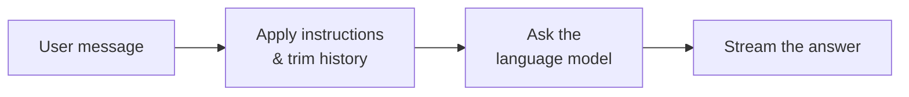

# Instructed Assistant

The **Instructed Assistant** is the simplest agent blueprint on the platform. It wraps a language model directly: you
give it a set of plain-text instructions (a system prompt), and it answers the user's messages accordingly. There is no
document retrieval, no knowledge base, and no human escalation — just a configured model that behaves the way your
instructions describe.

Think of it as a focused, branded version of a general chatbot. Where a raw model has no personality and no rules, an
Instructed Assistant profile can be told *who it is*, *what tone to use*, *what it should and shouldn't do*, and *which
model to run on* — all without writing any code.

::: tip When to reach for this agent
Use the Instructed Assistant when the task only needs the model's own reasoning and language skills — drafting,
rewriting, summarising pasted text, brainstorming, translation, or answering general questions. If the assistant needs
to look things up in your company's documents, use the
[Document Intelligence Assistant](../5_document_intelligence_assistant/) instead.
:::

## What it does

The Instructed Assistant runs a minimal two-step workflow every time a user sends a message:

1. **Prepare the conversation.** Your configured system prompt is inserted at the front of the conversation, and the
   chat history is trimmed so it fits inside the model's input budget. This keeps long conversations affordable and
   prevents the model from being overwhelmed by old context.
2. **Answer.** The prepared conversation is sent to the language model, and the response is streamed back to the user
   token by token.

That's the whole workflow. Because it does so little, it is fast, cheap, and predictable — which is exactly what makes
it a good default for assistants that don't need to consult your data.

## What it does *not* do

It helps to be explicit about the boundaries, because the name "assistant" can suggest more than this blueprint offers:

- **No knowledge base.** It never searches your documents. If you ask it about an internal policy, it will answer from
  the model's general training, not from your files. For grounded, cited answers, use the
  [Document Intelligence Assistant](../5_document_intelligence_assistant/).
- **No tools or actions.** It cannot create tickets, send messages, or call external systems. For that, use the MCP Tool
  Agent.
- **No human escalation.** It will not hand a question off to a colleague. For that, see the
  [Expert Coordinator Agent](../9_expert_coordinator_agent/).
- **No "training" on your data.** Like every agent on the platform, it is not fine-tuned on your content. Its behaviour
  comes entirely from the system prompt and the chosen model. See the [Agents overview](../) for why the platform uses
  configuration and retrieval rather than training.

## Typical scenarios

- **A writing helper.** "You are a helpful assistant that rewrites text to be clear and concise. Always keep the
  original meaning." Employees paste a paragraph and get a cleaned-up version.
- **A tone-of-voice assistant.** A marketing team configures the system prompt with their brand voice and style rules,
  giving everyone a consistent drafting helper.
- **A translation assistant.** "Translate everything the user sends into formal German. Output only the translation."
- **A constrained Q&A bot.** A general-knowledge helper that is instructed to stay on a specific topic and politely
  decline anything else.

## Setting it up

Like every agent, the Instructed Assistant is delivered as a **blueprint** (the read-only template) from which you
create one or more **profiles** (your configured, named instances). If you are new to that distinction, read
[Blueprints & Profiles](../2_blueprints_and_profiles/) first. To create a working assistant:

1. **Open the blueprint.** Go to **Admin > Agents > Blueprints** and select **Instructed Assistant**. If it shows as
   offline, you can still configure profiles — they activate once the agent service is running.
2. **Create a profile.** Click **Create Profile** and give it an **Agent ID** (a short, URL-safe slug such as
   `writing-helper`), a **Name**, a **Description**, and an **Icon**. These are what users see when they pick an
   assistant to talk to.
3. **Write the system prompt.** This is the heart of the assistant. Describe its role, its tone, what it should do, and
   what it must refuse. Be concrete — see the best practices below.
4. **Choose the model.** Pick a chat model from the dropdown. The available options come from your platform's LiteLLM
   configuration. Match the model to the task: a smaller, cheaper model is fine for rewriting and translation; a larger
   one helps for nuanced reasoning.
5. **Tune the parameters (optional).** Adjust temperature, the input-token budget, and the timeout if the defaults don't
   suit your use case. The defaults are sensible for most assistants.
6. **Save.** The profile is available immediately to any user with permission to use it.

::: tip There is nothing else to set up
Unlike the document- or expert-oriented agents, the Instructed Assistant has no external dependencies. You do **not**
need to create a knowledge base, run a data pipeline, or connect a chat channel. A model and a system prompt are all it
needs.
:::

## Configuration reference

The configuration form is grouped into three parts: the profile identity (shared by every agent), the assistant's
behaviour, and the language-model settings.

### Profile identity

These fields exist on every agent blueprint and define how the profile appears in the UI.

| Field           | Type                | Required | Description                                                                                         |
| --------------- | ------------------- | -------- | --------------------------------------------------------------------------------------------------- |
| **Agent ID**    | Text                | Yes      | Unique, URL-safe identifier for this profile. Lowercase letters, digits, underscores, hyphens only. |
| **Name**        | Text (per language) | Yes      | Display name shown to users. Can be set per language (de, en, fr, it).                              |
| **Description** | Text (per language) | Yes      | Short explanation of what this profile is for. Shown in the assistant picker.                       |
| **Icon**        | Icon picker         | No       | Visual identifier. Defaults to a generic robot icon.                                                |

### Behaviour

These fields control how the assistant treats each conversation.

| Field                    | Type      | Default   | Description                                                                                                                                                                                                                                 |
| ------------------------ | --------- | --------- | ------------------------------------------------------------------------------------------------------------------------------------------------------------------------------------------------------------------------------------------- |
| **System Prompt**        | Long text | *(empty)* | The plain-text instructions that define the assistant's role, tone, and rules. Inserted at the start of every conversation. This is the single most important setting.                                                                      |
| **Maximum Input Tokens** | Number    | `100000`  | The size of the input budget. The conversation (system prompt + chat history + new message) is trimmed to fit. Lower values cut cost and keep the model focused on recent turns; higher values preserve more history. Range: 1,000–200,000. |

::: warning Match the input budget to your model
**Maximum Input Tokens** must stay within the chosen model's actual context window. Setting it higher than the model
supports won't expand the model — the model will simply reject or truncate the request. When in doubt, leave it at the
default.
:::

### Language model

These settings live under the model section of the form. They select the model and control how it generates text.

| Field                        | Type             | Default | Description                                                                                                                                                                      |
| ---------------------------- | ---------------- | ------- | -------------------------------------------------------------------------------------------------------------------------------------------------------------------------------- |
| **Model**                    | Model picker     | —       | Which chat model the assistant runs on. Options come from your LiteLLM configuration. Required.                                                                                  |
| **Temperature**              | Number           | `0.0`   | Controls randomness. `0.0` gives focused, repeatable answers (best for translation, extraction, factual replies). Higher values (up to `2.0`) give more varied, creative output. |
| **Return Log Probabilities** | Toggle           | Off     | Whether the model returns token-level probabilities. An advanced/diagnostic option; leave off unless you specifically need confidence scores.                                    |
| **Top Log Probabilities**    | Number           | `0`     | How many of the most likely alternative tokens to return per position. Only applies when log probabilities are enabled. Range: 0–20.                                             |
| **Timeout**                  | Number (seconds) | `600`   | How long to wait for the model before giving up. Increase only if you use a slow model with very long outputs.                                                                   |

::: details How the settings combine at runtime
When a message arrives, the assistant builds the conversation as
`[ system messages → your system prompt → chat history → new user message ]`, trims it to **Maximum Input Tokens**, then
calls the selected **Model** with the configured **Temperature**, **Timeout**, and log-probability options. The reply
streams straight back to the chat UI.
:::

## Best practices

**Write the system prompt like a job description.** State the role ("You are an IT support assistant for internal
staff"), the behaviour ("Answer in short, numbered steps"), and the limits ("If a question is not about IT, say you can
only help with IT topics"). Vague prompts produce vague assistants.

**Start with a low temperature.** `0.0`–`0.3` is right for most business assistants — it makes answers consistent and
predictable. Only raise it for genuinely creative tasks like brainstorming or copywriting.

**Keep one profile per purpose.** Rather than one "does everything" assistant, create focused profiles ("Email Drafter",
"German Translator", "IT FAQ Bot"). Each gets a tighter system prompt and is easier for users to choose between.

**Pick the smallest model that does the job.** Rewriting, translating, and summarising rarely need your largest model.
Reserve the expensive models for profiles that genuinely need stronger reasoning.

**Remember it can't see your documents.** If users keep asking it about internal policies or files, that's a signal you
need the [Document Intelligence Assistant](../5_document_intelligence_assistant/) instead.
