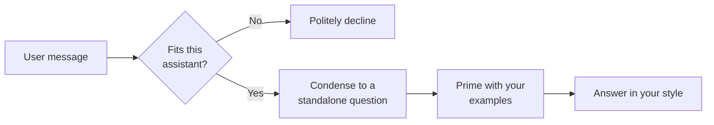

# Belehrbarer Assistent

Der **Belehrbare Assistent** (der Few-Shot-Agent) wird durch Beispiele geformt, anstatt durch eine lange Reihe
geschriebener Regeln. Sie geben ihm eine Handvoll Muster-Interaktionen – *wenn ein Benutzer so etwas fragt, antworten
Sie so* – und er lernt das Muster, den Ton und das Format, das Sie wünschen, aus diesen Beispielen. Dies ist die
Technik, die als **Few-Shot-Prompting** bekannt ist: Dem Modell werden einige „Shots“ (Beispiele) des gewünschten
Verhaltens gezeigt, und es generalisiert daraus.

Wie der [Instruierte Assistent](../3_instructed_assistant/) verfügt er über keine Wissensbasis und führt keine externen
Aktionen aus. Der Unterschied liegt darin, *wie Sie ihn steuern*: Der Instruierte Assistent folgt schriftlichen
Anweisungen, während der Belehrbare Assistent auch demonstrierten Beispielen folgt – was oft viel einfacher ist, als
einen gewünschten Stil in Worten zu beschreiben.

::: tip Wann Sie diesen Agenten einsetzen sollten
Nutzen Sie den Belehrbaren Assistenten, wenn der *Stil oder die Form* der Antwort wichtig ist und einfacher zu zeigen
als zu erklären ist – etwa beim Klassifizieren von Nachrichten in feste Kategorien, Antworten in einem strengen Format,
Anpassen an einen bestimmten Support-Tonfall oder Extrahieren von Feldern aus Text. Wenn Sie nur freiformulierte Hilfe
ohne spezielles Format benötigen, ist der [Instruierte Assistent](../3_instructed_assistant/) einfacher. Wenn Antworten
aus Ihren Dokumenten stammen müssen, verwenden Sie den
[Dokumenten-Intelligenz-Assistenten](../5_document_intelligence_assistant/).
:::

## Was er tut

Bei jeder Nachricht prüft der Belehrbare Assistent zunächst, ob die Anfrage überhaupt von ihm bearbeitet werden sollte,
und antwortet erst dann – unter Verwendung Ihrer Beispiele als Leitfaden:

1. **Passung prüfen (Eignungsschutz).** Der Assistent vergleicht die Anfrage mit seiner eigenen Beschreibung. Wenn die
   Frage eindeutig außerhalb dessen liegt, wofür dieser Assistent gedacht ist, lehnt er ab, anstatt schlecht zu
   antworten. Dies verhindert, dass ein eng trainierter Assistent vom Thema abweicht.
2. **Frage verdichten.** Die jüngste Konversation und die neueste Nachricht werden zu einer eigenständigen Frage
   zusammengefasst, sodass Folgefragen wie „und die zweite?“ immer noch eigenständig Sinn ergeben.
3. **Mit Ihren Beispielen vorbereiten.** Ihr System-Prompt und Ihre Beispielpaare werden zu dem Kontext zusammengefügt,
   den das Modell sieht, gefolgt von der verdichteten Frage.
4. **In Ihrem Stil antworten.** Das Modell antwortet, indem es dem von Ihren Beispielen etablierten Muster folgt, und
   die Antwort wird an den Benutzer gestreamt.

::: warning Die Beispiele ersetzen den rohen Chatverlauf
Beim Antwortschritt verwendet der Assistent absichtlich Ihre **Beispiele** als Konversationskontext und nicht den
tatsächlichen Chatverlauf – der Verlauf überlebt nur durch die verdichtete Frage. Dies macht die Beispiele so
einflussreich: Sie sind effektiv die Konversation, die das Modell fortzusetzen glaubt. Wählen Sie sie sorgfältig aus.
:::

## Was er *nicht* tut

- **Keine Wissensbasis.** Er durchsucht niemals Ihre Dokumente; Antworten stammen vom Modell plus Ihren Beispielen. Für
  fundierte, zitierte Antworten verwenden Sie den
  [Dokumenten-Intelligenz-Assistenten](../5_document_intelligence_assistant/).
- **Keine Tools oder Aktionen, keine menschliche Eskalation.** Dieselben Grenzen wie beim Instruierten Assistenten.
- **Kein echtes "Training".** Trotz des Namens wird nichts feingetunt (fine-tuned). "Lehren" bedeutet hier, Beispiele in
  der Konfiguration bereitzustellen – sie treten sofort in Kraft und können jederzeit geändert werden. Siehe die
  [Agents-Übersicht](../), warum die Plattform Beispiele und Retrieval statt Modelltraining verwendet.

## Typische Szenarien

- **Nachrichtenklassifikation.** Beispiele paaren eingehende Nachrichten mit einem einzigen Kategorie-Label ("Billing",
  "Technical", "Other"); der Assistent kennzeichnet neue Nachrichten auf dieselbe Weise.
- **Strenges Ausgabeformat.** Beispiele zeigen Eingabetext und eine gewünschte JSON- oder Template-Antwort; der
  Assistent erzeugt für neue Eingaben dieselbe Form.
- **Tonfall-Abstimmung.** Ein Support-Team liefert echte (bereinigte) Frage-Antwort-Paare in ihrem Unternehmensstil, und
  der Assistent entwirft neue Antworten, die gleich klingen.
- **Feldextraktion.** Beispiele demonstrieren das Extrahieren spezifischer Felder (Datumsangaben, Namen, Beträge) aus
  freiem Text.

## Einrichtung

Der Belehrbare Assistent wird als **Blueprint** geliefert, aus dem Sie konfigurierte **Profile** erstellen – siehe
[Blueprints & Profile](../2_blueprints_and_profiles/) für diese Unterscheidung. So erstellen Sie eines:

1. **Öffnen Sie den Blueprint.** Gehen Sie zu **Admin > Agents > Blueprints** und wählen Sie **Teachable Assistant**
   aus.
2. **Erstellen Sie ein Profil** mit einer **Agent ID**, einem **Namen**, einem **Icon** und – wichtig – einer präzisen
   **Beschreibung** (siehe die Hinweis unten).
3. **Schreiben Sie den System-Prompt.** Eine kurze Anweisung, die die Aufgabe beschreibt ("Sie klassifizieren
   Support-Nachrichten in eine von drei Kategorien").
4. **Fügen Sie Ihre Beispiele hinzu.** Dies ist der Kern der Einrichtung. Fügen Sie mehrere **Beispielpaare** hinzu,
   jedes mit der Eingabe des Benutzers und der genauen Antwort, die Sie wünschen. Drei bis zehn gut gewählte Beispiele
   sind oft besser als ein langer schriftlicher Prompt.
5. **Wählen Sie das Modell und die Parameter.** Wählen Sie ein Chat-Modell und stellen Sie die Temperatur ein – niedrig
   für Klassifizierung und Formatierung, wo Konsistenz wichtig ist.
6. **Speichern** Sie, und testen Sie dann mit Eingaben, die Ihren Beispielen ähneln (aber nicht kopieren), plus ein paar
   Off-Topic-Eingaben, um zu bestätigen, dass der Eignungsschutz sie ablehnt.

::: warning Das Feld "Beschreibung" ist funktional, nicht nur ein Label
Im Gegensatz zu den meisten Agents verwendet der Belehrbare Assistent seine **Beschreibung** als Test für den
Eignungsschutz. Eine vage Beschreibung ("Ein hilfreicher Assistent") lässt den Schutz alles durch; eine präzise
("Klassifiziert interne IT-Support-Nachrichten in Billing, Technical oder Other") lässt ihn irrelevante Fragen korrekt
ablehnen. Verfassen Sie die Beschreibung als präzise Aussage des Umfangs.
:::

## Konfigurationsreferenz

Das Formular besteht aus vier Teilen: der Profilidentität, dem System-Prompt und den Beispielen, dem Eingabebudget und
dem Sprachmodell.

### Profilidentität

| Feld             | Typ                | Erforderlich | Beschreibung                                                                                                                                                              |
| ---------------- | ------------------ | ------------ | ------------------------------------------------------------------------------------------------------------------------------------------------------------------------- |
| **Agent ID**     | Text               | Ja           | Eindeutiger, URL-sicherer Bezeichner. Kleinbuchstaben, Ziffern, Unterstriche, Bindestriche.                                                                               |
| **Name**         | Text (pro Sprache) | Ja           | Anzeigename, der Benutzern gezeigt wird.                                                                                                                                  |
| **Beschreibung** | Text (pro Sprache) | Ja           | **Dient auch als Eignungstest.** Beschreiben Sie präzise, wofür dieser Assistent gedacht ist – der Schutz verwendet diese, um zu entscheiden, ob geantwortet werden soll. |
| **Icon**         | Icon-Auswahl       | Nein         | Visueller Bezeichner. Standardmäßig ein Buch-Icon.                                                                                                                        |

### Den Assistenten unterrichten

Diese Felder definieren, woraus der Assistent lernt.

| Feld                   | Typ              | Standardwert | Beschreibung                                                                                                                                                                  |
| ---------------------- | ---------------- | ------------ | ----------------------------------------------------------------------------------------------------------------------------------------------------------------------------- |
| **System-Prompt**      | Langer Text      | *(leer)*     | Eine kurze Anweisung, die die Aufgabe beschreibt und zusammen mit den Beispielen verwendet wird.                                                                              |
| **Few-Shot Beispiele** | Liste von Paaren | *(leer)*     | Die Beispiel-Interaktionen, die den Assistenten unterrichten. Jeder Eintrag hat eine **Benutzer**-Eingabe und die gewünschte **Agent**-Antwort. Beides kann pro Sprache sein. |

Jedes Beispiel ist ein Paar:

| Feld         | Typ                | Beschreibung                                                 |
| ------------ | ------------------ | ------------------------------------------------------------ |
| **Benutzer** | Text (pro Sprache) | Ein Beispiel dafür, was ein Benutzer sagen könnte.           |
| **Agent**    | Text (pro Sprache) | Die Antwort, die der Assistent auf diese Eingabe geben soll. |

### Eingabebudget

| Feld                 | Typ  | Standardwert | Beschreibung                                                                                                                                                          |
| -------------------- | ---- | ------------ | --------------------------------------------------------------------------------------------------------------------------------------------------------------------- |
| **Max Input Tokens** | Zahl | `100000`     | Größe des Eingabebudgets; die Konversation wird gekürzt, um hineinzupassen. Bereich 1.000–200.000. Halten Sie es innerhalb des Kontextfensters des gewählten Modells. |

### Sprachmodell

| Feld                                     | Typ             | Standardwert | Beschreibung                                                                                                                                                 |
| ---------------------------------------- | --------------- | ------------ | ------------------------------------------------------------------------------------------------------------------------------------------------------------ |
| **Modell**                               | Modell-Auswahl  | —            | Welches Chat-Modell der Assistent verwendet. Optionen stammen aus Ihrer LiteLLM-Konfiguration. Erforderlich.                                                 |
| **Temperatur**                           | Zahl            | `0.0`        | Zufälligkeit. Halten Sie sie niedrig (`0.0`–`0.3`) für Klassifizierung und strenge Formatierung; erhöhen Sie sie nur für kreative Aufgaben. Bereich 0.0–2.0. |
| **Log-Wahrscheinlichkeiten zurückgeben** | Umschalter      | Aus          | Erweiterte/diagnostische Option für Token-Level-Konfidenzwerte. Deaktiviert lassen, es sei denn, erforderlich.                                               |
| **Top Log-Wahrscheinlichkeiten**         | Zahl            | `0`          | Wie viele alternative Tokens pro Position gemeldet werden sollen; gilt nur, wenn Log-Wahrscheinlichkeiten aktiviert sind. Bereich 0–20.                      |
| **Timeout**                              | Zahl (Sekunden) | `600`        | Wie lange auf das Modell gewartet werden soll, bevor aufgegeben wird.                                                                                        |

::: details Wie sich die Einstellungen zur Laufzeit kombinieren
Eine Nachricht wird auf **Max Input Tokens** gekürzt, vom Eignungsschutz anhand der **Beschreibung** geprüft und (falls
akzeptiert) zu einer eigenständigen Frage verdichtet. Der Assistent erstellt dann den Kontext als
`[ System-Prompt → Ihre Beispielpaare → verdichtete Frage ]` und ruft das ausgewählte **Modell** mit der konfigurierten
**Temperatur**, dem **Timeout** und den Optionen für Log-Wahrscheinlichkeiten auf, wobei die Antwort an die Chat-UI
gestreamt wird.
:::

## Best Practices

- **Zeigen, nicht erzählen.** Wenige konkrete Beispielpaare steuern das Verhalten zuverlässiger als ein langer
  schriftlicher Prompt. Führen Sie mit Beispielen; halten Sie den System-Prompt kurz.
- **Decken Sie die Vielfalt ab, nicht das Volumen.** Wählen Sie Beispiele, die die verschiedenen *Arten* von Eingaben
  abdecken, die Sie erwarten (den einfachen Fall, den kniffligen Fall, den Grenzfall), anstatt viele nahezu identische
  Duplikate. Drei bis zehn vielfältige Beispiele sind ein guter Bereich.
- **Gestalten Sie jedes Beispiel in Form und Inhalt identisch mit der gewünschten Antwort.** Der Assistent kopiert das
  Format ebenso wie den Inhalt – wenn Sie JSON als Ausgabe wünschen, muss die Antwort jedes Beispiels gültiges JSON
  sein; wenn Sie ein einwortiges Label wünschen, muss jedes Beispiel ein einzelnes Wort sein.
- **Verfassen Sie eine präzise Beschreibung.** Sie ist der Ein-/Ausschalter für den Eignungsschutz. Geben Sie genau an,
  was im Geltungsbereich liegt, damit irrelevante Fragen sauber abgelehnt werden.
- **Verwenden Sie eine niedrige Temperatur für strukturierte Aufgaben.** Klassifizierung, Extraktion und Formatierung
  profitieren von `0.0`–`0.2`, damit die Ausgabe über verschiedene Läufe hinweg konsistent bleibt.
