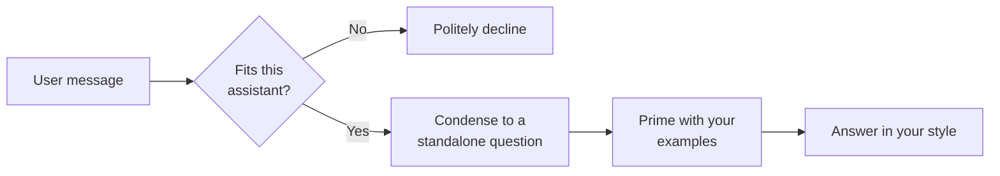

# Teachable Assistant

The **Teachable Assistant** (the few-shot agent) is shaped by examples rather than by a long set of written rules. You
give it a handful of sample exchanges — *when a user asks something like this, answer like that* — and it learns the
pattern, tone, and format you want from those examples. This is the technique known as **few-shot prompting**: the model
is shown a few "shots" of the desired behaviour and generalises from them.

Like the [Instructed Assistant](../3_instructed_assistant/), it has no knowledge base and takes no external actions. The
difference is *how you steer it*: the Instructed Assistant follows written instructions, while the Teachable Assistant
also follows demonstrated examples — which is often far easier than describing a desired style in words.

::: tip When to reach for this agent
Use the Teachable Assistant when the *style or shape* of the answer matters and is easier to show than to explain —
classifying messages into fixed categories, replying in a strict format, matching a support tone of voice, or extracting
fields from text. If you only need free-form help with no particular format, the
[Instructed Assistant](../3_instructed_assistant/) is simpler. If answers must come from your documents, use the
[Document Intelligence Assistant](../5_document_intelligence_assistant/).
:::

## What it does

For every message, the Teachable Assistant first checks whether the request is something it should handle at all, and
only then answers — using your examples as the guide:

1. **Check fit (suitability guard).** The assistant compares the request against its own description. If the question is
   clearly outside what this assistant is for, it declines instead of answering badly. This is what keeps a narrowly
   trained assistant from being dragged off-topic.
2. **Condense the question.** The recent conversation and the latest message are folded into one self-contained
   question, so follow-ups like "and the second one?" still make sense on their own.
3. **Prime with your examples.** Your system prompt and your example pairs are assembled into the context the model
   sees, followed by the condensed question.
4. **Answer in your style.** The model responds, following the pattern your examples established, and the answer is
   streamed back to the user.

::: warning The examples replace the raw chat history
At the answering step the assistant deliberately uses your **examples** as the conversational context rather than the
real chat history — the history only survives through the condensed question. This is what makes the examples so
influential: they are effectively the conversation the model thinks it is continuing. Choose them carefully.
:::

## What it does *not* do

- **No knowledge base.** It never searches your documents; answers come from the model plus your examples. For grounded,
  cited answers use the [Document Intelligence Assistant](../5_document_intelligence_assistant/).
- **No tools or actions, no human escalation.** Same boundaries as the Instructed Assistant.
- **No real "training".** Despite the name, nothing is fine-tuned. "Teaching" here means supplying examples in the
  configuration — they take effect immediately and can be changed at any time. See the [Agents overview](../) for why
  the platform uses examples and retrieval rather than model training.

## Typical scenarios

- **Message classification.** Examples pair incoming messages with a single category label ("Billing", "Technical",
  "Other"); the assistant labels new messages the same way.
- **Strict output format.** Examples show input text and a desired JSON or template response; the assistant produces the
  same shape for new inputs.
- **Tone matching.** A support team supplies real (sanitised) question/answer pairs in their house style, and the
  assistant drafts new replies that sound the same.
- **Field extraction.** Examples demonstrate pulling specific fields (dates, names, amounts) out of free text.

## Setting it up

The Teachable Assistant is delivered as a **blueprint** from which you create configured **profiles** — see
[Blueprints & Profiles](../2_blueprints_and_profiles/) for that distinction. To create one:

1. **Open the blueprint.** Go to **Admin > Agents > Blueprints** and select **Teachable Assistant**.
2. **Create a profile** with an **Agent ID**, **Name**, **Icon**, and — importantly — a precise **Description** (see the
   note below).
3. **Write the system prompt.** A short instruction describing the task ("You classify support messages into one of
   three categories").
4. **Add your examples.** This is the core of the setup. Add several **example pairs**, each with the user's input and
   the exact response you want. Three to ten well-chosen examples usually beat a long written prompt.
5. **Choose the model and parameters.** Pick a chat model and set the temperature — low for classification and
   formatting, where consistency matters.
6. **Save**, then test with inputs that resemble (but don't copy) your examples, plus a few off-topic ones to confirm
   the suitability guard declines them.

::: warning The Description field is functional, not just a label
Unlike most agents, the Teachable Assistant uses its **Description** as the test for the suitability guard. A vague
description ("A helpful assistant") makes the guard let everything through; a precise one ("Classifies internal IT
support messages into Billing, Technical, or Other") lets it correctly turn away unrelated questions. Write the
description as a tight statement of scope.
:::

## Configuration reference

The form has four parts: the profile identity, the system prompt and examples, the input budget, and the language model.

### Profile identity

| Field           | Type                | Required | Description                                                                                                                         |
| --------------- | ------------------- | -------- | ----------------------------------------------------------------------------------------------------------------------------------- |
| **Agent ID**    | Text                | Yes      | Unique, URL-safe identifier. Lowercase letters, digits, underscores, hyphens.                                                       |
| **Name**        | Text (per language) | Yes      | Display name shown to users.                                                                                                        |
| **Description** | Text (per language) | Yes      | **Doubles as the suitability test.** Describe precisely what this assistant is for — the guard uses it to decide whether to answer. |
| **Icon**        | Icon picker         | No       | Visual identifier. Defaults to a book icon.                                                                                         |

### Teaching the assistant

These fields define what the assistant learns from.

| Field                 | Type          | Default   | Description                                                                                                                                   |
| --------------------- | ------------- | --------- | --------------------------------------------------------------------------------------------------------------------------------------------- |
| **System Prompt**     | Long text     | *(empty)* | A short instruction describing the task, used alongside the examples.                                                                         |
| **Few-Shot Examples** | List of pairs | *(empty)* | The example exchanges that teach the assistant. Each entry has a **user** input and the desired **agent** response. Both can be per-language. |

Each example is one pair:

| Field     | Type                | Description                                                 |
| --------- | ------------------- | ----------------------------------------------------------- |
| **User**  | Text (per language) | An example of what a user might say.                        |
| **Agent** | Text (per language) | The response you want the assistant to give for that input. |

### Input budget

| Field                | Type   | Default  | Description                                                                                                                          |
| -------------------- | ------ | -------- | ------------------------------------------------------------------------------------------------------------------------------------ |
| **Max Input Tokens** | Number | `100000` | Size of the input budget; the conversation is trimmed to fit. Range 1,000–200,000. Keep it within the chosen model's context window. |

### Language model

| Field                        | Type             | Default | Description                                                                                                                |
| ---------------------------- | ---------------- | ------- | -------------------------------------------------------------------------------------------------------------------------- |
| **Model**                    | Model picker     | —       | Which chat model the assistant runs on. Options come from your LiteLLM configuration. Required.                            |
| **Temperature**              | Number           | `0.0`   | Randomness. Keep low (`0.0`–`0.3`) for classification and strict formatting; raise only for creative tasks. Range 0.0–2.0. |
| **Return Log Probabilities** | Toggle           | Off     | Advanced/diagnostic option for token-level confidence scores. Leave off unless needed.                                     |
| **Top Log Probabilities**    | Number           | `0`     | How many alternative tokens to report per position; only applies when log probabilities are enabled. Range 0–20.           |
| **Timeout**                  | Number (seconds) | `600`   | How long to wait for the model before giving up.                                                                           |

::: details How the settings combine at runtime
A message is trimmed to **Max Input Tokens**, checked against the **Description** by the suitability guard, and (if
accepted) condensed into a standalone question. The assistant then builds the context as
`[ system prompt → your example pairs → condensed question ]` and calls the selected **Model** with the configured
**Temperature**, **Timeout**, and log-probability options, streaming the reply to the chat UI.
:::

## Best practices

**Show, don't tell.** A few concrete example pairs steer behaviour more reliably than a long written prompt. Lead with
examples; keep the system prompt short.

**Cover the variety, not the volume.** Choose examples that span the different *kinds* of input you expect (the easy
case, the tricky case, the edge case) rather than many near-duplicates. Three to ten diverse examples is a good range.

**Make every example identical in shape to the answer you want.** The assistant copies format as much as content — if
you want JSON out, every example's response must be valid JSON; if you want a one-word label, every example must be a
single word.

**Write a tight Description.** It is the on/off switch for the suitability guard. State exactly what's in scope so
unrelated questions are declined cleanly.

**Use a low temperature for structured tasks.** Classification, extraction, and formatting benefit from `0.0`–`0.2` so
the output stays consistent across runs.
