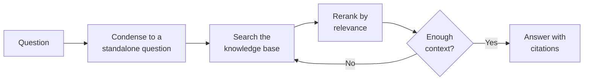

# Dokumenten-Intelligenz-Assistent

Der **Dokumenten-Intelligenz-Assistent** (der RAG-Agent) beantwortet Fragen mithilfe der eigenen Dokumente Ihrer
Organisation. Er verwendet Retrieval-Augmented Generation (RAG): Bevor er antwortet, durchsucht er Ihre Wissensbasen
nach den relevantesten Passagen und stützt seine Antwort – mit Zitaten – auf diese Passagen, anstatt sich auf das
allgemeine Training des Sprachmodells zu verlassen. Er ist der leistungsfähigste und am besten konfigurierbare Agent auf
der Plattform und derjenige, um den die meisten Unternehmens-Deployments aufgebaut sind.

Im Gegensatz zum [Instruierten Assistenten](../3_instructed_assistant/) und
[Lernfähigen Assistenten](../4_teachable_assistant/), die nur das eigene Wissen des Modells verwenden, kann dieser Agent
Fragen zu *Ihren* Inhalten – Richtlinien, Handbüchern, Berichten, Projektdateien – beantworten und dem Benutzer genau
mitteilen, aus welchen Dokumenten er die Informationen bezogen hat.

::: tip Über das „Trainieren“ von Agents
Der Swiss AI Hub fine-tuned oder trainiert keine Modelle mit Ihren Daten. Der Dokumenten-Intelligenz-Assistent bleibt
aktuell, indem er zum Zeitpunkt der Abfrage aus Ihrer Wissensbasis *abruft*. Aktualisieren Sie ein Dokument, und der
Agent verwendet die neue Version bei der nächsten Frage – kein erneutes Training, und Sie können immer sehen, welche
Quellen er verwendet hat. Weitere Informationen finden Sie in der [Agents-Übersicht](../).
:::

## Was er leistet

Im Kern läuft der Agent einen Abruf-dann-Antwort-Zyklus ab: Er wandelt das Gespräch in eine saubere Suchanfrage um, ruft
die relevantesten Passagen ab und ordnet sie, prüft, ob das Gefundene tatsächlich ausreicht, um zu antworten, und erst
dann verfasst er eine fundierte, zitierte Antwort.

1. **Die Frage verdichten.** Das aktuelle Gespräch und die neueste Nachricht werden zu einer eigenständigen Frage
   zusammengefasst, sodass Folgefragen wie „und was ist mit Teilzeitkräften?“ weiterhin korrekt eigenständig gesucht
   werden.
2. **Die Wissensbasis durchsuchen.** Die semantische Suche läuft über die konfigurierten Wissensbasen (vektorindizierte
   Sammlungen Ihrer Dokumente) und gibt die relevantesten Passagen zurück.
3. **Nach Relevanz neu ordnen** *(optional).* Ein dediziertes Reranking-Modell bewertet die Passagen neu, sodass die
   besten an die Spitze gelangen, bevor sie das Sprachmodell erreichen.
4. **Suffizienz prüfen** *(optional).* Ein Guard fragt, ob die abgerufenen Passagen tatsächlich ausreichen, um zu
   antworten. Falls nicht, kann der Agent mit einer verfeinerten Abfrage („Multi-Hop“) erneut suchen, bis zu einem
   konfigurierten Limit – oder, wenn er immer noch nicht genug findet, dem Benutzer mitteilen, dass er es nicht weiß,
   anstatt zu raten.
5. **Mit Zitaten antworten.** Das Modell schreibt die Antwort unter Verwendung nur der abgerufenen Passagen und verweist
   auf seine Quellen.

Über diesen Kernzyklus hinaus kann der Agent auch auf **Speicher** zugreifen – persönlichen Kontext, den er über den
einzelnen Benutzer gelernt hat, und geteiltes Organisationswissen – und einen **Eignungs-Guard** anwenden, der Fragen
außerhalb seines Zuständigkeitsbereichs höflich ablehnt. All dies ist optional und in der Konfigurationsreferenz unten
beschrieben.

## Was er *nicht* leistet

- **Er wird nicht aus allgemeinem Wissen antworten.** Von Natur aus antwortet er aus Ihren Dokumenten. Wenn nichts
  Relevantes gefunden wird (und der Suffizienz-Guard aktiviert ist), teilt er dies mit, anstatt eine Antwort zu
  erfinden.
- **Keine Tools oder Aktionen.** Er liest und antwortet; er erstellt keine Tickets und ruft keine externen Systeme auf.
  Dafür verwenden Sie den MCP Tool Agent.
- **Keine menschliche Eskalation von sich aus.** Wenn Sie möchten, dass er bei Nichtbeantwortbarkeit auf einen
  menschlichen Experten zurückgreift, verwenden Sie den Company Knowledge Agent (die Expert-RAG-Variante). Siehe den
  [Expert Coordinator Agent](../9_expert_coordinator_agent/).
- **Er nimmt keine Dokumente auf.** Das Füllen und Aktualisieren der Wissensbasis ist die Aufgabe einer
  [Daten-Pipeline](../../6_pipelines/), nicht des Agents. Der Agent liest nur, was die Pipeline indiziert hat.

## Typische Szenarien

- **HR-Richtlinienassistent.** Konfiguriert, um die HR-Wissensbasis zu durchsuchen, beantwortet er die Frage „Wie viele
  Urlaubstage kann ich übertragen?“ mit einem Zitat aus dem Mitarbeiterhandbuch.
- **Technischer Support-Assistent.** Verweist auf Produkthandbücher und Release Notes; beantwortet kundenbezogene Fragen
  mit Verweisen auf den genauen Abschnitt.
- **Projektwissensassistent.** Durchsucht die Projektdokumente, sodass Teammitglieder Fragen zu Entscheidungen,
  Spezifikationen und Status stellen können, ohne Ordner durchsuchen zu müssen.

## Bevor Sie beginnen: Voraussetzungen

Dies ist der entscheidende Unterschied zu den einfacheren Agents – der Dokumenten-Intelligenz-Assistent hängt von einer
Infrastruktur ab, die **unabhängig vom Agent selbst** existieren muss. Richten Sie diese zuerst ein:

1. **Eine befüllte Wissensbasis.** Der Agent durchsucht vektorindizierte Sammlungen Ihrer Dokumente. Diese Sammlungen
   müssen bereits existieren und indizierten Inhalt enthalten. Das Erstellen und Befüllen erfolgt durch eine
   [Datenerfassungs-Pipeline](../../6_pipelines/) – die Standard-Pipeline indiziert Dokumente, die über die UI
   hochgeladen wurden, und benutzerdefinierte Pipelines können von Quellen wie SharePoint synchronisieren und den Index
   aktuell halten, wenn sich Dokumente ändern. **Keine Wissensbasis, nichts abzurufen.**
2. **Ein Embedding-Modell.** Die Suche funktioniert, indem der Embedding (Vektor) der Frage mit den Embeddings Ihrer
   Dokumente verglichen wird. Das Embedding-Modell, das Sie für den Agent auswählen, **muss mit demjenigen
   übereinstimmen, das zum Indizieren der Wissensbasis verwendet wurde** – andernfalls sind die Vektoren inkompatibel
   und die Suche liefert nichts Nützliches.
3. **Ein Chat-Modell.** Das Sprachmodell, das die endgültige Antwort schreibt, verfügbar über die LiteLLM-Konfiguration
   Ihrer Plattform.
4. **Ein Reranking-Modell** *(optional).* Nur erforderlich, wenn Sie das Reranking aktivieren. Ebenfalls über LiteLLM
   verfügbar gemacht.
5. **Ein Speicher-Backend** *(optional).* Nur erforderlich, wenn Sie Benutzer- oder Organisationsspeicher aktivieren.

::: warning Das Embedding-Modell muss dem Index entsprechen
Die häufigste Ursache für „der Agent findet nichts“ ist eine Diskrepanz des Embedding-Modells zwischen der
Agent-Konfiguration und der Pipeline, die die Wissensbasis erstellt hat. Bestätigen Sie, dass beide dasselbe
Embedding-Modell verwenden, bevor Sie etwas anderes debuggen.
:::

## Einrichtung

Der Agent wird als **Blueprint** geliefert, aus dem Sie konfigurierte **Profile** erstellen – siehe
[Blueprints & Profile](../2_blueprints_and_profiles/). Sind die Voraussetzungen erfüllt:

1. **Öffnen Sie den Blueprint** unter **Admin > Agents > Blueprints** und wählen Sie
   **Dokumenten-Intelligenz-Assistent**.
2. **Erstellen Sie ein Profil** mit einer **Agent ID**, einem **Namen**, einer **Beschreibung** und einem **Icon**.
3. **Fügen Sie mindestens eine Wissensquelle hinzu.** Wählen Sie den Vector Store (Wissensbasis) zum Durchsuchen und das
   passende Embedding-Modell. Dies ist obligatorisch – der Agent benötigt einen Ort zum Abrufen. Sie können mehrere
   Quellen hinzufügen, um sie gemeinsam zu durchsuchen.
4. **Wählen Sie das Chat-Modell** und passen Sie dessen Temperatur an (halten Sie sie für faktenbasierte, fundierte
   Antworten niedrig).
5. **Passen Sie Abruf und Beantwortung** nach Bedarf an: wie viele Passagen abgerufen werden sollen, ob ein Reranking
   erfolgen soll, ob der Suffizienz-Guard ausgeführt und Multi-Hop erlaubt werden soll, sowie den System-Prompt.
6. **Aktivieren Sie Speicher und Guards**, falls gewünscht (alle optional – siehe unten).
7. **Speichern und testen** Sie mit echten Fragen, und überprüfen Sie, ob die zitierten Quellen die von Ihnen erwarteten
   sind.

## Konfigurationsreferenz

Das Formular bietet viele Optionen, da der Agent leistungsstark ist. Nur die **Profilidentität**, das **Chat-Modell**
und **mindestens eine Wissensquelle** sind erforderlich; alles andere hat sinnvolle Standardwerte.

### Profilidentität

| Feld             | Typ                | Erforderlich | Beschreibung                                                                                |
| :--------------- | :----------------- | :----------- | :------------------------------------------------------------------------------------------ |
| **Agent ID**     | Text               | Ja           | Eindeutiger, URL-sicherer Bezeichner. Kleinbuchstaben, Ziffern, Unterstriche, Bindestriche. |
| **Name**         | Text (pro Sprache) | Ja           | Anzeigename für Benutzer.                                                                   |
| **Beschreibung** | Text (pro Sprache) | Ja           | Kurze Erklärung, die im Assistenten-Picker angezeigt wird.                                  |
| **Icon**         | Icon-Picker        | Nein         | Visueller Bezeichner. Standardmäßig ein Dateisymbol.                                        |

### Sprachmodell

| Feld                                     | Typ             | Standard | Beschreibung                                                                                                          |
| :--------------------------------------- | :-------------- | :------- | :-------------------------------------------------------------------------------------------------------------------- |
| **Modell**                               | Modell-Picker   | —        | Das Chat-Modell, das die Antwort schreibt. Erforderlich.                                                              |
| **Temperatur**                           | Zahl            | `0.0`    | Zufälligkeit. Für fundierte, faktenbasierte Antworten niedrig halten (`0.0`–`0.3`). Bereich 0.0–2.0.                  |
| **Log-Wahrscheinlichkeiten zurückgeben** | Umschalter      | Aus      | Erweiterte Diagnoseoption für Token-Level-Konfidenz. Deaktiviert lassen, sofern nicht benötigt.                       |
| **Top Log-Wahrscheinlichkeiten**         | Zahl            | `0`      | Alternative Token pro Position zur Berichterstattung; nur wenn Log-Wahrscheinlichkeiten aktiviert sind. Bereich 0–20. |
| **Timeout**                              | Zahl (Sekunden) | `600`    | Wie lange auf das Modell gewartet werden soll, bevor aufgegeben wird.                                                 |

### Wissensquellen (Retriever)

Der Agent durchsucht eine oder mehrere **Wissensquellen**. Fügen Sie mindestens eine hinzu; fügen Sie mehrere hinzu, um
mehrere Wissensbasen gleichzeitig zu durchsuchen. Jede Quelle hat diese Einstellungen:

| Feld                            | Typ                 | Standard  | Beschreibung                                                                                                                         |
| :------------------------------ | :------------------ | :-------- | :----------------------------------------------------------------------------------------------------------------------------------- |
| **Embedding-Modell**            | Modell-Picker       | —         | Muss mit dem Modell übereinstimmen, das zum Indizieren dieser Wissensbasis verwendet wurde (siehe Voraussetzungen). Erforderlich.    |
| **Vector Store**                | Wissensbasis-Picker | —         | Die Sammlung (und optionalen Namespaces) zum Durchsuchen. Erforderlich.                                                              |
| **Retrieve K**                  | Zahl                | `5`       | Wie viele Passagen pro Suche abgerufen werden sollen. Höhere Werte finden mehr, fügen aber Rauschen und Kosten hinzu. Bereich 1–100. |
| **Abfragemodus**                | Auswahl             | `default` | Suchstrategie: `default` (dicht/semantisch), `hybrid` (dicht + Stichwort) oder `sparse` (Stichwort).                                 |
| **Knotentypen**                 | Mehrfachauswahl     | `content` | Ob Dokumentinhalte, übergeordnete **Zusammenfassungsknoten** oder beides abgerufen werden sollen. Mindestens einer erforderlich.     |
| **Vorheriges/Nächstes abrufen** | Optionale Gruppe    | Aus       | Ziehen Sie auch die Chunks direkt vor/nach jedem Treffer, damit die Passagen ihren umgebenden Kontext behalten.                      |
| **Zusammenfassungen abrufen**   | Optionale Gruppe    | Aus       | Ziehen Sie auch übergeordnete Zusammenfassungsknoten für eine übergeordnete Ansicht des Quelldokuments.                              |

### Reranking *(optional)*

Standardmäßig deaktiviert. Wenn aktiviert, bewertet ein dediziertes Modell die abgerufenen Passagen nach Relevanz neu,
bevor sie das Chat-Modell erreichen – in der Regel ein erheblicher Qualitätsgewinn mit zusätzlicher Latenz und Kosten.

| Feld                 | Typ           | Standard | Beschreibung                                                                            |
| :------------------- | :------------ | :------- | :-------------------------------------------------------------------------------------- |
| **Reranking-Modell** | Modell-Picker | —        | Das Rerank-Modell (verfügbar über LiteLLM). Erforderlich, wenn Reranking aktiviert ist. |
| **Top N**            | Zahl          | `5`      | Wie viele Passagen nach dem Reranking beibehalten werden sollen. Bereich 1–100.         |

### Kontext-Suffizienz-Guard *(optional)*

Standardmäßig deaktiviert. Wenn aktiviert, prüft ein Guard, ob der abgerufene Kontext tatsächlich ausreicht, um zu
antworten – und kann zusätzliche Abrufrunden („Multi-Hop“) auslösen oder den Agenten zugeben lassen, dass er es nicht
weiß, anstatt zu raten.

| Feld                                     | Typ        | Standard                   | Beschreibung                                                                                                                                                                     |
| :--------------------------------------- | :--------- | :------------------------- | :------------------------------------------------------------------------------------------------------------------------------------------------------------------------------- |
| **Kontext-Suffizienz prüfen**            | Umschalter | Aus                        | Führen Sie den Guard vor der Beantwortung aus. Dringend empfohlen für den Einsatz in kritischen Bereichen, wo eine falsche Antwort schlimmer ist als „Ich weiß es nicht.“        |
| **Max. Abruf-Hops**                      | Zahl       | `1`                        | Wie oft der Agent erneut suchen darf, wenn der Guard den Kontext als unzureichend befindet. Höhere Werte können die Antworten verbessern, erhöhen aber die Latenz. Bereich 1–10. |
| **Nachricht bei unzureichendem Kontext** | Langtext   | *(Grundlegender Standard)* | Was der Agent sagt, wenn er nicht genug findet, um zu antworten. Passen Sie die Formulierung und den Ton an.                                                                     |

### Eignungs-Guard *(optional)*

Ein Few-Shot-Guard, der entscheidet, ob eine Frage für diesen Assistenten relevant ist. Geben Sie Beispielanfragen mit
der Kennzeichnung Akzeptieren/Ablehnen an; lassen Sie die Liste leer, um alles zu akzeptieren.

| Feld                | Typ                | Beschreibung                                                                         |
| :------------------ | :----------------- | :----------------------------------------------------------------------------------- |
| **Benutzeranfrage** | Text (pro Sprache) | Eine Beispielanfrage, die ein Benutzer senden könnte.                                |
| **Akzeptieren?**    | Umschalter         | Ob dieses Beispiel akzeptiert (im Geltungsbereich) oder abgelehnt werden soll.       |
| **Grund**           | Text (pro Sprache) | Warum es akzeptiert oder abgelehnt wird – hilft dem Guard bei der Verallgemeinerung. |

### Benutzerspeicher *(optional)*

Ermöglicht es dem Assistenten, Kontext über den einzelnen Benutzer über Gespräche hinweg zu speichern (z.B. deren Rolle
oder Präferenzen) und diesen zur Personalisierung von Antworten zu verwenden. Standardmäßig aktiviert.

| Feld                                        | Typ        | Standard | Beschreibung                                                                                                            |
| :------------------------------------------ | :--------- | :------- | :---------------------------------------------------------------------------------------------------------------------- |
| **Benutzererinnerungsabruf aktivieren**     | Umschalter | Ein      | Persönliche Erinnerungen in den Kontext ziehen, um Antworten zu personalisieren.                                        |
| **Benutzerspeicher neu ordnen**             | Umschalter | Ein      | Abgerufene Erinnerungen nach Relevanz neu ordnen (wird nur angezeigt, wenn der Abruf aktiviert ist). Fügt Kosten hinzu. |
| **Benutzerspeicher-Speicherung aktivieren** | Umschalter | Ein      | Neue Erkenntnisse aus dem Gespräch für zukünftige Personalisierung speichern.                                           |

### Organisationsspeicher *(optional)*

Ermöglicht es dem Assistenten, auf gemeinsames Wissen zurückzugreifen, das für die gesamte Organisation erfasst wurde
(zum Beispiel Antworten, die vom [Expert Coordinator Agent](../9_expert_coordinator_agent/) gesammelt wurden).
Deaktivieren Sie den Abschnitt „Organisationsspeicher“, um ihn zu deaktivieren.

| Feld                                 | Typ        | Standard          | Beschreibung                                                                                                                       |
| :----------------------------------- | :--------- | :---------------- | :--------------------------------------------------------------------------------------------------------------------------------- |
| **Mandanten-ID**                     | Text       | Plattformstandard | Welchen Mandanten-Shared-Memory gelesen werden soll.                                                                               |
| **Zulässige Namespaces**             | Liste      | *(leer)*          | Positivliste der Speicher-Namespaces, aus denen gelesen werden soll. Leer bedeutet uneingeschränkt.                                |
| **Standard-Namespace**               | Text       | Plattformstandard | Namespace, der verwendet wird, wenn eine Anfrage keinen angibt. Muss innerhalb der Positivliste liegen, falls eine festgelegt ist. |
| **Organisationsspeicher neu ordnen** | Umschalter | Ein               | Abgerufene Organisationserinnerungen nach Relevanz neu ordnen. Fügt Kosten hinzu.                                                  |

### Prompts und Eingabebudget

| Feld                  | Typ      | Standard                   | Beschreibung                                                                                                                                                           |
| :-------------------- | :------- | :------------------------- | :--------------------------------------------------------------------------------------------------------------------------------------------------------------------- |
| **System-Prompt**     | Langtext | *(Grundlegender Standard)* | Definiert die Rolle und Regeln des Assistenten. Die Standardeinstellung weist ihn an, nur aus dem abgerufenen Kontext zu antworten und Quellen zu zitieren.            |
| **Kontext-Prompt**    | Langtext | *(Vorlagenstandard)*       | Vorlage dafür, wie abgerufene Passagen dem Modell präsentiert werden. Die meisten Deployments belassen dies bei der Standardeinstellung.                               |
| **Max. Eingabetoken** | Zahl     | `128000`                   | Das Eingabebudget; das Gespräch und der abgerufene Kontext werden gekürzt, um zu passen. Innerhalb des Kontextfensters des Chat-Modells halten. Bereich 1.024–128.000. |

## Best Practices

**Stellen Sie zuerst die korrekte Wissensbasis sicher.** Die Qualität der Antworten ist durch die Qualität des
Indizierten begrenzt. Stellen Sie sicher, dass die [Pipeline](../../6_pipelines/) die richtigen Dokumente aufnimmt und
sie aktuell hält, bevor Sie den Agenten optimieren.

**Gleichen Sie das Embedding-Modell mit dem Index ab.** Lesen Sie die Voraussetzungen nochmals – eine Diskrepanz führt
stillschweigend zu Fehlern beim Abruf.

**Aktivieren Sie den Suffizienz-Guard für Assistenten in kritischen Bereichen.** Für den Einsatz in Bereichen wie
Richtlinien, Recht oder Compliance ist es weitaus besser, wenn der Agent sagt „Ich habe nicht genügend Informationen“,
als eine selbstbewusste falsche Antwort zu geben. Kombinieren Sie dies mit einer geringen Anzahl von
Multi-Hop-Wiederholungen.

**Halten Sie die Temperatur niedrig.** `0.0`–`0.3` hält die Antworten den abgerufenen Quellen treu.

**Beginnen Sie mit wenigen Wissensquellen, nicht mit allen.** Das gleichzeitige Durchsuchen aller Sammlungen führt zu
verrauschten, gemischten Ergebnissen. Wenn Benutzer sehr unterschiedliche Themen abdecken, sollten Sie den Document
Navigation Assistant in Betracht ziehen, um jede Frage an die richtige Wissensbasis zu leiten, anstatt sie alle in ein
Profil zu werfen.

**Passen Sie Retrieve K und Reranking gemeinsam an.** Ein häufiges Muster ist es, eine großzügige Anzahl von Passagen
abzurufen (höherer Retrieve K) und das Reranking nur die besten wenigen (Top N) behalten zu lassen – mehr Recall, ohne
das Modell zu überfordern.
