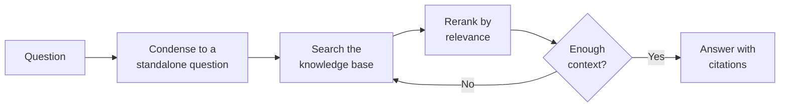

# Document Intelligence Assistant

The **Document Intelligence Assistant** (the RAG agent) answers questions using your organization's own documents. It
uses Retrieval-Augmented Generation (RAG): before answering, it searches your knowledge bases for the most relevant
passages and grounds its reply in those passages — with citations — rather than relying on the language model's general
training. It is the most capable and most configurable agent on the platform, and the one most enterprise deployments
build around.

Unlike the [Instructed Assistant](../3_instructed_assistant/) and [Teachable Assistant](../4_teachable_assistant/),
which only use the model's own knowledge, this agent can answer questions about *your* content — policies, manuals,
reports, project files — and tell the user exactly which documents it drew from.

::: tip About "training" agents
The Swiss AI Hub does not fine-tune or train models on your data. The Document Intelligence Assistant stays current by
*retrieving* from your knowledge base at query time. Update a document and the agent uses the new version on the next
question — no retraining, and you can always see which sources it used. See the [Agents overview](../) for more.
:::

## What it does

At its core the agent runs a retrieve-then-answer loop: it turns the conversation into a clean search query, fetches and
ranks the most relevant passages, checks whether what it found is actually enough to answer, and only then writes a
grounded, cited reply.

1. **Condense the question.** The recent conversation and the latest message are folded into one self-contained
   question, so follow-ups like "and what about part-timers?" still search correctly on their own.
2. **Search the knowledge base.** Semantic search runs across the configured knowledge bases (vector-indexed collections
   of your documents) and returns the most relevant passages.
3. **Rerank by relevance** *(optional).* A dedicated reranking model re-scores the passages so the best ones rise to the
   top before they reach the language model.
4. **Check sufficiency** *(optional).* A guard asks whether the retrieved passages are actually enough to answer. If
   not, the agent can search again with a refined query ("multi-hop"), up to a configured limit — or, if it still can't
   find enough, tell the user it doesn't know rather than guess.
5. **Answer with citations.** The model writes the answer using only the retrieved passages and references its sources.

Beyond this core loop, the agent can also draw on **memory** — personal context it has learned about the individual
user, and shared organizational knowledge — and apply a **suitability guard** that politely declines questions outside
its remit. These are all optional and covered in the configuration reference below.

## What it does *not* do

- **It won't answer from general knowledge.** By design it answers from your documents. If nothing relevant is found
  (and the sufficiency guard is on), it says so rather than inventing an answer.
- **No tools or actions.** It reads and answers; it doesn't create tickets or call external systems. For that, use the
  MCP Tool Agent.
- **No human escalation on its own.** If you want it to fall back to a human expert when it can't answer, use the
  Company Knowledge Agent (the expert-RAG variant). See the [Expert Coordinator Agent](../9_expert_coordinator_agent/).
- **It does not ingest documents.** Filling and updating the knowledge base is the job of a
  [data pipeline](../../6_pipelines/), not the agent. The agent only reads what the pipeline has indexed.

## Typical scenarios

- **HR policy assistant.** Configured to search the HR knowledge base, it answers "How many vacation days do I carry
  over?" with a citation to the staff handbook.
- **Technical support assistant.** Points at product manuals and release notes; answers customer-facing questions with
  references to the exact section.
- **Project knowledge assistant.** Searches a project's documents so team members can ask about decisions, specs, and
  status without digging through folders.

## Before you start: prerequisites

This is the key difference from the simpler agents — the Document Intelligence Assistant depends on infrastructure that
must exist **independently of the agent itself**. Set these up first:

1. **A populated knowledge base.** The agent searches vector-indexed collections of your documents. Those collections
   must already exist and contain indexed content. Creating and filling them is done by a
   [data ingestion pipeline](../../6_pipelines/) — the default pipeline indexes documents uploaded through the UI, and
   custom pipelines can sync from sources like SharePoint and keep the index up to date as documents change. **No
   knowledge base, nothing to retrieve.**
2. **An embedding model.** Search works by comparing the embedding (vector) of the question against the embeddings of
   your documents. The embedding model you select for the agent **must match the one used to index the knowledge base**
   — otherwise the vectors are incompatible and search returns nothing useful.
3. **A chat model.** The language model that writes the final answer, available through your platform's LiteLLM
   configuration.
4. **A reranking model** *(optional).* Required only if you enable reranking. Also made available through LiteLLM.
5. **A memory backend** *(optional).* Required only if you enable user or organization memory.

::: warning The embedding model must match the index
The single most common cause of "the agent finds nothing" is an embedding-model mismatch between the agent configuration
and the pipeline that built the knowledge base. Confirm both use the same embedding model before debugging anything
else.
:::

## Setting it up

The agent is delivered as a **blueprint** from which you create configured **profiles** — see
[Blueprints & Profiles](../2_blueprints_and_profiles/). With the prerequisites in place:

1. **Open the blueprint** under **Admin > Agents > Blueprints** and select **Document Intelligence Assistant**.
2. **Create a profile** with an **Agent ID**, **Name**, **Description**, and **Icon**.
3. **Add at least one knowledge source.** Pick the vector store (knowledge base) to search and the matching embedding
   model. This is mandatory — the agent needs somewhere to retrieve from. You can add several sources to search them
   together.
4. **Choose the chat model** and adjust its temperature (keep it low for factual, grounded answers).
5. **Tune retrieval and answering** as needed: how many passages to fetch, whether to rerank, whether to run the
   sufficiency guard and allow multi-hop, and the system prompt.
6. **Enable memory and guards** if you want them (all optional — see below).
7. **Save and test** with real questions, checking that the cited sources are the ones you expect.

## Configuration reference

The form has a lot of options because the agent is powerful. Only the **profile identity**, **chat model**, and **at
least one knowledge source** are required; everything else has sensible defaults.

### Profile identity

| Field           | Type                | Required | Description                                                                   |
| --------------- | ------------------- | -------- | ----------------------------------------------------------------------------- |
| **Agent ID**    | Text                | Yes      | Unique, URL-safe identifier. Lowercase letters, digits, underscores, hyphens. |
| **Name**        | Text (per language) | Yes      | Display name shown to users.                                                  |
| **Description** | Text (per language) | Yes      | Short explanation shown in the assistant picker.                              |
| **Icon**        | Icon picker         | No       | Visual identifier. Defaults to a file icon.                                   |

### Language model

| Field                        | Type             | Default | Description                                                                                |
| ---------------------------- | ---------------- | ------- | ------------------------------------------------------------------------------------------ |
| **Model**                    | Model picker     | —       | The chat model that writes the answer. Required.                                           |
| **Temperature**              | Number           | `0.0`   | Randomness. Keep low (`0.0`–`0.3`) for grounded, factual answers. Range 0.0–2.0.           |
| **Return Log Probabilities** | Toggle           | Off     | Advanced diagnostic option for token-level confidence. Leave off unless needed.            |
| **Top Log Probabilities**    | Number           | `0`     | Alternative tokens to report per position; only when log probabilities are on. Range 0–20. |
| **Timeout**                  | Number (seconds) | `600`   | How long to wait for the model before giving up.                                           |

### Knowledge sources (retrievers)

The agent searches one or more **knowledge sources**. Add at least one; add several to search multiple knowledge bases
together. Each source has these settings:

| Field                      | Type                  | Default   | Description                                                                                         |
| -------------------------- | --------------------- | --------- | --------------------------------------------------------------------------------------------------- |
| **Embedding model**        | Model picker          | —         | Must match the model used to index this knowledge base (see prerequisites). Required.               |
| **Vector store**           | Knowledge-base picker | —         | The collection (and optional namespaces) to search. Required.                                       |
| **Retrieve K**             | Number                | `5`       | How many passages to fetch per search. Higher finds more but adds noise and cost. Range 1–100.      |
| **Query mode**             | Choice                | `default` | Search strategy: `default` (dense/semantic), `hybrid` (dense + keyword), or `sparse` (keyword).     |
| **Node types**             | Multi-select          | `content` | Whether to retrieve document **content**, parent **summary** nodes, or both. At least one required. |
| **Retrieve previous/next** | Optional group        | Off       | Also pull the chunks immediately before/after each hit, so passages keep their surrounding context. |
| **Retrieve summaries**     | Optional group        | Off       | Also pull parent-level summary nodes for a higher-level view of the source document.                |

### Reranking *(optional)*

Off by default. When enabled, a dedicated model re-scores retrieved passages for relevance before they reach the chat
model — usually a meaningful quality boost at some extra latency and cost.

| Field               | Type         | Default | Description                                                                       |
| ------------------- | ------------ | ------- | --------------------------------------------------------------------------------- |
| **Reranking model** | Model picker | —       | The rerank model (available through LiteLLM). Required when reranking is enabled. |
| **Top N**           | Number       | `5`     | How many passages to keep after reranking. Range 1–100.                           |

### Context-sufficiency guard *(optional)*

Off by default. When enabled, a guard checks whether the retrieved context is actually enough to answer — and can
trigger additional retrieval rounds ("multi-hop") or have the agent admit it doesn't know instead of guessing.

| Field                            | Type      | Default              | Description                                                                                                                                    |
| -------------------------------- | --------- | -------------------- | ---------------------------------------------------------------------------------------------------------------------------------------------- |
| **Check context sufficiency**    | Toggle    | Off                  | Run the guard before answering. Strongly recommended for high-stakes use where a wrong answer is worse than "I don't know."                    |
| **Max retrieval hops**           | Number    | `1`                  | How many times the agent may re-search when the guard finds the context insufficient. Higher can improve answers but adds latency. Range 1–10. |
| **Context-insufficient message** | Long text | *(default provided)* | What the agent says when it can't find enough to answer. Customize the wording and tone.                                                       |

### Suitability guard *(optional)*

A few-shot guard that decides whether a question is in scope for this assistant. Provide example requests labelled
accept/reject; leave the list empty to accept everything.

| Field              | Type                | Description                                                     |
| ------------------ | ------------------- | --------------------------------------------------------------- |
| **User request**   | Text (per language) | An example request a user might send.                           |
| **Should accept?** | Toggle              | Whether this example should be accepted (in scope) or rejected. |
| **Reason**         | Text (per language) | Why it's accepted or rejected — helps the guard generalize.     |

### User memory *(optional)*

Lets the assistant remember context about the individual user across conversations (e.g. their role or preferences) and
use it to personalize answers. On by default.

| Field                            | Type   | Default | Description                                                                                |
| -------------------------------- | ------ | ------- | ------------------------------------------------------------------------------------------ |
| **Enable user memory retrieval** | Toggle | On      | Pull personal memories into context to personalize answers.                                |
| **Rerank user memory**           | Toggle | On      | Rerank retrieved memories for relevance (shown only when retrieval is enabled). Adds cost. |
| **Enable user memory storage**   | Toggle | On      | Save new learnings from the conversation for future personalization.                       |

### Organization memory *(optional)*

Lets the assistant draw on shared knowledge captured for the whole organization (for example, answers gathered by the
[Expert Coordinator Agent](../9_expert_coordinator_agent/)). Set the organization-memory section to off to disable it.

| Field                          | Type   | Default          | Description                                                                                     |
| ------------------------------ | ------ | ---------------- | ----------------------------------------------------------------------------------------------- |
| **Tenant ID**                  | Text   | platform default | Which tenant's shared memory to read.                                                           |
| **Allowed namespaces**         | List   | *(empty)*        | Allow-list of memory namespaces to read from. Empty means unrestricted.                         |
| **Default namespace**          | Text   | platform default | Namespace used when a request doesn't specify one. Must be within the allow-list if one is set. |
| **Rerank organization memory** | Toggle | On               | Rerank retrieved organization memories for relevance. Adds cost.                                |

### Prompts and input budget

| Field                | Type      | Default               | Description                                                                                                                                    |
| -------------------- | --------- | --------------------- | ---------------------------------------------------------------------------------------------------------------------------------------------- |
| **System prompt**    | Long text | *(grounding default)* | Defines the assistant's role and rules. The default instructs it to answer only from retrieved context and quote sources.                      |
| **Context prompt**   | Long text | *(template default)*  | Template for how retrieved passages are presented to the model. Most deployments leave this at the default.                                    |
| **Max input tokens** | Number    | `128000`              | The input budget; the conversation and retrieved context are trimmed to fit. Keep within the chat model's context window. Range 1,024–128,000. |

## Best practices

**Get the knowledge base right first.** The quality of answers is capped by the quality of what's indexed. Make sure the
[pipeline](../../6_pipelines/) is ingesting the right documents and keeping them current before tuning the agent.

**Match the embedding model to the index.** Re-read the prerequisites — a mismatch silently breaks retrieval.

**Turn on the sufficiency guard for high-stakes assistants.** For policy, legal, or compliance use, it's far better for
the agent to say "I don't have enough information" than to produce a confident wrong answer. Pair it with a small number
of multi-hop retries.

**Keep temperature low.** `0.0`–`0.3` keeps answers faithful to the retrieved sources.

**Start with a few knowledge sources, not all of them.** Searching every collection at once produces noisy, mixed
results. If users span very different topics, consider the Document Navigation Assistant to route each question to the
right knowledge base instead of dumping them all into one profile.

**Tune Retrieve K and reranking together.** A common pattern is to retrieve a generous number of passages (higher
Retrieve K) and let reranking keep only the best few (Top N) — more recall without overwhelming the model.
