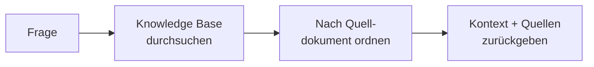

# Retrieval Agent

Der **Retrieval Agent** ist der [Document Intelligence Assistant](/de/docs/5_document_intelligence_assistant/) ohne den
Antwortschritt. Er führt die *Retrieval*-Hälfte von RAG aus – durchsucht Ihre Knowledge Base und gibt die relevantesten
Dokumentenpassagen zurück – aber er **ruft niemals ein Sprachmodell auf und schreibt niemals eine Antwort**. Er gibt den
Rohkontext (die gefundenen Passagen und deren Quellmetadaten) zur weiteren Verwendung zurück.

Stellen Sie ihn sich eher als einen spezialisierten Baustein vor, denn als einen vollständigen Chat-Assistenten. Während
der Document Intelligence Assistant die Frage eines Benutzers beantwortet, *findet* der Retrieval Agent lediglich das
relevante Material und stoppt.

::: warning Eine spezialisierte Komponente, kein allgemeiner Chat-Assistent
Dies ist ein fortschrittlicher, zusammensetzbarer Agent. Er verarbeitet keine normale Chat-Nachricht und erstellt keine
konversationelle Antwort – er nimmt eine Frage entgegen und gibt Kontext zurück. In der aktuellen Plattform ist er
**nicht in den Workflow anderer Agents integriert** (zum Beispiel delegiert der Document Navigation Assistant an einen
vollständigen RAG-Agenten, nicht an diesen hier). Verwenden Sie ihn nur, wenn Sie Retrieval speziell von der
Antwortgenerierung entkoppeln möchten. Wenn Sie einen Assistenten wünschen, der Fragen im Chat beantwortet, verwenden
Sie den [Document Intelligence Assistant](/de/docs/5_document_intelligence_assistant/).
:::

## Was er tut

1. **Knowledge Base durchsuchen.** Eine semantische Suche wird gegen die konfigurierte Knowledge Base ausgeführt und
   gibt die relevantesten Passagen zurück. Optional können angrenzende Chunks abgerufen werden, damit jede Passage ihren
   umgebenden Kontext beibehält.
2. **Nach Quelldokument ordnen.** Die abgerufenen Passagen werden gruppiert und nach dem Dokument, aus dem sie stammen,
   geordnet und in einem einzigen Kontextblock formatiert.
3. **Kontext und Quellen zurückgeben.** Der Agent beendet seine Arbeit, indem er den geordneten Kontext zusammen mit den
   strukturierten Quellpassagen zurückgibt – und stoppt. Es gibt keinen Schritt zur Antwortgenerierung.

## Wann Sie ihn verwenden sollten

- **Retrieval entkoppelt von der Generierung.** Wenn Sie Grundmaterial abrufen und einem separaten Prozess zuführen
  möchten – einem benutzerdefinierten Frontend, einem anderen System oder einem Modell, das Sie selbst steuern.
- **Retrieval überprüfen und debuggen.** Wenn Sie genau sehen möchten, was eine Knowledge Base für eine bestimmte Frage
  zurückgibt, ohne die Antwort eines LLM.
- **Zusammensetzung.** Als wiederverwendbares Retrieval-Grundelement in benutzerdefinierten Workflows, wo die
  Antwortgenerierung an anderer Stelle stattfindet.

Wenn Sie einfach fundierte, zitierte Antworten im Chat wünschen, ist dies der falsche Agent – verwenden Sie den
[Document Intelligence Assistant](/de/docs/5_document_intelligence_assistant/), der denselben Retrieval-Schritt
umschliesst und dann antwortet.

## Was er bewusst weglässt

Im Vergleich zum Document Intelligence Assistant lässt der Retrieval Agent alles weg, was nicht Retrieval ist:

| Fähigkeit                             | Document Intelligence Assistant |          Retrieval Agent           |
| ------------------------------------- | :-----------------------------: | :--------------------------------: |
| Durchsucht Ihre Knowledge Base        |               ✅                |                 ✅                 |
| Reranking                             |          ✅ (optional)          |                 ❌                 |
| Generiert eine Antwort mit einem LLM  |               ✅                |                 ❌                 |
| Zitate in einer schriftlichen Antwort |               ✅                | ❌ (gibt Quellen als Daten zurück) |
| Kontext-Suffizienz-Guard / Multi-Hop  |          ✅ (optional)          |                 ❌                 |
| Eignungs-Guard                        |          ✅ (optional)          |                 ❌                 |
| Benutzer- & Organisationsgedächtnis   |          ✅ (optional)          |                 ❌                 |

Dies ist der Grund, warum seine Konfiguration so schlank ist: Es gibt kein Chat-Modell, keine Temperatur, kein
Reranking, keine Guards und keinen Speicher zu konfigurieren – nur die Knowledge Source.

## Bevor Sie beginnen: Voraussetzungen

Der Retrieval Agent teilt die Daten-Voraussetzungen des Document Intelligence Assistant – aber **es wird kein
Chat-Modell benötigt**, da er niemals Text generiert.

1. **Eine gefüllte Knowledge Base.** Eine vektor-indexierte Sammlung Ihrer Dokumente muss bereits existieren, gefüllt
   durch eine [Datenerfassungs-Pipeline](/de/docs/6_pipelines/). Der Agent liest nur, was die Pipeline indiziert hat.
2. **Ein Embedding-Modell**, das **mit dem zum Indizieren der Knowledge Base verwendeten Modell übereinstimmt** – eine
   Nichtübereinstimmung führt stillschweigend zum Fehlschlagen der Suche.

## Konfigurationsreferenz

Nur die **Profilidentität** und eine einzige **Knowledge Source** sind erforderlich.

### Profilidentität

| Feld             | Typ                | Erforderlich | Beschreibung                                                                                |
| ---------------- | ------------------ | ------------ | ------------------------------------------------------------------------------------------- |
| **Agent ID**     | Text               | Ja           | Eindeutiger, URL-sicherer Identifier. Kleinbuchstaben, Ziffern, Unterstriche, Bindestriche. |
| **Name**         | Text (pro Sprache) | Ja           | Anzeigename.                                                                                |
| **Beschreibung** | Text (pro Sprache) | Ja           | Kurze Erklärung, wovon dieses Profil abruft.                                                |
| **Icon**         | Icon-Auswahl       | Nein         | Visueller Identifier.                                                                       |

### Knowledge Source

Die einzelne Knowledge Base, die dieser Agent durchsucht. (Der Document Intelligence Assistant erlaubt mehrere; der
Retrieval Agent nimmt genau eine.)

| Feld                          | Typ                    | Standard  | Beschreibung                                                                                                         |
| ----------------------------- | ---------------------- | --------- | -------------------------------------------------------------------------------------------------------------------- |
| **Embedding-Modell**          | Modell-Auswahl         | —         | Muss dem Modell entsprechen, das zum Indizieren dieser Knowledge Base verwendet wurde. Erforderlich.                 |
| **Vector Store**              | Knowledge-Base-Auswahl | —         | Die Sammlung (und optionale Namespaces) zum Durchsuchen. Erforderlich.                                               |
| **K Abruf**                   | Zahl                   | `5`       | Wie viele Passagen abgerufen werden sollen. Bereich 1–100.                                                           |
| **Abfragemodus**              | Auswahl                | `default` | Suchstrategie: `default` (semantisch), `hybrid` (semantisch + Schlüsselwort) oder `sparse` (Schlüsselwort).          |
| **Knotentypen**               | Mehrfachauswahl        | `content` | Dokumenten-**Inhalt**, übergeordnete **Zusammenfassungs-Knoten** oder beides abrufen. Mindestens einer erforderlich. |
| **Vorherige/nächste abrufen** | Optionale Gruppe       | Aus       | Auch die unmittelbar vor/nach jedem Treffer liegenden Chunks abrufen, um den umgebenden Kontext zu erhalten.         |
| **Zusammenfassungen abrufen** | Optionale Gruppe       | Aus       | Auch übergeordnete Zusammenfassungs-Knoten abrufen.                                                                  |

### Ausgabeformatierung

| Feld               | Typ         | Standard                 | Beschreibung                                                                                                                                                   |
| ------------------ | ----------- | ------------------------ | -------------------------------------------------------------------------------------------------------------------------------------------------------------- |
| **Kontext-Prompt** | Langer Text | *(Standard-Kombinierer)* | Optionale Vorlage, die steuert, wie die abgerufenen Passagen in den zurückgegebenen Kontextblock formatiert werden. Leer lassen, um den Standard zu verwenden. |

## Best Practices

**Verwenden Sie die Knowledge Base wieder, die Sie bereits erstellt haben.** Der Retrieval Agent liest dieselben
Vektor-Sammlungen wie der Document Intelligence Assistant – verweisen Sie ihn auf eine bestehende, gut gepflegte
Knowledge Base, anstatt eine neue aufzusetzen.

**Stimmen Sie das Embedding-Modell mit dem Index ab.** Wie bei jedem Retrieval Agent ist eine Nichtübereinstimmung des
Embeddings die häufigste Ursache für leere Ergebnisse.

**Bevorzugen Sie den Document Intelligence Assistant, es sei denn, Sie benötigen speziell den Rohkontext.** Für nahezu
alle Chat-basierten Fragen und Antworten ist der vollständige RAG-Agent die richtige Wahl. Wählen Sie den Retrieval
Agent nur, wenn die Antwortgenerierung wirklich an anderer Stelle erfolgen soll.
