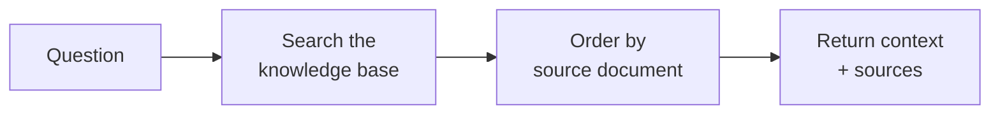

# Retrieval Agent

The **Retrieval Agent** is the [Document Intelligence Assistant](../5_document_intelligence_assistant/) with the answer
step removed. It performs the *retrieval* half of RAG — searching your knowledge base and returning the most relevant
document passages — but it **never calls a language model and never writes an answer**. It hands back the raw context
(the matched passages and their source metadata) for something else to use.

Think of it as a focused building block rather than a finished chat assistant. Where the Document Intelligence Assistant
answers a user's question, the Retrieval Agent just *finds the relevant material* and stops.

::: warning A specialist component, not a general chat assistant
This is an advanced, composable agent. It does not take a normal chat message and does not produce a conversational
reply — it takes a question and returns context. In the current platform it is **not wired into any other agent's
workflow** (for example, the Document Navigation Assistant delegates to a full RAG agent, not to this one). Reach for it
only when you specifically want retrieval decoupled from answer generation. If you want an assistant that answers
questions in chat, use the [Document Intelligence Assistant](../5_document_intelligence_assistant/).
:::

## What it does

1. **Search the knowledge base.** Semantic search runs against the configured knowledge base and returns the most
   relevant passages. It can optionally pull adjacent chunks so each passage keeps its surrounding context.
2. **Order by source document.** The retrieved passages are grouped and ordered by the document they came from, and
   formatted into a single context block.
3. **Return context and sources.** The agent finishes by returning the ordered context together with the structured
   source passages — and stops. There is no answer-generation step.

## When to use it

- **Retrieval decoupled from generation.** When you want to fetch grounding material and feed it to a separate process —
  a custom front-end, another system, or a model you control yourself.
- **Inspecting and debugging retrieval.** When you want to see exactly what a knowledge base returns for a given
  question, without an LLM's answer in the way.
- **Composition.** As a reusable retrieval primitive in custom flows where answer generation happens elsewhere.

If you simply want grounded, cited answers in chat, this is the wrong agent — use the
[Document Intelligence Assistant](../5_document_intelligence_assistant/), which wraps this same retrieval step and then
answers.

## What it deliberately leaves out

Compared to the Document Intelligence Assistant, the Retrieval Agent omits everything that isn't retrieval:

| Capability                            | Document Intelligence Assistant |       Retrieval Agent        |
| ------------------------------------- | :-----------------------------: | :--------------------------: |
| Searches your knowledge base          |               ✅                |              ✅              |
| Reranking                             |          ✅ (optional)          |              ❌              |
| Generates an answer with an LLM       |               ✅                |              ❌              |
| Citations in a written reply          |               ✅                | ❌ (returns sources as data) |
| Context-sufficiency guard / multi-hop |          ✅ (optional)          |              ❌              |
| Suitability guard                     |          ✅ (optional)          |              ❌              |
| User & organization memory            |          ✅ (optional)          |              ❌              |

This is what makes its configuration so small: there is no chat model, no temperature, no reranking, no guards, and no
memory to configure — only the knowledge source.

## Before you start: prerequisites

The Retrieval Agent shares the Document Intelligence Assistant's data prerequisites — but **no chat model is needed**,
since it never generates text.

1. **A populated knowledge base.** A vector-indexed collection of your documents must already exist, filled by a
   [data ingestion pipeline](../../6_pipelines/). The agent only reads what the pipeline has indexed.
2. **An embedding model** that **matches the one used to index the knowledge base** — a mismatch silently breaks search.

## Configuration reference

Only the **profile identity** and a single **knowledge source** are required.

### Profile identity

| Field           | Type                | Required | Description                                                                   |
| --------------- | ------------------- | -------- | ----------------------------------------------------------------------------- |
| **Agent ID**    | Text                | Yes      | Unique, URL-safe identifier. Lowercase letters, digits, underscores, hyphens. |
| **Name**        | Text (per language) | Yes      | Display name.                                                                 |
| **Description** | Text (per language) | Yes      | Short explanation of what this profile retrieves from.                        |
| **Icon**        | Icon picker         | No       | Visual identifier.                                                            |

### Knowledge source

The single knowledge base this agent searches. (The Document Intelligence Assistant allows several; the Retrieval Agent
takes exactly one.)

| Field                      | Type                  | Default   | Description                                                                                  |
| -------------------------- | --------------------- | --------- | -------------------------------------------------------------------------------------------- |
| **Embedding model**        | Model picker          | —         | Must match the model used to index this knowledge base. Required.                            |
| **Vector store**           | Knowledge-base picker | —         | The collection (and optional namespaces) to search. Required.                                |
| **Retrieve K**             | Number                | `5`       | How many passages to fetch. Range 1–100.                                                     |
| **Query mode**             | Choice                | `default` | Search strategy: `default` (semantic), `hybrid` (semantic + keyword), or `sparse` (keyword). |
| **Node types**             | Multi-select          | `content` | Retrieve document **content**, parent **summary** nodes, or both. At least one required.     |
| **Retrieve previous/next** | Optional group        | Off       | Also pull the chunks immediately before/after each hit, preserving surrounding context.      |
| **Retrieve summaries**     | Optional group        | Off       | Also pull parent-level summary nodes.                                                        |

### Output formatting

| Field              | Type      | Default              | Description                                                                                                                             |
| ------------------ | --------- | -------------------- | --------------------------------------------------------------------------------------------------------------------------------------- |
| **Context prompt** | Long text | *(default combiner)* | Optional template controlling how the retrieved passages are formatted into the returned context block. Leave empty to use the default. |

## Best practices

**Reuse the knowledge base you already built.** The Retrieval Agent reads the same vector collections as the Document
Intelligence Assistant — point it at an existing, well-maintained knowledge base rather than standing up a new one.

**Match the embedding model to the index.** As with every retrieval agent, an embedding mismatch is the most common
cause of empty results.

**Prefer the Document Intelligence Assistant unless you specifically need raw context.** For nearly all chat-style
question answering, the full RAG agent is the right choice. Choose the Retrieval Agent only when answer generation
genuinely belongs somewhere else.
